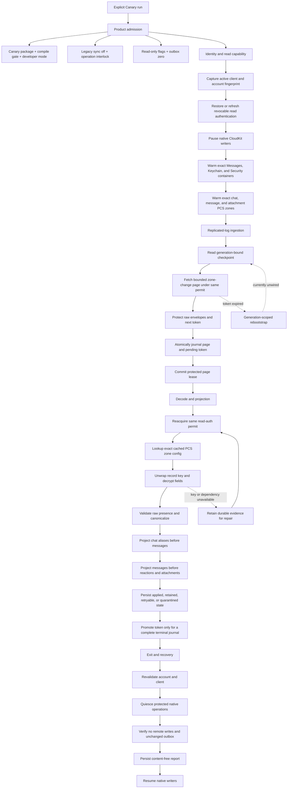

# Cloud Sync V2 connection treemap and recovery state machine

## Decision

Treat Messages in iCloud as a durable replicated log whose ingestion is
separate from local message projection. A successful network fetch is not a
successful sync, and an undecryptable or temporarily unprojectable record must
not disappear merely because a later CloudKit cursor exists.

Every protected operation in one run must remain bound to the same tuple:

```text
account fingerprint
  + live CloudMessagesClient identity
  + read-authentication generation
  + protected-store identity
  + native writer-pause permit
  + container/database/zone
  + checkpoint generation
```

If any member changes, the run fails closed. It must not borrow another
container, create PCS state, fall back to legacy sync, clear a cursor, or
continue under a new account.

## Status legend

| Status | Meaning |
| --- | --- |
| `LIVE-PROVEN` | A content-free report or device trace has exercised the boundary on the Pixel. |
| `TEST-PROVEN` | Focused source-contract or behavioral tests cover the boundary, but current-device proof is incomplete. |
| `REPAIRED; LIVE PROOF PENDING` | Source contains the intended repair; generated bindings, signed APK, or device proof remains. |
| `GAP / POLICY DECISION` | The safe behavior is not wired end to end or needs an explicit product decision. |

## End-to-end treemap



The important cut is between `D4` and `E`: remote progress first becomes a
durable local journal. Projection may then retry without refetching or losing
the exact remote evidence.

### Two progress clocks

The implementation intentionally has two different progress clocks. They must
not be collapsed into one user-visible "sync complete" state:

1. **Remote-ingestion progress** is the opaque fetched token. It may advance
   only when the current generation has a complete contiguous journal and
   every row is either exactly applied or explicitly `retainedUnprojected`.
2. **Exact-projection progress** is the contiguous applied sequence. It advances
   only across rows whose canonical projection committed atomically.

`retainedUnprojected` therefore prevents a parser or dependency defect from
pinning the remote cursor forever, but it is not success. The protected source,
digest, record mapping evidence, scope, and generation remain durable; the row
is retried locally; and Messages-in-iCloud write admission requires all three
zones to contain only exactly applied rows. Canary reports and future UI must
show fetched, retained, and projected counts separately.

## Source-linked audit

| Boundary | Current source | Required invariant | Status |
| --- | --- | --- | --- |
| Manual admission | [`troubleshoot_panel.dart`](../lib/app/layouts/settings/pages/misc/troubleshoot_panel.dart#L436), [`rustpush_service.dart`](../lib/services/rustpush/rustpush_service.dart#L7448) | User-confirmed Canary entry only; no automatic semantic pull. | `LIVE-PROVEN` |
| Process and database exclusion | [`CloudKitOperationInterlock.runExclusive`](../lib/services/rustpush/cloud_sync/cloudkit_operation_interlock.dart#L91), [`CloudSyncManualSemanticPullSampler.runConfirmed`](../lib/services/rustpush/cloud_sync/cloud_sync_manual_semantic_pull_sampler.dart#L135) | One CloudKit owner, durable fence, bounded heartbeat, and writer resume in `finally`. | `TEST-PROVEN`; exercised live |
| Account-bound read authentication | [`CloudSyncProductionAuthSnapshotProvider`](../lib/services/rustpush/cloud_sync/cloud_sync_production_sampler_adapter.dart#L775), [`cloud_sync_ensure_read_authentication`](../rust/src/api/api.rs#L7520) | Restore or refresh only the active client's revocable read credential; reject a raced session replacement. | `TEST-PROVEN`; persisted restore exercised live |
| Writer-pause capability | [`prepareReadAuthenticationUnderNativeWriterPause`](../lib/services/rustpush/cloud_sync/cloud_sync_production_sampler_adapter.dart#L826), [`cloud_sync_warm_read_authentication_under_writer_pause`](../rust/src/api/api.rs#L319) | Exact positive 64-bit token, active interlock, and same client/account before and after warmup. | `TEST-PROVEN` |
| Exact PCS-zone warmup | [`warm_semantic_read_zone_encryption_configs`](../rustpush/src/imessage/cloud_messages.rs#L2201), [`get_cached_zone_encryption_config_exact`](../rustpush/src/icloud/cloudkit.rs#L3579) | Lookup only `chatManateeZone`, `messageManateeZone`, and `attachmentManateeZone` on the read-auth container. Never create a zone or use the general container. | `REPAIRED; LIVE PROOF PENDING` |
| Capability-bound protected fetch | [`cloud_sync_fetch_protected_page_under_writer_pause`](../rust/src/api/api.rs#L2190), [`sync_records_page_for_read_authentication`](../rustpush/src/imessage/cloud_messages.rs#L2388), [`CloudSyncEngine._pullChangesWhileStoreExclusive`](../lib/services/rustpush/cloud_sync/cloud_sync_engine.dart#L898) | Semantic fetch must acquire the exact active writer-pause capability, use only the permit-validated cached read-auth container, and hold it through the remote page read. Previous token and generation remain opaque; page, record, byte, and time limits remain enforced. The separate unbound entry point is restricted to the compile-gated, non-projecting shadow diagnostic. | `REPAIRED; GENERATED BINDINGS AND LIVE PROOF PENDING` |
| Page adoption and crash recovery | [`CloudProtectedPageLeaseLifecycle`](../lib/services/rustpush/cloud_sync/cloud_protected_page_lease_lifecycle.dart#L11), [`journalFetchedBatch`](../lib/services/rustpush/cloud_sync/objectbox_cloud_sync_store.dart#L104) | Protect page before Dart exposure; atomically journal before committing the native page lease. | `TEST-PROVEN`; live reports show admitted pages |
| Same-capability protected decode | [`RustCloudSemanticDecoder`](../lib/services/rustpush/cloud_sync/cloud_sync_production_sampler_adapter.dart#L577), [`cloud_sync_decode_protected_change`](../rust/src/api/api.rs#L3545), [`cloud_sync_decode_transient_record_cached_only`](../rust/src/cloud_sync_transient_bridge.rs#L1605) | Decode uses the same writer-pause permit and exact cached read-auth container/PCS key as fetch preparation. | `REPAIRED; LIVE PROOF PENDING` |
| Canonical conversion | [`cloud_sync_canonical_converter.rs`](../rust/src/cloud_sync_canonical_converter.rs), [`parse_associated_parent`](../rust/src/cloud_sync_canonical_dto.rs#L2023) | Preserve wire presence, reject malformed identity, and do not invent clear/delete semantics. | `TEST-PROVEN`; representative records decoded live |
| Ordered local projection | [`TransactionalCloudInboxApplier`](../lib/services/rustpush/cloud_sync/cloud_inbox_applier.dart#L866), [`ObjectBoxCanonicalSemanticEntityAdapter`](../lib/services/rustpush/cloud_sync/objectbox_canonical_semantic_entity_adapter.dart#L204), [`ObjectBoxCloudSemanticStoreGateway`](../lib/services/rustpush/cloud_sync/objectbox_cloud_semantic_store_gateway.dart#L305) | One local transaction records canonical state, replay metadata, record mapping, and terminal inbox state. Chat aliases precede messages; messages precede reactions and attachments. | `LIVE-PROVEN`, with remaining unsupported fields/attachments retained |
| Legacy unknown-row retry | [`CloudUnknownInboxBarrierRecoveryStore`](../lib/services/rustpush/cloud_sync/cloud_sync_store.dart#L290), [`ObjectBoxCloudSyncStore.requeueUnknownInboxBarrier`](../lib/services/rustpush/cloud_sync/objectbox_cloud_sync_store.dart#L974) | Reopen only the first unresolved current-generation save in the still-pending batch, only if it predates the fixed migration cutoff. Preserve retry history, protected reference, digest, checkpoint, and token. Reject tombstones and preflight failures. | `TEST-PROVEN`; bounded one-time migration, not a general fallback |
| Retained projection repair | [`TransactionalCloudInboxApplier.reprojectRetainedUnprojected`](../lib/services/rustpush/cloud_sync/cloud_inbox_applier.dart#L894), [`CloudRetainedProjectionStoreGateway`](../lib/services/rustpush/cloud_sync/cloud_inbox_applier.dart#L797) | Candidate selection is scope- and generation-bound. A retained row becomes applied only in the same transaction that commits its complete canonical projection; failures rotate fairly without changing token or source evidence. | `TEST-PROVEN`; exercised live with unresolved rows remaining |
| Cursor promotion | [`_promotePendingFetchedTokenIfTerminalLocked`](../lib/services/rustpush/cloud_sync/objectbox_cloud_sync_store.dart#L2456) | Promote the pending token only when every sequence exists and is terminal. `retainedUnprojected` may release fetch progress but remains repairable and never counts as fully applied. | `TEST-PROVEN`; exercised live |
| Honest Canary completion | [`cloudSyncV2SemanticCanaryPresentation`](../lib/app/layouts/settings/pages/misc/troubleshoot_panel.dart#L46), [`cloud_sync_semantic_canary_presentation_test.dart`](../test/services/cloud_sync/cloud_sync_semantic_canary_presentation_test.dart) | Sum retained rows across all zones. Report `Complete` only when the original three-zone/status/quarantine/retry/write-tripwire gates pass and retained count is zero; otherwise report `Partial` or `Stopped Safely` with separate fetched, applied, and retained totals. | `REPAIRED; FOCUSED TESTS PENDING REGENERATED BINDINGS` |
| Token-expiry reset | [`CloudSyncStore.rebootstrapAfterReset`](../lib/services/rustpush/cloud_sync/cloud_sync_store.dart#L150), [`ObjectBoxCloudSyncStore.rebootstrapAfterReset`](../lib/services/rustpush/cloud_sync/objectbox_cloud_sync_store.dart#L1312) | Obtain an account-bound remote-reset proof, quiesce the coordinator, atomically fence old evidence, increment generation, and restart from no token. The coordinator must also prove how unresolved old-generation saves and tombstones remain repairable or are reconciled by the full refetch. | `GAP / POLICY DECISION`: durable primitive exists, but production orchestration has no caller and current-generation reprojection cannot consume generation-zero evidence |
| No-write exit tripwire | [`CloudSyncManualSemanticPullSampler._runConfirmedUnderInterlock`](../lib/services/rustpush/cloud_sync/cloud_sync_manual_semantic_pull_sampler.dart#L194) | Remote confirmations remain zero, outbox count is unchanged, active identity is revalidated, native operations quiesce, and writers resume. | `LIVE-PROVEN` |

## Recovery policy

| Failure | Safe lane | Current audit |
| --- | --- | --- |
| Read credential cold or revoked | Warm in-memory credential, otherwise restore encrypted same-account credential, otherwise perform one bounded same-account refresh. Pause and require explicit user action after that. | Implemented and tested; current capability-bound fetch and decoder handoffs await live proof. |
| Account/client changes mid-run | Stop before further decode, projection, acknowledgement, or writer resume under the old identity. Preserve journal and checkpoint. | Implemented at sampler, transport, decoder, and projection boundaries. |
| PCS key unavailable | Lookup exact cached zone config, then one bounded same-scope warm/refresh. Retain the raw protected record and checkpoint evidence if unavailable. | Exact lookup repaired; live proof pending. |
| Network or server failure | Preserve prior token, record bounded backoff, honor server retry-after, and retry later. | Implemented. |
| Throttling | Honor bounded retry-after and do not spin or clear state. | Implemented. |
| Missing chat/message dependency | In the developer-only read-only Canary, a recognized dependency code may immediately become `retainedUnprojected`; ordinary sync requires the bounded attempt-and-age policy. Keep protected evidence and retry ordered projection after the parent or parser repair exists. | Implemented and compile-time/configuration gated away from write-capable sync. |
| Malformed or unsupported record | Persist a fixed content-free reason. Retain or quarantine according to whether a future parser can safely repair it; never guess identity or deletion. | Implemented, but every new reason needs an explicit repairability classification. |
| Tombstone in read-only Canary | Retain as unprojected evidence. Do not delete a local message and do not issue a remote delete. | Implemented and write-gated. |
| Process death after fetch | Recover/rollback the native page lease, replay the durable journal, and keep the previous token until the journal is terminal. | Implemented and crash-tested. |
| Change token expired | Verify same account and server reset condition, obtain a protected reset proof, stop all coordinators, atomically increment generation and fence old rows, then refetch. Before activation, define reconciliation for retained saves and tombstones from the old generation so evidence is not merely preserved but stranded. Never merely clear the token. | Primitive exists; production decision/orchestrator and cross-generation reconciliation policy are missing. |
| Attachment body unavailable | Project validated metadata first; materialize through bounded native MMCS work later. Retain inline bodies until a proven native path exists. | Partial implementation; not a release blocker for text/history if represented honestly. |
| Live message delivery | IDS/APNs continues independently of CloudKit archive repair. CloudKit work must never block receive readiness. | Architectural invariant; covered by the critical-path map. |

## Explicitly forbidden fallbacks

The following are not recovery mechanisms:

- using a general or write-capable CloudKit container when the read-auth
  container is cold;
- authenticating or decoding under a different account, client, credential
  generation, writer-pause token, protected-store identity, zone, or checkpoint
  generation;
- invoking `ZoneSaveOperation`, PCS creation, keychain clique reset, or remote
  record mutation from the semantic read path;
- silently enabling the legacy CloudKit path after a V2 failure;
- clearing a token because an error is unknown, malformed, or inconvenient;
- treating `retainedUnprojected` as a successful local projection;
- advancing past an incomplete or nonterminal page journal;
- deleting local messages for tombstones during the read-only Canary;
- allowing optional CloudKit work to delay IDS/APNs startup or acknowledgement.

## What likely matches Apple's engineering model

This section separates public evidence from inference. It does not claim that a
patent or public framework describes the private Messages implementation.

### Direct public evidence

- Apple documents `CKSyncEngine` state as opaque state that the client persists;
  it includes server change tokens and pending work. Account changes and fetched
  record-zone changes are explicit events.
- `CKFetchRecordZoneChangesOperation` uses per-zone opaque tokens and delivers
  successive batches. A client caches tokens on disk and must not infer their
  contents or ordering.
- Apple Platform Security describes private CloudKit data as protected by a
  per-user hierarchy, with record keys generated on trusted devices and wrapped
  into that hierarchy.
- Apple's CKSyncEngine sample persists local changes before queuing upload,
  applies remote modifications/deletions to its local store, and retains
  last-known server records for conflict handling.

Primary references:

- [CKSyncEngine](https://developer.apple.com/documentation/cloudkit/cksyncengine-5sie5)
- [CKSyncEngine.State](https://developer.apple.com/documentation/cloudkit/cksyncenginestate)
- [CKFetchRecordZoneChangesOperation](https://developer.apple.com/documentation/cloudkit/ckfetchrecordzonechangesoperation)
- [Apple Platform Security: iCloud encryption](https://support.apple.com/guide/security/icloud-encryption-sec3cac31735/web)
- [Apple sample: CKSyncEngine](https://github.com/apple/sample-cloudkit-sync-engine)

### Architectural inference

The most plausible Apple-style design is a small number of independently
recoverable state machines:

1. account/trust establishes a revocable read capability;
2. a per-zone replication engine durably ingests opaque changes and tokens;
3. PCS resolves record keys under the same account/trust generation;
4. a local semantic projector applies records in dependency order;
5. live IDS/APNs delivery remains independent from archive reconciliation;
6. reset or account-change events create a new generation rather than mutating
   old evidence in place.

That model explains why one malformed or temporarily undecryptable record
should become durable repair work instead of forcing the server cursor backward
forever. Our journal, protected page lease, retained-unprojected state, and
generation fence already approximate this model. The read-capability handoff is
now repaired in source for both fetch and decode, but still needs generated-
binding and live proof. The missing production reset orchestrator remains the
major unimplemented state transition.

## Patent evidence rules

Apple patent records are useful for vocabulary, component boundaries, and
possible failure-state designs. They are not proof that current iOS, CloudKit,
PCS, or Messages uses the disclosed embodiment. Patent evidence must therefore
be recorded as:

```text
publication + family
  -> exact claim, paragraph, or figure
  -> direct disclosed mechanism
  -> narrow architectural inference
  -> source/code boundary it may inform
```

Do not copy patented implementation expression into the product. Prefer public
API behavior, device evidence, clean-room protocol facts, and independently
designed state-machine logic. No patent-derived inference is a code requirement.

### Patent ledger

| Publication/family | Direct disclosure | Narrow inference for this design | Explicit limit |
| --- | --- | --- | --- |
| [US10742732B1, Cloud storage and synchronization of messages](https://patents.google.com/patent/US10742732B1/en), continuation [US11190586B2](https://patents.google.com/patent/US11190586B2/en); Apple; priority 2017-03-02 | Claims 14-16 and Figures 3-6 describe a temporary delivery store separate from a long-term archival “truth zone,” bounded batches instead of a whole database, conversation state before message batches, stable cross-device record identifiers for duplicate avoidance, per-device time tags (claims 7 and 19), and recent-first recovery in Figure 5C. | Keep live delivery separate from archival restore; process chat/conversation identity before messages; deduplicate by stable record identity; retain per-device opaque progress; consider recent-first initial backfill only as a later optimization. | It does not disclose the private CloudKit protobuf, current Manatee schema, PCS, or exact server cursor semantics. “Truth zone” is not proof of a CloudKit zone name. |
| [US11012428B1, Cloud messaging system](https://patents.google.com/patent/US11012428B1/en) and its family; Apple; priority 2017-03-02 | The abstract, Figures 10, 14A-C, 16-17, and claims 1, 6, and 8 describe application-specific isolated containers, a user-private encrypted container, public/private databases, an account zone with short- and long-term records, and encrypted attachment assets addressed separately from access records. | Bind message reads to one application/account container. Keep protected record metadata separate from attachment bytes, and fail closed when expected read identity is unavailable. | It does not prove CloudKit, PCS, MMCS, current zone names, exact asset fields, or current credentials. Its cryptographic deletion is not a sync tombstone. |
| [US20160352518A1, Backup system with multiple recovery keys](https://patents.google.com/patent/US20160352518A1/en), issued as [US9904629B2](https://patents.google.com/patent/US9904629B2/en); Apple; priority 2015-05-31 | Section V, Figures 19-20, and claims 1, 6, 9, 11, and 13 describe a service identity that unlocks a container private key, then a zone private key, then a per-record key, plus separately wrapped device recovery material. | This is the strongest patent support for the capability chain `service identity -> container key -> zone key -> record key`. A successful account login does not prove the active device has the correct content-key generation. | It does not prove the PCS name/current API, current CKKS/Octagon recovery, Messages-specific service identities, or cached-only production behavior. |
| [US20140281540A1, Keychain syncing](https://patents.google.com/patent/US20140281540A1/en), issued as US9197700B2; Apple; priority 2013-01-18 | Figure 3 and claims 1, 4, 6, and 11-20 describe signed sync-circle membership, authenticated join approval, and keychain/private-key synchronization only among admitted devices. | Model trust membership and content access as revocable generations. Bind cached key material to the exact client/account generation and pause rather than substituting a broader identity. | It is a trust-state pattern, not proof of current iCloud Keychain, Octagon, CKKS, PCS, or Messages recovery policy. |
| [US7747784B2, Data synchronization protocol](https://patents.google.com/patent/US7747784B2/en), publication US20090228606A1; Apple; priority 2008-03-04 | Figures 30-31 and 41-43 and claims 1-5 describe opaque checkpoint anchors, persistence after interruption, explicit expired-anchor reset/slower synchronization, add/modify/delete changes, conflict resolution, and two-sided anchor commit. | Keep progress opaque and scope-bound; advance only after durable processing; handle token expiry through an explicit generation-scoped rebootstrap, not an unproved cursor clear. | It is generic synchronization evidence, not CloudKit, Messages, PCS, or `CKServerChangeTokenExpired` semantics. |
| [US20100198784A1, Reusable state information for synchronization and maintenance of data](https://patents.google.com/patent/US20100198784A1/en) and family; Apple; priority 2004-07-01 | The specification and claim 1 describe durable deleted/soft-deleted history, ancestry for conflict analysis, and garbage collection only after known peers no longer require the state. | Retain deletion evidence and prior record mappings until local deletion is safely projected and the relevant consumers have crossed the state. | It is tombstone-like generic sync evidence, not a CloudKit or Messages tombstone schema. |
| [US8589680B2, Synchronizing encrypted data on a device having file-level content protection](https://patents.google.com/patent/US8589680B2/en); Apple; priority 2010-04-07 | Synchronization initialization retrieves an escrow keybag, derives/decrypts protection-class keys from a sync ticket, and only then synchronizes protected data. | Authentication, protected-key warmup, and semantic decode are distinct gates. The same-permit PCS warmup remains necessary even after account login succeeds. | The file-protection mechanism predates current CloudKit/PCS and supplies no private Messages wire facts. |

The first family is the most useful message-specific result. The recovery-key
family supplies the strongest key-hierarchy analogy, and the older generic sync
families support explicit reset and conservative deletion-history handling.
Together they reinforce, but do not prove, this composite architecture:

```text
trusted/recovered service identity
  -> cached application container key
  -> exact zone key
  -> per-record key
  -> record or attachment decode
  -> stable-identity reconciliation or retained deletion evidence
  -> committed protected checkpoint
```

None of these patents justifies replacing opaque CloudKit tokens with
timestamps, inferring private field names, resetting trust from a read path, or
enabling writes.

## Release gates derived from the map

1. Generated bridge bindings expose the separate writer-pause-bound protected
   fetch and include the writer-pause token on protected decode, with no
   unrelated drift.
2. Focused Dart, Rust, rustpush, protector, and source-contract tests pass.
3. A cold-start integration test executes this exact chain in one process:
   `restore/refresh auth -> pause writers -> warm three PCS zones -> fetch ->
   decode with same permit -> journal -> project -> promote token`.
4. Synthetic token-expiry validation proves no automatic clear and then tests
   the approved generation-scoped rebootstrap workflow.
5. Crash injection covers fetch-before-journal, journal-before-lease-commit,
   projection-before-terminal-mark, and terminal-mark-before-token-promotion.
6. Account replacement at every external wait fails closed and preserves old
   evidence.
7. A signed in-place Canary run preserves `firstInstallTime`, creates exactly
   one report for the invocation, restores representative text/reaction/link
   records, and reports zero remote writes/deletes and outbox `0 -> 0`.
8. A second pull is idempotent: no duplicate canonical rows, no skipped page,
   and no repeated projection except explicitly retained repair work.
9. Reports distinguish remote-ingestion completeness from exact-projection
   completeness. Production readiness requires retained rows to be zero or to
   have an explicitly reviewed, non-destructive repair policy.
10. The fixed-cutoff legacy unknown-row migration is removed after affected
    Canary databases have been retried, or remains covered by a source-contract
    test proving it cannot touch a newer row, tombstone, preflight failure,
    checkpoint, token, protected reference, or payload digest.

## Current critical path

Do not broaden scope to FaceTime, Find My, Windows ARM, SMS/RCS, or outbound
CloudKit while this sequence is active:

1. review and apply only the generated bridge files required by the repaired
   fetch/decode capability handoff;
2. run focused tests and one cold-start GCE chain test;
3. build and sign one Canary;
4. install in place and capture one live semantic-pull report;
5. if live proof succeeds, design the token-expiry reset coordinator as a
   separate reviewed change;
6. only then widen attachment materialization and automatic scheduling.
