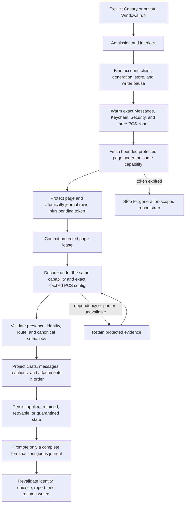
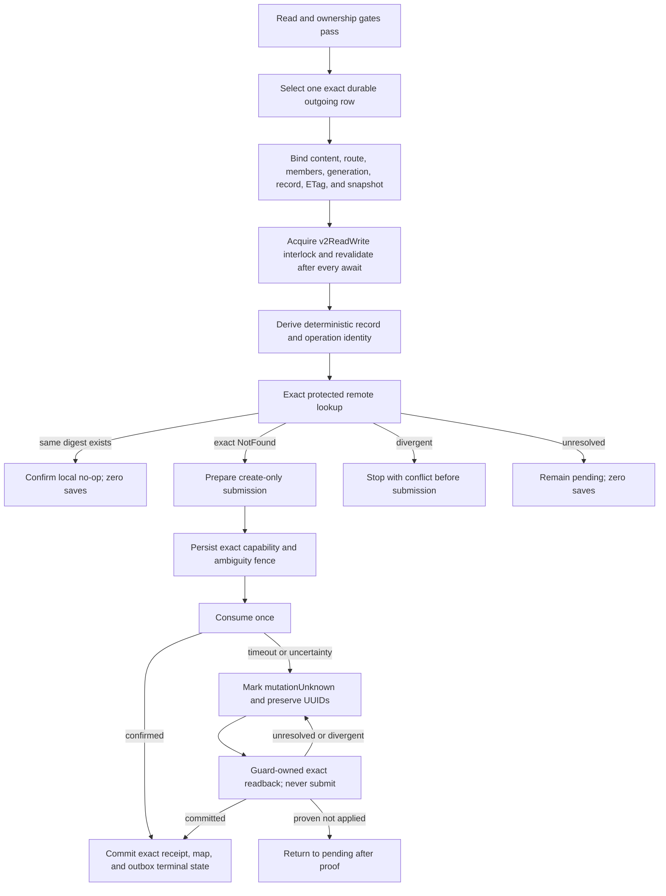

# Cloud Sync V2 current connection treemap

This document is the short operational source of truth. It contains current
architecture, safety rules, qualification state, and the next falsification
test. Dated investigations, obsolete candidates, run-by-run notes, patents,
and historical evidence remain intact in the
[investigation log](cloud_sync_v2/history/CLOUD_SYNC_V2_INVESTIGATION_LOG_THROUGH_2026-09-07.md).
The [bundle index](cloud_sync_v2/index.md) points to both documents and the
current evidence set.

## Decision

Treat Messages in iCloud as a durable replicated log. Remote ingestion and
local projection are separate progress clocks. A successful fetch is not a
successful sync. Undecryptable or temporarily unprojectable records remain
durable repair work and never disappear merely because a later token exists.

Every protected operation must remain bound to one exact tuple:

```text
account fingerprint
  + live CloudMessagesClient identity
  + read-authentication generation
  + protected-store identity
  + native writer-pause permit
  + container/database/zone
  + checkpoint generation
```

If any member changes, fail closed and retain the evidence. Never borrow a
different identity or container, create PCS state from the read path, fall
back to legacy sync, clear a cursor, or continue under a replacement account.

## Status legend

| Status | Meaning |
| --- | --- |
| `LIVE-PROVEN` | A content-free trace exercised the exact boundary on the named platform. Proof does not transfer between platforms. |
| `TEST-PROVEN` | Source-contract or behavioral tests cover the boundary; current-device proof remains. |
| `SOURCE-IMPLEMENTED` | The repair is in the candidate, but full exact-source qualification is incomplete. |
| `IN REPAIR` | A concrete counterexample invalidated the previous candidate. |
| `GAP` | A safe end-to-end behavior is not implemented or needs a product decision. |

## Current candidate

| Item | Current evidence |
| --- | --- |
| Fully qualified APK | Source 9d33235fc35c6a31dee34ed655fdb4d576ccb61d; [GCE 34732301245](https://github.com/Xare123/openbubbles-app/actions/runs/34732301245) passed all selected tests, bridge regeneration, packaging, native-library verification, trusted signing and cleanup. Includes progress card and local recent-chat visibility. |
| Last observed Pixel | Canary 883f001868ac64a160c20018b2fb46e3aedb029e, version 1.15.0 (20002227). Fresh-account messages visibly restored. At 2026-09-13 04:01:18Z, Messages still fetched; Chats/Attachments had terminal empty reads. Outbox stayed 0 -> 0. Later ADB inventories were empty; recheck before device actions. |
| Next source | FaceTime trace repair fbbfbfebb passed 35 Node tests. Subsequent foreground pacing repair adds smaller Regular work and matching report validation. All 199 focused tests passed; analyzer has no errors/warnings (five existing style infos). Full qualification and Pixel installation remain. |
| Recent-first | Local recent-chat visibility implemented/tested. Account-wide newest-history fetching is NOT implemented. Persist a fresh-stream direction before its first request and bind continuation/restart before enabling legacy-style order. Existing cursors keep their direction. |
| Windows writes | Bounded direct text/reaction/image and separate edit/unsend have source-specific evidence. September 12 edit-21 and unsend-24 reached exact CloudKit confirmation. Pixel, chained mutations, groups and independent rendering remain open. |
| Release state | Full production is not established. Remaining gates below apply. |

Prior tables and obsolete next steps were preserved verbatim in the September 12
consolidation entry of the [investigation log](cloud_sync_v2/history/CLOUD_SYNC_V2_INVESTIGATION_LOG_FROM_2026-09-07.md).
Historical tests do not establish current-device behavior.

## Scope and current evidence

| Capability | Established | Remaining |
| --- | --- | --- |
| History read | Fresh Canary visibly restores chats/messages. | Terminal ingestion, actionable retained repair or explained unavailability, repeat/incremental/restart proof. |
| Media/documents/reactions read | Earlier representative live results; current materialization/filtering implemented. | Current Pixel photos, video, transcript GIFs, documents and incremental updates. GIFs need not appear in profile media. |
| Direct writes | Bounded Windows text, reaction, image, edit and unsend protocol results. | Ordinary Pixel composition, restart recovery and independent client display. |
| Groups | Restored-group binding implemented/tested. | Approved two-recipient text, attachments, reactions and supported mutations. No personal group substitution. |
| Edits/deletes | Predecessor-preserving edit/unsend source and separate Windows confirmations. | Chained mutations, conflicts, independent display; supported deletion/tombstone ownership and recovery. |
| Lifecycle | Identity/reset fences and bounded Android worker implemented/tested. | Current background/lock, reconnect, process death, token expiry and account repair. |
| Progress/speed | Card and smaller Regular workload implemented. | Integrated qualification, Pixel UX and measured performance. |
| Newest history first | Local recent-chat admission fixed. | Durable fresh-stream direction plus multi-page/restart/incremental qualification. |
| FaceTime | Lifecycle/layout candidate; offline leave analysis repaired. | Actual two-way media beyond 30 seconds, remote hangup, subsequent and incoming calls. |
| SMS/MMS/RCS | Excluded by user. | Preserve and label exclusion separately from iMessage failures. |

## Safety gates

These gates are non-negotiable:

1. Bind account, live client, credential generation, protected store, zone,
   checkpoint generation, and writer-pause capability at every external wait.
2. Journal each protected page and pending token atomically before committing
   the native page lease.
3. Project in dependency order: chats, messages, reactions, attachments.
4. Promote a token only across a complete contiguous terminal journal.
5. Keep fetched, retained, and exactly projected progress separate.
6. Keep live IDS/APNs receive readiness independent from archive repair.
7. Admit a write only from an exact durable row and a fresh protected
   dependency binding.
8. Prove exact remote absence before first create. Persist the ambiguity fence
   before consuming a prepared mutation.
9. After submission uncertainty, reconcile by exact readback only. Never
   automatically replay, update-merge, quarantine away ambiguity, or delete.
10. Require an exact protected receipt before committing a record map and
    terminal outbox state together.
11. Preserve Alpha, its hardware identity, its database, and its messages.
12. Keep Windows Smart App Control enabled. Use GCE or a trusted signed
    environment when local policy blocks an executable.

## Explicitly forbidden fallbacks

- Use of a general or write-capable container when semantic read authentication
  is cold.
- Cross-account, cross-client, cross-generation, cross-zone, or cross-store
  authentication and decryption.
- `ZoneSaveOperation`, PCS creation, clique reset, or remote mutation from the
  semantic read path.
- Silent fallback to legacy CloudKit sync.
- Cursor clearing for an unknown, malformed, or inconvenient error.
- Treating `retainedUnprojected` as successful local projection.
- Advancing past an incomplete journal.
- Deleting local rows for read-path tombstones.
- Letting optional CloudKit work delay live message startup or acknowledgment.
- Using GCE as a live Apple client or exporting account, relay, PCS, or device
  identity to CI.

## Read state machine



The durable journal between fetch and projection is the critical cut. It makes
projection repair possible without refetching or losing the exact server
evidence.

## Outbound create state machine



Direct, reaction, and group operations use distinct protected binding tags.
One lane cannot be cast into another. Confirmed replay is readback-only and
must prove zero saves.

### Attachment-write integration boundary

The next vertical slice must connect the existing composer journal to this
entire chain, not merely add an upload validator:

```text
exact attachment descriptor actually sent through IDS
  -> protected descriptor + metadata + one retained record identity
  -> verified original MMCS bytes, exact pinned length
  -> existing account/container + attachment-zone PCS + boundary-key lookup
  -> byte upload, retaining its receipt or unresolved-upload state
  -> create-only CloudAttachment(cm metadata, lqa asset)
  -> exact record readback and confirmed dependency
  -> parent Message with the same attachment references
```

- The Dart store atomically admits completed Attachment-v1 uploads, and the
  runtime byte-upload coordinator and parent-message connection are implemented.
  Live byte upload has succeeded; child/parent record readback remains open.
  Native integration separates protected pre-upload preparation
  (`outboundAttachmentUpload`) from completed record-create material
  (`outboundAttachment`). Neither grants network permission or parent admission.
- Existing `Attachment.metadata["rustpush"]` stores an MMCS descriptor with
  decryption material at upload-finish, before IDS send success. It is mutable,
  not an encrypted receipt or proof of what IDS sent. Pin the actual wire
  descriptor into protected admission before send, then bind native success to
  it. The v3 receipt now carries the protected source binding, not raw keys or
  descriptors. Composer source staging/adoption is connected; whole-runtime
  attachment qualification remains separate.
- Do not put the source only inside the IDS receipt: acknowledgment deletes
  that file immediately after durable confirmation, before outbound admission.
  A protected source needs its own durable reference and recovery/GC ownership
  through parent adoption. The additive journal `protectedSourceBinding` field
  now owns that reference independently; old rows remain null and unqualified.
- Re-fetching that pinned MMCS object avoids a second permanent plaintext-byte
  journal and mutable-file reuse. It needs APS/MMCS availability, complete
  target/chunk validation, and the pinned plaintext length. A missing or expired
  object must defer, not substitute a different local file. Chunk integrity and
  length do not validate a guessed CTR key; the key must be the one actually sent.
- Reuse `CloudMessagesPreparedSaveSubmission` for record-save correlation and
  single consumption; the next native candidate supplies typed preparation
  and checked readback without enabling admission. Do not use
  legacy `save_attachments`, which enters generic update-capable saving.
- Legacy `prepare_file` calls `get_boundary_key`, which can create a keychain
  item. V2 lookup must also use keystore `get_secret`, not `ensure_secret`, when
  unwrapping existing boundary material. Keep the DSID and entry under the same
  state lock; a missing key fails without generating either local or remote keys.
- The attachment-specific local-send path extends outbox admission and parent
  encoding together. The plaintext-only path still rejects media.
- Record identity must be persisted before first upload and reused on retry.
  Legacy allocates a random attachment record ID; do not assume the proven
  Message GUID HMAC naming rule also applies to attachment records.
- `prepare_put_v2` randomizes chunk keys, FORD key and IV. Re-preparing identical
  plaintext retains neither the original encrypted descriptor nor its reference.
  Preserve the entire `PreparedPut`, including each chunk's key/signature/length,
  under platform protection before upload. Bind it to the original parent source,
  attachment metadata, full container-issued record identifier and file digest.
  A returned asset must match that exact preparation before record-create staging.
- Upload uncertainty and record-save uncertainty are distinct. Record NotFound
  cannot authorize blind byte re-upload or record-ID replacement.
- Next integration order: protected actual-IDS descriptor ownership in the
  local-send journal; durable pre-upload plan and attempt state; exact completed
  upload adoption; existing create-only record transport/readback; parent message
  dependency and encoding. Do not bypass the missing journal ownership by calling
  the legacy uploader or treating native codec tests as end-to-end qualification.
- Native send preparation is a separate boundary: `IMClient.send` calls
  `MessageInst.prepare_send`, which assigns a new send timestamp and may add
  the sender/conversation GUID. Capturing a Dart-built MessageInst and then
  allowing preparation to mutate it is not proof of the final wire. Integration
  must validate the final attachment descriptors and bind positive IDS success
  to the original source. Prefer an explicit validator for the three known
  preparation changes (timestamp, generated conversation GUID, added self
  participant), with all body/recipient/attachment fields unchanged, if that
  avoids a new two-phase send API. Freezing the prepared submission is an
  alternative, not a prerequisite. Do not ignore arbitrary changed fields.
- Local reflection is another normal transformation: `indexedPartsToAttributedBodyDyn`
  changes attachment GUIDs to `<messageGuid>_<part>` and inserts a space where
  the composer may use an object placeholder. Source identity must bind ordered
  descriptors and actual text/formatting, not these local aliases. Resolve each
  body reference to its exact attachment; do not accept count-only matching,
  unrelated rows, substituted descriptors or changed text. The native protected
  source still pins the actual sent descriptor, independently of local UI IDs.

## Fast qualification loop

Use the cheapest boundary that can falsify the current hypothesis:

```text
source contract or behavioral logic
  -> focused local test when policy allows, otherwise GCE
  -> full exact-source GCE suite and APK build

Apple protocol, PCS, save, readback, or replay behavior
  -> exact-source trusted minimal Windows harness when available
  -> otherwise signed Canary on Pixel

Android registration, ObjectBox/UI, background, lock, or lifecycle behavior
  -> signed Canary on Pixel

cross-device convergence
  -> independent Apple device confirmation
```

Do not rebuild a Canary for every code edit. GCE handles exact-source Dart,
Rust, bridge-generation, identity, projection, and reconciliation tests.
Windows ARM64 bundles are built on the isolated GitHub runner and imported
only after archive, native-codec, source/configuration and launch verification.
The retained `6abbeede2` runtime proves its bounded direct write, not newer
attachment code; `3ebcc81c9` must pass import and its own live test.
Local Cargo compilation remains blocked by App Control 4551. Keep that policy
enabled. The verified cloud bundle runs with the existing engineering signing
path when the original ObjectBox vendor DLL is preserved; re-signing that
vendor DLL caused the earlier startup block. Credentials and PCS state remain
local, never on GCE. Windows qualifies protocol boundaries, not Pixel lifecycle
or final Android release behavior.

Use five promotion lanes and do not skip upward:

1. **Focused local lane:** handwritten Dart contracts and structural guards for
   the changed boundary. It may reject a patch but cannot qualify native Rust.
2. **Fast GCE lane:** `app-rust-only` regenerates and verifies FRB bindings,
   checks the Rust bridge, and runs the app Rust library without Android SDK,
   Gradle, signing, or APK work.
3. **Full GCE lane:** only a promotion candidate runs every Dart/Rust/rustpush/
   protector test and produces the signed, ABI-verified Canary APK.
4. **Windows protocol lane:** exact-source minimal harnesses may falsify Apple
   request, PCS, save, readback, and replay behavior without an APK. They do not
   qualify Android lifecycle or UI behavior.
5. **Pixel release lane:** batch direct send, process-death recovery, group send,
   readback, restart, lifecycle, and UI evidence into as few signed-APK sessions
   as safety permits. Manual Apple-device display remains independent evidence.

The manual-writer Pixel lane now has a host-controlled three-phase gate:
[`pixel_cloudkit_write_gate.ps1`](../tooling/pixel_cloudkit_write_gate.ps1)
and [`vm_trigger_cloudkit_write.dart`](../tooling/vm_trigger_cloudkit_write.dart).
`prepare` establishes V2 ownership locally and returns only a candidate GUID
hash; `run` restarts Canary, reselects that exact hash, and invokes the existing
one-intent production path; optional `verify` restarts again and requires zero
new admissions. Every phase pins the app source and host-tool hashes, takes the
recipient only from a process environment variable bound to a separately
supplied SHA-256, emits content-free evidence, and requires the automatic
worker to be absent. The tooling is test-proven but does not replace live
CloudKit readback or independent Apple-device display.

## Recovery policy

| Failure | Safe response |
| --- | --- |
| Read credential cold or revoked | Warm the in-memory same-account credential, restore the encrypted same-account credential, or perform one bounded refresh. Then require user action. |
| Account or client changes | Stop before projection or acknowledgment and preserve journal, source, and checkpoint. |
| PCS key unavailable | Warm or look up only the exact same-scope zone. Retain the protected record if still unavailable. |
| Network or throttling | Preserve token and evidence, honor bounded retry-after, and retry later. |
| Missing parent or parser | Retain protected evidence and retry projection after the dependency or parser repair. |
| Malformed record | Store a fixed content-free reason and explicit repairability classification. Never guess identity. |
| Process death after fetch | Recover the protected lease, replay the durable journal, and keep the prior token until terminal. |
| Token expired | Stop, require the account-bound protected reset proof, release the read boundary, reacquire the destructive-reset interlock and native pause, advance the exact zone generation once, fence old evidence, reconcile authority after interruption, and replay at most once. |
| Write result unknown | Preserve request and operation UUIDs, protected receipt, and fence. Exact readback is the only next network action. |

## Source-linked boundary map

| Boundary | Primary source | Current status |
| --- | --- | --- |
| Product admission and interlock | [`cloud_sync_manual_semantic_pull_sampler.dart`](../lib/services/rustpush/cloud_sync/cloud_sync_manual_semantic_pull_sampler.dart), [`cloudkit_operation_interlock.dart`](../lib/services/rustpush/cloud_sync/cloudkit_operation_interlock.dart) | Read live-proven; full session replacement qualification remains. |
| Read authentication and exact PCS | [`cloud_sync_production_sampler_adapter.dart`](../lib/services/rustpush/cloud_sync/cloud_sync_production_sampler_adapter.dart), [`cloudkit.rs`](../rustpush/src/icloud/cloudkit.rs) | Exact `ad822f37c` live read-only pull completed; cold/account lifecycle proof remains. |
| Protected fetch, journal, and token | [`native_protected_cloud_sync_transport.dart`](../lib/services/rustpush/cloud_sync/native_protected_cloud_sync_transport.dart), [`objectbox_cloud_sync_store.dart`](../lib/services/rustpush/cloud_sync/objectbox_cloud_sync_store.dart) | Test and prior live proof. |
| Authenticated reset and restart recovery | [`cloud_sync_reset_coordinator.dart`](../lib/services/rustpush/cloud_sync/cloud_sync_reset_coordinator.dart), [`cloud_sync_manual_semantic_pull_sampler.dart`](../lib/services/rustpush/cloud_sync/cloud_sync_manual_semantic_pull_sampler.dart), [`cloudkit_writer_authority.dart`](../lib/services/rustpush/cloud_sync/cloudkit_writer_authority.dart), [`objectbox_cloud_sync_preflight.dart`](../lib/services/rustpush/cloud_sync/objectbox_cloud_sync_preflight.dart) | Exact-source qualified at `0b86a6465`; live expired-token/restart proof remains. |
| Decode and canonical conversion | [`rust_cloud_semantic_decoder.dart`](../lib/services/rustpush/cloud_sync/rust_cloud_semantic_decoder.dart), [`cloud_sync_canonical_converter.rs`](../rust/src/cloud_sync_canonical_converter.rs) | Test and representative live proof. |
| Ordered projection and retained repair | [`cloud_inbox_applier.dart`](../lib/services/rustpush/cloud_sync/cloud_inbox_applier.dart), [`objectbox_cloud_semantic_store_gateway.dart`](../lib/services/rustpush/cloud_sync/objectbox_cloud_semantic_store_gateway.dart) | Read live-proven; current backlog must be explicit. |
| Composer origin, IDS completion, and write admission | [`rustpush_service.dart`](../lib/services/rustpush/rustpush_service.dart), [`cloud_sync_local_send_journal.dart`](../lib/services/rustpush/cloud_sync/cloud_sync_local_send_journal.dart), [`cloud_sync_manual_outbound_canary.dart`](../lib/services/rustpush/cloud_sync/cloud_sync_manual_outbound_canary.dart), [`cloudkit_writer_mutation_guard.dart`](../lib/services/rustpush/cloud_sync/cloudkit_writer_mutation_guard.dart) | Atomic direct/restored-group composer admission, bounded awaited receipt replay, atomic startup claim, protected receipt recovery, and reset-required fencing are exact-source qualified through `0b86a6465`; live Pixel process-death recovery, remote readback, and duplicate suppression remain. |
| Direct and group encoders | [`cloud_sync_local_send_encoder.dart`](../lib/services/rustpush/cloud_sync/cloud_sync_local_send_encoder.dart), [`cloud_sync_outbound_group_binding.dart`](../lib/services/rustpush/cloud_sync/cloud_sync_outbound_group_binding.dart) | Direct live-proven on Windows; group source-implemented. |
| Native create/readback receipt | [`api.rs`](../rust/src/api/api.rs), [`cloud_messages.rs`](../rustpush/src/imessage/cloud_messages.rs), [`chat_create.rs`](../rustpush/src/imessage/cloud_messages/chat_create.rs) | Direct Windows proof; exact-source suite and group live proof pending. |
| Android durable read wake | [`CloudSyncV2Worker.kt`](../android/app/src/main/kotlin/com/bluebubbles/messaging/services/rustpush/CloudSyncV2Worker.kt), [`DartWorker.kt`](../android/app/src/main/kotlin/com/bluebubbles/messaging/services/backend_ui_interop/DartWorker.kt), [`cloud_sync_semantic_drain_controller.dart`](../lib/services/rustpush/cloud_sync/cloud_sync_semantic_drain_controller.dart) | Current ready/lease/budget repair has focused behavioral proof. Prior `fc132e5f8` compilation did not detect the startup deadlock; Pixel lifecycle proof remains. |

## Release gates

- [x] Source 9d33235fc passed full GCE 34732301245 and signed APK verification.
- [x] That run completed cleanup; later GCE inventory was empty.
- [x] Fresh Canary visibly projects readable chats/messages.
- [x] Source-specific bounded Windows text/reaction/image and separate edit/unsend protocol checks.
- [ ] Full integrated pacing-source qualification and exact signed installation.
- [ ] Complete remote history and classify/repair actionable retained saves.
- [ ] Repeat with stable cursors, no duplicates and readable media/documents.
- [ ] Pause/resume, background/lock, reconnect, cold restart and token/account recovery.
- [ ] Ordinary Pixel send through IDS acceptance, durable admission, CloudKit save/update,
  exact readback and independent client display.
- [ ] Restart reconciliation with zero duplicate IDS/CloudKit operations.
- [ ] Approved group text/attachments/reactions and supported mutations.
- [ ] Chained edit-then-unsend, conflict/unknown-outcome recovery and deletion semantics.
- [ ] Newest-history bootstrap with durably bound direction and existing cursors preserved.
- [ ] Accurate status for fetched, projected, retained, media and outgoing reconciliation.
- [ ] Measured Regular/Turbo behavior, then real FaceTime call qualification.
- [ ] Document supported operations and limitations. No upstream draft until user confirmation.

## Current critical path

1. Qualify smaller Regular work and report validation while preserving total fresh-record
   allowance, cursor identity, retained evidence and at-head repair.
2. Reconnect and inspect the existing Pixel session. Use verified cooperative cancellation
   or let it finish; observation timeouts do not prove termination. Install after native settlement.
3. Resume through Profile > Backup. Verify progress, media access between sessions,
   pause/resume, readable history, terminal state and retained categories.
4. Use the ordinary composer on automatic-upload builds for approved +16177106179.
   The manual-write host gate intentionally rejects that build mode. Recover existing
   exact intents before creating another test.
5. Verify exact readback, restart and independent rendering, then approved groups,
   attachments, reactions, chained edits/unsends and supported deletions.
6. Qualify a durably bound fresh-stream recent-first policy in Windows/cloud tests
   before another APK. Existing cursors keep their order.

Retained totals include excluded telephony, tombstones, malformed entries and
dependencies; they are not the number of missing readable messages. The last
observed Pixel pull was incomplete.

## Existing-history adoption evidence gate

Automatic adoption is not safe from the offline checkout alone. For each
queued intent, a content-free live observation must first distinguish the six
`existing_history` categories and prove exactly one current direct-iMessage Chat
owner under the same account, protected store, scope, generation, writer epoch,
and native session. The proof must bind the canonical Chat lookup hash, semantic
snapshot, service-identifier alias, canonical/member record map, latest applied
non-tombstone save, ETag, protected record reference, and payload digest. A
later retained save, tombstone, competing owner, or native `overlaps` /
`incomplete` result remains a defer.

Only after that proof may the production local-send admission seam atomically
re-read the state-1 journal intent and unchanged provisional Message/Chat,
adopt the exact existing relationship, and persist its durable reconciliation
binding under the existing `v2ReadWrite` interlock and auth fence. That
transaction must create no Chat stage, outbox row, record-map mutation, remote
save, merge-update, or delete. Restart must repeat as a no-op; any mismatch must
roll back and leave the intent ready/deferred. A bare Message reparent is not a
fallback because the journal source digest binds the original Chat row and UUID.

## Edit and unsend evidence gate

Apple carries edit history and retracted parts inside the existing message's
`msgProto.messageSummaryInfo` blob (`ec`, `ep`, `otr`, and `rp`). The read path
already validates part-key consistency, page-local edit ordering, and the rule
that present-but-empty collections are absent rather than an explicit clear.
Native revision numbers are sorted indexes regenerated for each payload, not
cross-record causal clocks. Local projection must keep the displayed body and
edit history on one compatible snapshot. A complete newer history may replace
both; an older subset cannot replace either; incompatible histories remain
retained with a content-free conflict. Retractions are an irreversible union
for the exact owned message. Do not synthesize multipart bodies from histories:
the renderer takes current text from the attributed body, not its edit list.

**Read transition candidate:** the native digest still includes current body
bytes. The inbox applier may reconcile that difference only through the optional
transaction proof: exact stored snapshot, same physical Message record, distinct
non-null ETags, exact protected reference and an earlier durable applied
replay cross-checked against its original inbox row. The bounded lookup reads
at most two matching receipts and rejects ambiguity. The real canonical adapter
then verifies owner, chat, sender, creation date, subject, full body/part ranges
and compatible edit/retraction lineage without modifying rows. Unchanged parts
and their order are preserved; unknown retractions and contradictory text fail.
One-body multipart content is supported; ambiguous multi-body encodings remain
conflicts. Global immutable and edit-revision conflict checks stay enabled.

The combined regression uses real ObjectBox, the inbox applier and a synthetic
decoded DTO boundary. It proves edit, forged-body rejection, stale replay and
undo across reopen with zero outbound rows. It does not prove native Apple
decoding, capture a real Apple update or authorize remote writes. Earlier raw
records/receipts remain intact. Outbound ETag handling is a separate gate.

The legacy `Message.toCloud` already serializes these fields, and generic
`CloudMessagesClient.save_records` is called by `save_messages` for message
updates. Reuse that encoding. Its `SaveRecordOperation::try_new(update=true)`
does not set a predecessor record ETag; it is not evidence of V2-safe causal
conflict handling. V2 transport currently remains initial-create-only.

Verified protocol lead: the [Apple daemon request header](https://github.com/JaviSoto/iOS10-Runtime-Headers/blob/1501f5e689fda4644df0adbffc50c0f737c4ab96/PrivateFrameworks/CloudKitDaemon.framework/CKDPRecordSaveRequest.h)
has a request-level `etag`, distinct from the nested Record's `etag`. The
header alone did not establish wire numbers. That gap is now resolved by
[Apple's actual serializer/decoder](https://github.com/Xare123/openbubbles-app/actions/runs/34620660937)
on macOS 15.7.9 (24G830), not by our own generated request:

| Observed property | Wire representation |
| --- | --- |
| Request `etag` | string field 4 |
| `saveSemantics` | varint field 6: `1 = failIfOutdated`, `2 = failIfExists`, `3 = override` |
| Zone / record PCS tags | string fields 7 / 8; neither is the version precondition |

`tooling/cloud_sync/apple_save_wire_probe.m` loaded the local
Apple serializer on an isolated macOS runner with synthetic values only. The
opt-in `apple_wire_probe` input on Windows validation skips both Windows build
jobs. Run `34620660937` compiled, serialized and round-tripped each property in
27 seconds, with no Apple credentials, user profile or CloudKit operation.
Image UUID: `002449BA-60D0-341F-933F-D5582A63F116`. Full synthetic report SHA-256:
`e05fdca3ee4378bb566a0cfaed20a1032d501007ccaa812380a0db7bd823facf`.
Bounded enum observations are not an exhaustive enum definition or server proof.

The separate `SaveRecordOperation::try_update_if_unchanged` builder is added
but **not connected to V2 transport**. It binds the exact fetched record identity,
type and nonempty ETag, checks the supplied PCS zone and unchanged default key,
and rejects custom record protection instead of silently replacing it. Legacy
save bytes remain unchanged. Independent Apple wire fixtures and rejection tests
passed GCE qualification. The caller still needs durable mutation intent,
account/container/database authority and unknown-outcome readback reconciliation;
an ETag conflict after a lost success response does not prove that nothing saved.

The native-only `cloud_sync_message_proto_patch` candidate patches decompressed
msgProto fields 3/4/7 while preserving all other wire spans verbatim. It rejects
ambiguous mutable fields and malformed/over-budget input. All nine synthetic
tests passed within 533 app-native tests on `a42ecb74f`, GCE `34644303016`, with
exact bridge regeneration and successful cleanup. Independent VM and runner
inventories were empty afterward. This helper is not connected to a writer;
it does not prove Apple mutation semantics, PCS authority or causal merge.

The predecessor lookup now retains the fetched `Record` instead of rebuilding
it from `CloudMessage`, whose fixed field list drops unrecognized fields.
This preserves decoded CloudKit fields and embedded opaque bytes, not unknown
outer protobuf tags already discarded by the transport decoder. Future saves
must be field-limited merges so omitted server fields remain untouched. The
native-only version result has redacted debug output and carries no write permit.
Exact identity, type and nonempty ETag checks precede admission; missing ETags
remain unresolved, never evidence of absence. Qualification is tracked above.

Do not construct mutation summary info through `Message.toCloud()`: its typed
roundtrip injects defaults and omits unknown plist entries. Patch the retained
plist value tree and preserve existing history/body bytes instead. Source review
found a concrete producer/consumer mismatch: legacy `rustpush_service.dart` and
`cloud_sync_local_mutation_projection.dart` both retain edited parts/history
when adding a retraction, while the reader rejected their overlap. `5bb07dcdf`
removes that mutual-exclusion check, not timestamp/body/part validation. History
and terminal state are retained together; the real ObjectBox regression keeps
the message unsent after reopen and stale replay. This is current-app contract
evidence, not a claim of independently captured Apple serialization. The old
quarantine enum remains for persisted/bridge compatibility; do not reset stored
records or tokens to force adoption of the repair.

Dependency `fbf9b4c` passed native-only GCE qualification `34621760644`, pinned
by app `4dc324995`: 297 tests, zero failures. Compile took 56s, tests 6.3s,
and the full run including cleanup took approximately 5m12s. Cleanup completed
at 16:29:20Z; independent VM/runner inventories were empty. No APK, account
access or writer activation; both writer flags were off.

The next end-to-end path is:

```text
durable edit/unsend intent (mutation UUID distinct from target message GUID)
  -> positive IDS confirmation for that exact mutation
  -> reflected body/history/retractions and protected native source
  -> fetch exact remote predecessor under unchanged writer authority
  -> retain merge candidate + ETag + request identity before submission
  -> one version-checked save -> exact readback -> confirmed
     conflict/unknown -> readback/refetch, never blind recreate or overwrite
```

Reuse existing request/receipt boundaries; do not weaken the initial-send
journal's rejection of already-edited messages. The ordinary edit/unsend route
currently invokes its legacy upload before its explicit reflection call and
can return while native still owns a background IDS send. That ordering is not
proof of a live legacy bug (local broadcast can race it), but it cannot serve
as the V2 durable mutation/positive-confirmation contract. Preserve unknown
remote fields and previous attempts when deriving a new candidate.

Mutation source checkpoint `c65584196` adds a native-only exact-intent codec
(`rust/src/cloud_sync_ids_mutation_source.rs`). It separates the mutation UUID
from the target GUID/part and preserves the sender, ordered route, text runs,
formatting and indexes. Reconstruction uses retained intent, not mutable chat
state; prepared validation permits only `MessageInst::prepare_send` changes.
Native protected staging is now implemented in
`rust/src/cloud_sync_ids_mutation_stage.rs`: one immutable source/hash wrapper,
its own `idsMutationSource` purpose, bounded descriptor, and exact committed
lease validation before reopen. The native-test-proven integration adds
purpose-typed bridge staging/restore, exact pre-send and prepared-send checks,
and a version-4 native positive-IDS receipt that preserves mutation ownership
through replay and acknowledgement. Historical receipt versions 2/3 retain
their original meanings; create consumers retain mutation receipts without
acknowledging them. That native checkpoint predates the journal integration
described below; neither checkpoint enables a CloudKit existing-record save.
Text-with-flags edits and unsends are represented; unsupported replacement
parts must remain explicit pending work, never flattened or counted complete.
Next integration: protected source adoption/commit adapter and app receipt
recovery with an exact-source local projector, then predecessor/readback.
Initial-create admission remains unchanged.
The codec-only checkpoint passed GitHub `34624049558`; expanded codec and
protected staging passed exact-source GCE `34625938024` on `3d95920ff`:
503 Rust tests and bridge reproduction succeeded. The subsequent API/send and
version-4 receipt integration `ab7f640c5` passed native compilation and 513 Rust
tests in GCE `34627823377` (`us-west1-c`, app-Rust-only, both writer flags off).
Only the expected generated-binding drift gate failed. Artifact `10274958197`
was SHA-256 verified and its exact seven generated files imported; five have
logical changes. Unrelated dirty generated files were preserved. The 39 focused
Dart tests now pass, including mutation/attachment bindings and FaceTime export
and diagnostics contracts. This is not a full Dart suite or native/app runtime test.
Cleanup succeeded at 17:38:18Z; independent VM/runner inventories were empty.
The new bridge requires its matching native library. Do not apply this Dart
binding as an overlay onto retained Windows native `62221f9c2`, bypass the FRB
content-hash check, or infer that the current installed APK contains this API.

Journal integration decision: keep mutation intent separate from the existing
initial-create journal, whose immutable source must remain unedited. Reuse its
transaction/receipt lifecycle, not its create-origin validator. Bind operation
UUID, target GUID/part, target snapshot and protected source independently.
Stage and durably adopt the original mutation before IDS submission; positive
native confirmation and exact receipt replay precede local reflection and
CloudKit admission. Remote-record availability gates the later CloudKit update,
not ordinary IDS edit/unsend support. A missing remote predecessor never permits
recreating a previously known message. Receipt recovery and all protected-byte
liveness roots must include the new journal together, not in later patches.

The local journal foundation is now source-implemented and covered by 351
focused Dart tests across eight suites. It uses additive ObjectBox entity 35
(all pre-existing entities and their UIDs are unchanged), with separate
operation UUID and target GUID/part, a protected source binding, and a snapshot
of the original target. The state path is staged -> submission claimed ->
positive native receipt retained -> local reflection committed. A claimed
unknown result cannot be resent automatically. Cold receipt replay retains
the original native session binding, even under a new live authenticated
session. Both protected-byte and lease scans retain every journal state/account.
Three parent-authored regressions reproduced acceptance of a wire with an
unrelated sender, recipient or conversation; route binding now rejects all
three. A projection cannot change routing or writer epoch during its commit.
Local projection currently has a tested transaction seam only, not a
qualified source-derived projector. Protected-source preparation now composes
adoption, idempotent original-lease commit, exact restored-wire validation and
one-time submission claiming under the existing exclusions/auth fence. A
commit failure can reuse the staged source after reopen; a claimed outcome
cannot re-enter submission. Both live callbacks and cold native receipt replay
route mutations to their own journal without create admission or receipt
acknowledgement. This is not connected to ordinary edit/unsend capture or a
remote save. The Windows request now composes submission and confirmation;
exact-source projection remains required before enabling app capture.

GCE Dart-only `34629000411` passed 3,184 Dart tests plus 14 outbox and three
evidence-output cases on `b701e36a7`, before this journal addition. Cleanup
succeeded at 17:51:15Z and independent inventories showed zero VMs/runners.
Despite its generic job label, this run produced no APK. Exact journal-source
full-suite qualification remains separate from these prior results.
Checkpoint `f24e7379f` failed GCE Dart qualification `34631352089`: 3,220
passed, three migration fixtures failed because they retained entity 35 while
pretending to be an entity-32/33 model, or expected the last entity to be 34.
The fixtures are corrected, and an actual entity-34 upgrade/reopen case now
preserves existing messages and send intents. Independent comparison confirmed
all 26 predecessor entity definitions and retired entity IDs are unchanged.
Cleanup succeeded; subsequent VM and runner inventories were empty.
Windows fast-loop `34631493537` passed on `f24e7379f` with isolated pilot
`9c63ab24d`: 38 focused Dart tests, 51 packaged-DLL codec cases, ARM64 load and
invalid-launch smoke. Its local-write configuration was compiled only, not run
against an account. Artifact `10277865440` is not yet imported or locally
signed. Preserve native `62221f9c2` until a matching replacement is qualified.
This result does not replace the installed Windows or Pixel app.
The combined source-preparation, mutation/send/reaction/upload journals, GC,
migration and app receipt-composition cohort now passes **410 local tests**
across 12 suites. This is synthetic/local-store qualification, not an Apple
account test. Full cloud qualification must be rerun on the repaired candidate.
Source preparation/receipt routing and fixture repairs are committed as
`c988a5844`. Reviewed default-off FaceTime diagnostics are separate at
`99d45a9c7`. Full Dart rerun `34633136729` passed that exact combined head:
3,237 Dart tests, 14 outbox cases and 3 evidence-output cases. Cleanup and
independent empty VM/runner inventories were verified before the next run.

Windows mutation experiment: native source `db5c1508c` passed compilation and
517 Rust tests in GCE app-Rust-only `34634299421`, N2D-16/us-west1-c, writer
flags off. Only generated-binding drift failed. Artifact `10277519451` was
checksum-verified and imported: the exact API plus paired bridge dispatch/hash
changes, with unrelated generated edits preserved. Cleanup succeeded at
18:47:41Z and independent inventories were empty. The API waits for
positive IDS acceptance and persists the mutation-purpose receipt. The working
Dart request-v6 branch now uses separate mutation journaling, never initial-create
admission. Missing native callback fails before authentication or claim. Requests
bind one exact prior successful test send, direct plaintext part 0, and a fresh
60-second qualification window. Reopening a claim can reconcile retained receipts
only, never submit again. The composed local pipeline passes 39 journal tests,
including timeout, wrong-purpose receipt, post-send auth change, and reopen.
The 75-test local cohort covers request compatibility, exact target/payload,
source-to-confirmation composition, unknown-result restart and branch separation.
The request/target agent's patches were reviewed, refined and retained; agent
shutdown was verified. Combined source `89c06f4de9ce7f51dc78ff233d19cff8dfb0750a`
failed GCE Dart-only run `34635968989`: 3,256 passed and one structural test
still expected only one Windows protected-transport construction. The test now
checks initial-send and mutation compositions separately, their shared entry
gates, staging and branch isolation; all five focused bridge-contract tests pass.
Cleanup completed at 19:07:49Z; independent VM/runner inventories are empty.
Windows ARM64 fast-loop `34635971964` passed on `89c06f4de`: 38 focused Dart
tests, 51 packaged-DLL codec cases, ARM64 load and invalid-launch smoke. Artifact
`10277893755` remains cloud-retained rather than downloading an already superseded
native candidate. It lacks the prepared-time field. No APK is requested
despite the generic GCE job label. Full combined qualification and Windows runtime proof remain. No real
edit/unsend sent, local body projected or CK update enabled.
Before local reflection, qualify mutation time semantics: `new_msg` starts at
timestamp zero and `prepare_send` changes it. Do not project time zero, or
mistake receipt arrival time for the exact on-wire edit time.
The inspected version-4 receipt had no prepared timestamp. The next native
candidate retains the validated actual wire time in a protected version-5 mutation
receipt and carries it through replay/ack. Both ordinary native confirmation and
the Windows experiment use it only after exact prepared-source validation and
positive participant acceptance. Existing v2/v3/v4 shapes and receipt IDs stay
unchanged; a same-ID time change, upgrade or downgrade cannot overwrite evidence.
The original staged source remains immutable. Native `6b59bf451` passed 524
Rust tests and bridge compilation in GCE `34637298156`. Only expected binding
drift failed. Artifact `10279009262` was checksum-verified, exact seven-file
allowlist reviewed and imported. Cleanup passed; independent VM and runner
inventories were empty. The three changed generated files now carry the optional
prepared time. Do not pair these bindings with the predecessor Windows DLL.
Dart receipt v2 proof binds this exact time; legacy no-time v1 proof stays
unchanged and cannot authorize reflection. Time alteration/removal/upgrade,
cold replay and unsupported-time retention passed the 87-test combined cohort.
Source-derived reflection is now composed under protected-store and auth
exclusions, with an atomic target-snapshot check and no CloudKit save. A cold
launch rereads the exact native receipt and committed original, never prepares
or sends another mutation. The combined journal/staging/initial-send/Windows
cohort passes 245 tests; eight additional pure projection cases cover empty
summaries, exact UUIDs, Unicode formatting, second edits, legacy timestamp
comparison, independent history copies and anti-resurrection. Targeted analysis
is clean. Full Dart, matching Windows build, live edit/unsend and genuine Apple
before/after record evidence remain next. No schema change duplicates time.

Retained-version inspection now has live **offline** evidence: the Windows
profile contains 23,413 scoped record groups and zero multi-row groups, so
it cannot supply a same-record before/after pair. The source database hash
was unchanged under the launcher lock. Schema-12 metadata-only inspection
passes seven ObjectBox tests, including generation/zone isolation, capped
distinct-value counts, missing digests and source preservation. Do not repeat
this inventory without new ingestion; obtain a targeted real Apple edit/unsend
transition when a second client is available. Storage/receipt integration can
continue independently, but remote updates remain disabled.

GCE Dart-only `34625386547`, source `4f7674c1f`, passed 3,169 Dart tests,
14 outbox contract cases and 3 evidence-output cases. Cleanup succeeded at
17:13:11Z on September 11; its exact VM and runner registration were absent
from subsequent inventories. Native-only `34625938024` on `3d95920ff`
passed in `us-west1-c`; cleanup succeeded at 17:23:33Z and independent VM and
runner inventories were empty. Its scope predates the new bridge/receipt integration.
The new Dart mutation-binding codec passed 10 focused tests plus the 12
unchanged attachment-binding tests; this is identity parsing, not journal,
delivery, CloudKit save or independent-client proof.

Do not enable update transport from structural inference alone. First capture
one genuine Apple edit and one unsend read-only, proving the same record name,
the before/after protected system fields and change tag, the complete rewritten
or merged field set, and the resulting `messageSummaryInfo` bytes. Then require
stale-tag refetch and reapply, exact retry identity, and anti-resurrection proof.
Explicit `NOT_FOUND` is not permission to recreate a previously known message.

An older review mentioned a three-file identity scaffold without identifying
its paths. It was not located in the current checkout and must not be counted
as implementation. Historical discussion remains in the investigation log.

### September 12 Windows causal-write qualification

Candidate build `7f25691656ef-dirty-ca780901f9c8-local-write` used the retained
Windows profile and approved test route only. Edit request
`qualification-20260912-terminal-edit-21` resumed a previously claimed
positive IDS mutation without another native send. Exact predecessor recovery
crossed the deliberately narrow stable E -> mutation-unknown E+1 -> stable E+2
authority transition, reconciled one unknown operation, confirmed one exact
CloudKit update, and left zero not-applied, diverged, or unresolved operations.
The production Android restart path now probes the exact reflected mutation
before trying native receipt restoration, so an already-reflected state-3/4
intent proceeds to adopted-operation reconciliation instead of re-entering the
fresh-write reflection path. All other errors remain fail closed.

Unsend request `qualification-20260912-unsend-24` targeted fresh, independently
confirmed parent request `qualification-20260912-unsend-parent-23`. It attempted
one native unsend, retained and acknowledged its positive mutation receipt,
submitted one version-checked CloudKit update, confirmed one exact readback,
and reported zero recovered, unknown, not-applied, diverged, or unresolved
operations. Local reflection completed. Read-only inspection of a disposable
ObjectBox copy found mutation terminal state 5, structurally valid source
binding, positive IDS and local-reflection markers, matching route and retracted
display, zero ordinary initial-send intents for the mutation, and no change to
the retained source database.

Request `qualification-20260912-terminal-unsend-22` was rejected locally before
claim or network activity because its parent had already been edited. The
qualification harness still permits only one mutation over a pristine parent;
it does not weaken initial-create validation to test chained mutations. A
separate fresh parent was used instead. These results close bounded Windows
protocol execution for independent edit and unsend. They do not close ordinary
Pixel UI capture, Android lifecycle/restart behavior, independent recipient
display, attachment mutation, chained mutations, or the broad regression and
fresh-Canary gates.
