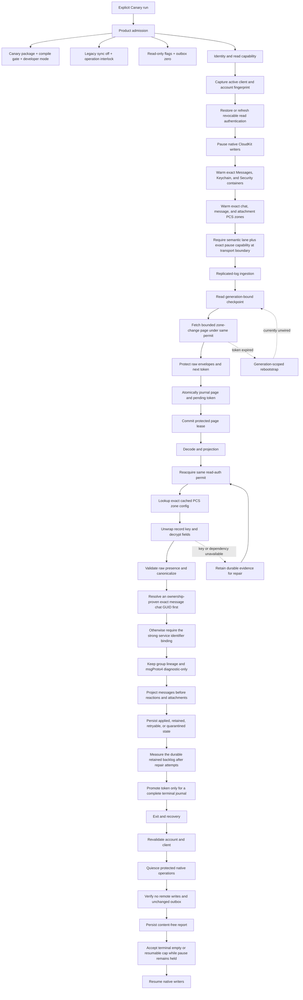
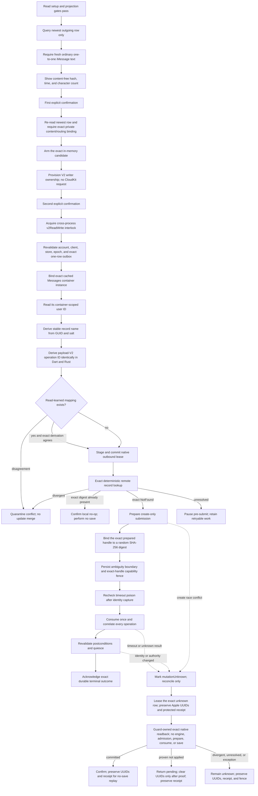
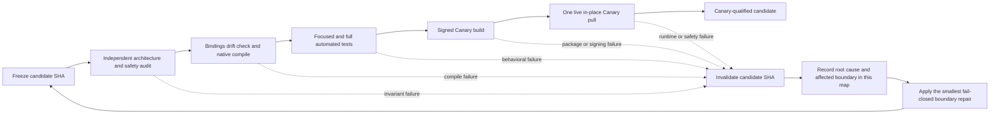
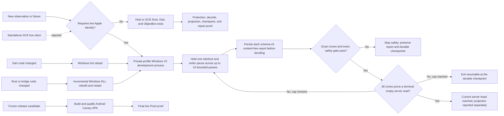

# Cloud Sync V2 connection treemap and recovery state machine

## Decision

Treat Messages in iCloud as a durable replicated log whose ingestion is
separate from local message projection. A successful network fetch is not a
successful sync, and an undecryptable or temporarily unprojectable record must
not disappear merely because a later CloudKit cursor exists.

Every protected operation in one run must remain bound to the same tuple:

```text
account fingerprint
  + live CloudMessagesClient identity
  + read-authentication generation
  + protected-store identity
  + native writer-pause permit
  + container/database/zone
  + checkpoint generation
```

If any member changes, the run fails closed. It must not borrow another
container, create PCS state, fall back to legacy sync, clear a cursor, or
continue under a new account.

## Status legend

| Status | Meaning |
| --- | --- |
| `LIVE-PROVEN` | A content-free report or device trace has exercised the boundary on the Pixel. |
| `TEST-PROVEN` | Focused source-contract or behavioral tests cover the boundary, but current-device proof is incomplete. |
| `REPAIRED; LIVE PROOF PENDING` | Source contains the intended repair; generated bindings, signed APK, or device proof remains. |
| `IN REPAIR` | A concrete counterexample invalidated the prior candidate and the replacement has not passed every gate yet. |
| `GAP / POLICY DECISION` | The safe behavior is not wired end to end or needs an explicit product decision. |

## Live investigation board

This table is the current control surface. Every failed assumption changes the
affected node here before another live run; every candidate must pass the next
listed falsification test before its status advances.

| Node | Current evidence | Status | Next falsification test |
| --- | --- | --- | --- |
| Windows private profile and identity | The isolated `cloudkit-v2-dev` profile and marker are present. A current read-only inspection of the real profile proves 668 chats, 12,258 messages, 2,237 attachments, and outbox zero. It contains one pre-existing contentless local row with no CloudKit record identity; the same row remains in the disposable copy and is not a V2 replay regression. Its 48,319-file tree hash was identical before and after the policy experiment, proving the source profile was untouched. The disposable copy now contains 12,569 messages and 2,370 attachments after replay. | Real profile and local projection `LIVE-PROVEN`; isolated policy candidate `LIVE-PROVEN` | Freeze the qualified source, retain the real profile as rollback evidence, and perform mutations only in disposable copies until Android qualification. |
| Relay activation and saved identity | Alpha's existing relay health check is green. A consumed sharing code is rejected by the registration relay with HTTP 401, while a fresh iPhone-relay code entered into the signed Canary was accepted and advanced through Apple password login to SMS 2FA. The OABS/QR exporter deliberately supports only `MacOSConfig`; `RelayConfig` has no encoded transfer payload. A Windows `hw_info.plist` contains a usable `RelayConfig`, but its NGM identity is bound to the Windows keystore. Android KeyMint rejected that copied identity, so it is not a portable login bundle. The repair now stages only the saved relay configuration and creates fresh Android-local NGM and APNS state through the same setup path Alpha uses. | Root cause `LIVE-PROVEN`; repaired path `TEST-PROVEN` | Qualify and install the repaired Canary, verify that Activation shows the saved relay device, then advance through Apple login without requesting another relay code. |
| Fresh Apple account and PCS bootstrap | The active CloudKit branch had diverged from the installed Alpha and omitted `201661268` and `b0ea2abbc`, Alpha's stale-login-attempt and Rust-handle lifetime repairs. Canary now restores Alpha's guarded login controller while retaining the content-free SRP response classifier. Exact source `6bb6a506db2f525a756d4e773fe1c98884bbcc05` completed fresh Android login, created Android-local identity state, and reached CloudKit. Its first V2 pull then stopped at `cloud_sync_native_auth_pcs_zones_failed`. A trusted-device PIN bootstrap through the existing legacy setup enlarged the local Keychain state, and the next V2 pull passed PCS authorization and fetched 450 protected changes with writes disabled. This isolates ordinary Apple login from the separate iCloud Keychain clique requirement. The dedicated V2 preparation action now checks clique membership, fetches existing escrow bottles, prompts for one trusted-device credential, and joins without enabling legacy sync. Empty recovery data fails closed, non-credential join failures are treated as outcome-unknown and rechecked before any retry, account teardown waits for the foreground operation, and the path contains no encrypted-data reset call. | Login and PCS boundary `LIVE-PROVEN`; dedicated V2 preparation `TEST-PROVEN` | Qualify the exact SHA, install it over Canary without clearing data, and prove the preparation action reports already-ready on the existing trusted profile. A fresh untrusted Canary remains a separate live join test. |
| Apple network path | On the current military Wi-Fi, the PC reached `gateway.icloud.com:443`, the APNS bag endpoint, and the same APNS courier host on TCP 5223 and 443. The committed rustpush revision tries 5223 then 443 with bounded timeouts. GitHub SSH 22 was blocked, so source submodules use a command-local HTTPS rewrite only. | `TEST-PROVEN`; live active APNS port not yet recorded | Record the selected APNS port and a successful CloudKit request from the signed Windows harness without logging credentials or content. |
| Session-wide no-write boundary | Independent audit disproved the first controller design: one-shot sampler calls resumed native writers between reports, before terminal-empty acceptance. The replacement holds one operation interlock and one native-writer pause across every pass, report persistence, and terminal decision. Every controller construction now requires an explicit session runner; the unsafe one-shot fallback is gone. The durable fence renews throughout the session. Exit settles an in-flight renewal and checks the actual operation state, while same-kind nested work is rejected immediately after fence loss. Sixty-six focused tests pass, targeted analysis is clean, and the post-fix independent audit found no P0-P3 issue. | `TEST-PROVEN`; GCE/live pending | Full Dart/Rust/GCE qualification on the frozen replacement SHA. |
| Crash-recovery interlock feedback | A force-stop during a live legacy sync correctly releases the process and file locks but leaves the durable database fence valid for its five-minute crash-safety lease. Immediate legacy and V2 retries fail closed. The interlock now reads only the active lease expiry through an optional owner-free status surface, bounds that advice to its own maximum lease duration, and gives the user an approximate retry interval. Missing, corrupt, or clock-skewed status falls back to the five-minute maximum. It never clears, steals, renews, or identifies the lease. | Safety behavior `LIVE-PROVEN`; repair and expiry tests `TEST-PROVEN`; device copy pending | Force-stop one Canary pull, restart, and require the busy message to explain the interrupted lease. Retry after expiry and require acquisition without clearing state. |
| Drain termination and launcher identity | The 16-pass outcome is now distinct resumable non-success. Every status is bound to a cryptographic launch ID and exact Dart PID, launchers are profile-serialized, and timeout or identity mismatch leaves the active exact process running. A later invocation rejects that retained harness before touching build artifacts and rechecks immediately before launch. The status reader now retries transient Windows sharing violations without accepting stale or malformed state. No-build drain selection chooses the latest matching read-only semantic report rather than an unrelated newer projection report. The local-only projection viewer uses a source-bound, artifact-hash build receipt; mutated-artifact and changed-source receipt tests fail closed. CloudKit-capable no-build operations retain the stricter fresh-report gate. | Viewer restart and status/report handling `LIVE-PROVEN`; drain terminal behavior `LIVE-PROVEN` on the isolated copy | Keep launch identity and report-selection contracts in the focused PowerShell suite, then repeat on the frozen Android candidate. |
| Initial-sync workload controls | The first authenticated Android semantic pass used four pages of 50 changes per zone. It fetched 200 chat, 50 message, and 200 attachment changes; attachment metadata processing alone took about 65 seconds, while no message could project because the eligible message preceded its owning iMessage chat behind an SMS-heavy change stream. CloudKit continuation is an opaque per-zone token plus `moreComing`, so the client can resume but cannot safely date-seek. The installed Canary offers one, four, or sixteen passes under one interlock and native-writer pause. It has now fetched through chat sequence 524, but the pending page is held behind sequence 475 rather than needing another page. A content-free comparison with the already-drained Windows profile places its corresponding heads at 793, 18,992, and 3,626 changes. The comparison is directional rather than a cursor equivalence proof, but it shows why one small run cannot complete history and why sixteen passes can reach the chat head long before the message head. | Workload and resumability `LIVE-PROVEN`; bounded composition `TEST-PROVEN`; current chat page blocked locally | Repair and replay the exact local barrier before fetching another chat page. Require persisted reports after every pass and increasing chat ownership. Escalate to Deep only after the current page drains. Do not fetch attachment bodies during initial history. |
| Remote-ingestion head | Engine evidence distinguishes a durably journaled terminal empty server page from a duplicate nonempty page that inserts zero rows. The isolated Windows profile reached a terminal empty read for all three zones with content-free checkpoint totals of 793 chat, 18,992 message, and 3,626 attachment changes. The preserved Android Canary has not reached any zone head; its message zone still has one protected pending page. | Windows topology `LIVE-PROVEN`; current Canary incomplete | Resume the Canary from its protected tokens. Treat a pass-limit exit as progress, not completion, and accept head only when each exact zone records an empty terminal read. |
| Exact local projection | Earlier signed Android state held 599 owned chats and projected 87 messages. The preserved Windows profile holds 668 owned chats and 12,258 owned messages. The isolated compatibility replay recovered 311 additional historical iMessage messages and 133 attachment metadata rows, reaching 12,569 messages and 2,370 attachments. All 311 replay-added messages are renderable. The full copy has 12,503 plain-text bodies, 65 attachment-only rows, and the same one pre-existing non-CloudKit blank row as its source. Its projected bodies contain zero replacement characters, unexpected controls, malformed UTF-16, common mojibake signatures, HTML error documents, or invisible-only text. Outbox remains zero, and a second drain applied zero rows. The read-only Windows list and detail viewers reached ready state in responsive signed windows. Of 262 current-provenance V2 attachments, all 262 resolve to exact protected sources; 115 are materializable and 147 are honestly metadata-only. A signed live probe transferred one 1,150-byte plugin payload through exact record fetch, ETag binding, PCS decryption, MMCS/Ford V2 authentication, and atomic placement. A second production-adapter call returned `alreadyReferenced=true`, preserved the file digest and timestamp, created no materialization partials, and left exactly one final `referenced` row. | Windows projection, replay, viewer, one attachment transfer, and live idempotency `LIVE-PROVEN`; Android presentation pending | Qualify one exact source and require the preserved Canary to show the same recovered history without a restart, orphan, new blank row, duplicate, or write. Then repeat one small on-demand attachment on Android and require one verified local body with no partial state. |
| Android projection-to-UI handoff | `ChatsService` ignores its first zero-to-nonzero count transition and its incremental watcher adds only one chat when a transaction creates many. The Windows replay exposed a second defect: direct semantic message writes never maintained `Chat.dbOnlyLatestMessageDate`, so all 545 chats with visible messages had a null ordering cache. The adapter now updates that cache monotonically per message, and a local-only post-pull repair backfills older projected profiles before the full chat-list refresh. On the disposable profile it repaired 545 rows, produced 545 exact matches with zero null/stale/ahead rows, and changed zero rows on repeat. A refresh failure still preserves the completed CloudKit result and gives an explicit restart fallback. CloudKit URL balloons also carried a valid projected URL while `hasDdResults` was false; the legacy getter therefore misclassified them as unsupported interactive messages. The getter now recognizes a URL-balloon marker plus a validated URL, preserves the first URL when multiple distinct links are present, and fails closed for invalid text and nullable legacy flags. | Ordering repair `LIVE-PROVEN` on Windows; URL-balloon repair and Android source contract `TEST-PROVEN`; device proof pending | Install only after full qualification, then require recent chats to appear in correct order immediately after catch-up and after app restart. Open a pulled multi-link URL balloon and prove a usable preview target without exposing message content. |
| Canonical ownership bootstrap | Exact source `046bea639793163e3343e67c8367c44e8a08a526` passed the full GCE, signing, runner-cleanup, and native-library gates in run `33622711864`, then installed over the preserved Canary with Alpha unchanged. The corrected nullable-style bootstrap committed one authenticated Chat snapshot and three iMessage aliases, proving the circular bootstrap repair works. The next Standard run reached chat sequence 524, but sequence 475 became a local barrier. The auth-drift repair let that exact protected row pass a stable before/after identity fence and reach `native_ready`. Content-free decoder instrumentation then isolated the remaining conflict as `decoder_chat_service_mismatch`: Rust intentionally emitted typed SMS `CloudChat` metadata for the mixed-route historical-iMessage resolver, while Dart still enforced the older iMessage-only Chat contract. The candidate removes only that stale Chat rejection; SMS/RCS Message and Reaction bodies remain rejected or typed out of scope. The current content-free census remains 176 local iMessage chat shells, one Chat snapshot, one record map, one replay row, zero projected Messages, and 49 later Chat rows ordered behind sequence 475. | Bootstrap and exact barrier cause `LIVE-PROVEN`; decoder contract repair `TEST-PROVEN` | Qualify and install the repaired Canary in place, replay sequence 475, and require sequences 476-524 to drain. Then require Chat snapshots to rise above one, the retained Message to gain an independently proven owner, visible chats/messages in the actual UI, unchanged outbox `0 -> 0`, and unchanged Alpha state. |
| Outbound authority and exclusion | The Android-Canary-only UI selects the newest eligible existing one-to-one iMessage text, shows only a GUID hash, timestamp, and character count, and requires two single-use confirmations. The operator must enter the exact recipient; the persisted candidate must use canonical iMessage endpoint forms and agree across chat GUID, chat identifier, sole participant, and one current IDS sending handle. The encoded native `CloudMessage` is then checked against that same exact route before any admission. Before provisioning and again inside the final `v2ReadWrite` exclusion, it re-reads only that newest row and requires an exact private content/routing binding; edits, deletion, rerouting, active-handle replacement, expiry, or a newer outgoing row cancel the operation without falling back. The core holds the cross-process interlock through native quiescence. Every native writer boundary independently requires that active interlock. A changed account, exact Dart transport client, protected-store identity, authority epoch, or exact cached writer-container instance revokes the permit; an ambiguous postcondition durably marks authority `mutationUnknown`. The guard rechecks timeout poisoning after asynchronous identity capture and before it can arm mutation state. Each native prepared handle has a random SHA-256 binding recorded in the durable capability fence, so a capability for one handle cannot consume another. The native consume boundary accepts that one digest-bound capability and revalidates the retained container on both sides of submission. | `TEST-PROVEN`; no live write yet | Qualify the exact source in CI, then prove one bounded Canary create while legacy/read-only owners cannot overlap it. |
| Deterministic Messages record identity | Apple derives a missing message record name as full lowercase hexadecimal HMAC-SHA256 with `ckAppInit.cloudKitUserId` as the UTF-8 key and the unchanged message GUID as UTF-8 data. A signed ARM64 Windows debug DLL from CI run `33484931375` compared that derivation with 142 Apple-created message records in the isolated profile: 142 matched and zero differed. No content or identity input was logged. The diagnostic oracle has been removed from the candidate. | `LIVE-PROVEN`; 142/142 exact matches | Keep the synthetic fixture in CI and reject any staged, prepared, or reconciled mapping that disagrees with the deterministic derivation. |
| Exact first-create reconciliation | V2 now initializes the exact general Messages container, resolves only the existing `messageManateeZone` PCS configuration, and keeps its container-scoped user ID native-only. It derives the stable name before staging, then recomputes the derivation at prepare and reconcile. A non-forgeable native binding retains the exact container `Arc`; same-user replacement fails before proof or submission and a post-submit replacement becomes mutation-unknown. Exact absence may admit create-only; an exact matching digest is a local confirmed no-op; divergent state is quarantined; unresolved state stays pre-submit. A post-submit create conflict is ambiguous until exact reconciliation proves same, divergent, or unresolved state. Recovery accepts one exact `pending` or `unknownOutcome` create and automatically routes an exact `confirmed` row into no-save replay. The Canary's transition policy retains the confirmed native receipt durably; protected-store recovery treats that receipt as live across restart. Exact readback returns an opaque proof bound to the operation and receipt. Only that proof can release the local receipt, while quarantined and ordinary confirmed rows keep terminal cleanup behavior. Neither lane admits a new message. | `REPAIRED`; live write pending | Run one exact remote-absence/create/confirmed-only-replay sequence and prove one remote record, one durable terminal outcome, and zero replay saves. |
| Outbound durability before live write | A read-only audit found that remote-write admission is still missing four production properties even though authority exclusion and deterministic record identity are test-proven: an expiring outbox lease has no heartbeat during a long submission; the durable result does not yet bind the complete server causality tuple; local message mutation and outbox admission are not one ObjectBox transaction; and tombstone causality has no safe anti-resurrection proof. Account/generation fencing inside admission and live legacy/V2 one-writer coexistence also remain unproven. | `NO-GO` for remote writes | Add generation-bound compare-and-swap lease renewal first, then make local mutation plus outbox admission atomic. Keep remote writes disabled until result identity, tombstones, account fencing, and coexistence pass restart and ambiguity tests. |
| Candidate qualification | GCE run `33622711864` qualified exact source `046bea639793163e3343e67c8367c44e8a08a526`: generated bindings, full Dart, Rust, rustpush, protector, Canary APK/native-library verification, GitHub-hosted signing, runner deregistration, and VM deletion all passed. The signed artifact was installed in place without clearing Canary data. Live login, PCS, protected read, no-write tripwires, and one Chat ownership bootstrap passed. The auth-drift repair and single-use barrier migration pass 237 focused decoder, engine, and ObjectBox tests. The follow-on SMS-Chat contract repair passes the 58-test decoder/safe-code set and the exact mixed-route ObjectBox integration test; full clean qualification is pending. | Installed predecessor `LIVE-PROVEN`; current repair `TEST-PROVEN`; end-user projection incomplete | Qualify and install the repair in place without clearing Canary data, inspect a read-only post-run copy, and use visible readable UI state as the release gate. |

### Investigation checkpoint: preserved retry generation after contract repair

Exact source `e78eb7ab11310878758bc01dc0c1dc7fab7e2621` passed generated-
binding drift, the full Dart suite, Rust library and production-feature tests,
the protector harness, Canary APK/native-library verification, GitHub-hosted
signing, runner deregistration, and VM deletion in GCE run `33720501924`. The
signed artifact installed in place with Canary's first-install time and signing
identity unchanged and Alpha untouched. The live Standard pull performed zero
remote saves or deletes, but the UI still showed no chats.

A stopped, read-only ObjectBox copy proved why. Chat sequence 475 remained the
first nonterminal row: quarantined as `conflict`, with no preflight, replay, or
record-map evidence and retry count 3. The repaired typed-SMS Chat decoder was
therefore never reached. The original migration accepted retry count 1 only;
two earlier signed diagnostic retries that isolated the decoder mismatch had
preserved the row and advanced that same historical count to 3.

The replacement migration admits only the non-adjacent historical counts 1 and
3 under the existing exact scope, active-fence, first-barrier, protected-source,
no-semantic-evidence, and fixed-cutoff constraints. Counts 2 and 4 are rejected,
so a failed retry from either admitted state cannot re-enter. Focused and full
ObjectBox tests prove both admitted states, both adjacent rejection states,
idempotence, checkpoint preservation, and evidence rejection. The next
falsification gate is a no-rebuild device replay: sequence 475 must reach the
repaired decoder and the ordered remainder through 524 must drain before a new
signed GCE artifact is produced.

### Investigation checkpoint: why projection worked before but not here

The apparent regression is multiple distinct states behind the same “pull
finished” UI. Authentication and PCS decoding worked, but the local ordered
projection stopped before its transaction.

1. The historical signed Android store had 599 independently authenticated
   Chat snapshots before it committed 87 Message snapshots. Seventy messages
   belonged to iMessage chats and 17 to SMS chats.
2. The isolated Windows fast-loop store reached all three remote heads and has
   668 Chat, 12,258 Message, and 2,108 Attachment snapshots. All 12,258 messages
   have a local chat; 10,125 belong to iMessage chats.
3. The current Canary has 176 local iMessage chat shells, but only one V2 Chat
   snapshot, one record map, and one replay row. It has zero projected Messages.
   The chat checkpoint fetched through sequence 524 but cannot apply beyond
   sequence 474 because sequence 475 is quarantined; 49 later valid rows remain
   ordered behind it.
4. Sequence 475 reached Rust `native_ready`. Before starting the semantic
   transaction, the decoder recaptured its native authentication snapshot and
   found that the client/session identity had changed. The old implementation
   classified this transient authorization drift as a nonretryable semantic
   conflict, even though no replay or record-map evidence was written.
5. A content-free comparison found no exact server-record hash for sequence 475
   in the isolated Windows snapshot. That absence means the profiles cannot be
   used to infer semantic equality or override the Android record's identity.
6. CloudKit Chat record names are generated identifiers, not a derivation of
   `Message.chatID`. The client therefore cannot safely exact-fetch the parent
   Chat by converting the message field into a record name.
7. The repair keeps the strict before/after identity fence. Drift now produces
   a retryable, content-free authorization code and no projection. A fixed-cutoff
   migration may reopen only this first current-generation Chat save, only at
   retry count one, only under the active coordinator fence, and only when no
   replay or record mapping exists. It preserves the protected source,
   checkpoint, token, and attempt history. A second real conflict cannot enter
   the migration again.
8. The bounded retry then passed a stable identity fence and returned native
   `ready`, but the newly split content-free decoder codes identified the next
   conflict as `decoder_chat_service_mismatch` rather than generic conflict.
9. This was a cross-layer contract regression. Commit `fa51bd5c4` deliberately
   retained typed SMS `CloudChat` metadata so one proven current SMS group can
   own its historical iMessages. Dart still carried the earlier iMessage-only
   Chat assertion from `b41f3df2b`, so the valid dependency could never reach
   the already-tested mixed-route resolver.
10. The repair admits typed SMS metadata only in the Chat lane. The existing
    native exact-service check remains authoritative, while SMS/RCS Message and
    Reaction bodies stay rejected or typed out of scope. Focused decoder,
    safe-code, and mixed-route ObjectBox tests pass.
11. After that page drains, safe recovery returns to the same ordering that
    succeeded before: authenticate and commit Chat owners and aliases, then
    replay retained Messages. A message-derived owner, copied Windows snapshot,
    legacy `ckRecordId`, or relaxed account boundary remains rejected.

The next experiment requires one in-place repair build while preserving Canary
state. On the first Standard pull, sequence 475 must commit as typed Chat
metadata, then sequences 476-524 must drain before another chat page is fetched.
Success requires more than a completed snackbar: Chat ownership must increase,
the retained Message must project, at least one readable chat/message must be
visible after an app restart, outbox must remain `0 -> 0`, and Alpha must remain
unchanged.

For Dart-only barrier diagnosis, the existing signed debug Canary now has a
proven no-rebuild loop: attach Flutter with the Canary's four exact compile-time
defines, hot-reload the bounded content-free diagnostic change, invoke the
existing semantic action, and inspect only the reviewed report vocabulary. The
initial attach took about 21 seconds and a one-to-two-library reload about one
second. This lane cannot qualify a release and cannot test Rust/native changes;
the final candidate still requires a clean exact-SHA build, native-library
inspection, signing, and in-place install.

### Investigation checkpoint: Windows projection and usability proof

A fresh read-only inspection of the isolated Windows ObjectBox profile on
2026-09-02 confirmed that CloudKit data is not merely downloaded and journaled:

1. all 12,258 projected messages are attached to one of 668 chats;
2. 12,192 use plain-text bodies and 1,828 carry attachment relationships; 65
   are attachment-only, while one pre-existing local row has neither content
   nor a CloudKit record identity;
3. the local outbox remained zero, with 15,034 semantic snapshots and matching
   record maps still present; and
4. a dedicated local-only viewer bypassed CloudKit authentication, exposed no
   send/delete controls, and displayed both the conversation list and a full
   conversation from the existing projection.

The full-conversation view rendered ten current viewport rows after the
latest-message positioning correction, retained an explicit read-only banner,
and showed no load error or empty-content placeholder. The exact signed build
then closed and reopened from a source- and artifact-hash receipt in 1.42
seconds, producing the same content-free UI result. The process remained
responsive on both launches. The Windows capture helper could read the Flutter
accessibility tree but could not foreground the custom window for a bitmap
capture; this is a test-helper limitation and is not counted as visual proof.

The later disposable replay added 311 messages without adding any blank or
malformed body. Its production body-selection path resolves 12,503 rows from
plain text and 65 from an attachment fallback; the sole contentless row is the
same non-CloudKit row already present in the source. A content-free scan found
zero replacement characters, unexpected control bytes, unpaired UTF-16,
common mojibake signatures, HTML error documents, or invisible-only projected
text. The untouched source and replayed copy also have the same 78 messages at
risk of an empty attachment placeholder, the same 137 missing referenced
attachment rows across 90 messages, and zero missing attachment relations.
Those placeholder risks are therefore pre-existing legacy projection debt,
not a V2 replay regression. No message body was printed, copied into a report,
or retained as a test artifact.

This closes a major ambiguity: the canonical converter, durable projection,
chat linkage, and basic rendering model can produce usable message history.
It does not prove Android Canary ownership catch-up, Android database refresh,
or production UI integration. Those remain the release gate.

Static review then found a deterministic Android presentation gap behind that
last boundary. The normal chat-count watcher ignores the first transition from
zero chats and cannot enumerate a multi-chat semantic transaction. The Canary
catch-up action now awaits one full `ChatsService` refresh after the durable
semantic session returns. The refresh uses the app's existing asynchronous chat
loader, remains outside the CloudKit transaction, and has a content-free
restart fallback so a presentation error cannot be mistaken for lost history.
Focused composition and presentation tests pass; signed-device proof remains
required.

### Investigation checkpoint: session and launcher safety

The 2026-08-31 controller/launcher checkpoint closed five concrete
counterexamples before another live request:

1. native writers no longer reopen between bounded drain passes;
2. the database fence heartbeat remains active for the whole confirmed session;
3. an in-flight renewal is settled and its concrete operation state is checked
   before success can escape (the earlier post-Zone static check was ineffective);
4. disposal closes admission and cannot start a later pass after the current
   persisted report; and
5. pass-limit, timeout, stale status, and concurrent-launch outcomes cannot be
   mistaken for a successful exact-process drain, and a retained timeout/2FA
   process blocks rebuilding its executable or DLL;
6. no controller construction can silently replace a confirmed session with
   repeated one-shot pulls; and
7. same-kind nested interlock work checks the concrete lost-fence state before
   entering its action.

Evidence at this checkpoint is 66 focused session/launcher Dart tests, 140
focused engine/report/mutation/composition tests, a clean targeted analyzer,
the PowerShell launcher behavioral suite, and `git diff --check`. The engine
batch includes the explicit duplicate-nonempty-page counterexample. This is
host proof only. The candidate remains unqualified until a fresh independent
audit, the full GCE matrix, and the signed isolated Windows profile all pass on
one exact commit. The broad local suite is not treated as evidence because this
shell lacks `objectbox.dll`; the pinned GCE image is the full-suite authority.
The bounded post-fix audit found no remaining P0-P3 issue in the session,
interlock, harness, or launcher diff.

### Investigation checkpoint: deterministic Messages record identity

Apple's current and iOS 18.2 implementations agree on the complete first-create
record-name function:

```text
lowercase_hex(HMAC-SHA256(
  key  = UTF8(container_scoped_cloudkit_user_id),
  data = UTF8(message_guid)
))
```

There is no input normalization, case folding, delimiter, prefix, Base64
encoding, or truncation. `CKRecordUtilities.recordNameUsingSalt:guid:` calls
the exported `IMSharedHelperHMACSHA256`; its CommonCrypto implementation passes
the salt as the HMAC key and GUID as data. Independently, CloudKit's private
container initialization returns JSON field `cloudKitUserId`, and rustpush
already stores that exact value as `CloudKitOpenContainer.user_id`. Apple's
container implementation exposes the same container-scoped value as the
current user's `CKRecordID.recordName`, which is the salt consumed by Messages.

This invalidates V2's former `allocate_or_reuse_record_name(None)` UUIDv4 path.
The content-free local oracle passed on 2026-09-01: a CI-built, SHA-256-checked,
ARM64-verified, locally signed debug DLL compared 142 already-fetched Apple
message records and emitted 142 `match=true` observations with zero mismatches.
No GUID, salt, record name, message body, credential, or derived digest was
logged or crossed FFI. The temporary oracle was then removed. V2 staging now
derives the record name inside Rust from the validated general Messages
container, and prepare plus reconcile independently recompute the same binding
before remote I/O.

## End-to-end treemap



The important cut is between `D4` and `E`: remote progress first becomes a
durable local journal. Projection may then retry without refetching or losing
the exact remote evidence.

### Outbound create state machine



This writer is deliberately create-only. Exact absence is proven before the
first save, but the ambiguity boundary is still durable before consumption
because absence and create are not atomic. Once consumption may have happened,
no automatic replay is legal. A later exact lookup may confirm the same digest;
authoritatively prove that no create was applied; or leave the operation unknown.
Only pre-submission divergence may quarantine. Once native consumption may have
occurred, divergence, a readback error, and an unresolved result all preserve
the ambiguity evidence and stop.

There are four deliberately separate operator lanes:

1. **Initial create:** exact candidate selection, private binding revalidation,
   arm, local writer provisioning, final confirmation, then at most one create.
2. **Pending resubmission:** requires one exact `pending` row and a fresh second
   confirmation. It may use the ordinary one-row engine path, but cannot admit
   another message.
3. **Unknown-outcome reconciliation:** requires one exact `unknownOutcome` row
   and a fresh second confirmation. Its session has only read, quiesce, lease,
   exact-readback, and closed-transition capabilities. It never constructs the
   write transport, engine, admission coordinator, writer permit, conflict
   merge, quarantine, delete, prepare, consume, or submit surfaces.
4. **Confirmed-only replay verification:** requires the existing durable row to
   be terminal-confirmed before entry and performs an exact protected remote
   digest lookup. It never invokes native prepare, consume, or save, and must
   finish with zero saves, quarantines, or retries. The readback returns an
   opaque proof bound to the exact operation and protected receipt. Only that
   proof may release the receipt. Release consumes the proof, atomically
   compares every durable operation field, and clears the ObjectBox adoption
   marker before idempotently acknowledging the native receipt. If the process
   dies after the durable clear, startup recovery removes the now-unadopted
   receipt while the separate protected payload reference remains live. A
   stale row never loses its marker. Replay cannot silently become initial
   admission or a second create.

Provisioning is tracked as in-flight state. Account reset and teardown wait for
bounded provisioning quiescence, and synchronous disposal refuses to release
native handles underneath provisioning or a protected write.

Recovery and postflight validation use a closed lifecycle relation, not merely
an operation ID. A recoverable initial `pending` row has no Apple submission
UUIDs, lease, confirmation, or retry metadata. A retried `pending` row has both
failure and next-eligible metadata. An `unknownOutcome` row has the exact Apple
request/operation UUID pair, `unknown` failure, and no live lease or
confirmation. A `confirmed` row has that UUID pair and `confirmedAt`, with no
retry metadata or live lease. Postflight may preserve or newly assign the UUID
pair, but once assigned it cannot be cleared or replaced unless authoritative
`notApplied` readback returns the row to `pending`. Unknown recovery can only
confirm while preserving the pair and receipt, return to pending while clearing
the pair after proof and preserving the receipt, or remain unknown while
preserving all evidence. It cannot quarantine. `paused` is rejected until a
separately reviewed paused-resumption protocol exists.

### Canary installation identity boundary

The signed Canary is installed as
`com.bluebubbles.messaging.cloudkitcanary`, separate from Alpha. Its APK does
not contain the registration-relay token. For the owned Mac mini, setup imports
only the app's hardware-only `OABS` profile through Canary onboarding after
installation. Import creates fresh Canary-local UDID and NGM state. It does not
copy Alpha's `hw_info.plist`, Apple session, database, or messages.

Before import, check only Canary's private state. If Canary already has
`files/hw_info.plist`, stop and preserve it rather than re-importing. Keep the
OABS value out of command lines, logs, CI artifacts, and preferences; discard
the temporary transfer after successful onboarding. No setup command may read
or write Alpha's package path.

### Candidate qualification feedback loop



A passing downstream job never erases an upstream audit failure. Any source
change creates a new candidate SHA and restarts qualification. Failed GCE runs
are allowed to execute their cleanup path, but their APKs are never installed.

### Fast iteration split



The live development boundary must own the exact in-process
`CloudMessagesClient`, revocable read-auth generation, cached PCS configuration,
platform secret storage, and writer-pause capability. Windows already provides
current-user DPAPI protection and the production semantic path admits Windows
x64 and ARM64, so a separately identifiable Windows V2 development build can
provide the fast loop without a phone. It must use a private profile and must
never open the Store app's profile concurrently. Dart changes may hot reload;
Rust or bridge changes require an incremental Windows DLL rebuild and process
restart, but an unchanged signed build may use `-SkipBuild` only when its latest
report proves the current source fingerprint and its native DLL signature is
still valid. That guarded path completed in 17 seconds on 2026-08-31, with no
Android APK. Synthetic records, checkpoint state, canonical
conversion, ObjectBox projection, and report logic remain host or GCE tests.
GCE must never become a live CloudKit client because that would require
exporting the Windows profile's credentials, identity, and PCS state. Android
Canary remains the final release proof, not the everyday edit/retry loop.

Initial catch-up is not one unbounded fetch and cannot be inferred from the
number of newly inserted journal rows. A nonempty duplicate CloudKit page may
insert zero rows, so `fetched == 0` is not proof that the server is empty. The
engine now emits `observedEmptyTerminalRead` only after it durably journals a
terminal page and every server page observed in that run contained zero
changes. The schema-v5 report carries that evidence independently for the exact
chat, message, and attachment zones.

[`run_cloud_sync_v2_dev.ps1`](../tooling/windows/run_cloud_sync_v2_dev.ps1)
launches `-Drain` once. The in-process controller repeats the existing
four-page, 50-change-per-page semantic operation, persists every content-free
report before inspecting it, and stops immediately on any status, quarantine,
retry, zone-shape, or outbox inconsistency. It declares remote catch-up only
when all three zones prove an empty terminal read. A 16-pass ceiling bounds one
session to 3,200 observed changes per zone and exits as explicitly resumable,
not complete. One operation interlock and one native-writer pause enclose the
whole loop, including report persistence and terminal acceptance; reopening
writers between one-shot reports is not a valid drain. ObjectBox checkpoints
remain the only cursor state. Local
projection completeness is reported separately because a terminal remote head
may still contain retained evidence awaiting a safe parser or dependency
repair. Focused engine, sampler, report, and controller tests cover duplicate
nonempty pages, terminal evidence, persistence ordering, unsafe-report abort,
overlap, disposal, and the resumable ceiling. The Windows launcher must also
bind status to its exact launch ID and PID, serialize profile launches, treat
the pass cap as non-success, and never force-kill an active native operation on
timeout. Signed Windows live qualification remains pending.

### Two progress clocks

The implementation intentionally has two different progress clocks. They must
not be collapsed into one user-visible "sync complete" state:

1. **Remote-ingestion progress** is the opaque fetched token. It may advance
   only when the current generation has a complete contiguous journal and
   every row is either exactly applied or explicitly `retainedUnprojected`.
2. **Exact-projection progress** is the contiguous applied sequence. It advances
   only across rows whose canonical projection committed atomically.

`retainedUnprojected` therefore prevents a parser or dependency defect from
pinning the remote cursor forever, but it is not success. The protected source,
digest, record mapping evidence, scope, and generation remain durable; the row
is retried locally; and Messages-in-iCloud write admission requires all three
zones to contain only exactly applied rows. Canary reports and future UI must
show fetched, retained, and projected counts separately.

## Source-linked audit

| Boundary | Current source | Required invariant | Status |
| --- | --- | --- | --- |
| Manual admission | [`troubleshoot_panel.dart`](../lib/app/layouts/settings/pages/misc/troubleshoot_panel.dart#L436), [`rustpush_service.dart`](../lib/services/rustpush/rustpush_service.dart#L7448) | User-confirmed Canary entry only; no automatic semantic pull. | `LIVE-PROVEN` |
| Process and database exclusion | [`CloudKitOperationInterlock.runExclusive`](../lib/services/rustpush/cloud_sync/cloudkit_operation_interlock.dart), [`CloudSyncManualSemanticPullSampler.runConfirmedSession`](../lib/services/rustpush/cloud_sync/cloud_sync_manual_semantic_pull_sampler.dart) | One CloudKit owner, durable renewing fence, one native-writer pause across all reports/decisions, settlement of any in-flight renewal before exit, direct final fence-state validation, and writer resume in `finally`. | `TEST-PROVEN`; session replacement not yet live-qualified |
| Account-bound read authentication | [`CloudSyncProductionAuthSnapshotProvider`](../lib/services/rustpush/cloud_sync/cloud_sync_production_sampler_adapter.dart#L775), [`cloud_sync_ensure_read_authentication`](../rust/src/api/api.rs#L7520) | Restore or refresh only the active client's revocable read credential; reject a raced session replacement. | `TEST-PROVEN`; persisted restore exercised live |
| Writer-pause capability | [`prepareReadAuthenticationUnderNativeWriterPause`](../lib/services/rustpush/cloud_sync/cloud_sync_production_sampler_adapter.dart#L826), [`NativeProtectedCloudSyncTransport.fetchChanges`](../lib/services/rustpush/cloud_sync/native_protected_cloud_sync_transport.dart#L810), [`cloud_sync_warm_read_authentication_under_writer_pause`](../rust/src/api/api.rs#L319) | Exact positive 64-bit token, active interlock, and same client/account before and after warmup. An unbound fetch is legal only for the non-projecting shadow lane; a bound fetch is legal only for the semantic lane. | `TEST-PROVEN; LIVE-PROVEN ON SIGNED WINDOWS ARM64 HARNESS` |
| Exact PCS-zone warmup | [`warm_semantic_read_zone_encryption_configs`](../rustpush/src/imessage/cloud_messages.rs#L2201), [`get_cached_zone_encryption_config_exact`](../rustpush/src/icloud/cloudkit.rs#L3579) | Lookup only `chatManateeZone`, `messageManateeZone`, and `attachmentManateeZone` on the read-auth container. Never create a zone or use the general container. | `LIVE-PROVEN` across all three exact zones |
| Capability-bound protected fetch | [`cloud_sync_fetch_protected_page_under_writer_pause`](../rust/src/api/api.rs#L2190), [`sync_records_page_for_read_authentication`](../rustpush/src/imessage/cloud_messages.rs#L2388), [`CloudSyncEngine._pullChangesWhileStoreExclusive`](../lib/services/rustpush/cloud_sync/cloud_sync_engine.dart#L898) | Semantic fetch must acquire the exact active writer-pause capability, use only the permit-validated cached read-auth container, and hold it through the remote page read. Previous token and generation remain opaque; page, record, byte, and time limits remain enforced. The separate unbound entry point is restricted at composition and transport boundaries to the compile-gated, non-projecting shadow diagnostic. | `TEST-PROVEN; LIVE-PROVEN` for bounded 200-record windows per zone |
| Page adoption and crash recovery | [`CloudProtectedPageLeaseLifecycle`](../lib/services/rustpush/cloud_sync/cloud_protected_page_lease_lifecycle.dart#L11), [`journalFetchedBatch`](../lib/services/rustpush/cloud_sync/objectbox_cloud_sync_store.dart#L104) | Protect page before Dart exposure; atomically journal before committing the native page lease. | `TEST-PROVEN`; live reports show admitted pages |
| Same-capability protected decode | [`RustCloudSemanticDecoder`](../lib/services/rustpush/cloud_sync/cloud_sync_production_sampler_adapter.dart#L577), [`cloud_sync_decode_protected_change`](../rust/src/api/api.rs#L3545), [`cloud_sync_decode_transient_record_cached_only`](../rust/src/cloud_sync_transient_bridge.rs#L1605) | Decode uses the same writer-pause permit and exact cached read-auth container/PCS key as fetch preparation. Deterministic nested-protobuf schema failures are malformed retained evidence; actual panics remain internal decoder failures. | `TEST-PROVEN; LIVE-PROVEN` without a page retry barrier |
| Post-decode identity fence and pretransaction recovery | [`RustCloudSemanticDecoder`](../lib/services/rustpush/cloud_sync/rust_cloud_semantic_decoder.dart), [`CloudPretransactionChatConflictBarrierRecoveryStore`](../lib/services/rustpush/cloud_sync/cloud_sync_store.dart), [`ObjectBoxCloudSyncStore.requeuePretransactionChatConflictBarrier`](../lib/services/rustpush/cloud_sync/objectbox_cloud_sync_store.dart) | Recapture the native client, account, protected-store, and session identity after decode. Any drift stops before projection and is retryable authorization, never semantic conflict. The migration may reopen only the first current-generation `chatManateeZone` save that an older build quarantined as conflict before a transaction, with retry count exactly one, a fixed historical cutoff, an active coordinator fence, protected source intact, and no replay or record mapping. It does not change a checkpoint, token, source, digest, or prior attempt. | `TEST-PROVEN`; 237 focused decoder, engine, and ObjectBox tests pass; device replay pending |
| Canonical conversion | [`cloud_sync_canonical_converter.rs`](../rust/src/cloud_sync_canonical_converter.rs), [`parse_associated_parent`](../rust/src/cloud_sync_canonical_dto.rs#L2023) | Preserve wire presence, reject malformed identity, and do not invent clear/delete semantics. | `TEST-PROVEN`; representative records decoded live |
| Ordered local projection | [`TransactionalCloudInboxApplier`](../lib/services/rustpush/cloud_sync/cloud_inbox_applier.dart#L866), [`ObjectBoxCanonicalSemanticEntityAdapter`](../lib/services/rustpush/cloud_sync/objectbox_canonical_semantic_entity_adapter.dart#L204), [`ObjectBoxCloudSemanticStoreGateway`](../lib/services/rustpush/cloud_sync/objectbox_cloud_semantic_store_gateway.dart#L305) | One local transaction records canonical state, replay metadata, record mapping, and terminal inbox state. Chat aliases precede messages; messages precede reactions and attachments. | `LIVE-PROVEN`, with remaining unsupported fields/attachments retained |
| Pre-digest ownership repair | [`TransactionalCloudInboxApplier.repairLegacyOwnershipEvidence`](../lib/services/rustpush/cloud_sync/cloud_inbox_applier.dart), [`ObjectBoxCloudSemanticStoreGateway.repairLegacyOwnershipEvidence`](../lib/services/rustpush/cloud_sync/objectbox_cloud_semantic_store_gateway.dart), [`ObjectBoxCanonicalSemanticEntityAdapter.proveLegacyCanonicalOwnership`](../lib/services/rustpush/cloud_sync/objectbox_canonical_semantic_entity_adapter.dart) | Run locally before transport under the current coordinator fence. Admit only a current applied save with unique replay, current record map, exact protected re-decode, exact stored snapshot, and exact immutable canonical identity. Cover every historically writable kind: chat, message, reaction, and attachment. Require reaction parents and attachment owners to resolve through an exact durable Message-zone owner in the current account and dependency generation. Update only `canonicalGuidHash` plus `canonicalGuidLookupHash`; never mutate canonical rows, aliases, inbox, replay, checkpoint, token, outbox, or transport state. The global null-owner barrier remains until every legacy owner in that scope is proven. | `TEST-PROVEN`; GCE and signed Canary proof pending |
| Pre-semantic canonical bootstrap | [`CloudLegacyCanonicalOwnershipProofAdapter.provePreexistingCanonicalOwnership`](../lib/services/rustpush/cloud_sync/objectbox_cloud_semantic_store_gateway.dart), [`ObjectBoxCanonicalSemanticEntityAdapter.provePreexistingCanonicalOwnership`](../lib/services/rustpush/cloud_sync/objectbox_canonical_semantic_entity_adapter.dart), [`_ObjectBoxCloudSemanticStoreTransaction.applyEntity`](../lib/services/rustpush/cloud_sync/objectbox_cloud_semantic_store_gateway.dart) | Use only after the normal ownership check reports `canonical_identity_owner_unproven`, only when no semantic snapshot exists for the incoming logical key, and only when the exact canonical row predates V2. Require the transient decoded owner plus exact immutable canonical identity. A null legacy Chat style is missing mutable projection state, not contrary identity; any non-null style must still equal the decoded direct/group style and the canonical upsert fills a null style atomically. Stage both ownership digests on the incoming snapshot in the same write transaction, rerun the full global ownership check, then atomically commit canonical state, snapshot, map, replay, inbox terminal state, and checkpoint. A missing row follows the ordinary create path; any partial, unrelated, ambiguous, cross-kind, mismatched, or competing ownership evidence remains blocking and rolls back the provisional proof. | Circular dependency and nullable-style cause `LIVE-PROVEN`; corrected candidate analyzer clean, GCE pending |
| Legacy unknown-row retry | [`CloudUnknownInboxBarrierRecoveryStore`](../lib/services/rustpush/cloud_sync/cloud_sync_store.dart#L290), [`ObjectBoxCloudSyncStore.requeueUnknownInboxBarrier`](../lib/services/rustpush/cloud_sync/objectbox_cloud_sync_store.dart#L974) | Reopen only the first unresolved current-generation save in the still-pending batch, only if it predates the fixed migration cutoff. Preserve retry history, protected reference, digest, checkpoint, and token. Reject tombstones and preflight failures. | `TEST-PROVEN`; bounded one-time migration, not a general fallback |
| Retained projection repair | [`TransactionalCloudInboxApplier.reprojectRetainedUnprojected`](../lib/services/rustpush/cloud_sync/cloud_inbox_applier.dart#L894), [`CloudRetainedProjectionStoreGateway`](../lib/services/rustpush/cloud_sync/cloud_inbox_applier.dart#L797) | Candidate selection is scope- and generation-bound. A retained row becomes applied only in the same transaction that commits its complete canonical projection; failures rotate fairly without changing token or source evidence. | `TEST-PROVEN`; exercised live with unresolved rows remaining |
| Cursor promotion | [`_promotePendingFetchedTokenIfTerminalLocked`](../lib/services/rustpush/cloud_sync/objectbox_cloud_sync_store.dart#L2456) | Promote the pending token only when every sequence exists and is terminal. `retainedUnprojected` may release fetch progress but remains repairable and never counts as fully applied. | `TEST-PROVEN`; exercised live |
| Honest Canary completion | [`CloudRetainedUnprojectedBacklogStore`](../lib/services/rustpush/cloud_sync/cloud_sync_store.dart#L290), [`ObjectBoxCloudSyncStore.readRetainedUnprojectedInboxCount`](../lib/services/rustpush/cloud_sync/objectbox_cloud_sync_store.dart#L752), [`CloudSyncManualSemanticPullSampler`](../lib/services/rustpush/cloud_sync/cloud_sync_manual_semantic_pull_sampler.dart#L285), [`cloudSyncV2SemanticCanaryPresentation`](../lib/app/layouts/settings/pages/misc/troubleshoot_panel.dart#L46) | Read the current-generation durable retained backlog after repair attempts, then sum it across all zones. A zero per-run transition count is insufficient. Report `Complete` only when the original three-zone/status/quarantine/retry/write-tripwire gates pass and durable retained count is zero; a completed read with retained evidence is degraded/`Partial`, while a blocking failure is `Stopped Safely`. | `TEST-PROVEN; LIVE-PROVEN` |
| Token-expiry reset | [`CloudSyncStore.rebootstrapAfterReset`](../lib/services/rustpush/cloud_sync/cloud_sync_store.dart#L150), [`ObjectBoxCloudSyncStore.rebootstrapAfterReset`](../lib/services/rustpush/cloud_sync/objectbox_cloud_sync_store.dart#L1312) | Obtain an account-bound remote-reset proof, quiesce the coordinator, atomically fence old evidence, increment generation, and restart from no token. The coordinator must also prove how unresolved old-generation saves and tombstones remain repairable or are reconciled by the full refetch. | `GAP / POLICY DECISION`: durable primitive exists, but production orchestration has no caller and current-generation reprojection cannot consume generation-zero evidence |
| No-write exit tripwire | [`CloudSyncManualSemanticPullSampler._runConfirmedUnderInterlock`](../lib/services/rustpush/cloud_sync/cloud_sync_manual_semantic_pull_sampler.dart#L194) | Remote confirmations remain zero, outbox count is unchanged, active identity is revalidated, native operations quiesce, and writers resume. | `LIVE-PROVEN` |
| Manual writer admission | [`troubleshoot_panel.dart`](../lib/app/layouts/settings/pages/misc/troubleshoot_panel.dart), [`CloudSyncManualOutboundCanary.runDoubleConfirmed`](../lib/services/rustpush/cloud_sync/cloud_sync_manual_outbound_canary.dart), [`CloudKitOperationInterlock`](../lib/services/rustpush/cloud_sync/cloudkit_operation_interlock.dart) | Expose controls only in the compile-gated Android Canary. Initial create, interrupted recovery, and confirmed-only replay are separate two-confirmation lanes. Consume the confirmation before the first await, then hold one durable `v2ReadWrite` exclusion across fresh candidate or exact-operation revalidation, the second preflight, admission or reconciliation, one-row flush, terminal checks, and native quiescence. | `TEST-PROVEN`; live write pending |
| Exact local candidate binding | [`CloudSyncOutboundCanaryCandidateSelector`](../lib/services/rustpush/cloud_sync/cloud_sync_outbound_canary_candidate.dart), [`RustPushService.armCloudSyncV2OutboundConfirmed`](../lib/services/rustpush/rustpush_service.dart) | Query only the newest outgoing row. Require one fresh ordinary one-to-one iMessage text with no subject; never fall back. Require canonical persisted endpoint forms and exact agreement with the operator-entered recipient across chat GUID, chat identifier, and sole participant, plus a current IDS sending handle. Validate the encoded `CloudMessage` service, type, error, chat ID, sender, destination caller ID, and GUID against that route. Re-read current IDS handles and the exact row before arming and once more inside the final run exclusion; require the same private SHA-256 binding over content, route, time, and state. Keep the binding, body, recipient, and handles out of diagnostics. | `TEST-PROVEN`; live write pending |
| Writer provisioning quiescence | [`RustPushService.prepareCloudSyncV2OutboundWriter`](../lib/services/rustpush/rustpush_service.dart), [`RustPushService.resetAppleState`](../lib/services/rustpush/rustpush_service.dart), [`RustPushService.onClose`](../lib/services/rustpush/rustpush_service.dart) | Arm before provisioning. Track the provisioning future, reject concurrent admission, wait boundedly during account reset, and never dispose native handles underneath provisioning or an active write. | `TEST-PROVEN`; live write pending |
| Recovery and no-save replay | [`CloudSyncManualOutboundCanary.armRecoveryConfirmed`](../lib/services/rustpush/cloud_sync/cloud_sync_manual_outbound_canary.dart), [`CloudSyncManualOutboundCanary.armConfirmedReplay`](../lib/services/rustpush/cloud_sync/cloud_sync_manual_outbound_canary.dart), [`CloudKitWriterMutationGuard.reconcileUnknownOutcome`](../lib/services/rustpush/cloud_sync/cloudkit_writer_mutation_guard.dart), [`NativeProtectedCloudSyncTransport.releaseConfirmedReplayReceipt`](../lib/services/rustpush/cloud_sync/native_protected_cloud_sync_transport.dart) | Recovery snapshots the complete exact durable row and passes its explicit kind plus snapshot to a disjoint session factory. Pending resubmission, unknown readback, and confirmed replay cannot be cast into one another. The unknown lane constructs no engine, admission coordinator, write transport, writer permit, prepare, consume, conflict merge, quarantine, or delete capability. Guard-owned native readback is exhaustive: committed preserves UUIDs and receipt while confirming; proven-not-applied clears UUIDs only after proof while preserving the receipt and returning pending; divergent, unresolved, quarantined-envelope, and exception outcomes remain unknown and preserve UUIDs, receipt, and fence. ObjectBox reopen tests pin that evidence across restart. Confirmed replay remains exact no-save proof and is the only lane that can release a retained receipt after exact durable comparison. | `TEST-PROVEN`; live write pending |
| Revocable write authority | [`CloudKitWriterMutationGuard`](../lib/services/rustpush/cloud_sync/cloudkit_writer_mutation_guard.dart), [`NativeProtectedCloudSyncTransport`](../lib/services/rustpush/cloud_sync/native_protected_cloud_sync_transport.dart), [`CloudMessagesWriterPreparationBinding`](../rustpush/src/imessage/cloud_messages.rs) | Every native writer boundary requires `v2ReadWrite`. Account, exact Dart transport client object, store, epoch, and exact cached writer-container instance must remain exact before and after action. Timeout poisoning is rechecked after asynchronous identity capture and before mutation state can be armed. Ambiguity moves authority from stable epoch `E` to `mutationUnknown` at `E+1`; exact committed/not-applied readback reconciles to stable `E+2`, while unresolved evidence remains fenced at `E+1`. Fence schema v3 binds the exact lowercase reconciliation SHA-256 before and after native submission. | `TEST-PROVEN`; live write pending |
| Exact prepared-handle capability | [`CloudKitWriterMutationGuard`](../lib/services/rustpush/cloud_sync/cloudkit_writer_mutation_guard.dart), [`cloud_sync_consume_prepared_message_create`](../rust/src/api/api.rs) | Every native prepared handle owns a content-free random SHA-256 binding. The durable fence must contain that exact binding plus the capability digest, account, store, owner, and scope. A capability/fence for one prepared handle cannot consume another, and a rejected attempt does not consume either handle. | `TEST-PROVEN`; live write pending |
| Cross-language operation identity | [`CloudOperationIdentity.forInitialCreate`](../lib/services/rustpush/cloud_sync/cloud_operation_identity.dart), [`initial_message_create_operation_id`](../rust/src/cloud_sync_outbound.rs) | Dart and Rust must hash the same semantic persistence lane and payload schema version. The semantic/payload-V2 synthetic fixture is pinned on both sides; a legacy-lane or V1 operation ID cannot enter a V2 prepared envelope. | `TEST-PROVEN`; live write pending |
| Exact first-create proof | [`NativeProtectedCloudSyncTransport.prepareSubmission`](../lib/services/rustpush/cloud_sync/native_protected_cloud_sync_transport.dart) | Use the native exact record lookup before prepare. Only exact NotFound may create; exact digest match is a no-save confirmation; divergence conflicts; unresolved proof stays pre-submit. Mixed batches must partition exactly into remote and preconfirmed operation IDs. | `TEST-PROVEN`; live write pending |
| Create-only race handling | [`NativeProtectedCloudSyncTransport.consumePreparedSubmission`](../lib/services/rustpush/cloud_sync/native_protected_cloud_sync_transport.dart) | Persist the ambiguity boundary before consume and correlate the complete operation set. After capability consumption, every non-confirmed result is durably `unknownOutcome` with its diagnostic failure category retained; a create conflict cannot quarantine, update-merge, or automatically replay until exact readback proves the outcome. | `TEST-PROVEN`; live write pending |

## Recovery policy

| Failure | Safe lane | Current audit |
| --- | --- | --- |
| Read credential cold or revoked | Warm in-memory credential, otherwise restore encrypted same-account credential, otherwise perform one bounded same-account refresh. Pause and require explicit user action after that. | Implemented and tested; current capability-bound fetch and decoder handoffs await live proof. |
| Account/client changes mid-run | Stop before projection or acknowledgement under the old identity and preserve journal, protected source, and checkpoint. Report a bounded content-free authorization reason so ordinary retry can reacquire stable identity. An older pretransaction `conflict` is eligible for the single-use Chat-only migration only when no projection evidence exists. | Implemented at sampler, transport, decoder, projection, and bounded migration boundaries; focused tests pass, device replay pending. |
| PCS key unavailable | Lookup exact cached zone config, then one bounded same-scope warm/refresh. Retain the raw protected record and checkpoint evidence if unavailable. | Exact lookup repaired; live proof pending. |
| Network or server failure | Preserve prior token, record bounded backoff, honor server retry-after, and retry later. | Implemented. |
| Throttling | Honor bounded retry-after and do not spin or clear state. | Implemented. |
| Missing chat/message dependency | In the developer-only read-only Canary, a recognized dependency code may immediately become `retainedUnprojected`; ordinary sync requires the bounded attempt-and-age policy. Keep protected evidence and retry ordered projection after the parent or parser repair exists. | Implemented and compile-time/configuration gated away from write-capable sync. |
| Typed message-to-chat route | Preserve each canonical chat GUID owner. Exact canonical ownership is considered first and must agree with every present route-specific proof. When exact ownership is absent, an authenticated-service direct composite `chatID` (`<service>;-;<cid>`) may fall back only to the one-to-one `serviceIdentifier` owner; an authenticated-service group composite (`<service>;+;<gid>`) may fall back only to one validated current `groupId` owner whose projected chat has group style 43. A bare `chatID` is ambiguous and must be adjudicated by exact ownership plus chat style, a unique style-45 service owner, or a unique style-43 current-group owner. Disagreement, duplicate current-group owners, a foreign or structurally invalid composite, or a direct-style current-group owner is a conflict or malformed record. `originalGroupId`, legacy aliases, and `msgProto4.groupId` remain diagnostic-only and can neither select nor veto an owner. | `LIVE-PROVEN ON SIGNED WINDOWS ARM64`: route-kind selection is unit-proven across bare and composite direct/group variants, collisions, disagreement, malformed composites, and foreign service prefixes. The first signed route replay applied 56 of 59 decoder-ready messages: 46 through the unique current `groupId` owner and 10 through exact GUID ownership. Three unavailable routes remained retained, no route conflict was reported, remote saves/deletes stayed disabled, and the outbox remained `0 -> 0`. Legacy `alias1` rows remain preserved but non-authoritative. |
| Malformed or unsupported record | Persist a fixed content-free reason. Retain or quarantine according to whether a future parser can safely repair it; never guess identity or deletion. | Implemented, but every new reason needs an explicit repairability classification. |
| Tombstone in read-only Canary | Retain as unprojected evidence. Do not delete a local message and do not issue a remote delete. | Implemented and write-gated. |
| Process death after fetch | Recover/rollback the native page lease, replay the durable journal, and keep the previous token until the journal is terminal. | Implemented and crash-tested. |
| Change token expired | Verify same account and server reset condition, obtain a protected reset proof, stop all coordinators, atomically increment generation and fence old rows, then refetch. Before activation, define reconciliation for retained saves and tombstones from the old generation so evidence is not merely preserved but stranded. Never merely clear the token. | Primitive exists; production decision/orchestrator and cross-generation reconciliation policy are missing. |
| Attachment body unavailable | Project validated metadata first; materialize through bounded native MMCS work later. Retain inline bodies until a proven native path exists. | Partial implementation; not a release blocker for text/history if represented honestly. |
| Live message delivery | IDS/APNs continues independently of CloudKit archive repair. CloudKit work must never block receive readiness. | Architectural invariant; covered by the critical-path map. |

## Explicitly forbidden fallbacks

The following are not recovery mechanisms:

- using a general or write-capable CloudKit container when the read-auth
  container is cold;
- authenticating or decoding under a different account, client, credential
  generation, writer-pause token, protected-store identity, zone, or checkpoint
  generation;
- invoking `ZoneSaveOperation`, PCS creation, keychain clique reset, or remote
  record mutation from the semantic read path;
- silently enabling the legacy CloudKit path after a V2 failure;
- clearing a token because an error is unknown, malformed, or inconvenient;
- treating `retainedUnprojected` as a successful local projection;
- advancing past an incomplete or nonterminal page journal;
- deleting local messages for tombstones during the read-only Canary;
- allowing optional CloudKit work to delay IDS/APNs startup or acknowledgement.

## What likely matches Apple's engineering model

This section separates public evidence from inference. It does not claim that a
patent or public framework describes the private Messages implementation.

### Direct public evidence

- Apple documents `CKSyncEngine` state as opaque state that the client persists;
  it includes server change tokens and pending work. Account changes and fetched
  record-zone changes are explicit events.
- `CKFetchRecordZoneChangesOperation` uses per-zone opaque tokens and delivers
  successive batches. A client caches tokens on disk and must not infer their
  contents or ordering.
- Apple Platform Security describes private CloudKit data as protected by a
  per-user hierarchy, with record keys generated on trusted devices and wrapped
  into that hierarchy.
- Apple's CKSyncEngine sample persists local changes before queuing upload,
  applies remote modifications/deletions to its local store, and retains
  last-known server records for conflict handling.

Primary references:

- [CKSyncEngine](https://developer.apple.com/documentation/cloudkit/cksyncengine-5sie5)
- [CKSyncEngine.State](https://developer.apple.com/documentation/cloudkit/cksyncenginestate)
- [CKFetchRecordZoneChangesOperation](https://developer.apple.com/documentation/cloudkit/ckfetchrecordzonechangesoperation)
- [Apple Platform Security: iCloud encryption](https://support.apple.com/guide/security/icloud-encryption-sec3cac31735/web)
- [Apple sample: CKSyncEngine](https://github.com/apple/sample-cloudkit-sync-engine)

### Architectural inference

The most plausible Apple-style design is a small number of independently
recoverable state machines:

1. account/trust establishes a revocable read capability;
2. a per-zone replication engine durably ingests opaque changes and tokens;
3. PCS resolves record keys under the same account/trust generation;
4. a local semantic projector applies records in dependency order;
5. live IDS/APNs delivery remains independent from archive reconciliation;
6. reset or account-change events create a new generation rather than mutating
   old evidence in place.

That model explains why one malformed or temporarily undecryptable record
should become durable repair work instead of forcing the server cursor backward
forever. Our journal, protected page lease, retained-unprojected state, and
generation fence already approximate this model. The read-capability handoff is
now repaired in source for both fetch and decode, but still needs generated-
binding and live proof. The missing production reset orchestrator remains the
major unimplemented state transition.

## Patent evidence rules

Apple patent records are useful for vocabulary, component boundaries, and
possible failure-state designs. They are not proof that current iOS, CloudKit,
PCS, or Messages uses the disclosed embodiment. Patent evidence must therefore
be recorded as:

```text
publication + family
  -> exact claim, paragraph, or figure
  -> direct disclosed mechanism
  -> narrow architectural inference
  -> source/code boundary it may inform
```

Do not copy patented implementation expression into the product. Prefer public
API behavior, device evidence, clean-room protocol facts, and independently
designed state-machine logic. No patent-derived inference is a code requirement.

### Patent ledger

| Publication/family | Direct disclosure | Narrow inference for this design | Explicit limit |
| --- | --- | --- | --- |
| [US10742732B1, Cloud storage and synchronization of messages](https://patents.google.com/patent/US10742732B1/en), continuation [US11190586B2](https://patents.google.com/patent/US11190586B2/en); Apple; priority 2017-03-02 | Claims 14-16 and Figures 3-6 describe a temporary delivery store separate from a long-term archival “truth zone,” bounded batches instead of a whole database, conversation state before message batches, stable cross-device record identifiers for duplicate avoidance, per-device time tags (claims 7 and 19), and recent-first recovery in Figure 5C. | Keep live delivery separate from archival restore; process chat/conversation identity before messages; deduplicate by stable record identity; retain per-device opaque progress; consider recent-first initial backfill only as a later optimization. | It does not disclose the private CloudKit protobuf, current Manatee schema, PCS, or exact server cursor semantics. “Truth zone” is not proof of a CloudKit zone name. |
| [US11012428B1, Cloud messaging system](https://patents.google.com/patent/US11012428B1/en) and its family; Apple; priority 2017-03-02 | The abstract, Figures 10, 14A-C, 16-17, and claims 1, 6, and 8 describe application-specific isolated containers, a user-private encrypted container, public/private databases, an account zone with short- and long-term records, and encrypted attachment assets addressed separately from access records. | Bind message reads to one application/account container. Keep protected record metadata separate from attachment bytes, and fail closed when expected read identity is unavailable. | It does not prove CloudKit, PCS, MMCS, current zone names, exact asset fields, or current credentials. Its cryptographic deletion is not a sync tombstone. |
| [US20160352518A1, Backup system with multiple recovery keys](https://patents.google.com/patent/US20160352518A1/en), issued as [US9904629B2](https://patents.google.com/patent/US9904629B2/en); Apple; priority 2015-05-31 | Section V, Figures 19-20, and claims 1, 6, 9, 11, and 13 describe a service identity that unlocks a container private key, then a zone private key, then a per-record key, plus separately wrapped device recovery material. | This is the strongest patent support for the capability chain `service identity -> container key -> zone key -> record key`. A successful account login does not prove the active device has the correct content-key generation. | It does not prove the PCS name/current API, current CKKS/Octagon recovery, Messages-specific service identities, or cached-only production behavior. |
| [US20140281540A1, Keychain syncing](https://patents.google.com/patent/US20140281540A1/en), issued as US9197700B2; Apple; priority 2013-01-18 | Figure 3 and claims 1, 4, 6, and 11-20 describe signed sync-circle membership, authenticated join approval, and keychain/private-key synchronization only among admitted devices. | Model trust membership and content access as revocable generations. Bind cached key material to the exact client/account generation and pause rather than substituting a broader identity. | It is a trust-state pattern, not proof of current iCloud Keychain, Octagon, CKKS, PCS, or Messages recovery policy. |
| [US7747784B2, Data synchronization protocol](https://patents.google.com/patent/US7747784B2/en), publication US20090228606A1; Apple; priority 2008-03-04 | Figures 30-31 and 41-43 and claims 1-5 describe opaque checkpoint anchors, persistence after interruption, explicit expired-anchor reset/slower synchronization, add/modify/delete changes, conflict resolution, and two-sided anchor commit. | Keep progress opaque and scope-bound; advance only after durable processing; handle token expiry through an explicit generation-scoped rebootstrap, not an unproved cursor clear. | It is generic synchronization evidence, not CloudKit, Messages, PCS, or `CKServerChangeTokenExpired` semantics. |
| [US20100198784A1, Reusable state information for synchronization and maintenance of data](https://patents.google.com/patent/US20100198784A1/en) and family; Apple; priority 2004-07-01 | The specification and claim 1 describe durable deleted/soft-deleted history, ancestry for conflict analysis, and garbage collection only after known peers no longer require the state. | Retain deletion evidence and prior record mappings until local deletion is safely projected and the relevant consumers have crossed the state. | It is tombstone-like generic sync evidence, not a CloudKit or Messages tombstone schema. |
| [US8589680B2, Synchronizing encrypted data on a device having file-level content protection](https://patents.google.com/patent/US8589680B2/en); Apple; priority 2010-04-07 | Synchronization initialization retrieves an escrow keybag, derives/decrypts protection-class keys from a sync ticket, and only then synchronizes protected data. | Authentication, protected-key warmup, and semantic decode are distinct gates. The same-permit PCS warmup remains necessary even after account login succeeds. | The file-protection mechanism predates current CloudKit/PCS and supplies no private Messages wire facts. |

The first family is the most useful message-specific result. The recovery-key
family supplies the strongest key-hierarchy analogy, and the older generic sync
families support explicit reset and conservative deletion-history handling.
Together they reinforce, but do not prove, this composite architecture:

```text
trusted/recovered service identity
  -> cached application container key
  -> exact zone key
  -> per-record key
  -> record or attachment decode
  -> stable-identity reconciliation or retained deletion evidence
  -> committed protected checkpoint
```

None of these patents justifies replacing opaque CloudKit tokens with
timestamps, inferring private field names, resetting trust from a read path, or
enabling writes.

## Release gates derived from the map

1. Generated bridge bindings expose the separate writer-pause-bound protected
   fetch and include the writer-pause token on protected decode, with no
   unrelated drift. Dart also rejects a semantic-lane fetch before the bridge
   when the exact writer-pause capability is absent, and rejects a bound fetch
   for every non-semantic persistence lane.
2. Focused Dart, Rust, rustpush, protector, and source-contract tests pass.
3. A cold-start integration test executes this exact chain in one process:
   `restore/refresh auth -> pause writers -> warm three PCS zones -> fetch ->
   decode with same permit -> journal -> project -> promote token`.
4. Synthetic token-expiry validation proves no automatic clear and then tests
   the approved generation-scoped rebootstrap workflow.
5. Crash injection covers fetch-before-journal, journal-before-lease-commit,
   projection-before-terminal-mark, and terminal-mark-before-token-promotion.
6. Account replacement at every external wait fails closed and preserves old
   evidence.
7. A signed in-place Canary run preserves `firstInstallTime`, creates exactly
   one report for the invocation, restores representative text/reaction/link
   records, and reports zero remote writes/deletes and outbox `0 -> 0`.
8. A second pull is idempotent: no duplicate canonical rows, no skipped page,
   and no repeated projection except explicitly retained repair work.
9. Reports distinguish remote-ingestion completeness from exact-projection
   completeness. Their retained count is the durable current backlog after
   repair attempts, not the number newly retained during this invocation.
   Production readiness requires that backlog to be zero or to have an
   explicitly reviewed, non-destructive repair policy.
10. The fixed-cutoff legacy unknown-row migration is removed after affected
    Canary databases have been retried, or remains covered by a source-contract
    test proving it cannot touch a newer row, tombstone, preflight failure,
    checkpoint, token, protected reference, or payload digest.
11. Every writer bridge boundary rejects calls without the exact active
    `v2ReadWrite` interlock or digest-bound mutation capability. The retained
    native preparation binding must still match the exact cached container
    instance immediately before and after submission; collision and same-user
    replacement tests fail before admitting a normal retry.
12. First-create tests cover exact absence, exact existing digest, divergence,
    indeterminate proof, swapped proof references, create races, and restart
    reconciliation after a persisted ambiguity boundary.
13. The first live write is one plain-text Canary message to the explicit test
    recipient. A confirmed-only replay of that exact durable operation must
    perform no save, and content-free
    evidence must prove one remote record, one local terminal operation, no
    delete, no update merge, and no automatic replay.

## Current critical path

Do not broaden scope to FaceTime, Find My, Windows ARM, or SMS/RCS while this
sequence is active. Outbound CloudKit remains paused until the read path is
visibly stable:

1. qualify and install the auth-drift repair over the existing Canary without
   clearing its app data; do not touch Alpha;
2. run Standard catch-up while preserving every opaque token. Require sequence
   475 to retry safely and the remainder of its page through 524 to drain under
   the same coordinator and writer-pause boundary;
3. inspect a read-only post-run database copy. Require Chat snapshots to rise
   above one and the retained Message's owner blocker to clear. If stable auth
   remains unavailable, use the new content-free mismatch code instead of
   clearing state or weakening ownership;
4. restart Canary and require actual visible chats/messages. A fetched count,
   committed token, or successful component report alone is not completion;
5. continue resumable message history in bounded sessions. Keep SMS/MMS/RCS
   outside this release and defer attachment bodies until their Message owners
   exist;
6. only if live timing confirms that attachment-zone work materially delays
   chat/message recovery, introduce a reviewed chat-then-message-then-attachment
   scheduler. Do not alter ownership rules to compensate for ordering;
7. freeze one candidate SHA and qualify read plus create-only writer safety in
   CI before any live mutation;
8. send one double-confirmed plain-text Canary, then use the distinct
   confirmed-only replay lane as a zero-save idempotency proof; and
9. design token-expiry reset and broader attachment-body materialization as
   separate reviewed changes after text/history projection is stable.

### Latest bounded live proof

The signed Windows ARM64 harness completed a clean rebuild in 99.7 seconds on
2026-08-31 after bridge regeneration. Its first replay projected 143 chats but
retained all 110 decoder-ready messages. Content-free cardinality diagnostics
then proved the actual precedence defect: 109 messages had one exact,
ownership-proven `chatID == Chat.guid` owner, while `msgProto4.groupId` resolved
to no `CloudChat.gid` owner for all 110 and incorrectly erased those exact
matches during intersection.

The first repair made exact GUID ownership decisive. The next signed Windows
ARM64 replay built incrementally in 40.1 seconds, projected all 109 exactly
proven messages, and consequently projected six attachment records. A static
follow-up audit then found that a unique weak group-lineage claim could still
select a chat when exact proof was absent. The resolver is now stricter: only
exact GUID ownership or the one-to-one strong `serviceIdentifier` binding may
select a chat, disagreement is a conflict, and group lineage plus
`msgProto4.groupId` are diagnostic-only. Unit tests cover exact precedence,
strong fallback, strong-path disagreement, and weak-only failure; a signed
replay of this stricter boundary completed after a 41.7-second incremental
build. Of 81
decoder-ready records in the next bounded message page, 77 had exact current
ownership and were projected. Four lacked exact or strong-service ownership
and remained retained; one of those had a unique weak group/lineage claim that
the resolver deliberately refused to promote. Nine attachment records then
reprojected after their message parents became available. Remote saves, remote
deletes, automatic triggers, and tombstone semantic deletes remained disabled,
and the outbox stayed `0 -> 0` throughout.

The next resolver revision promotes only the protocol-defined current route:
exact ownership is considered first, authenticated-service direct composites
fall back to `serviceIdentifier`, and group composites fall back to the current
`groupId`. Bare identifiers remain explicitly
ambiguous until exact ownership and chat style, a unique style-45 service
owner, or a unique style-43 current-group owner resolves them. It still
resolves exact, service, and current-group ownership independently and fails
closed if they disagree, if a current group ID has multiple owners, if it
points to a direct-style chat, or if a composite carries a foreign service
prefix. `originalGroupId`, legacy aliases, and `msgProto4.groupId` remain
unable to select a chat even when all three agree. Seventy-four focused adapter
tests and the 1,016-test Cloud Sync suite pass. Exact source commit
`115ee3432d1e4a6087857f23e2f654e4d5713d53` then passed the full GCE producer,
binding-reproducibility, Dart, Rust, rustpush, protector, native-library,
GitHub-hosted signing, runner-deregistration, and VM-deletion gates in run
`33386865466`.

The signed Windows ARM64 route replay completed after a 104.0-second rebuild.
It fetched 100 message changes and applied 56 of the 59 decoder-ready records:
46 used `canonical_message_chat_reference_current_group_id`, 10 used
`canonical_message_chat_reference_exact_guid`, and three unavailable routes
remained retained. No route-conflict diagnostic appeared. Remote saves, remote
deletes, automatic triggers, and tombstone semantic deletes remained disabled,
and the outbox stayed `0 -> 0`. The durable message backlog is still 144,
including 21 retained malformed decoder records and 98 retained unsupported-
service records; attachment projection also remains dependency-limited. The
local harness report labels the checkout dirty because unrelated pre-existing
worktree edits were present, so the exact-SHA GCE result remains the clean
source qualification and Android must be built from that exact committed SHA.

The deterministic decoder-retention repair at source commit
`3366f1fc6979dcb45ca09557f3f1dcdf66e9addf` then passed bridge
reproducibility, the full Dart suite, Rust, rustpush, the protector harness,
Canary APK/native-library verification, GitHub-hosted signing, runner
deregistration, and VM deletion in GCE run `33389976371`. The local Windows
ARM64 fast loop rebuilt that revision in 44.5 seconds. Its first semantic pull
reported zero retries and retained the unsupported reaction shape under its
exact safe code instead of collapsing it to an unknown failure. A no-build
follow-up completed in 13.2 seconds with all remote-write/delete tripwires
still disabled and the outbox unchanged at `0 -> 0`.

That no-build replay applied eight of 39 decoder-ready iMessage records. Seven
resolved by exact GUID and one by the current group ID. The other 31 all used
bare `chatID` syntax and had no exact, raw-service, current-group, lineage, or
`msgProto4` owner. They showed no collision, conflict, or retry. The next
mapped experiment is therefore observational: for a bare `chatID`, derive the
service-qualified direct-CID alias (`iMessage;-;<bare>`) inside the native
authenticated boundary and report only whether it maps to zero, one style-45,
multiple, or wrong-style owners. It must not select an owner until live replay
proves the interpretation and disagreement rules are reviewed. SMS, MMS, and
RCS rows remain preserved evidence but are outside iMessage projection and
release-completion counts.

### Isolated full-history compatibility and presentation proof

The later full-drain analysis found that the remaining projection gap was not
one universal missing alias. It was a mixed-service history boundary: current
Android state can own a group as SMS while older CloudKit records for that same
group remain iMessage. Promoting every opposite-service alias would merge
unrelated direct chats, so the compatibility rule is intentionally narrow.

An historical iMessage may use one current SMS group owner only when all of
these facts hold at once:

1. exact, strong-service, current-group, weak-lineage, and `msgProto4` owners
   are absent in the iMessage namespace;
2. the reference is not a direct route;
3. the opposite-service `serviceIdentifier` owner is absent;
4. the opposite-service current `groupId` has exactly one owner; and
5. that owner is a style-43 group chat marked `isRpSms`.

Every other opposite-service shape fails closed. SMS message bodies and all RCS
rows remain outside this iMessage release. The converter keeps SMS `CloudChat`
metadata typed as SMS so the resolver can prove this boundary without
pretending that SMS message content belongs to CloudKit V2.

The rule was exercised only on a disposable copy of the drained Windows
profile. One build-and-drain recovered 311 messages and 133 attachment metadata
rows. The copy then contained 668 chats, 12,569 messages, and 2,370 attachments.
It had zero messages without chat owners, zero replay-added messages without
renderable content, zero cross-kind ownership mismatches, and outbox zero. The
one contentless non-CloudKit row was already present in the protected source.
The source and copy both retained exactly 78 legacy messages at risk of an empty
attachment placeholder and 137 missing referenced attachment rows across 90
messages, proving the replay did not create that backlog.
Recognized URL counts rose with the recovered messages, while parser mismatch
remained zero. Rich link-preview payload projection remains a separately
measured test-proven repair until a fresh replay populates those payloads.

The attachment-body lane then completed one bounded live proof on this copy.
All 262 current-provenance rows resolved to their exact durable source; 115
were materializable and 147 remained explicitly metadata-only. The smallest
candidate transferred 1,150 authenticated bytes through exact CloudKit record
read, ETag binding, PCS decrypt, MMCS response handling, Ford V2 chunk
authentication, and atomic placement. The root defect was destination code
revalidating already source-authenticated Ford plaintext as a legacy
double-SHA chunk. The repaired destination-only mode cannot be used as a
source and preserves the V1, V2, and legacy source checks. A repeat production
adapter call returned `alreadyReferenced=true`, left the content digest and
modification time unchanged, created no materialization partial, and left zero
intermediate stage rows plus one final `referenced` row.

A second no-build drain applied zero messages and zero attachments. It repaired
zero chat-order rows, made no remote save or delete, and left the same canonical
counts. The remaining 181 route-unavailable records stay durably retained
because they lack sufficient ownership evidence; the projector neither guesses
an owner nor advances by discarding them.

Before and after this experiment, the protected source profile contained
48,319 files totaling 304,413,096 bytes and had the same SHA-256 tree digest.
This proves the experiment did not mutate the real Windows profile. The signed
read-only list and automatic detail viewers both reached ready state and stayed
responsive. Message content was used only inside the local rendering boundary
and was not emitted into reports, diagnostics, or this document.

The projection also exposed a presentation invariant that protocol tests had
missed. All 545 chats with visible messages had a null denormalized latest-
message date. The local-only repair set all 545 to their exact latest visible
message instant, with zero null, behind, or ahead values. Its second run changed
zero rows. New semantic message writes now maintain the same field
monotonically, and Android catch-up runs the repair before refreshing the chat
list.

The next release gates are therefore smaller and explicit:

1. pass the full Dart, Rust, rustpush, protector, PowerShell, analyzer, binding,
   and native-library qualification on one clean source commit;
2. install that exact signed Canary without clearing its protected state;
3. run bounded catch-up and require visible, correctly ordered conversations in
   the real Messages screen, both immediately and after restart;
4. repeat catch-up and require zero duplicates, no orphan/blank regression,
   outbox `0 -> 0`, and no remote save/delete evidence; and
5. keep the 181 unresolved routes, unpopulated link-preview payloads, and the
   remaining on-demand attachment bodies as separately measured backlog rather
   than hiding them inside a success claim.
