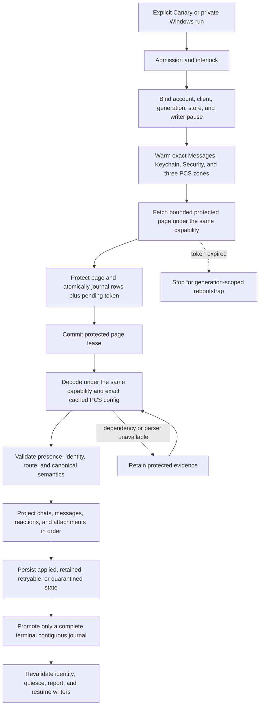
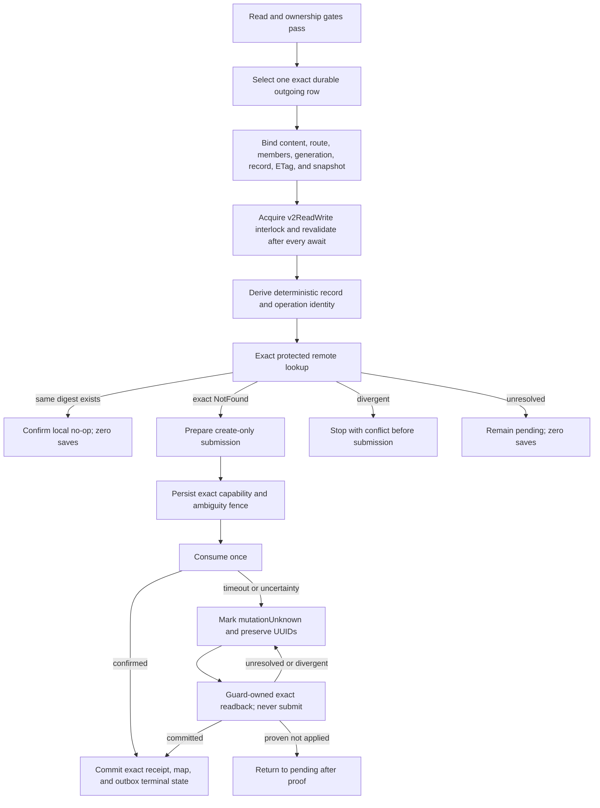

# Cloud Sync V2 current connection treemap

This document is the short operational source of truth. It contains current
architecture, safety rules, qualification state, and the next falsification
test. Dated investigations, obsolete candidates, run-by-run notes, patents,
and historical evidence remain intact in the
[investigation log](cloud_sync_v2/history/CLOUD_SYNC_V2_INVESTIGATION_LOG_THROUGH_2026-09-07.md).
The [bundle index](cloud_sync_v2/index.md) points to both documents and the
current evidence set.

## Decision

Treat Messages in iCloud as a durable replicated log. Remote ingestion and
local projection are separate progress clocks. A successful fetch is not a
successful sync. Undecryptable or temporarily unprojectable records remain
durable repair work and never disappear merely because a later token exists.

Every protected operation must remain bound to one exact tuple:

```text
account fingerprint
  + live CloudMessagesClient identity
  + read-authentication generation
  + protected-store identity
  + native writer-pause permit
  + container/database/zone
  + checkpoint generation
```

If any member changes, fail closed and retain the evidence. Never borrow a
different identity or container, create PCS state from the read path, fall
back to legacy sync, clear a cursor, or continue under a replacement account.

## Status legend

| Status | Meaning |
| --- | --- |
| `LIVE-PROVEN` | A content-free trace exercised the exact boundary on the named platform. Proof does not transfer between platforms. |
| `TEST-PROVEN` | Source-contract or behavioral tests cover the boundary; current-device proof remains. |
| `SOURCE-IMPLEMENTED` | The repair is in the candidate, but full exact-source qualification is incomplete. |
| `IN REPAIR` | A concrete counterexample invalidated the previous candidate. |
| `GAP` | A safe end-to-end behavior is not implemented or needs a product decision. |

## Current candidate

| Item | Current state |
| --- | --- |
| App branch | `agent/cloudkit-v2-sms-chat-contract` |
| Conditional-update predecessor | **TEST-PROVEN:** app `c092ef1a7` pins rustpush `90787d3`. Native `lookup_message_record_version` retains decoded CloudKit fields, opaque encrypted payloads and exact identity/ETag without a typed `CloudMessage` roundtrip. The old typed lookup delegates to it; current-container and cached-PCS checks remain. GCE dependency-only `34647348048` passed 305 tests and cleanup; app-native `34647652095` passed 533 tests and exact bridge regeneration. No update/save path is enabled. |
| Conditional-update staging | **SOURCE-IMPLEMENTED, not enabled:** `cloud_sync_message_update_stage.rs` retains the exact predecessor, version-checked merge request, original ciphertext and request IDs under a distinct protected purpose. Reopen requires the exact committed lease and binding. `cloud_sync_message_summary_patch.rs` preserves unknown plist values and existing body bytes; singleton history is accepted to match the reader. Tests cover mutation retries, source/authority changes, create/update purpose isolation, changed ETags and forbidden field replacement. GCE qualification is pending. Neither helper grants save authority; journal adoption, protected liveness, causal candidate preparation and conflict/readback reconciliation still need integration. |
| Edited-then-unsent readback | **TEST-PROVEN:** `5bb07dcdf` removes the reader's mutual-exclusion rule for edited/retracted part IDs. Both existing producers retain that history on unsend; the DTO and projection already support it. Timestamp/body/part validation remains. All 136 focused Dart tests passed, including real ObjectBox reopen and stale replay without resurrection. GCE `34648004825` passed 534 native tests and exact bridge regeneration; no Apple-device or APK proof yet. |
| September 11 mutation candidate | **LIVE-PROVEN on Windows, IDS/local scope only:** `c02379430` with dependency `98cc67a` passed fresh edit-16 and unsend-18, each with positive IDS acknowledgment, retained native receipt, local reflection and a separate-process reconciliation without resending. Both parent messages passed CloudKit save/readback. Copied-DB inspection confirmed state 3, exact stored display and zero initial-send intents for each mutation; source DB unchanged. Existing-record CloudKit updates remain disabled, and independent recipient display is unverified. Old edit-08 stays unknown and must never be resent. |
| Installed Android candidate | Signed `f860966d53b6019b46f1437312e67662724f08ce`, installed September 11 at 09:14:53Z and runtime-verified. Two reads reached the remote head with saves/deletes off and outbox `0 -> 0`. The final local sweep examined 3,587 blocking saves, applied zero, and completed partial at 09:47:41Z. Qualification-07 remains unsent after IDS 6005. Approved registration repair quiesced reads and preserved chats, hardware and CloudKit state; saved-account reuse returned phone-number validation failure. Await normal validation, not another reset. Alpha is untouched. |
| Qualified source, not installed | Read-transition `90f98b7eb` passed 296 focused tests, targeted analysis, and GCE `34594546421`: 3,147 Dart tests plus 14 outbox and 3 evidence-output cases. Cleanup completed at 11:44:17Z; independent VM/runner inventories were empty. It includes replay repair `fd60a8a20` and background patch `0bb67d2c4`, which avoids repeating exhaustive retained-history sweeps on routine metadata wakes. No APK or Pixel runtime proof for these patches yet. |
| Windows candidate | Imported `c02379430` from `34642902373`: 39 focused tests, 51 packaged-DLL codec cases, 78 verified bundle files, native load and isolated invalid-launch smoke passed. Protected profile hashes stayed unchanged during import. Dependency run `34642902143` passed 299 tests; app-native `34642902097` passed 524 tests and exact bridge regeneration. All cleanup completed. A read-only pass renewed the missing auth cache before live writes; no reset or new code was needed. The follow-up preflight repair is test-proven only, not in this imported runtime. |
| Current full qualification | GCE `34579830953` passed every selected build/test gate, APK/native verification, Android JVM tests, trusted signing and cleanup on `f860966d5`, including cold-start fix `b432b9e8a`. T2D 60; writer on, automatic uploads off. Signed artifact `10192048724` was downloaded and signature-verified before the in-place Pixel install. Prior `34576684370` also passed on `5e9a532be`. Neither APK includes the later Windows-only reaction harness. |
| Qualification | GCE `34485566441` passed 2,566 Dart tests plus 14 semantic outbox and 3 evidence-output cases on exact source `7df4fced8`, including the new real ObjectBox manual-selection tests. Cleanup succeeded and both VM and registration inventories were empty. This dart-only run did not build an APK or native Windows binary. Earlier full signed qualification `34444190598` covers installed code `e060bcb41`, not the new patches. Native base `35551340c` passed 377 app Rust and 260 rustpush tests. Live ordinary-send/save/readback remains separate. |
| Main change | Direct and restored-group plaintext admission, IDS receipt recovery, protected reset proof, crash-safe generation rebootstrap, bounded replay, manual read/write gates, and a Canary-only durable Android metadata wake are wired with automatic uploads off. The wake stores only the exact semantic-scope hash, revalidates the live account and safety state in Dart, and cannot invoke the outbound writer. |
| Dependency | App `2fd0da2a3` pins `aff6379`, including the reviewed FaceTime remote-target guard and default-off bounded Find My diagnostics. GCE `34589003289` passed 287 dependency tests; cleanup completed at 10:32:58Z. No sidecar runtime success is claimed and no APK includes them yet. Writer fix `d201fb5` adds the exact attachment zone; IDS-proof base `f2e8ea3` still requires status 0 for every intended recipient. |
| Prior-source qualification | GCE run `34437410835` fully succeeded for exact source `75440cafc`: full Dart suite, 373 app Rust tests, 253 rustpush tests, 34 protector tests, bridge drift checks, APK/native-library verification, Android JVM tests, trusted signing, and cleanup. This APK lacks the new positive-acknowledgment repair and is not a write-qualified release candidate. Older `fc132e5f8` also has the headless ready-handshake deadlock. |
| Android release proof | The signed `ad822f37c` APK was installed in place with Canary data preserved and Alpha untouched. Its live read-only pull drained the remote head in one pass and finished without an unsafe failure. The final local sweep completed Chats with the exact 476-row durable backlog, kept remote save/delete disabled, and kept outbox `0 -> 0`. Messages and Attachments remain honestly degraded with 1,893 and 1,693 blocking saves respectively. |
| Production claim | Not yet allowed. |

Next technical gate: prove safe conditional existing-record writes. Read-transition candidate
`90f98b7eb` passed GCE Dart-only qualification `34594546421`.
The prior blocking IDS/local subgate passed on exact `c02379430` at 20:46:57Z
(edit-16) and 20:47:56Z (unsend-18). Next connect the exact confirmed mutation
source to a durable, version-checked update candidate. Preserve unknown outer
fields and nested protobuf/plist data; retain the original ETag and candidate
before submission. Qualify conflict/unknown-outcome readback and restart without
resending IDS. Do not enable arbitrary existing-record writes from a successful
local reflection or synthetic roundtrip alone. Independent Apple-device and
Android end-to-end proof remain separate.
Preview repair `269620126` and reviewed Find My lane isolation `ee9729ec3`
passed GCE Dart-only `34597175527`, exact source
`ee9729ec32fc132b386e4cbd42e608424968dbec`: 3,167 Dart tests plus 14 outbox
and 3 evidence-output cases. The test step took 4m30s; cleanup completed at
12:18:21Z and independent VM/runner inventories were empty. Both writer flags
were off; no APK, signing, or native compilation was requested.
The real inbox merge and ObjectBox test now applies an edit, rejects an
unproved changed body, preserves current text on an older replay and applies
an unsend after reopen. The four focused suites pass 296 tests. Full-suite GCE
qualification passed; installed-device proof remains separate. The original memory
regressions now opt in explicitly to the proof capability; the real-store
test, not those fakes, demonstrates the combined path.

Next device gate: finish normal Canary authentication, then exercise the
combined signed Android source and independently verify
written content on the recipient/second-client side. Runtime parent admission,
separate-process no-op write restart and two cold read-only launches now pass.
The same client has not ingested the written Message; absence of a self-echo
does not invalidate exact record readback or prove cross-device visibility.
The offline v4 inspector lacks the real retained-child proof reader and must
remain diagnostic-only, not become another mandatory rewrite. Restored groups,
Android reactions and independent Apple-device visibility remain separate requirements.
The September 10 offline Windows inventory found **zero** chats with exactly
the two approved test recipients. Do not select another personal group. The
new request-v3 route binds the entire member set and exact restored group GUID;
its journal/adapter selection passed local qualification (174 focused tests,
including exact adopted-group selection after database reopen). This does not create
groups or bypass the existing protected semantic dependency. Live group proof
needs the approved conversation restored/created first. Direct-reaction work
and attachment integration can proceed independently of that prerequisite.
Current private request `qualification-20260911-unsend-18` completed receipt-only
restart. Edit-16 and unsend-18 both have persisted local state 3; their parents
15/17 have exact CloudKit readback proof. Old edit-08 remains claimed without a
receipt and must never be resent. Parent-11 failed before claim during auth
preflight and remains unclaimed. Prior plaintext, attachment, reaction and all
mutation evidence remain preserved. Qualified runtime:
`../windows-cloudkit-qualified-c02379430`. The read-only renewal guard incorrectly
required byte-identical `hw_info.plist`: `setup_push` reencrypts the retained
identity and saves APS state on connection. This is not an account-reset signal;
future guards must compare stable identity/configuration, not randomized ciphertext.
Older runtimes and receipts remain rollback material.

### Current attachment-write boundary

```text
committed original IDS source
  -> source-derived attachment inventory
  -> retained upload plans (one original randomized plan per child)
  -> durable byte-upload result
  -> Attachment record save and exact readback
  -> parent Message admission, save and exact readback
```

| Boundary | Evidence / next gate |
| --- | --- |
| Canonical identity | Native upload, final record and readback use the same owned `(message, part)` key as ingestion. Do not rekey older retained plans. |
| Native direct parent | Source `787869904`, GCE `34544585837`: **484 Rust tests passed**. Included in later native qualification below. |
| App integration | Candidate connects plan reuse, upload execution, ordered record drain and parent admission. A versioned journal proof requires every source-derived child to pass readback. Save acknowledgments and generic receipt cleanup cannot stand in for readback. |
| Local qualification | Combined admission/journal/dependency/transport/composition suite: 278 passed. Timeout/reconciliation/transport subset: 42 passed after parent review. These overlap and do not establish live-account behavior. |
| Timeout correction | Release tracked preparation before draining record saves. Otherwise a save timeout can quiesce the outer operation that is waiting on that save. A dedicated sequencing test covers this boundary. |
| Group attachments | Native `d5b31d5b9`, GCE `34547723829`: 490 Rust tests passed; only generated-interface drift failed. Artifact `10179880441` was hash-verified and imported; VM/runner inventories empty. Exact restored group binding is pinned before staging and after awaits. Local transport passed 15 tests, admission 73; no live group-attachment proof. |
| Recovery | Original source, epoch and attempt IDs remain immutable. Under current stable authority, the coordinator reuses existing plans and stages only missing entries from the original native inventory. A newly ambiguous upload may schedule only its own receipt-first next pass after native quiescence, exact fence/attempt verification and unchanged identity. Parent's composed guard/consumer test proves the missing-receipt pass creates no outbox entry or second upload. Combined qualification: **936 tests passed across 28 suites**, including fixed-inventory interruption/reopen and historical upgrades; full Dart CI passed below. Live runtime remains unqualified. |
| Full-suite checkpoint | Source `0ff8e5595`, GCE `34555255259`: **3,016 Dart tests, 14 semantic-outbox contract cases and 3 evidence-output cases passed**. The three previous fixture/constructor-contract failures were repaired and rechecked. Cleanup completed at 02:47:11Z on September 11; independent VM/runner inventories were empty. No APK, native compilation, signing or live account access occurred in this dart-only run. |
| Windows baseline | Historical source `0ff8e5595`, Windows run `34555641336`: 30 focused Dart tests, 51 actual Rust-DLL codec tests, ARM64 load and invalid-launch marker passed. Parent verified 78 bundle files. This baseline predates the attachment-request and durable-source-lookup repairs; it is retained rollback evidence, not the active runtime. |
| Durable source lookup | Review found that `validateReadyForCreate` reloads a Message with an empty transient `attachments` list. The executor now selects its exact persisted `dbAttachments` relation instead, retaining exactly-one original/reflected GUID matching. Eight database-reopen regressions cover both aliases, ambiguity, unrelated rows and forbidden transient/global fallback. Exact source `3ebcc81c9` passed 3,042 Dart tests plus 14 outbox and 3 evidence-output cases in GCE `34557585998`; cleanup and independent empty VM/runner inventories verified. Live attachment proof remains open. |
| Windows attachment input | Explicit request v4 adds synthetic `text-v1` and `png-v1` files only, no arbitrary user-file upload. Claim, original descriptor, protected source staging, positive IDS confirmation and the existing exact-intent production adapter remain required. Previous request-v1/v2/v3 bindings are unchanged. Interrupted IDS confirmation stays unconfirmed, not resendable. |
| Live attachment failure | Native `62221f9` passed preparation and byte upload on September 11. Read-only inspection after the 06:11:34Z failure found one exact IDS-confirmed message, one adopted upload and one matching pending Attachment create with attempt count zero. The `invalid_checkpoint` failure is before record save, not a rejected login or failed IDS send. Request and claim remain unchanged. |
| Diagnostic repair | `1d9de8629` preserves fixed native failures through FRB. Native fix `62221f9` passed 493 app Rust tests in GCE `34567150925`, 276 dependency tests on test-only successor `c206428a3`, and Windows run `34567152272`. All GCE cleanup succeeded; independent VM/runner inventories were empty. |
| Upload recovery roots | `readLiveProtectedOutboundLeaseReferences` included upload leases, but `readLiveProtectedReferences` omitted plan/result bytes. Five ObjectBox reopen cases failed before the 13-line repair `db27373d9`; 184 related tests passed afterward. Qualified overlay `17818cd3d` moved the exact retained child from pending to confirmed without the previous `invalid_checkpoint`. The remaining parent-admission receipt failure was repaired below; do not clear or regenerate the retained source. |
| Released result receipt | App `436c61bbb`: the upload result lease is also the final-save receipt. Verified child readback clears the outbox adoption marker and acknowledges that native receipt. Recovery incorrectly demanded it again from the immutable upload row. Recovery now reuses the exact child-readback predicate before excluding only that retired receipt; original plan, payload/result references and upload history remain live. The restart regression failed before repair; 276 targeted tests passed afterward, including 20 incomplete/mismatched proof cases. Overlay `46bc6f027` passed real parent admission and a separate-process no-op restart. Missing or mismatched receipts still fail closed. |

Protected bytes and receipt-adoption markers are different liveness sets.
Readback releases the shared result receipt, not the encrypted result payload.
Do not delete upload history, suppress all missing leases, or infer release from
a generic terminal state. See the current investigation log for exact traces.

Prepared-handle lifecycle correction: a failed native consume can retain its
unconsumed owner and writer permit. Waiting for futures alone cannot release
that permit. Native `590cf25bb` adds idempotent owner release without changing
files, fences or protected leases. GCE `34548927310` passed **493 Rust tests**;
only generated bridge drift failed. Artifact `10180257648` was hash-verified
and imported; VM and runner inventories were empty after cleanup. Dart
engine/transport cleanup passed the 125-test release/admission/adapter cohort,
including 20 focused release cases for late preparation, both heartbeat losses,
returned failure, thrown failure and consumed success. Release does not cancel
an owner already taken by consume. The combined 868-test checkpoint passed;
the full-suite result above and live attachment write/recovery remain release gates.

An ambiguous MMCS upload still cannot be blindly replayed. Original CloudKit
UUIDs do not prove MMCS request idempotency, and chunk deduplication is not
asset-completion recovery. Retain unknown attempts. Durable native completed
receipts recover lost Dart responses, not network outcomes without a receipt.

Detailed prior source SHAs, bridge artifacts, test counts and failed-run evidence
are retained in the [current investigation log](cloud_sync_v2/history/CLOUD_SYNC_V2_INVESTIGATION_LOG_FROM_2026-09-07.md).
GCE cleanup for `34544585837` succeeded; independent inventories showed no
instances or runner registrations. Apple credentials and stores remain local.

The first September 10 attempt failed on retained IDS credentials before send.
Explicit request-bound sender authentication from the same retained GSA session
then succeeded on `6abbeede2`. It did not reset onboarding or clear CloudKit
state. `setup_push` rewrites saved APS connection material, so the full hardware
file hash is not a hardware-identity comparison. The OS-config fingerprint and
immutable request claim stayed unchanged across the subsequent restart.

Retained Windows exact-source qualification: app `6abbeede2`, rustpush `f33dcac`, pilot
`a2680baac`. GCE app Rust `34497413348` passed 380 tests and rustpush
`34497413071` passed 261. Both cleanup jobs passed; independent inventories
showed zero VMs and zero runner registrations. Neither run built an APK or
accessed Apple credentials. Windows `34497409120` attempt 2 passed in 24m17s
(Flutter compile 945.8s), following one package-download failure before compile.
All 78 bundle files were verified before extraction. Local signing preserved
the vendor ObjectBox DLL, native load/unload passed, and the invalid-launch
marker was observed with zero dummy-profile files. No PC policy was changed.

Offline inspection of the retained September 7 test on a disposable database
copy confirmed one canonical legible message with a valid source binding, but
IDS proof remains version 0 and the exact-readback marker is absent. The
retained confirmed outbox row alone is not full write proof. Source database,
request and claim stayed unchanged; the temporary database copy was removed.
The new September 10 request independently passed all these checks with IDS
version 2, valid source binding, legible text, exact-readback marker and released
receipt. Restart kept those proofs and one canonical message with zero new
admissions. This closes that bounded Windows gate, not full production parity.

Keep native compilation isolated: the local signed `slab` build script remains
blocked by App Control error 4551. No security policy was changed. Targeted
Dart tests work with the matching ObjectBox library on PATH. The approved
cloud budget is $200 through September 15; Apple credentials and message stores
remain local. [Build runbook](WINDOWS_HOST_BUILD_ENVIRONMENT.md) contains setup
and import boundaries; the investigation log retains failed-run evidence.

Historical installed Canary came from full signed GCE run `34444190598`, app source
`3dc614c9eced02b49f130a2752ce531d9e6aec7a` (code `e060bcb41`): build,
GitHub-hosted signing, and cleanup jobs all succeeded. The signature-verified
APK was installed in place on Canary at 2026-09-09 23:43:18 Pacific; Alpha's
package snapshot and Canary's UID/data directory/first-install time were
preserved. Host preflight verifies artifact identity, not the running Dart
build: that earlier observation left `sourceCommitDeviceVerified` false. The
current signed `f860966d5` installation and runtime proof supersede this baseline.

Earlier live observation, 2026-09-10 05:43-05:50 Pacific: two user-triggered
plaintext sends received native confirmations which were journaled. The test
conversation rendered the edited message and the subsequent unsend notice.
This qualifies that local live-send/UI boundary only. No exact CloudKit
save/readback, restart, or independent-device edit/unsend proof was obtained.
The conversation-list preview still displayed the retracted message's text,
an observed stale-preview defect now repaired locally: previews honor retracted
parts without deleting retained text; normal and pinned tiles recompute on
same-record updates even when dateEdited is unchanged. The five-suite cohort
passes 48 tests, including real mounted widgets/ObjectBox updates and preserved
history. Reinstating the old same-ID gate makes that widget test fail. Full
cloud qualification and installation of this preview patch remain pending.
A semantic pull remained active during the original observation and was not
restarted. See the current investigation log for timestamps and private
evidence paths. Causal edit/unsend writes remain a gap, not a passed gate.

### What the candidate includes

- Native and Dart compute the same deterministic group-routing digest from the
  canonical group, current raw group ID, service/style, group version, and
  normalized participants.
- Both sides use UTF-8 byte ordering. Exact `urn:biz:<UUID>` participants are
  retained; arbitrary schemes remain rejected.
- Older applied groups can receive a missing digest only through protected
  null-to-non-null projection repair with an otherwise exact snapshot match.
- Restored, nonprovisional group plaintext uses opaque dependency binding tag
  3. It binds generation, owner, aliases, server record, ETag/raw reference,
  latest applied save, and routing digest.
- Direct tag-1 and reaction tag-2 encoders and bindings remain unchanged.
- Provisional group creation, group reactions, group-state mutations, remote
  deletion, and update merge remain closed.
- Exact out-of-scope chat satellites and retained tombstones no longer make a
  valid physical-retention result fail the whole Chats zone.
- Retained message and attachment blockers are counted separately from the
  larger physical backlog. The current live blocker is therefore 3,586 saves,
  not all 10,108 retained rows.
- Content-free Windows inspection proved all 189 native `msgProto` field-2
  wire mismatches are classes 4-7, whose Apple schemas use int64 rather than
  the ordinary message string. The same inspection found five class-3 system
  events. The decoder base `12035ec0c` validates all five variant schemas and retains
  them as `UnsupportedMessageType`; it does not invent projection semantics.
- Existing-history write deferrals report fixed counts for local-chat, snapshot,
  alias, prior-origin, record-map, and tombstone conflicts. The classifier is
  observational only and does not authorize adoption or alter failure precedence.
- Canary ADB control is package-scoped, challenge-confirmed, and read-only by
  default. Host parsing accounts for Android SharedPreferences key prefixes and
  harmless Windows PowerShell native-stderr promotion.
- Receipt discovery keeps only a bounded candidate window in memory and reads at
  most 64 receipts per replay page. Its cursor advances past invalid receipts,
  while leaving later valid receipts discoverable on subsequent pages.
- Startup receipt replay completes before stale-send normalization. The
  ObjectBox startup claim then retains native-confirmation work and clears only
  sends that are proven untracked in the same transaction.
- Canary can register one exact, content-free semantic-scope hash with Android
  WorkManager. Foreground, headless APNs, and network hints coalesce into a
  metadata-only read. The native waiter is bounded to five attempts and eight
  minutes; Flutter-engine readiness is cancellable and bounded to one minute.
  The repaired Dart drain requests cooperative cancellation after five minutes
  and awaits protected quiescence. A native timeout does not prove Dart stopped.
  Engine leases survive waiter cancellation until Dart replies; delayed teardown
  rechecks exact engine identity, active calls, and the idle generation on Main.
  Alpha, Beta, production, media-prefetch, and every outbound lane remain closed.

## Scope and current evidence

| Capability | Status | Remaining proof or work |
| --- | --- | --- |
| Chat and message history | `LIVE-PROVEN` for restored readable history | Qualify sustained incremental sync, restart, and account lifecycle on the release candidate. |
| Reactions on read | `LIVE-PROVEN` for representative records | Continue retaining unavailable parents; qualify current candidate on Pixel. |
| Photos and videos on read | `SOURCE-IMPLEMENTED` after prior live proof | Current source resolves generic and UTI-only image/video records consistently across profile and message surfaces. Pixel must prove HEIC, video, and tap-to-open behavior; GIF data remains preserved but profile animation is not a release requirement. |
| Documents and plugin payloads | `TEST-PROVEN` | Supported documents remain visible, unknown opaque files remain available, and only the exact `.pluginPayloadAttachment` suffix is hidden from profile media/documents without deleting its row. Pixel UI proof remains. |
| Direct plaintext create | `LIVE-PROVEN` for bounded Windows request `qualification-20260910-03` | Positive IDS version 2, exact-readback marker, one canonical legible message and restart with zero new admissions passed. Independent Apple-device display and ordinary Pixel composer convergence remain open. |
| Restored-group plaintext create | `SOURCE-IMPLEMENTED` and exact-source qualified | Perform one authorized live group test with pinned route/binding plus exact readback/restart proof. Provisional group creation remains closed. |
| Write-send provenance | `SOURCE-IMPLEMENTED` | Native positive-acceptance tests pass. Qualify the additive persisted-proof upgrade and dispatch/reconciliation tests. Old deferred/ready intents cannot promote or enter fresh admission without new proof; old adopted pending entries are retained and skipped for new leases. Submission rechecks proof. Exact readback remains allowed and does not retroactively prove IDS acceptance. A fresh v2 native confirmation can requalify the exact unchanged old source without resending it. Automatic uploads remain off pending execution and live proof. |
| Retained writer queue usability | `TEST-PROVEN` | One journal-bound, read-only classifier covers queue drain, queued Chat observation, and preflight. It exempts only pristine pending creates with proof version 0, exact protected envelope/mapping, current owner/generation, no lease, attempt, Apple UUID or receipt. All rows remain counted and fingerprinted; no upload, acknowledgement, deletion, or proof upgrade occurs. GCE passed the real consumer/admission/store regression with a fresh qualified send beside retained work and reopen without duplicate submission. Apple responses are synthetic in this test; live proof remains. Unknown/retried/leased/malformed rows still block. |
| Direct reactions | `LIVE-PROVEN` for bounded Windows like-05/remove-like-06 | Positive IDS confirmation, one admission, exact persisted readback and separate-process zero-admission restarts passed. Ordinary Pixel composition and independent Apple-device display remain. |
| Edits and unsends | Read transition `TEST-PROVEN` for qualified shapes; write `GAP` | Same-record, rotated-tag transitions require exact durable predecessor binding and real canonical identity plus complete compatible body/history proof. The four-suite run passes 296 tests and full-suite GCE passed on `90f98b7eb`. Unsupported multi-body encodings or ambiguous lineage stay retained conflicts. Live-device proof remains. Outbound causal updates and stale-tag reconciliation remain separate gaps. |
| Attachment writes | `LIVE-PROVEN` for bounded Windows image 04 admission/readback recovery | Source-bound upload, child readback, parent admission and no-op restart passed overlay `46bc6f027`. Independent recipient/second-client rendering, ordinary Pixel composer convergence, group attachment proof and exact-source Android qualification remain. Upload receipt alone is not record-save proof. |
| Tombstones and deletion | Closed | Define exact ownership and recoverable semantics before enabling any local or remote delete. |
| Token expiry | `TEST-PROVEN` | Live expired-token/restart proof remains. The exact-source path requires an authenticated protected reset proof, releases the semantic read boundary, reacquires the destructive-reset interlock and native pause, advances once, reconciles authority after process death, and replays once. |
| Android background catch-up | `IN REPAIR` | The ready-handshake/lifecycle repair is qualified in installed `f860966d5`. Live evidence then exposed a no-progress exhaustive projection sweep. The next patch keeps routine metadata bounded, avoids retrying solely for retained projection debt, and preserves deep repair, scope/reset/cancellation gates and truthful partial reports. 129 focused tests pass; combined exact-source qualification and Pixel lifecycle proof remain. |
| SMS, MMS, and RCS | Out of scope | Do not add them to this CloudKit V2 release path. |

## Safety gates

These gates are non-negotiable:

1. Bind account, live client, credential generation, protected store, zone,
   checkpoint generation, and writer-pause capability at every external wait.
2. Journal each protected page and pending token atomically before committing
   the native page lease.
3. Project in dependency order: chats, messages, reactions, attachments.
4. Promote a token only across a complete contiguous terminal journal.
5. Keep fetched, retained, and exactly projected progress separate.
6. Keep live IDS/APNs receive readiness independent from archive repair.
7. Admit a write only from an exact durable row and a fresh protected
   dependency binding.
8. Prove exact remote absence before first create. Persist the ambiguity fence
   before consuming a prepared mutation.
9. After submission uncertainty, reconcile by exact readback only. Never
   automatically replay, update-merge, quarantine away ambiguity, or delete.
10. Require an exact protected receipt before committing a record map and
    terminal outbox state together.
11. Preserve Alpha, its hardware identity, its database, and its messages.
12. Keep Windows Smart App Control enabled. Use GCE or a trusted signed
    environment when local policy blocks an executable.

## Explicitly forbidden fallbacks

- Use of a general or write-capable container when semantic read authentication
  is cold.
- Cross-account, cross-client, cross-generation, cross-zone, or cross-store
  authentication and decryption.
- `ZoneSaveOperation`, PCS creation, clique reset, or remote mutation from the
  semantic read path.
- Silent fallback to legacy CloudKit sync.
- Cursor clearing for an unknown, malformed, or inconvenient error.
- Treating `retainedUnprojected` as successful local projection.
- Advancing past an incomplete journal.
- Deleting local rows for read-path tombstones.
- Letting optional CloudKit work delay live message startup or acknowledgment.
- Using GCE as a live Apple client or exporting account, relay, PCS, or device
  identity to CI.

## Read state machine



The durable journal between fetch and projection is the critical cut. It makes
projection repair possible without refetching or losing the exact server
evidence.

## Outbound create state machine



Direct, reaction, and group operations use distinct protected binding tags.
One lane cannot be cast into another. Confirmed replay is readback-only and
must prove zero saves.

### Attachment-write integration boundary

The next vertical slice must connect the existing composer journal to this
entire chain, not merely add an upload validator:

```text
exact attachment descriptor actually sent through IDS
  -> protected descriptor + metadata + one retained record identity
  -> verified original MMCS bytes, exact pinned length
  -> existing account/container + attachment-zone PCS + boundary-key lookup
  -> byte upload, retaining its receipt or unresolved-upload state
  -> create-only CloudAttachment(cm metadata, lqa asset)
  -> exact record readback and confirmed dependency
  -> parent Message with the same attachment references
```

- The Dart store atomically admits completed Attachment-v1 uploads, and the
  runtime byte-upload coordinator and parent-message connection are implemented.
  Live byte upload has succeeded; child/parent record readback remains open.
  Native integration separates protected pre-upload preparation
  (`outboundAttachmentUpload`) from completed record-create material
  (`outboundAttachment`). Neither grants network permission or parent admission.
- Existing `Attachment.metadata["rustpush"]` stores an MMCS descriptor with
  decryption material at upload-finish, before IDS send success. It is mutable,
  not an encrypted receipt or proof of what IDS sent. Pin the actual wire
  descriptor into protected admission before send, then bind native success to
  it. The v3 receipt now carries the protected source binding, not raw keys or
  descriptors. Composer source staging/adoption is connected; whole-runtime
  attachment qualification remains separate.
- Do not put the source only inside the IDS receipt: acknowledgment deletes
  that file immediately after durable confirmation, before outbound admission.
  A protected source needs its own durable reference and recovery/GC ownership
  through parent adoption. The additive journal `protectedSourceBinding` field
  now owns that reference independently; old rows remain null and unqualified.
- Re-fetching that pinned MMCS object avoids a second permanent plaintext-byte
  journal and mutable-file reuse. It needs APS/MMCS availability, complete
  target/chunk validation, and the pinned plaintext length. A missing or expired
  object must defer, not substitute a different local file. Chunk integrity and
  length do not validate a guessed CTR key; the key must be the one actually sent.
- Reuse `CloudMessagesPreparedSaveSubmission` for record-save correlation and
  single consumption; the next native candidate supplies typed preparation
  and checked readback without enabling admission. Do not use
  legacy `save_attachments`, which enters generic update-capable saving.
- Legacy `prepare_file` calls `get_boundary_key`, which can create a keychain
  item. V2 lookup must also use keystore `get_secret`, not `ensure_secret`, when
  unwrapping existing boundary material. Keep the DSID and entry under the same
  state lock; a missing key fails without generating either local or remote keys.
- The attachment-specific local-send path extends outbox admission and parent
  encoding together. The plaintext-only path still rejects media.
- Record identity must be persisted before first upload and reused on retry.
  Legacy allocates a random attachment record ID; do not assume the proven
  Message GUID HMAC naming rule also applies to attachment records.
- `prepare_put_v2` randomizes chunk keys, FORD key and IV. Re-preparing identical
  plaintext retains neither the original encrypted descriptor nor its reference.
  Preserve the entire `PreparedPut`, including each chunk's key/signature/length,
  under platform protection before upload. Bind it to the original parent source,
  attachment metadata, full container-issued record identifier and file digest.
  A returned asset must match that exact preparation before record-create staging.
- Upload uncertainty and record-save uncertainty are distinct. Record NotFound
  cannot authorize blind byte re-upload or record-ID replacement.
- Next integration order: protected actual-IDS descriptor ownership in the
  local-send journal; durable pre-upload plan and attempt state; exact completed
  upload adoption; existing create-only record transport/readback; parent message
  dependency and encoding. Do not bypass the missing journal ownership by calling
  the legacy uploader or treating native codec tests as end-to-end qualification.
- Native send preparation is a separate boundary: `IMClient.send` calls
  `MessageInst.prepare_send`, which assigns a new send timestamp and may add
  the sender/conversation GUID. Capturing a Dart-built MessageInst and then
  allowing preparation to mutate it is not proof of the final wire. Integration
  must validate the final attachment descriptors and bind positive IDS success
  to the original source. Prefer an explicit validator for the three known
  preparation changes (timestamp, generated conversation GUID, added self
  participant), with all body/recipient/attachment fields unchanged, if that
  avoids a new two-phase send API. Freezing the prepared submission is an
  alternative, not a prerequisite. Do not ignore arbitrary changed fields.
- Local reflection is another normal transformation: `indexedPartsToAttributedBodyDyn`
  changes attachment GUIDs to `<messageGuid>_<part>` and inserts a space where
  the composer may use an object placeholder. Source identity must bind ordered
  descriptors and actual text/formatting, not these local aliases. Resolve each
  body reference to its exact attachment; do not accept count-only matching,
  unrelated rows, substituted descriptors or changed text. The native protected
  source still pins the actual sent descriptor, independently of local UI IDs.

## Fast qualification loop

Use the cheapest boundary that can falsify the current hypothesis:

```text
source contract or behavioral logic
  -> focused local test when policy allows, otherwise GCE
  -> full exact-source GCE suite and APK build

Apple protocol, PCS, save, readback, or replay behavior
  -> exact-source trusted minimal Windows harness when available
  -> otherwise signed Canary on Pixel

Android registration, ObjectBox/UI, background, lock, or lifecycle behavior
  -> signed Canary on Pixel

cross-device convergence
  -> independent Apple device confirmation
```

Do not rebuild a Canary for every code edit. GCE handles exact-source Dart,
Rust, bridge-generation, identity, projection, and reconciliation tests.
Windows ARM64 bundles are built on the isolated GitHub runner and imported
only after archive, native-codec, source/configuration and launch verification.
The retained `6abbeede2` runtime proves its bounded direct write, not newer
attachment code; `3ebcc81c9` must pass import and its own live test.
Local Cargo compilation remains blocked by App Control 4551. Keep that policy
enabled. The verified cloud bundle runs with the existing engineering signing
path when the original ObjectBox vendor DLL is preserved; re-signing that
vendor DLL caused the earlier startup block. Credentials and PCS state remain
local, never on GCE. Windows qualifies protocol boundaries, not Pixel lifecycle
or final Android release behavior.

Use five promotion lanes and do not skip upward:

1. **Focused local lane:** handwritten Dart contracts and structural guards for
   the changed boundary. It may reject a patch but cannot qualify native Rust.
2. **Fast GCE lane:** `app-rust-only` regenerates and verifies FRB bindings,
   checks the Rust bridge, and runs the app Rust library without Android SDK,
   Gradle, signing, or APK work.
3. **Full GCE lane:** only a promotion candidate runs every Dart/Rust/rustpush/
   protector test and produces the signed, ABI-verified Canary APK.
4. **Windows protocol lane:** exact-source minimal harnesses may falsify Apple
   request, PCS, save, readback, and replay behavior without an APK. They do not
   qualify Android lifecycle or UI behavior.
5. **Pixel release lane:** batch direct send, process-death recovery, group send,
   readback, restart, lifecycle, and UI evidence into as few signed-APK sessions
   as safety permits. Manual Apple-device display remains independent evidence.

The manual-writer Pixel lane now has a host-controlled three-phase gate:
[`pixel_cloudkit_write_gate.ps1`](../tooling/pixel_cloudkit_write_gate.ps1)
and [`vm_trigger_cloudkit_write.dart`](../tooling/vm_trigger_cloudkit_write.dart).
`prepare` establishes V2 ownership locally and returns only a candidate GUID
hash; `run` restarts Canary, reselects that exact hash, and invokes the existing
one-intent production path; optional `verify` restarts again and requires zero
new admissions. Every phase pins the app source and host-tool hashes, takes the
recipient only from a process environment variable bound to a separately
supplied SHA-256, emits content-free evidence, and requires the automatic
worker to be absent. The tooling is test-proven but does not replace live
CloudKit readback or independent Apple-device display.

## Recovery policy

| Failure | Safe response |
| --- | --- |
| Read credential cold or revoked | Warm the in-memory same-account credential, restore the encrypted same-account credential, or perform one bounded refresh. Then require user action. |
| Account or client changes | Stop before projection or acknowledgment and preserve journal, source, and checkpoint. |
| PCS key unavailable | Warm or look up only the exact same-scope zone. Retain the protected record if still unavailable. |
| Network or throttling | Preserve token and evidence, honor bounded retry-after, and retry later. |
| Missing parent or parser | Retain protected evidence and retry projection after the dependency or parser repair. |
| Malformed record | Store a fixed content-free reason and explicit repairability classification. Never guess identity. |
| Process death after fetch | Recover the protected lease, replay the durable journal, and keep the prior token until terminal. |
| Token expired | Stop, require the account-bound protected reset proof, release the read boundary, reacquire the destructive-reset interlock and native pause, advance the exact zone generation once, fence old evidence, reconcile authority after interruption, and replay at most once. |
| Write result unknown | Preserve request and operation UUIDs, protected receipt, and fence. Exact readback is the only next network action. |

## Source-linked boundary map

| Boundary | Primary source | Current status |
| --- | --- | --- |
| Product admission and interlock | [`cloud_sync_manual_semantic_pull_sampler.dart`](../lib/services/rustpush/cloud_sync/cloud_sync_manual_semantic_pull_sampler.dart), [`cloudkit_operation_interlock.dart`](../lib/services/rustpush/cloud_sync/cloudkit_operation_interlock.dart) | Read live-proven; full session replacement qualification remains. |
| Read authentication and exact PCS | [`cloud_sync_production_sampler_adapter.dart`](../lib/services/rustpush/cloud_sync/cloud_sync_production_sampler_adapter.dart), [`cloudkit.rs`](../rustpush/src/icloud/cloudkit.rs) | Exact `ad822f37c` live read-only pull completed; cold/account lifecycle proof remains. |
| Protected fetch, journal, and token | [`native_protected_cloud_sync_transport.dart`](../lib/services/rustpush/cloud_sync/native_protected_cloud_sync_transport.dart), [`objectbox_cloud_sync_store.dart`](../lib/services/rustpush/cloud_sync/objectbox_cloud_sync_store.dart) | Test and prior live proof. |
| Authenticated reset and restart recovery | [`cloud_sync_reset_coordinator.dart`](../lib/services/rustpush/cloud_sync/cloud_sync_reset_coordinator.dart), [`cloud_sync_manual_semantic_pull_sampler.dart`](../lib/services/rustpush/cloud_sync/cloud_sync_manual_semantic_pull_sampler.dart), [`cloudkit_writer_authority.dart`](../lib/services/rustpush/cloud_sync/cloudkit_writer_authority.dart), [`objectbox_cloud_sync_preflight.dart`](../lib/services/rustpush/cloud_sync/objectbox_cloud_sync_preflight.dart) | Exact-source qualified at `0b86a6465`; live expired-token/restart proof remains. |
| Decode and canonical conversion | [`rust_cloud_semantic_decoder.dart`](../lib/services/rustpush/cloud_sync/rust_cloud_semantic_decoder.dart), [`cloud_sync_canonical_converter.rs`](../rust/src/cloud_sync_canonical_converter.rs) | Test and representative live proof. |
| Ordered projection and retained repair | [`cloud_inbox_applier.dart`](../lib/services/rustpush/cloud_sync/cloud_inbox_applier.dart), [`objectbox_cloud_semantic_store_gateway.dart`](../lib/services/rustpush/cloud_sync/objectbox_cloud_semantic_store_gateway.dart) | Read live-proven; current backlog must be explicit. |
| Composer origin, IDS completion, and write admission | [`rustpush_service.dart`](../lib/services/rustpush/rustpush_service.dart), [`cloud_sync_local_send_journal.dart`](../lib/services/rustpush/cloud_sync/cloud_sync_local_send_journal.dart), [`cloud_sync_manual_outbound_canary.dart`](../lib/services/rustpush/cloud_sync/cloud_sync_manual_outbound_canary.dart), [`cloudkit_writer_mutation_guard.dart`](../lib/services/rustpush/cloud_sync/cloudkit_writer_mutation_guard.dart) | Atomic direct/restored-group composer admission, bounded awaited receipt replay, atomic startup claim, protected receipt recovery, and reset-required fencing are exact-source qualified through `0b86a6465`; live Pixel process-death recovery, remote readback, and duplicate suppression remain. |
| Direct and group encoders | [`cloud_sync_local_send_encoder.dart`](../lib/services/rustpush/cloud_sync/cloud_sync_local_send_encoder.dart), [`cloud_sync_outbound_group_binding.dart`](../lib/services/rustpush/cloud_sync/cloud_sync_outbound_group_binding.dart) | Direct live-proven on Windows; group source-implemented. |
| Native create/readback receipt | [`api.rs`](../rust/src/api/api.rs), [`cloud_messages.rs`](../rustpush/src/imessage/cloud_messages.rs), [`chat_create.rs`](../rustpush/src/imessage/cloud_messages/chat_create.rs) | Direct Windows proof; exact-source suite and group live proof pending. |
| Android durable read wake | [`CloudSyncV2Worker.kt`](../android/app/src/main/kotlin/com/bluebubbles/messaging/services/rustpush/CloudSyncV2Worker.kt), [`DartWorker.kt`](../android/app/src/main/kotlin/com/bluebubbles/messaging/services/backend_ui_interop/DartWorker.kt), [`cloud_sync_semantic_drain_controller.dart`](../lib/services/rustpush/cloud_sync/cloud_sync_semantic_drain_controller.dart) | Current ready/lease/budget repair has focused behavioral proof. Prior `fc132e5f8` compilation did not detect the startup deadlock; Pixel lifecycle proof remains. |

## Release gates

### Candidate qualification

- [x] Reset-proof base `7df608af7` passed the full exact-source suite and
  signed-APK path in GCE run `34407071539`, with automatic uploads off.
- [x] Current app code `0b86a6465` reproduced bindings and passed 2,522 Dart,
  359 app Rust, 226 rustpush, 34 protector, and 14 semantic-outbox contract
  tests in run `34414062044`.
- [x] The `0b86a6465` Canary contains every required ARM64 native library and
  is signed on the existing trusted GitHub-hosted signing path.
- [x] Run `34414062044` deleted its VM and deregistered its runner; independent
  inventories confirmed zero remaining runners and zero GCE instances.
- [x] Exact source `fc132e5f8` reproduced 2,542 Dart, 359 app Rust, 226
  rustpush, 34 protector, 14 semantic-outbox, and 3 evidence-output cases in
  run `34423632222`; bindings reproduced and the signed ARM64 Canary contains
  every required native library. Runner and VM inventories both returned zero.

### Read qualification

- [x] Representative chats and readable messages project on Canary.
- [x] Representative reactions and media metadata project without deleting
  unavailable evidence.
- [ ] A cold-start candidate executes authentication, pause, three-zone warm,
  fetch, decode, journal, projection, and token promotion in one process.
  Windows `f90226831` completed this path after repair `b432b9e8a`; the
  corresponding Android release candidate remains unqualified.
- [ ] A second pull is idempotent and reports fetched, retained, and projected
  counts separately.
  Windows fresh-process repeat passed with fetched=0, applied=0, retained=6654
  and settled outbox unchanged; retain the Pixel gate separately.
- [ ] Restart, background/lock, account replacement, and expired-token paths
  preserve evidence and fail closed.

### Write qualification

- [x] Source `6abbeede2` direct plaintext request `qualification-20260910-03`
  has positive IDS version-2 confirmation, a persisted exact-readback marker,
  one canonical legible message, and restart with zero new admissions. The
  earlier pre-repair failure and September 7 weaker proof remain historical
  counterexamples, not substitutes for this fresh observation.
- [x] Host-controlled Pixel prepare/run/verify tooling exercises the existing
  exact-intent production path across fresh Canary processes, rejects candidate
  drift, redacts arbitrary failures, and requires automatic uploads off. Live
  execution against Apple remains below.
- [ ] Confirmed direct replay proves zero saves and independent Apple-device
  display for the release candidate.
- [ ] Restored-group plaintext passes exact-source tests, one authorized live
  group create, exact readback, restart, and independent display.
- [ ] Direct reactions pass live save/readback/restart and independent display.
- [ ] Ordinary composer queue admission atomically commits the first durable
  outgoing Message and state-0 local-send intent. Native IDS success is durably
  recorded before `SendConfirm`; restart recovery promotes it to state 3 and
  acknowledges that receipt only after the ObjectBox commit. Protected staging
  then atomically adopts the intent into the outbox and converges automatically.
- [ ] Attachment write, edits, unsends, and supported tombstone semantics each
  receive an implemented and verified causal/recovery path before full release.

### Production qualification

- [ ] One signed Canary survives foreground/background, lock, reconnect,
  process restart, and account repair without duplicate sends or lost tokens.
- [ ] Current retained backlog is zero or every retained category has an
  explicit non-destructive repair or honest unavailable state.
- [ ] User-visible status distinguishes remote ingestion, projection, media
  materialization, live delivery, and write reconciliation.
- [ ] Scope documentation names supported operations precisely. Initial text
  creation must not be advertised as complete Messages parity.

## Current critical path

1. Qualify the combined attachment and cold-start-auth source on Android and
   independently verify the written attachment through a second client.
   Windows overlay `46bc6f027` completed exact image 04 parent admission and a
   separate-process restart with no new admission or blocked work; read-only
   `f90226831` completed two cold reads without a reset. Do not demand that the
   writer's incremental cursor self-echo its record, or weaken the offline
   inspector to manufacture proof. Preserve the original source and attempt across writer
   epochs; absent receipts never authorize blind reupload. Also prove source
   staging remains usable during long reads, not merely lossless on contention.
2. Preserve qualified Windows direct request `qualification-20260910-03` and
   its proof. No additional direct send is needed merely to recheck that result.
   The exact restored-group route is implemented/tested, but no group with the
   approved two test recipients exists in the retained Windows profile. Restore
   or create that approved conversation before live group qualification. Never
   substitute another personal group.
3. Windows direct reaction add/remove and no-op restarts now pass. Continue
   attachment/causal-write qualification, preserving exact readback, recovery and
   independent Apple-device display as separate gates. Implement group creation,
   group reactions and supported edits/unsends, not just restored plaintext.
4. Qualify lifecycle P0 before automatic sync: expired-token reset must advance
   exactly once and replay once; a second reset signal must stop. Process death
   must recover prepared or unknown authority without losing old evidence.
   Same-generation authentication may refresh once; account replacement must
   preserve evidence and fail closed.
5. The durable Android metadata entrypoint is under lifecycle repair after a
   concrete ready-handshake counterexample. Requalify it and prove background, lock,
   APNs, reconnect, process restart, bounded retry, and stale-identity behavior
   on Pixel before considering production enablement.
6. Run lifecycle soak and produce one release-candidate report that proves
   identity stability, token continuity, zero duplicate writes, and honest
   retained counts. Complete attachment writes, reactions, edits/unsends, and
   supported group/deletion semantics for the full production goal. Keep each
   unqualified operation disabled during development, not excluded from completion.

## Next falsification test

Image 04 is already claimed and IDS-confirmed. Windows parent admission and
separate-process write restart pass. App `b432b9e8a` fixes a real cold-read
failure: reset recovery captured native identity before read authentication
had restored its identifiers. Authentication now runs under the semantic-read
interlock, which releases before reset recovery takes its own lock. The exact
identity/reset predicates remain intact. All 126 targeted tests passed and
read-only overlay `f90226831` completed two separate-process reads.

Those reads preserve 6,654 old retained entries, including out-of-scope services,
with no new Message ingestion for image 04. This is not a new send failure.
The next useful proof is independent client visibility, not repeated empty
self-reads or another inspector implementation. Disposable-copy inspection
still honestly cannot certify v4 source/readback without its child-proof
callback. Do not send another image, weaken child readback, clear credentials,
reset cursors, or use the older `5e9a532be` APK as containing the cold fix.

The isolated Windows direct test and restart passed; do not repeat the claimed
request. Source inventory, canonical read/write identity and parent UTF-16 body
passed GCE `34541849568`; executor adversarial tests and the real persistent
guard passed locally. Windows attachment admission and restart are evidence
for overlay `46bc6f027`, not Android proof. Combined Android source `f860966d5`
is now signed and installed; its batched device session is in progress. Independent
Apple-device display remains separate; component tests cannot replace it.
When the approved group is present, falsify exact selection, acceptance by every
intended target, group encoding, readback and restart without resending. Preserve
the direct claim. The inspector must distinguish readable text, positive IDS
confirmation and exact-readback proof.
Then qualify the ready/lease/budget repair with Android behavioral tests and
an exact-source signed APK. Do not install `fc132e5f8` as background-qualified.
Use one batched Pixel session: cold read, idempotent
second read, background/lock/APNs/reconnect, expired-token/restart recovery, and
the authorized direct process-death write test. The write must recover state 3,
adopt exactly one
protected outbox operation, obtain exact CloudKit readback and independent
Apple-device display, and create zero duplicate local or remote records.
Automatic uploads remain disabled during this proof.
Existing-history adoption remains a separate write gate; diagnostic counts
cannot authorize or perform adoption.

## Existing-history adoption evidence gate

Automatic adoption is not safe from the offline checkout alone. For each
queued intent, a content-free live observation must first distinguish the six
`existing_history` categories and prove exactly one current direct-iMessage Chat
owner under the same account, protected store, scope, generation, writer epoch,
and native session. The proof must bind the canonical Chat lookup hash, semantic
snapshot, service-identifier alias, canonical/member record map, latest applied
non-tombstone save, ETag, protected record reference, and payload digest. A
later retained save, tombstone, competing owner, or native `overlaps` /
`incomplete` result remains a defer.

Only after that proof may the production local-send admission seam atomically
re-read the state-1 journal intent and unchanged provisional Message/Chat,
adopt the exact existing relationship, and persist its durable reconciliation
binding under the existing `v2ReadWrite` interlock and auth fence. That
transaction must create no Chat stage, outbox row, record-map mutation, remote
save, merge-update, or delete. Restart must repeat as a no-op; any mismatch must
roll back and leave the intent ready/deferred. A bare Message reparent is not a
fallback because the journal source digest binds the original Chat row and UUID.

## Edit and unsend evidence gate

Apple carries edit history and retracted parts inside the existing message's
`msgProto.messageSummaryInfo` blob (`ec`, `ep`, `otr`, and `rp`). The read path
already validates part-key consistency, page-local edit ordering, and the rule
that present-but-empty collections are absent rather than an explicit clear.
Native revision numbers are sorted indexes regenerated for each payload, not
cross-record causal clocks. Local projection must keep the displayed body and
edit history on one compatible snapshot. A complete newer history may replace
both; an older subset cannot replace either; incompatible histories remain
retained with a content-free conflict. Retractions are an irreversible union
for the exact owned message. Do not synthesize multipart bodies from histories:
the renderer takes current text from the attributed body, not its edit list.

**Read transition candidate:** the native digest still includes current body
bytes. The inbox applier may reconcile that difference only through the optional
transaction proof: exact stored snapshot, same physical Message record, distinct
non-null ETags, exact protected reference and an earlier durable applied
replay cross-checked against its original inbox row. The bounded lookup reads
at most two matching receipts and rejects ambiguity. The real canonical adapter
then verifies owner, chat, sender, creation date, subject, full body/part ranges
and compatible edit/retraction lineage without modifying rows. Unchanged parts
and their order are preserved; unknown retractions and contradictory text fail.
One-body multipart content is supported; ambiguous multi-body encodings remain
conflicts. Global immutable and edit-revision conflict checks stay enabled.

The combined regression uses real ObjectBox, the inbox applier and a synthetic
decoded DTO boundary. It proves edit, forged-body rejection, stale replay and
undo across reopen with zero outbound rows. It does not prove native Apple
decoding, capture a real Apple update or authorize remote writes. Earlier raw
records/receipts remain intact. Outbound ETag handling is a separate gate.

The legacy `Message.toCloud` already serializes these fields, and generic
`CloudMessagesClient.save_records` is called by `save_messages` for message
updates. Reuse that encoding. Its `SaveRecordOperation::try_new(update=true)`
does not set a predecessor record ETag; it is not evidence of V2-safe causal
conflict handling. V2 transport currently remains initial-create-only.

Verified protocol lead: the [Apple daemon request header](https://github.com/JaviSoto/iOS10-Runtime-Headers/blob/1501f5e689fda4644df0adbffc50c0f737c4ab96/PrivateFrameworks/CloudKitDaemon.framework/CKDPRecordSaveRequest.h)
has a request-level `etag`, distinct from the nested Record's `etag`. The
header alone did not establish wire numbers. That gap is now resolved by
[Apple's actual serializer/decoder](https://github.com/Xare123/openbubbles-app/actions/runs/34620660937)
on macOS 15.7.9 (24G830), not by our own generated request:

| Observed property | Wire representation |
| --- | --- |
| Request `etag` | string field 4 |
| `saveSemantics` | varint field 6: `1 = failIfOutdated`, `2 = failIfExists`, `3 = override` |
| Zone / record PCS tags | string fields 7 / 8; neither is the version precondition |

`tooling/cloud_sync/apple_save_wire_probe.m` loaded the local
Apple serializer on an isolated macOS runner with synthetic values only. The
opt-in `apple_wire_probe` input on Windows validation skips both Windows build
jobs. Run `34620660937` compiled, serialized and round-tripped each property in
27 seconds, with no Apple credentials, user profile or CloudKit operation.
Image UUID: `002449BA-60D0-341F-933F-D5582A63F116`. Full synthetic report SHA-256:
`e05fdca3ee4378bb566a0cfaed20a1032d501007ccaa812380a0db7bd823facf`.
Bounded enum observations are not an exhaustive enum definition or server proof.

The separate `SaveRecordOperation::try_update_if_unchanged` builder is added
but **not connected to V2 transport**. It binds the exact fetched record identity,
type and nonempty ETag, checks the supplied PCS zone and unchanged default key,
and rejects custom record protection instead of silently replacing it. Legacy
save bytes remain unchanged. Independent Apple wire fixtures and rejection tests
passed GCE qualification. The caller still needs durable mutation intent,
account/container/database authority and unknown-outcome readback reconciliation;
an ETag conflict after a lost success response does not prove that nothing saved.

The native-only `cloud_sync_message_proto_patch` candidate patches decompressed
msgProto fields 3/4/7 while preserving all other wire spans verbatim. It rejects
ambiguous mutable fields and malformed/over-budget input. All nine synthetic
tests passed within 533 app-native tests on `a42ecb74f`, GCE `34644303016`, with
exact bridge regeneration and successful cleanup. Independent VM and runner
inventories were empty afterward. This helper is not connected to a writer;
it does not prove Apple mutation semantics, PCS authority or causal merge.

The predecessor lookup now retains the fetched `Record` instead of rebuilding
it from `CloudMessage`, whose fixed field list drops unrecognized fields.
This preserves decoded CloudKit fields and embedded opaque bytes, not unknown
outer protobuf tags already discarded by the transport decoder. Future saves
must be field-limited merges so omitted server fields remain untouched. The
native-only version result has redacted debug output and carries no write permit.
Exact identity, type and nonempty ETag checks precede admission; missing ETags
remain unresolved, never evidence of absence. Qualification is tracked above.

Do not construct mutation summary info through `Message.toCloud()`: its typed
roundtrip injects defaults and omits unknown plist entries. Patch the retained
plist value tree and preserve existing history/body bytes instead. Source review
found a concrete producer/consumer mismatch: legacy `rustpush_service.dart` and
`cloud_sync_local_mutation_projection.dart` both retain edited parts/history
when adding a retraction, while the reader rejected their overlap. `5bb07dcdf`
removes that mutual-exclusion check, not timestamp/body/part validation. History
and terminal state are retained together; the real ObjectBox regression keeps
the message unsent after reopen and stale replay. This is current-app contract
evidence, not a claim of independently captured Apple serialization. The old
quarantine enum remains for persisted/bridge compatibility; do not reset stored
records or tokens to force adoption of the repair.

Dependency `fbf9b4c` passed native-only GCE qualification `34621760644`, pinned
by app `4dc324995`: 297 tests, zero failures. Compile took 56s, tests 6.3s,
and the full run including cleanup took approximately 5m12s. Cleanup completed
at 16:29:20Z; independent VM/runner inventories were empty. No APK, account
access or writer activation; both writer flags were off.

The next end-to-end path is:

```text
durable edit/unsend intent (mutation UUID distinct from target message GUID)
  -> positive IDS confirmation for that exact mutation
  -> reflected body/history/retractions and protected native source
  -> fetch exact remote predecessor under unchanged writer authority
  -> retain merge candidate + ETag + request identity before submission
  -> one version-checked save -> exact readback -> confirmed
     conflict/unknown -> readback/refetch, never blind recreate or overwrite
```

Reuse existing request/receipt boundaries; do not weaken the initial-send
journal's rejection of already-edited messages. The ordinary edit/unsend route
currently invokes its legacy upload before its explicit reflection call and
can return while native still owns a background IDS send. That ordering is not
proof of a live legacy bug (local broadcast can race it), but it cannot serve
as the V2 durable mutation/positive-confirmation contract. Preserve unknown
remote fields and previous attempts when deriving a new candidate.

Mutation source checkpoint `c65584196` adds a native-only exact-intent codec
(`rust/src/cloud_sync_ids_mutation_source.rs`). It separates the mutation UUID
from the target GUID/part and preserves the sender, ordered route, text runs,
formatting and indexes. Reconstruction uses retained intent, not mutable chat
state; prepared validation permits only `MessageInst::prepare_send` changes.
Native protected staging is now implemented in
`rust/src/cloud_sync_ids_mutation_stage.rs`: one immutable source/hash wrapper,
its own `idsMutationSource` purpose, bounded descriptor, and exact committed
lease validation before reopen. The native-test-proven integration adds
purpose-typed bridge staging/restore, exact pre-send and prepared-send checks,
and a version-4 native positive-IDS receipt that preserves mutation ownership
through replay and acknowledgement. Historical receipt versions 2/3 retain
their original meanings; create consumers retain mutation receipts without
acknowledging them. That native checkpoint predates the journal integration
described below; neither checkpoint enables a CloudKit existing-record save.
Text-with-flags edits and unsends are represented; unsupported replacement
parts must remain explicit pending work, never flattened or counted complete.
Next integration: protected source adoption/commit adapter and app receipt
recovery with an exact-source local projector, then predecessor/readback.
Initial-create admission remains unchanged.
The codec-only checkpoint passed GitHub `34624049558`; expanded codec and
protected staging passed exact-source GCE `34625938024` on `3d95920ff`:
503 Rust tests and bridge reproduction succeeded. The subsequent API/send and
version-4 receipt integration `ab7f640c5` passed native compilation and 513 Rust
tests in GCE `34627823377` (`us-west1-c`, app-Rust-only, both writer flags off).
Only the expected generated-binding drift gate failed. Artifact `10274958197`
was SHA-256 verified and its exact seven generated files imported; five have
logical changes. Unrelated dirty generated files were preserved. The 39 focused
Dart tests now pass, including mutation/attachment bindings and FaceTime export
and diagnostics contracts. This is not a full Dart suite or native/app runtime test.
Cleanup succeeded at 17:38:18Z; independent VM/runner inventories were empty.
The new bridge requires its matching native library. Do not apply this Dart
binding as an overlay onto retained Windows native `62221f9c2`, bypass the FRB
content-hash check, or infer that the current installed APK contains this API.

Journal integration decision: keep mutation intent separate from the existing
initial-create journal, whose immutable source must remain unedited. Reuse its
transaction/receipt lifecycle, not its create-origin validator. Bind operation
UUID, target GUID/part, target snapshot and protected source independently.
Stage and durably adopt the original mutation before IDS submission; positive
native confirmation and exact receipt replay precede local reflection and
CloudKit admission. Remote-record availability gates the later CloudKit update,
not ordinary IDS edit/unsend support. A missing remote predecessor never permits
recreating a previously known message. Receipt recovery and all protected-byte
liveness roots must include the new journal together, not in later patches.

The local journal foundation is now source-implemented and covered by 351
focused Dart tests across eight suites. It uses additive ObjectBox entity 35
(all pre-existing entities and their UIDs are unchanged), with separate
operation UUID and target GUID/part, a protected source binding, and a snapshot
of the original target. The state path is staged -> submission claimed ->
positive native receipt retained -> local reflection committed. A claimed
unknown result cannot be resent automatically. Cold receipt replay retains
the original native session binding, even under a new live authenticated
session. Both protected-byte and lease scans retain every journal state/account.
Three parent-authored regressions reproduced acceptance of a wire with an
unrelated sender, recipient or conversation; route binding now rejects all
three. A projection cannot change routing or writer epoch during its commit.
Local projection currently has a tested transaction seam only, not a
qualified source-derived projector. Protected-source preparation now composes
adoption, idempotent original-lease commit, exact restored-wire validation and
one-time submission claiming under the existing exclusions/auth fence. A
commit failure can reuse the staged source after reopen; a claimed outcome
cannot re-enter submission. Both live callbacks and cold native receipt replay
route mutations to their own journal without create admission or receipt
acknowledgement. This is not connected to ordinary edit/unsend capture or a
remote save. The Windows request now composes submission and confirmation;
exact-source projection remains required before enabling app capture.

GCE Dart-only `34629000411` passed 3,184 Dart tests plus 14 outbox and three
evidence-output cases on `b701e36a7`, before this journal addition. Cleanup
succeeded at 17:51:15Z and independent inventories showed zero VMs/runners.
Despite its generic job label, this run produced no APK. Exact journal-source
full-suite qualification remains separate from these prior results.
Checkpoint `f24e7379f` failed GCE Dart qualification `34631352089`: 3,220
passed, three migration fixtures failed because they retained entity 35 while
pretending to be an entity-32/33 model, or expected the last entity to be 34.
The fixtures are corrected, and an actual entity-34 upgrade/reopen case now
preserves existing messages and send intents. Independent comparison confirmed
all 26 predecessor entity definitions and retired entity IDs are unchanged.
Cleanup succeeded; subsequent VM and runner inventories were empty.
Windows fast-loop `34631493537` passed on `f24e7379f` with isolated pilot
`9c63ab24d`: 38 focused Dart tests, 51 packaged-DLL codec cases, ARM64 load and
invalid-launch smoke. Its local-write configuration was compiled only, not run
against an account. Artifact `10277865440` is not yet imported or locally
signed. Preserve native `62221f9c2` until a matching replacement is qualified.
This result does not replace the installed Windows or Pixel app.
The combined source-preparation, mutation/send/reaction/upload journals, GC,
migration and app receipt-composition cohort now passes **410 local tests**
across 12 suites. This is synthetic/local-store qualification, not an Apple
account test. Full cloud qualification must be rerun on the repaired candidate.
Source preparation/receipt routing and fixture repairs are committed as
`c988a5844`. Reviewed default-off FaceTime diagnostics are separate at
`99d45a9c7`. Full Dart rerun `34633136729` passed that exact combined head:
3,237 Dart tests, 14 outbox cases and 3 evidence-output cases. Cleanup and
independent empty VM/runner inventories were verified before the next run.

Windows mutation experiment: native source `db5c1508c` passed compilation and
517 Rust tests in GCE app-Rust-only `34634299421`, N2D-16/us-west1-c, writer
flags off. Only generated-binding drift failed. Artifact `10277519451` was
checksum-verified and imported: the exact API plus paired bridge dispatch/hash
changes, with unrelated generated edits preserved. Cleanup succeeded at
18:47:41Z and independent inventories were empty. The API waits for
positive IDS acceptance and persists the mutation-purpose receipt. The working
Dart request-v6 branch now uses separate mutation journaling, never initial-create
admission. Missing native callback fails before authentication or claim. Requests
bind one exact prior successful test send, direct plaintext part 0, and a fresh
60-second qualification window. Reopening a claim can reconcile retained receipts
only, never submit again. The composed local pipeline passes 39 journal tests,
including timeout, wrong-purpose receipt, post-send auth change, and reopen.
The 75-test local cohort covers request compatibility, exact target/payload,
source-to-confirmation composition, unknown-result restart and branch separation.
The request/target agent's patches were reviewed, refined and retained; agent
shutdown was verified. Combined source `89c06f4de9ce7f51dc78ff233d19cff8dfb0750a`
failed GCE Dart-only run `34635968989`: 3,256 passed and one structural test
still expected only one Windows protected-transport construction. The test now
checks initial-send and mutation compositions separately, their shared entry
gates, staging and branch isolation; all five focused bridge-contract tests pass.
Cleanup completed at 19:07:49Z; independent VM/runner inventories are empty.
Windows ARM64 fast-loop `34635971964` passed on `89c06f4de`: 38 focused Dart
tests, 51 packaged-DLL codec cases, ARM64 load and invalid-launch smoke. Artifact
`10277893755` remains cloud-retained rather than downloading an already superseded
native candidate. It lacks the prepared-time field. No APK is requested
despite the generic GCE job label. Full combined qualification and Windows runtime proof remain. No real
edit/unsend sent, local body projected or CK update enabled.
Before local reflection, qualify mutation time semantics: `new_msg` starts at
timestamp zero and `prepare_send` changes it. Do not project time zero, or
mistake receipt arrival time for the exact on-wire edit time.
The inspected version-4 receipt had no prepared timestamp. The next native
candidate retains the validated actual wire time in a protected version-5 mutation
receipt and carries it through replay/ack. Both ordinary native confirmation and
the Windows experiment use it only after exact prepared-source validation and
positive participant acceptance. Existing v2/v3/v4 shapes and receipt IDs stay
unchanged; a same-ID time change, upgrade or downgrade cannot overwrite evidence.
The original staged source remains immutable. Native `6b59bf451` passed 524
Rust tests and bridge compilation in GCE `34637298156`. Only expected binding
drift failed. Artifact `10279009262` was checksum-verified, exact seven-file
allowlist reviewed and imported. Cleanup passed; independent VM and runner
inventories were empty. The three changed generated files now carry the optional
prepared time. Do not pair these bindings with the predecessor Windows DLL.
Dart receipt v2 proof binds this exact time; legacy no-time v1 proof stays
unchanged and cannot authorize reflection. Time alteration/removal/upgrade,
cold replay and unsupported-time retention passed the 87-test combined cohort.
Source-derived reflection is now composed under protected-store and auth
exclusions, with an atomic target-snapshot check and no CloudKit save. A cold
launch rereads the exact native receipt and committed original, never prepares
or sends another mutation. The combined journal/staging/initial-send/Windows
cohort passes 245 tests; eight additional pure projection cases cover empty
summaries, exact UUIDs, Unicode formatting, second edits, legacy timestamp
comparison, independent history copies and anti-resurrection. Targeted analysis
is clean. Full Dart, matching Windows build, live edit/unsend and genuine Apple
before/after record evidence remain next. No schema change duplicates time.

Retained-version inspection now has live **offline** evidence: the Windows
profile contains 23,413 scoped record groups and zero multi-row groups, so
it cannot supply a same-record before/after pair. The source database hash
was unchanged under the launcher lock. Schema-12 metadata-only inspection
passes seven ObjectBox tests, including generation/zone isolation, capped
distinct-value counts, missing digests and source preservation. Do not repeat
this inventory without new ingestion; obtain a targeted real Apple edit/unsend
transition when a second client is available. Storage/receipt integration can
continue independently, but remote updates remain disabled.

GCE Dart-only `34625386547`, source `4f7674c1f`, passed 3,169 Dart tests,
14 outbox contract cases and 3 evidence-output cases. Cleanup succeeded at
17:13:11Z on September 11; its exact VM and runner registration were absent
from subsequent inventories. Native-only `34625938024` on `3d95920ff`
passed in `us-west1-c`; cleanup succeeded at 17:23:33Z and independent VM and
runner inventories were empty. Its scope predates the new bridge/receipt integration.
The new Dart mutation-binding codec passed 10 focused tests plus the 12
unchanged attachment-binding tests; this is identity parsing, not journal,
delivery, CloudKit save or independent-client proof.

Do not enable update transport from structural inference alone. First capture
one genuine Apple edit and one unsend read-only, proving the same record name,
the before/after protected system fields and change tag, the complete rewritten
or merged field set, and the resulting `messageSummaryInfo` bytes. Then require
stale-tag refetch and reapply, exact retry identity, and anti-resurrection proof.
Explicit `NOT_FOUND` is not permission to recreate a previously known message.

An older review mentioned a three-file identity scaffold without identifying
its paths. It was not located in the current checkout and must not be counted
as implementation. Historical discussion remains in the investigation log.
