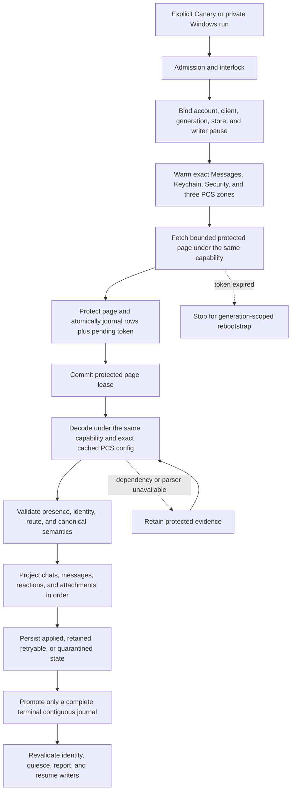
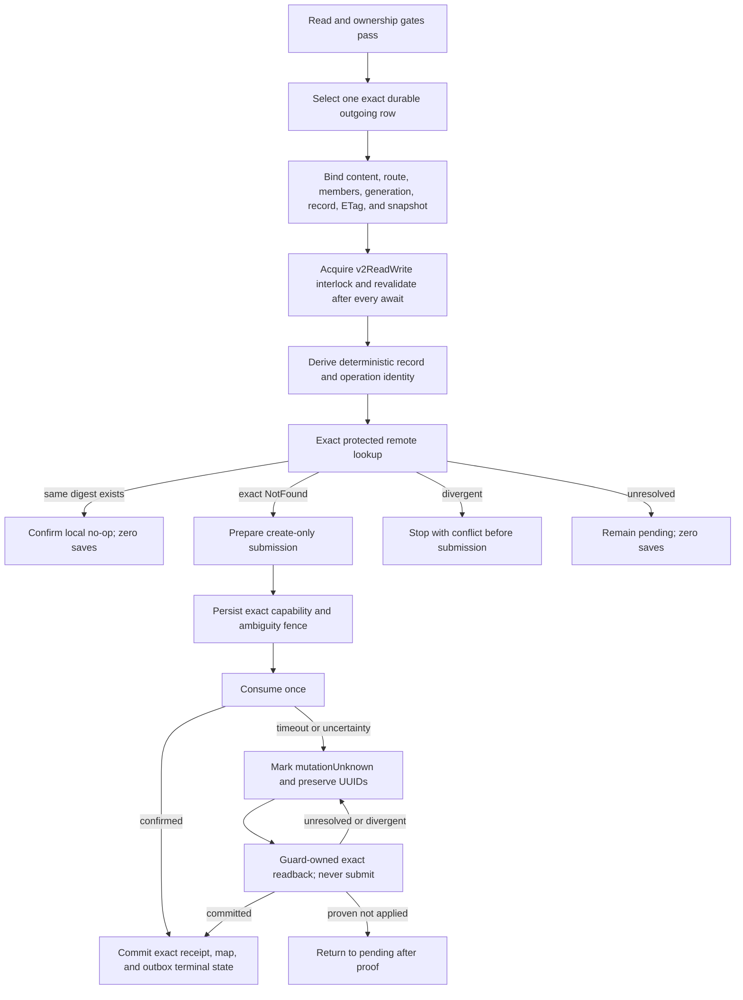

# Cloud Sync V2 current connection treemap

This document is the short operational source of truth. It contains current
architecture, safety rules, qualification state, and the next falsification
test. Dated investigations, obsolete candidates, run-by-run notes, patents,
and historical evidence remain intact in the
[investigation log](cloud_sync_v2/history/CLOUD_SYNC_V2_INVESTIGATION_LOG_THROUGH_2026-09-07.md).
The [bundle index](cloud_sync_v2/index.md) points to both documents and the
current evidence set.

## Decision

Treat Messages in iCloud as a durable replicated log. Remote ingestion and
local projection are separate progress clocks. A successful fetch is not a
successful sync. Undecryptable or temporarily unprojectable records remain
durable repair work and never disappear merely because a later token exists.

Every protected operation must remain bound to one exact tuple:

```text
account fingerprint
  + live CloudMessagesClient identity
  + read-authentication generation
  + protected-store identity
  + native writer-pause permit
  + container/database/zone
  + checkpoint generation
```

If any member changes, fail closed and retain the evidence. Never borrow a
different identity or container, create PCS state from the read path, fall
back to legacy sync, clear a cursor, or continue under a replacement account.

## Status legend

| Status | Meaning |
| --- | --- |
| `LIVE-PROVEN` | A content-free trace exercised the exact boundary on the named platform. Proof does not transfer between platforms. |
| `TEST-PROVEN` | Source-contract or behavioral tests cover the boundary; current-device proof remains. |
| `SOURCE-IMPLEMENTED` | The repair is in the candidate, but full exact-source qualification is incomplete. |
| `IN REPAIR` | A concrete counterexample invalidated the previous candidate. |
| `GAP` | A safe end-to-end behavior is not implemented or needs a product decision. |

## Current candidate

| Item | Current state |
| --- | --- |
| App branch | `agent/cloudkit-v2-sms-chat-contract` |
| Candidate | App source `12035ec0cefe73a9d4f7f779d2e9a06c4c7667b0`; prior Android release proof remains `ad822f37cbf468a6bc74d602965e78ae02a852d1`. |
| Main change | `MessageEncryptedV3.msgType` now selects the matching Apple system-event protobuf schema. Valid classes 3-7 remain retained as typed unsupported events instead of being mislabeled malformed by the ordinary-message decoder. |
| Dependency | rustpush `c5e9053`, which restores the five system-event payload schemas on the existing fork branch. |
| Full qualification | Exact-source T2D-60 GCE run `34226323430` passed: 2,441 Dart tests, 346 Rust app tests, 223 rustpush production-feature tests, 32 protector tests, reproducible generated bindings, signed Canary APK, ARM64 application/native-library verification, runner deregistration, and VM deletion. The GCE build job took 28m43s; the complete workflow took 32m11s. |
| Android release proof | The signed `ad822f37c` APK was installed in place with Canary data preserved and Alpha untouched. Its live read-only pull drained the remote head in one pass and finished without an unsafe failure. The final local sweep completed Chats with the exact 476-row durable backlog, kept remote save/delete disabled, and kept outbox `0 -> 0`. Messages and Attachments remain honestly degraded with 1,893 and 1,693 blocking saves respectively. |
| Production claim | Not yet allowed. |

### What the candidate includes

- Native and Dart compute the same deterministic group-routing digest from the
  canonical group, current raw group ID, service/style, group version, and
  normalized participants.
- Both sides use UTF-8 byte ordering. Exact `urn:biz:<UUID>` participants are
  retained; arbitrary schemes remain rejected.
- Older applied groups can receive a missing digest only through protected
  null-to-non-null projection repair with an otherwise exact snapshot match.
- Restored, nonprovisional group plaintext uses opaque dependency binding tag
  3. It binds generation, owner, aliases, server record, ETag/raw reference,
  latest applied save, and routing digest.
- Direct tag-1 and reaction tag-2 encoders and bindings remain unchanged.
- Provisional group creation, group reactions, group-state mutations, remote
  deletion, and update merge remain closed.
- Exact out-of-scope chat satellites and retained tombstones no longer make a
  valid physical-retention result fail the whole Chats zone.
- Retained message and attachment blockers are counted separately from the
  larger physical backlog. The current live blocker is therefore 3,586 saves,
  not all 10,108 retained rows.
- Content-free Windows inspection proved all 189 native `msgProto` field-2
  wire mismatches are classes 4-7, whose Apple schemas use int64 rather than
  the ordinary message string. The same inspection found five class-3 system
  events. Candidate `12035ec0c` validates all five variant schemas and retains
  them as `UnsupportedMessageType`; it does not invent projection semantics.
- Canary ADB control is package-scoped, challenge-confirmed, and read-only by
  default. Host parsing accounts for Android SharedPreferences key prefixes and
  harmless Windows PowerShell native-stderr promotion.

## Scope and current evidence

| Capability | Status | Remaining proof or work |
| --- | --- | --- |
| Chat and message history | `LIVE-PROVEN` for restored readable history | Qualify sustained incremental sync, restart, and account lifecycle on the release candidate. |
| Reactions on read | `LIVE-PROVEN` for representative records | Continue retaining unavailable parents; qualify current candidate on Pixel. |
| Photos and videos on read | `LIVE-PROVEN` for user-visible examples | One HEIC exact-size edge and some gallery/profile surfaces remain. GIF rendering is deferred, but data must remain preserved. |
| Documents and plugin payloads | Partial | Classify and expose supported document payloads without mislabeling opaque plugin payload containers as ordinary files. |
| Direct plaintext create | `LIVE-PROVEN` in the Windows development loop | Confirm exact remote readback, restart no-save replay, independent Apple-device visibility, and ordinary Pixel composer convergence. |
| Restored-group plaintext create | `SOURCE-IMPLEMENTED` | Pass exact-source GCE, then perform one authorized live group test and exact readback/restart proof. |
| Direct reactions | `TEST-PROVEN` | Live Apple save/readback and independent-reader display remain. |
| Edits and unsends | `GAP` | Require distinct causal mutation and anti-resurrection contracts. |
| Attachment writes | `GAP` | Require protected asset staging, record binding, save/readback, and recovery. |
| Tombstones and deletion | Closed | Define exact ownership and recoverable semantics before enabling any local or remote delete. |
| Token expiry | `GAP` | Wire generation-scoped rebootstrap and reconcile retained old-generation evidence. |
| SMS, MMS, and RCS | Out of scope | Do not add them to this CloudKit V2 release path. |

## Safety gates

These gates are non-negotiable:

1. Bind account, live client, credential generation, protected store, zone,
   checkpoint generation, and writer-pause capability at every external wait.
2. Journal each protected page and pending token atomically before committing
   the native page lease.
3. Project in dependency order: chats, messages, reactions, attachments.
4. Promote a token only across a complete contiguous terminal journal.
5. Keep fetched, retained, and exactly projected progress separate.
6. Keep live IDS/APNs receive readiness independent from archive repair.
7. Admit a write only from an exact durable row and a fresh protected
   dependency binding.
8. Prove exact remote absence before first create. Persist the ambiguity fence
   before consuming a prepared mutation.
9. After submission uncertainty, reconcile by exact readback only. Never
   automatically replay, update-merge, quarantine away ambiguity, or delete.
10. Require an exact protected receipt before committing a record map and
    terminal outbox state together.
11. Preserve Alpha, its hardware identity, its database, and its messages.
12. Keep Windows Smart App Control enabled. Use GCE or a trusted signed
    environment when local policy blocks an executable.

## Explicitly forbidden fallbacks

- Use of a general or write-capable container when semantic read authentication
  is cold.
- Cross-account, cross-client, cross-generation, cross-zone, or cross-store
  authentication and decryption.
- `ZoneSaveOperation`, PCS creation, clique reset, or remote mutation from the
  semantic read path.
- Silent fallback to legacy CloudKit sync.
- Cursor clearing for an unknown, malformed, or inconvenient error.
- Treating `retainedUnprojected` as successful local projection.
- Advancing past an incomplete journal.
- Deleting local rows for read-path tombstones.
- Letting optional CloudKit work delay live message startup or acknowledgment.
- Using GCE as a live Apple client or exporting account, relay, PCS, or device
  identity to CI.

## Read state machine



The durable journal between fetch and projection is the critical cut. It makes
projection repair possible without refetching or losing the exact server
evidence.

## Outbound create state machine



Direct, reaction, and group operations use distinct protected binding tags.
One lane cannot be cast into another. Confirmed replay is readback-only and
must prove zero saves.

## Fast qualification loop

Use the cheapest boundary that can falsify the current hypothesis:

```text
source contract or behavioral logic
  -> focused local test when policy allows, otherwise GCE
  -> full exact-source GCE suite and APK build

Apple protocol, PCS, save, readback, or replay behavior
  -> private-profile Windows fast loop

Android registration, ObjectBox/UI, background, lock, or lifecycle behavior
  -> signed Canary on Pixel

cross-device convergence
  -> independent Apple device confirmation
```

Do not rebuild a Canary for every code edit. Dart-only development may use
Windows hot reload. Rust or bridge changes need an incremental DLL rebuild and
process restart. Credentials and PCS state stay on the private Windows profile,
never on GCE. Pixel is the final release proof, not the everyday protocol loop.

## Recovery policy

| Failure | Safe response |
| --- | --- |
| Read credential cold or revoked | Warm the in-memory same-account credential, restore the encrypted same-account credential, or perform one bounded refresh. Then require user action. |
| Account or client changes | Stop before projection or acknowledgment and preserve journal, source, and checkpoint. |
| PCS key unavailable | Warm or look up only the exact same-scope zone. Retain the protected record if still unavailable. |
| Network or throttling | Preserve token and evidence, honor bounded retry-after, and retry later. |
| Missing parent or parser | Retain protected evidence and retry projection after the dependency or parser repair. |
| Malformed record | Store a fixed content-free reason and explicit repairability classification. Never guess identity. |
| Process death after fetch | Recover the protected lease, replay the durable journal, and keep the prior token until terminal. |
| Token expired | Stop, obtain an account-bound reset proof, quiesce coordinators, increment generation atomically, and rebootstrap only after old-evidence reconciliation is defined. |
| Write result unknown | Preserve request and operation UUIDs, protected receipt, and fence. Exact readback is the only next network action. |

## Source-linked boundary map

| Boundary | Primary source | Current status |
| --- | --- | --- |
| Product admission and interlock | [`cloud_sync_manual_semantic_pull_sampler.dart`](../lib/services/rustpush/cloud_sync/cloud_sync_manual_semantic_pull_sampler.dart), [`cloudkit_operation_interlock.dart`](../lib/services/rustpush/cloud_sync/cloudkit_operation_interlock.dart) | Read live-proven; full session replacement qualification remains. |
| Read authentication and exact PCS | [`cloud_sync_production_sampler_adapter.dart`](../lib/services/rustpush/cloud_sync/cloud_sync_production_sampler_adapter.dart), [`cloudkit.rs`](../rustpush/src/icloud/cloudkit.rs) | Exact `ad822f37c` live read-only pull completed; cold/account lifecycle proof remains. |
| Protected fetch, journal, and token | [`native_protected_cloud_sync_transport.dart`](../lib/services/rustpush/cloud_sync/native_protected_cloud_sync_transport.dart), [`objectbox_cloud_sync_store.dart`](../lib/services/rustpush/cloud_sync/objectbox_cloud_sync_store.dart) | Test and prior live proof. |
| Decode and canonical conversion | [`rust_cloud_semantic_decoder.dart`](../lib/services/rustpush/cloud_sync/rust_cloud_semantic_decoder.dart), [`cloud_sync_canonical_converter.rs`](../rust/src/cloud_sync_canonical_converter.rs) | Test and representative live proof. |
| Ordered projection and retained repair | [`cloud_inbox_applier.dart`](../lib/services/rustpush/cloud_sync/cloud_inbox_applier.dart), [`objectbox_cloud_semantic_store_gateway.dart`](../lib/services/rustpush/cloud_sync/objectbox_cloud_semantic_store_gateway.dart) | Read live-proven; current backlog must be explicit. |
| Write admission and recovery | [`cloud_sync_manual_outbound_canary.dart`](../lib/services/rustpush/cloud_sync/cloud_sync_manual_outbound_canary.dart), [`cloudkit_writer_mutation_guard.dart`](../lib/services/rustpush/cloud_sync/cloudkit_writer_mutation_guard.dart) | Direct Windows live proof; Pixel and other operation families remain. |
| Direct and group encoders | [`cloud_sync_local_send_encoder.dart`](../lib/services/rustpush/cloud_sync/cloud_sync_local_send_encoder.dart), [`cloud_sync_outbound_group_binding.dart`](../lib/services/rustpush/cloud_sync/cloud_sync_outbound_group_binding.dart) | Direct live-proven on Windows; group source-implemented. |
| Native create/readback receipt | [`api.rs`](../rust/src/api/api.rs), [`cloud_messages.rs`](../rustpush/src/imessage/cloud_messages.rs), [`chat_create.rs`](../rustpush/src/imessage/cloud_messages/chat_create.rs) | Direct Windows proof; exact-source suite and group live proof pending. |

## Release gates

### Candidate qualification

- [ ] Generated bindings reproduce with no unrelated drift.
- [ ] Full Dart, Rust, rustpush, protector, and ObjectBox tests pass at the
  exact app and submodule commits.
- [x] Canary APK contains the expected ARM64 native library and is signed on
  the existing trusted GitHub-hosted signing path.
- [ ] Failed GCE runs delete the VM and deregister the runner.

### Read qualification

- [x] Representative chats and readable messages project on Canary.
- [x] Representative reactions and media metadata project without deleting
  unavailable evidence.
- [ ] A cold-start candidate executes authentication, pause, three-zone warm,
  fetch, decode, journal, projection, and token promotion in one process.
- [ ] A second pull is idempotent and reports fetched, retained, and projected
  counts separately.
- [ ] Restart, background/lock, account replacement, and expired-token paths
  preserve evidence and fail closed.

### Write qualification

- [x] Direct plaintext create has bounded Windows save/readback/restart proof.
- [ ] Confirmed direct replay proves zero saves and independent Apple-device
  display for the release candidate.
- [ ] Restored-group plaintext passes exact-source tests, one authorized live
  group create, exact readback, restart, and independent display.
- [ ] Direct reactions pass live save/readback/restart and independent display.
- [ ] Ordinary composer admission commits the local message and V2 outbox
  intent together, then converges automatically.
- [ ] Attachment write, edits, unsends, and tombstones each receive their own
  causal and recovery contract before release or remain explicitly disabled.

### Production qualification

- [ ] One signed Canary survives foreground/background, lock, reconnect,
  process restart, and account repair without duplicate sends or lost tokens.
- [ ] Current retained backlog is zero or every retained category has an
  explicit non-destructive repair or honest unavailable state.
- [ ] User-visible status distinguishes remote ingestion, projection, media
  materialization, live delivery, and write reconciliation.
- [ ] Scope documentation names supported operations precisely. Initial text
  creation must not be advertised as complete Messages parity.

## Current critical path

1. Qualify candidate `12035ec0c`, then replay the retained message cohort and
   prove that the 189 schema-known system events move from native malformed to
   typed unsupported state without changing remote data or tokens.
2. Classify the remaining inbound message failures by their existing safe
   categories, especially malformed required identity, ambiguous reply, and
   dependency-parent state. Existing-history ownership is not an inbound
   projection cause.
3. Continue bounded retained projection until every remaining blocking message
   and attachment save is either projected or has an explicit typed unavailable
   state. Do not reinterpret physical retention as completed local projection.
4. Separately classify the two queued chat creates that fail closed as
   `cloud_sync_outbound_chat_existing_history`. That code currently collapses
   a matching local Chat, semantic snapshot, alias, or earlier outbound origin;
   none alone authorizes adoption. Adopt only after one exact current CloudKit
   Chat owner is proven, otherwise keep the create deferred.
5. Use the authorized test recipients only. First repeat direct no-duplicate
   readback proof, then create one controlled restored-group plaintext message.
6. Verify the group record by exact CloudKit readback, restart/no-save replay,
   and independent Apple-device display.
7. Qualify direct reactions. Keep edits, unsends, attachments, group-state
   changes, and deletion closed until their separate contracts pass.
8. Run lifecycle soak and produce one release-candidate report that proves
   identity stability, token continuity, zero duplicate writes, and honest
   retained counts.

## Next falsification test

The next falsification is a read-only retained replay on Canary using the
signed exact-source `12035ec0c` artifact from GCE run `34226323430`. For
message classes 3-7, the replay must
report typed unsupported state rather than native malformed state. It must not
save, delete, mutate the outbox, or remove a retained record. The confirmed
catch-up may legitimately fetch newly arrived records and advance read
checkpoints while proving remote head. Its subsequent retained-projection
sweep is the part that must remain local-only: it constructs no transport and
cannot fetch or advance a token. Any system-event schema decode failure,
unexplained retained-count loss, or write-side movement rejects the candidate.
Outbound existing-history resolution remains a separate write gate for the
two queued creates only.

## Existing-history adoption evidence gate

Automatic adoption is not safe from the offline checkout alone. For each
queued intent, a content-free live observation must first distinguish the four
`existing_history` branches and prove exactly one current direct-iMessage Chat
owner under the same account, protected store, scope, generation, writer epoch,
and native session. The proof must bind the canonical Chat lookup hash, semantic
snapshot, service-identifier alias, canonical/member record map, latest applied
non-tombstone save, ETag, protected record reference, and payload digest. A
later retained save, tombstone, competing owner, or native `overlaps` /
`incomplete` result remains a defer.

Only after that proof may the production local-send admission seam atomically
re-read the state-1 journal intent and unchanged provisional Message/Chat,
adopt the exact existing relationship, and persist its durable reconciliation
binding under the existing `v2ReadWrite` interlock and auth fence. That
transaction must create no Chat stage, outbox row, record-map mutation, remote
save, merge-update, or delete. Restart must repeat as a no-op; any mismatch must
roll back and leave the intent ready/deferred. A bare Message reparent is not a
fallback because the journal source digest binds the original Chat row and UUID.
