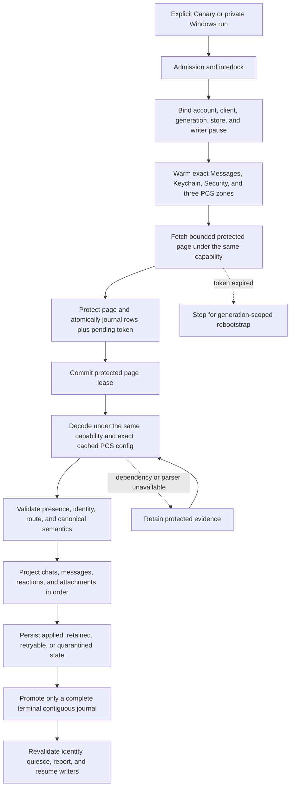
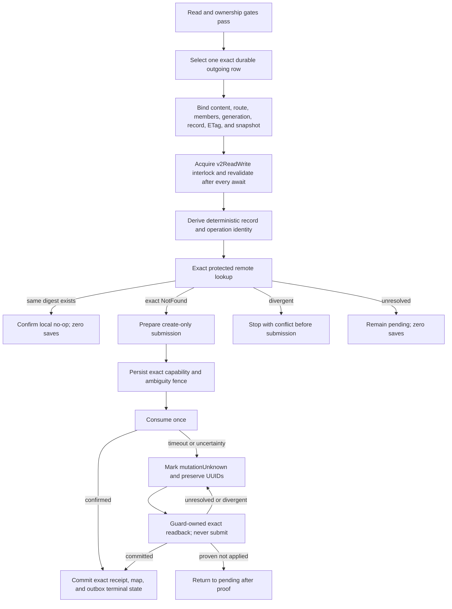

# Cloud Sync V2 current connection treemap

This document is the short operational source of truth. It contains current
architecture, safety rules, qualification state, and the next falsification
test. Dated investigations, obsolete candidates, run-by-run notes, patents,
and historical evidence remain intact in the
[investigation log](cloud_sync_v2/history/CLOUD_SYNC_V2_INVESTIGATION_LOG_FROM_2026-09-07.md).
The [bundle index](cloud_sync_v2/index.md) points to both documents and the
current evidence set.

## Decision

Treat Messages in iCloud as a durable replicated log. Remote ingestion and
local projection are separate progress clocks. A successful fetch is not a
successful sync. Undecryptable or temporarily unprojectable records remain
durable repair work and never disappear merely because a later token exists.

Every protected operation must remain bound to one exact tuple:

```text
account fingerprint
  + live CloudMessagesClient identity
  + read-authentication generation
  + protected-store identity
  + native writer-pause permit
  + container/database/zone
  + checkpoint generation
```

If any member changes, fail closed and retain the evidence. Never borrow a
different identity or container, create PCS state from the read path, fall
back to legacy sync, clear a cursor, or continue under a replacement account.

## Status legend

| Status | Meaning |
| --- | --- |
| `LIVE-PROVEN` | A content-free trace exercised the exact boundary on the named platform. Proof does not transfer between platforms. |
| `TEST-PROVEN` | Source-contract or behavioral tests cover the boundary; current-device proof remains. |
| `SOURCE-IMPLEMENTED` | The repair is in the candidate, but full exact-source qualification is incomplete. |
| `IN REPAIR` | A concrete counterexample invalidated the previous candidate. |
| `GAP` | A safe end-to-end behavior is not implemented or needs a product decision. |

## Current candidate

### Primary ownership handoff, September 18

User assigned primary implementation to existing task
`01a0abe1-9bbe-71b2-a9ce-4d4578022b0e` (facetime & find my), on Muse Spark
1.3 Contributor at max effort. It owns this CloudKit checkout, prioritizes the
remaining production gates, and preserves its independent FaceTime/Find My work.
Supervisor `01a098ec-c448-73a1-a73f-696d142de228` reviews meaningful checkpoints,
high-risk integration changes and final release evidence, without a competing
implementation loop. See AGENTS.md for the scope and coordination contract.

Execution is pending provider repair, not running: both configured Muse
Contributor routes failed before executing the handoff with provider400,
`unknown parameter access_programs`. The alternate route failed during remote
compaction. No takeover acknowledgement or implementation has occurred. A bounded
read-only diagnosis was sent to task `01a0687b-43f0-7a22-999f-260c60ae3d42`
(Connect Muse Spark API agent), respecting the user's instruction to keep
OpenCodex off. Do not repeat identical retries or change provider/security
configuration to force the handoff through. Confirm actual execution once repaired.

Handoff baseline is clean source `7aa70b1617669d55bca7c9da38ebd2c2e16e3c7c`,
branch `agent/cloudkit-v2-newest-bootstrap`, and installed diagnostic native
source `f43919ba3cbf18599be8d1270924293cae339aae`. This handoff changes no
runtime, account, queue or device. Fresh local check found no matching
Flutter/Dart/OpenBubbles process and C: has 26.75 GiB free. The prior qualification
and device observations below remain dated evidence, not fresh live state.

Next: verify current Canary state and exclusive relay availability, then run the
existing attachment diagnostic without refetch/projection/writes. If the live
preflight is unavailable, advance a specific offline-testable production gap,
not repeated unchanged polls or a duplicate APK build. Report evidence and the
next decision at a checkpoint; all unfinished release gates remain unfinished.

### Last live-test blocker, September 17

The same unknown Canary sign-in state remained through three consecutive goal
turns after the diagnostic runtime was ready. Checks on September 17 showed no ADB
device, no local test process, both qualification jobs terminal/successful and
zero GitHub runners. The goal was marked blocked, not completed, to stop idle repetition.
User must confirm whether Canary is still at activation/sign-in or now signed in,
or reconnect the Pixel for a fresh check. Then reserve the shared relay and run
the already-qualified cached attachment probe. Do not rebuild, reset data, weaken
auth checks or repeat a full sweep merely to work around this missing preflight.

### Next discriminating test: attachment quarantine details

- Sourceba47b1f09 adds secondary, closed attachment rejection details at missing
  `cm`, decrypted metadata-presence capture and canonical conversion boundaries.
  Original quarantine reason/category stays unchanged. Conversion detail is not
  attached to a later normalization/identity rejection. Media acceptance rules
  are intentionally unchanged; no owner/URL/key/signature values cross the bridge.
- Dart decoder/diagnostic tests passed64; analysis clean. GCE35192463601 now passed
  full-tree binding reproduction,774 Rust/3946 Dart(+5 skips)/17 PowerShell cases.
  All4 new native tests passed, including4096 previous-rule comparisons, strict
  structural failures and non-attribution after normalization. The job's VM and
  runner were removed; owner verified zero instances, parent verified zero runners.
  Estimated compute$0.08. Windows35192422648 also passed in27m23s, with710 Dart,
  51 DLL encoder cases, native scopes and exact source/provenance checks.
  Ptolemy's two-file Dart change was reviewed/corrected, closed and verified.
- Installed diagnostic host is nowf43919ba3cbf18599be8d1270924293cae339aae,
  signed DLL4bfdd1218ca2559c5ea5e2a756111a0432030bc1ed96da291de8d426b4c77084.
  Four exact native tests plus actual-DLL smoke passed locally. All15 checked
  account/database files unchanged during import; b9 remains verified rollback.
  Its14-message/9-attachment recovery remains preserved, not undone by this update.
  Next: confirm Canary sign-in status, reserve the relay, re-observe the8 attachment
  malformed-record cases without projection, then repair the observed cause.
  No APK, live mutation, new profile or destructive cleanup is needed for this step.
- Both sourcef439 jobs are complete: Windows35192422648/f21 and
  GCE35192463601/fab604fc7. Watches/smokes44222 and96533 are terminal. No duplicates.
  Pixel is no longer listed by ADB. User has been asked whether Canary is still
  signed out or repaired, before risking shared-relay contention. Live diagnostic
  probe has NOT run. No device action/private provisioning/current reservation.
- Offline alternative checked in source: projection-viewer modes skip account
  bootstrap but cannot decode retained encrypted records. The normal cached-record
  harness still calls setupPush and account construction; stale read authorization
  may refresh over the network. Existing persisted read credentials do not prove a
  network-free launch. No fake connection/account, skipped auth gate or new offline
  framework was introduced. Canary sign-in status remains the next live preflight.
- All current helpers are closed/verified. Sartre's source-backed lookup-location
  observation is retained in INCOMING_ARCHIVE_DESIGN.md as a proposed separation,
  not implemented group support. Parent rejected the broad "safe split" claim:
  raw comparison, native staging and Dart adoption still require parent proof.

### Immediate handoff: missing optional extension labels proved, September 16

- **TEST-PROVEN and installed:** Windows35185153466 passed in25m25s for appb9ebb102e,
  native-test-host/read-only and pilotf21. Installed signed DLL SHA256
  `2f960b7365ba9d87f25a87effd92cf30916b3faea008e644c84a153c21422919`.
  Verified64 source inputs,6 recursive pins,13 log hashes and3 ARM64 binaries.
  Hosted705 Dart,51 DLL encoder,17 native diagnostic and35 extension cases passed.
  Three local sparse-layout native tests and one actual-DLL smoke passed; all15
  checked account/database files unchanged during import. Previous5f bundle is
  rollback material; qualification record is under
  `build-evidence/windows-optional-labels-35185153466/verification.json`.
- **Historical diagnostic evidence:** exclusive read-only Windows observation
  b0e626b0a5a3e252c4ef2d5fc3130900 completed37 retained cases with durable state
  unchanged. Five cached heading parents advanced beyond unsupported association
  to extension decode `Name/Malformed`. No new restored messages or remote writes
  were claimed. New observation5cb1823cf2aeb48811b03bf37a8fb434 completed the same37
  cases and proved all7 Name failures have absent `an`, NSURL URL, display/layout
  strings and NSDictionary userInfo. Durable state unchanged, no remote writes,
  raw output removed and process cleanup confirmed. Read-test reservation released.
- **LIVE-PROVEN Windows repair:** optional-display repaira7911bd7a was
  reviewed by Ampere01a0adc7, accepted and closed/not_found. No child remains.
  The name is display data, not message/session identity. Its
  absence maps to the existing empty-label renderer value. Template display
  labels can be omitted; present wrong types, required URL/class/layout pairing,
  session/bundle identity and every archive budget stay enforced. Raw source is
  retained. Apple documents optional template text; private key names remain the
  existing parser's mapping, not public CloudKit schema evidence. Native tests
  cover sparse labels, bad present types, missing URL and incomplete structure;
  Dart test checks content and wire identity. Both cloud qualifications pass.
  Exact read-only observation1a6913ac507a0658b047646403c53da4 clears the2 sampled
  message failures and5 parent-decode failures; do not count them as7 unique rows.
  Normal projectioncb040c7a12c340ac4bb14fd0e750c1c1 then restored14 Message rows
  and9 Attachment rows, independently confirmed on offline before/after copies.
  Counts14044->14058 and2530->2539; all prior row IDs and24 outbox control rows
  preserved. All14 new messages have display text and parseable app metadata;
  no replacement characters/payload errors. This is not Pixel visual proof.
- **Completed qualification:** exact sourceb9ebb102e70d7aa9d17db8892935009ee42a2501
  passed Windows35185153466 and GCE35185177773 on corrected pilotfab604fc7.
  GCE770 Rust/3941 Dart(+5 skips)/17 PowerShell checks passed, including full-tree
  binding reproduction. Owner verified deleted VM/zero instances; parent verified
  cleanup job/zero runner registrations. Estimated compute$0.07. No duplicate/APK.
  Fresh-process stability1a35a2802cd2848458fcfe4ef2387933 passed two zero-fetch,
  zero-apply runs, retained6246 unchanged and outbox24 unchanged. Raw streams
  removed; all owned processes exited. No active profile/relay reservation.
  Sidecar Averroes01a0adcc completed its21-case classification and is closed,
  shutdown verified. All main child agents are closed; no live profile process.
- **TEST-PROVEN Dart reporting fix797d6210c:** quarantine exceptions previously
  omitted their known reason and became unknown. Fourteen reviewed enum codes
  now survive reports without changing category, retry policy or admission.
  The112-case decoder/safe-code/prepared-metadata batch and analysis passed.
  Sample21 splits into5 unsupported-service,7 unsupported-message-type,
  1 malformed-parent and8 malformed attachment-record quarantines. These are
  not automatically exclusions. Aggregate count equality proves no linkage;
  the8 attachment failures occur before parent probing and need independent
  cause evidence. The subsequent37-case observation confirmed all21 reasons
  remain; the name repair does not fix those independent quarantines.
- **Canary registration blocker:** installed710003e7b APK SHA256
  `8d87ec693bbbcbb9d31b0ab886e254cc2ef5c1a9253c3fc7acac9dc3233ad90b`
  omits the relay application token from its developer build. The same verified
  device code/origin returns200 with Windows' saved application token,401 with
  the empty Canary token. This is not proof of an invalid device code. No secret
  was added to CI, source, artifacts or an APK.
- User-approved Canary restart cleared the repeated interlock-busy symptom.
  Prior stable snapshot preserves702 chats/11917 messages/2416 attachments and
  nine outgoing entries; its lease was expired about28h. The user's subsequent
  setup reset removed hardware/identity files; GSA/keychain/database remain.
  Current setup is activation, unauthenticated and idle. Alpha stays untouched.
- User approved one additional restart and private debugger relay provisioning.
  The reviewed helper in `experiments/relay-debug-provision-20260916` calls normal
  config/selection APIs only, guarded by exact APK, mounted activation page,
  approved origin and matching-or-empty code. It copies no Windows account/keys.
  **Not executed:** execution policy rejected the approved restart before launch.
  Read-only follow-up confirms the old PID8013 remains and no VM-service marker
  or ADB forward exists. Ask user to force-stop/reopen Canary and leave activation
  visible; do not route around the guard. Inspect first, no automatic retry after
  an async timeout. Verify host through normal UI; user continues Apple sign-in.
  Ohm's read-only review is accepted; closed and verified not_found. All helpers
  closed; supported session deletion unavailable, transcripts retained.
  USB is now disconnected; paired wireless ADB192.168.68.50:38787 remains online,
  with the same Canary PID. No private provisioning has been applied.
- All live reservations were released after cleanup. A pending user restart is
  not a standing relay lock. Coordinate a new window with the independent
  FaceTime/Find My task before shared profile/relay use. Both GCE jobs finished;
  their runners/VMs were removed. No new APK was built in this iteration.
  C:about20.47GiB free. Scoped audit: build/test_cache2.62GB, .dart_tool63MB;
  no attribution made for other concurrent disk usage. Prior denied cleanup remains
  zero removed; preserved snapshots,
  credentials, rollback archives and transcripts are not cleanup candidates.
- **TEST-PROVEN source, not installed on Pixel:** db1fe6d76 detects missing build relay
  access before HTTP/native calls to the official origin and reports401/403 as
  ambiguous authorization failure, not a proven invalid device code. Default
  HTTPS port/case handling and custom origins are covered. Sixteen validator and
  four secret-exclusion tests passed; targeted analysis clean. No token or build
  secret changed. Epicurus reviewed/integrated/closed, shutdown verified.
- **TEST-PROVEN diagnostic source:** b03c7bc16 adds closed type/presence labels for
  six known extension fields on a Name failure. Decoder acceptance is unchanged;
  no archive values, arbitrary keys or class names are exposed. Windows aggregate
  schema4 parser passed24 tests, including injected-content rejection; Rustfmt
  passed. This is now qualified in installed5f and the discriminator ran live;
  no extra APK. Its parser acceptance remained unchanged until the pending repair.
- **GCE35182317779 completed successfully:** exact app5f, workflow14c2,
  n2d-standard-16 Spot/primary, cloudkit-qualification/no APK. App Rust and full
  Dart/PowerShell passed; inherited binding-list proof is limited as noted below.
  Owner verified deleted VM and zero remaining instances; parent independently
  checked successful cleanup job and zero GitHub runners. Lifetime16m07.729s,
  estimated compute cost$0.08, not a final invoice. Windows watch60611, local
  smoke59507 and live observer36185 are terminal. Original Windows pilot unchanged.
- **TEST-PROVEN collection repair99495e3ba:** native diagnostics were read only
  from stdout even though pretty_env_logger emits to stderr. The collector now
  consumes both bounded streams and persists only closed aggregates. All25
  PowerShell checks pass, including stderr-only and content-rejection cases.
  Private retained-inspection wrapper also writes the aggregate before existing
  raw-output cleanup; its syntax passes. Native boundary unchanged from5fdefad3a.
- **CI proof correction:** old generated-binding guards listed only some Dart
  outputs. Earlier reproducibility claims cover those listed files, not every
  generated API module. Main756121b21 and reviewed pilotfab604fc7 now guard and
  upload the complete lib/src/rust subtree plus three Rust outputs. A synthetic
  source5f fixture detected modified chat_identity/dependency and a new module;
  actionlint passes. The running GCE job started before this correction and must
  not count as full-tree binding proof. Keep its real Rust/Dart evidence; do not
  rerun a full build just for this. Apply corrected gate to the next native repair.

### Retained architecture and unresolved work

- The cached-only native parent locator derives an exact keyed parent identity
  from a freshly authenticated child. It makes no network request, file staging,
  cursor change or projection. Five extension parents are cached and reach the
  reviewed optional-label repair; two attachment parents are carrier exclusions,
  six are locally unobserved, not proved absent from Apple.
- The last full Windows sweep was source8e652804f/nativeaa953639a: all798 retained
  message saves and1011 attachment saves examined, with zero new applications in
  that final sweep. Retained total6269 also includes3779 known excluded saves and
  681 tombstones. Later37-case probes are samples, not a new complete census.
- Incoming direct plaintext has separate protected-source capture, exact remote
  inspection, fresh-Absent-only creation, and Found-to-normal-reader adoption.
  State3 means outbox-adopted, not CloudKit-confirmed; state4 wakes the reader.
  All three received flags remain off. Generation2 inbox keys now match consumers;
  tests cover late edits/retraction and restart. Actual received create/readback,
  received groups/media/mutations and independent-client visibility remain open.
- Received-group draft6c66ea3f5 remains unmerged in its owned
  `agent-worktrees/received-group-source-20260916` worktree. Original-group aliases
  can have competing owners. No arbitrary candidate list, terminal delta page,
  title/member match or guessed normalization proves uniqueness. Implement an
  account/generation-bound owner-selection contract before enabling that path.
- Canary ambiguous outbox and eight earlier confirmed entries remain preserved.
  Do not clear registrations, leases, cursors or queues to manufacture success.
  Known stale carrier dependency failures retain their history and fences.
- Prior builds, hashes, scopes, rejected hypotheses and cleanup records are in
  the [verbatim September16 checkpoint archive](cloud_sync_v2/history/TREEMAP_PRE_OPTIONAL_LABEL_REPAIR_2026-09-16.md)
  and [investigation log](cloud_sync_v2/history/CLOUD_SYNC_V2_INVESTIGATION_LOG_FROM_2026-09-07.md).
  They are evidence, not instructions to restore an obsolete runtime.

### Retained device baseline

- Installed Pixel source was710003e7b at the last read-only snapshot. Its
  interlock failure and one unknown-outcome outbox row still need exact readback
  and current-device qualification. Eight confirmed rows are not a completion
  claim for the unknown row.
- The already-built f027aad2a Canary from hosted35058684776 is verified but not
  installed. It contains Profile encryption/progress and engine-lifetime fixes.
  APK SHA256:
  `d34e72bb78add5f5654adf04e5183cffd8c786bdb5a526ab2a19a424b8e7ab50`.
  Evidence: build-evidence/github-canary-f027aad-35058684776.
- A previously failing HEIC download/reopen was user-confirmed. Group routing,
  incoming archival and edit/unsend behavior still have open gates below.
- Prior native counts, artifacts, rejected variants, cleanup exceptions and
  detailed September16 checkpoints are preserved in the
  [pre-reader treemap snapshot](cloud_sync_v2/history/TREEMAP_PRE_RECEIVED_READER_2026-09-16.md).
  Do not rerun or restore an older checkpoint merely because it passed a
  narrower test. The current candidate above controls new work.

## Scope and current evidence

| Capability | Established | Remaining |
| --- | --- | --- |
| History read | Fresh Canary visibly restores chats/messages. Current Windows candidate caught up and passed two fresh-process empty-terminal repeats. | Classify/repair remaining retained saves, explain unavailable data, and repeat on Pixel. |
| Media/documents/reactions read | Earlier representative live results; current materialization/filtering implemented. | Current Pixel photos, video, transcript GIFs, documents and incremental updates. GIFs need not appear in profile media. |
| Direct writes | Fresh exact-source Windows parent send, edit, unsend and new-process no-submit replay, plus earlier reaction and image protocol results. | Ordinary Pixel composition, restart recovery, group/media cases and independent client display. |
| Incoming/mirrored archival | Default-off receive hook, encrypted source, direct create/readback and Found-to-reader handoff implemented; source/transaction qualification progressing. | Same-source live receive/create/readback, groups/media/mutations, pre-seal failures and independent-client proof. |
| Groups | Restored-group binding implemented/tested. | Approved two-recipient text, attachments, reactions and supported mutations. No personal group substitution. |
| Edits/deletes | Direct single-part Windows send/edit/unsend, exact CloudKit confirmation/local reflection, terminal retraction and zero-submit restart replay. | Pixel, groups, conflicts, independent display, supported tombstones and mid-flight recovery. |
| Lifecycle | Identity/reset fences and bounded Android worker implemented/tested. | Current background/lock, reconnect, process death, token expiry and account repair. |
| Progress/speed | Card and smaller Regular workload implemented. | Integrated qualification, Pixel UX and measured performance. |
| Newest history first | Local recent-chat admission fixed. | Durable fresh-stream direction plus multi-page/restart/incremental qualification. |
| SMS/MMS/RCS | Excluded by user. | Preserve and label exclusion separately from iMessage failures. |

## Safety gates

These gates are non-negotiable:

1. Bind account, live client, credential generation, protected store, zone,
   checkpoint generation, and writer-pause capability at every external wait.
2. Journal each protected page and pending token atomically before committing
   the native page lease.
3. Project in dependency order: chats, messages, reactions, attachments.
4. Promote a token only across a complete contiguous terminal journal.
5. Keep fetched, retained, and exactly projected progress separate.
6. Keep live IDS/APNs receive readiness independent from archive repair.
7. Admit a write only from an exact durable row and a fresh protected
   dependency binding.
8. Prove exact remote absence before first create. Persist the ambiguity fence
   before consuming a prepared mutation.
9. After submission uncertainty, reconcile by exact readback only. Never
   automatically replay, update-merge, quarantine away ambiguity, or delete.
10. Require an exact protected receipt before committing a record map and
    terminal outbox state together.
11. Preserve Alpha, its hardware identity, its database, and its messages.
12. Keep Windows Smart App Control enabled. Use GCE or a trusted signed
    environment when local policy blocks an executable.

## Explicitly forbidden fallbacks

- Use of a general or write-capable container when semantic read authentication
  is cold.
- Cross-account, cross-client, cross-generation, cross-zone, or cross-store
  authentication and decryption.
- `ZoneSaveOperation`, PCS creation, clique reset, or remote mutation from the
  semantic read path.
- Silent fallback to legacy CloudKit sync.
- Cursor clearing for an unknown, malformed, or inconvenient error.
- Treating `retainedUnprojected` as successful local projection.
- Advancing past an incomplete journal.
- Deleting local rows for read-path tombstones.
- Letting optional CloudKit work delay live message startup or acknowledgment.
- Using GCE as a live Apple client or exporting account, relay, PCS, or device
  identity to CI.

## Read state machine



The durable journal between fetch and projection is the critical cut. It makes
projection repair possible without refetching or losing the exact server
evidence.

## Outbound create state machine



Direct, reaction, and group operations use distinct protected binding tags.
One lane cannot be cast into another. Confirmed replay is readback-only and
must prove zero saves.

### Attachment-write integration boundary

The next vertical slice must connect the existing composer journal to this
entire chain, not merely add an upload validator:

```text
exact attachment descriptor actually sent through IDS
  -> protected descriptor + metadata + one retained record identity
  -> verified original MMCS bytes, exact pinned length
  -> existing account/container + attachment-zone PCS + boundary-key lookup
  -> byte upload, retaining its receipt or unresolved-upload state
  -> create-only CloudAttachment(cm metadata, lqa asset)
  -> exact record readback and confirmed dependency
  -> parent Message with the same attachment references
```

- The Dart store atomically admits completed Attachment-v1 uploads, and the
  runtime byte-upload coordinator and parent-message connection are implemented.
  Live byte upload has succeeded; child/parent record readback remains open.
  Native integration separates protected pre-upload preparation
  (`outboundAttachmentUpload`) from completed record-create material
  (`outboundAttachment`). Neither grants network permission or parent admission.
- Existing `Attachment.metadata["rustpush"]` stores an MMCS descriptor with
  decryption material at upload-finish, before IDS send success. It is mutable,
  not an encrypted receipt or proof of what IDS sent. Pin the actual wire
  descriptor into protected admission before send, then bind native success to
  it. The v3 receipt now carries the protected source binding, not raw keys or
  descriptors. Composer source staging/adoption is connected; whole-runtime
  attachment qualification remains separate.
- Do not put the source only inside the IDS receipt: acknowledgment deletes
  that file immediately after durable confirmation, before outbound admission.
  A protected source needs its own durable reference and recovery/GC ownership
  through parent adoption. The additive journal `protectedSourceBinding` field
  now owns that reference independently; old rows remain null and unqualified.
- Re-fetching that pinned MMCS object avoids a second permanent plaintext-byte
  journal and mutable-file reuse. It needs APS/MMCS availability, complete
  target/chunk validation, and the pinned plaintext length. A missing or expired
  object must defer, not substitute a different local file. Chunk integrity and
  length do not validate a guessed CTR key; the key must be the one actually sent.
- Reuse `CloudMessagesPreparedSaveSubmission` for record-save correlation and
  single consumption; the next native candidate supplies typed preparation
  and checked readback without enabling admission. Do not use
  legacy `save_attachments`, which enters generic update-capable saving.
- Legacy `prepare_file` calls `get_boundary_key`, which can create a keychain
  item. V2 lookup must also use keystore `get_secret`, not `ensure_secret`, when
  unwrapping existing boundary material. Keep the DSID and entry under the same
  state lock; a missing key fails without generating either local or remote keys.
- The attachment-specific local-send path extends outbox admission and parent
  encoding together. The plaintext-only path still rejects media.
- Record identity must be persisted before first upload and reused on retry.
  Legacy allocates a random attachment record ID; do not assume the proven
  Message GUID HMAC naming rule also applies to attachment records.
- `prepare_put_v2` randomizes chunk keys, FORD key and IV. Re-preparing identical
  plaintext retains neither the original encrypted descriptor nor its reference.
  Preserve the entire `PreparedPut`, including each chunk's key/signature/length,
  under platform protection before upload. Bind it to the original parent source,
  attachment metadata, full container-issued record identifier and file digest.
  A returned asset must match that exact preparation before record-create staging.
- Upload uncertainty and record-save uncertainty are distinct. Record NotFound
  cannot authorize blind byte re-upload or record-ID replacement.
- Next integration order: protected actual-IDS descriptor ownership in the
  local-send journal; durable pre-upload plan and attempt state; exact completed
  upload adoption; existing create-only record transport/readback; parent message
  dependency and encoding. Do not bypass the missing journal ownership by calling
  the legacy uploader or treating native codec tests as end-to-end qualification.
- Native send preparation is a separate boundary: `IMClient.send` calls
  `MessageInst.prepare_send`, which assigns a new send timestamp and may add
  the sender/conversation GUID. Capturing a Dart-built MessageInst and then
  allowing preparation to mutate it is not proof of the final wire. Integration
  must validate the final attachment descriptors and bind positive IDS success
  to the original source. Prefer an explicit validator for the three known
  preparation changes (timestamp, generated conversation GUID, added self
  participant), with all body/recipient/attachment fields unchanged, if that
  avoids a new two-phase send API. Freezing the prepared submission is an
  alternative, not a prerequisite. Do not ignore arbitrary changed fields.
- Local reflection is another normal transformation: `indexedPartsToAttributedBodyDyn`
  changes attachment GUIDs to `<messageGuid>_<part>` and inserts a space where
  the composer may use an object placeholder. Source identity must bind ordered
  descriptors and actual text/formatting, not these local aliases. Resolve each
  body reference to its exact attachment; do not accept count-only matching,
  unrelated rows, substituted descriptors or changed text. The native protected
  source still pins the actual sent descriptor, independently of local UI IDs.

## Fast qualification loop

Use the cheapest boundary that can falsify the current hypothesis:

```text
source contract or behavioral logic
  -> focused local test when policy allows, otherwise GitHub-hosted Actions
  -> full exact-source GCE suite and APK build

Apple protocol, PCS, save, readback, or replay behavior
  -> exact-source trusted minimal Windows harness when available
  -> otherwise signed Canary on Pixel

Android registration, ObjectBox/UI, background, lock, or lifecycle behavior
  -> signed Canary on Pixel

cross-device convergence
  -> independent Apple device confirmation
```

Do not rebuild a Canary for every code edit. Use GitHub-hosted jobs for native
compilation and focused local Flutter tests. GCE credits are exhausted and
new paid GCE work requires renewed approval. The established GCE lanes below
remain a reference, not authorization to dispatch them.
Windows ARM64 bundles are built on the isolated GitHub runner and imported
only after archive, native-codec, source/configuration and launch verification.
The retained `6abbeede2` runtime proves its bounded direct write, not newer
attachment code; `3ebcc81c9` must pass import and its own live test.
Local Cargo compilation remains blocked by App Control 4551. Keep that policy
enabled. The verified cloud bundle runs with the existing engineering signing
path when the original ObjectBox vendor DLL is preserved; re-signing that
vendor DLL caused the earlier startup block. Credentials and PCS state remain
local, never on GCE. Windows qualifies protocol boundaries, not Pixel lifecycle
or final Android release behavior.

Use five promotion lanes and do not skip upward:

1. **Focused local lane:** handwritten Dart contracts and structural guards for
   the changed boundary. It may reject a patch but cannot qualify native Rust.
2. **Fast hosted native lane:** bridge qualification regenerates and verifies FRB bindings,
   checks the Rust bridge, and runs the app Rust library without Android SDK,
   Gradle, signing, or APK work.
3. **Full hosted lane:** only a promotion candidate runs every Dart/Rust/rustpush/
   protector test and produces the signed, ABI-verified Canary APK.
4. **Windows protocol lane:** exact-source minimal harnesses may falsify Apple
   request, PCS, save, readback, and replay behavior without an APK. They do not
   qualify Android lifecycle or UI behavior.
5. **Pixel release lane:** batch direct send, process-death recovery, group send,
   readback, restart, lifecycle, and UI evidence into as few signed-APK sessions
   as safety permits. Manual Apple-device display remains independent evidence.

The manual-writer Pixel lane now has a host-controlled three-phase gate:
[`pixel_cloudkit_write_gate.ps1`](../tooling/pixel_cloudkit_write_gate.ps1)
and [`vm_trigger_cloudkit_write.dart`](../tooling/vm_trigger_cloudkit_write.dart).
`prepare` establishes V2 ownership locally and returns only a candidate GUID
hash; `run` restarts Canary, reselects that exact hash, and invokes the existing
one-intent production path; optional `verify` restarts again and requires zero
new admissions. Every phase pins the app source and host-tool hashes, takes the
recipient only from a process environment variable bound to a separately
supplied SHA-256, emits content-free evidence, and requires the automatic
worker to be absent. The tooling is test-proven but does not replace live
CloudKit readback or independent Apple-device display.

## Recovery policy

| Failure | Safe response |
| --- | --- |
| Read credential cold or revoked | Warm the in-memory same-account credential, restore the encrypted same-account credential, or perform one bounded refresh. Then require user action. |
| Account or client changes | Stop before projection or acknowledgment and preserve journal, source, and checkpoint. |
| PCS key unavailable | Warm or look up only the exact same-scope zone. Retain the protected record if still unavailable. |
| Network or throttling | Preserve token and evidence, honor bounded retry-after, and retry later. |
| Missing parent or parser | Retain protected evidence and retry projection after the dependency or parser repair. |
| Malformed record | Store a fixed content-free reason and explicit repairability classification. Never guess identity. |
| Process death after fetch | Recover the protected lease, replay the durable journal, and keep the prior token until terminal. |
| Token expired | Stop, require the account-bound protected reset proof, release the read boundary, reacquire the destructive-reset interlock and native pause, advance the exact zone generation once, fence old evidence, reconcile authority after interruption, and replay at most once. |
| Write result unknown | Preserve request and operation UUIDs, protected receipt, and fence. Exact readback is the only next network action. |

## Source-linked boundary map

| Boundary | Primary source | Current status |
| --- | --- | --- |
| Product admission and interlock | [`cloud_sync_manual_semantic_pull_sampler.dart`](../lib/services/rustpush/cloud_sync/cloud_sync_manual_semantic_pull_sampler.dart), [`cloudkit_operation_interlock.dart`](../lib/services/rustpush/cloud_sync/cloudkit_operation_interlock.dart) | Read live-proven; full session replacement qualification remains. |
| Read authentication and exact PCS | [`cloud_sync_production_sampler_adapter.dart`](../lib/services/rustpush/cloud_sync/cloud_sync_production_sampler_adapter.dart), [`cloudkit.rs`](../rustpush/src/icloud/cloudkit.rs) | Exact `ad822f37c` live read-only pull completed; cold/account lifecycle proof remains. |
| Protected fetch, journal, and token | [`native_protected_cloud_sync_transport.dart`](../lib/services/rustpush/cloud_sync/native_protected_cloud_sync_transport.dart), [`objectbox_cloud_sync_store.dart`](../lib/services/rustpush/cloud_sync/objectbox_cloud_sync_store.dart) | Test and prior live proof. |
| Authenticated reset and restart recovery | [`cloud_sync_reset_coordinator.dart`](../lib/services/rustpush/cloud_sync/cloud_sync_reset_coordinator.dart), [`cloud_sync_manual_semantic_pull_sampler.dart`](../lib/services/rustpush/cloud_sync/cloud_sync_manual_semantic_pull_sampler.dart), [`cloudkit_writer_authority.dart`](../lib/services/rustpush/cloud_sync/cloudkit_writer_authority.dart), [`objectbox_cloud_sync_preflight.dart`](../lib/services/rustpush/cloud_sync/objectbox_cloud_sync_preflight.dart) | Exact-source qualified at `0b86a6465`; live expired-token/restart proof remains. |
| Decode and canonical conversion | [`rust_cloud_semantic_decoder.dart`](../lib/services/rustpush/cloud_sync/rust_cloud_semantic_decoder.dart), [`cloud_sync_canonical_converter.rs`](../rust/src/cloud_sync_canonical_converter.rs) | Test and representative live proof. |
| Ordered projection and retained repair | [`cloud_inbox_applier.dart`](../lib/services/rustpush/cloud_sync/cloud_inbox_applier.dart), [`objectbox_cloud_semantic_store_gateway.dart`](../lib/services/rustpush/cloud_sync/objectbox_cloud_semantic_store_gateway.dart) | Read live-proven; current backlog must be explicit. |
| Composer origin, IDS completion, and write admission | [`rustpush_service.dart`](../lib/services/rustpush/rustpush_service.dart), [`cloud_sync_local_send_journal.dart`](../lib/services/rustpush/cloud_sync/cloud_sync_local_send_journal.dart), [`cloud_sync_manual_outbound_canary.dart`](../lib/services/rustpush/cloud_sync/cloud_sync_manual_outbound_canary.dart), [`cloudkit_writer_mutation_guard.dart`](../lib/services/rustpush/cloud_sync/cloudkit_writer_mutation_guard.dart) | Atomic direct/restored-group composer admission, bounded awaited receipt replay, atomic startup claim, protected receipt recovery, and reset-required fencing are exact-source qualified through `0b86a6465`; live Pixel process-death recovery, remote readback, and duplicate suppression remain. |
| Direct and group encoders | [`cloud_sync_local_send_encoder.dart`](../lib/services/rustpush/cloud_sync/cloud_sync_local_send_encoder.dart), [`cloud_sync_outbound_group_binding.dart`](../lib/services/rustpush/cloud_sync/cloud_sync_outbound_group_binding.dart) | Direct live-proven on Windows; group source-implemented. |
| Native create/readback receipt | [`api.rs`](../rust/src/api/api.rs), [`cloud_messages.rs`](../rustpush/src/imessage/cloud_messages.rs), [`chat_create.rs`](../rustpush/src/imessage/cloud_messages/chat_create.rs) | Direct Windows proof; exact-source suite and group live proof pending. |
| Android durable read wake | [`CloudSyncV2Worker.kt`](../android/app/src/main/kotlin/com/bluebubbles/messaging/services/rustpush/CloudSyncV2Worker.kt), [`DartWorker.kt`](../android/app/src/main/kotlin/com/bluebubbles/messaging/services/backend_ui_interop/DartWorker.kt), [`cloud_sync_semantic_drain_controller.dart`](../lib/services/rustpush/cloud_sync/cloud_sync_semantic_drain_controller.dart) | Current ready/lease/budget repair has focused behavioral proof. Prior `fc132e5f8` compilation did not detect the startup deadlock; Pixel lifecycle proof remains. |

## Release gates

- [x] Prior APK source 6f778c99 passed full GCE 34741584069 and signing verification (not installed).
- [x] That run completed cleanup; later GCE inventory was empty.
- [x] Fresh Canary visibly projects readable chats/messages.
- [x] Source-specific Windows text/reaction/image checks and direct single-part send/edit/edit/unsend, exact echoed history/retraction, completed restart.
- [x] Exact source `78d0f8cf2` passed full integrated GCE qualification, package/native verification, Android JVM tests and GitHub-hosted signing (34983806715).
- [x] Install that exact signed hash on Pixel in place without touching Alpha; package, version, certificate and retained state verified.
- [ ] Complete remote history and classify/repair actionable retained saves.
- [ ] Repeat with stable cursors, no duplicates and readable media/documents.
- [ ] Pause/resume, background/lock, reconnect, cold restart and token/account recovery.
- [ ] Ordinary Pixel send through IDS acceptance, durable admission, CloudKit save/update,
  exact readback and independent client display.
- [ ] Restart reconciliation with zero duplicate IDS/CloudKit operations.
- [ ] Approved group text/attachments/reactions and supported mutations.
- [ ] Pixel/group mutation chains, mid-flight conflict/unknown-outcome recovery and deletion semantics.
- [x] Newest-history bootstrap source implementation with direction durably bound before request one, existing cursors preserved and exact app-Rust qualification (GCE 34982392496, 682/682).
- [x] Full exact-source GCE packaging/signing qualification for newest-history bootstrap (34983806715).
- [ ] Pixel multi-page, restart, cancellation and incremental-follow-up qualification for newest-history bootstrap.
- [ ] Accurate status for fetched, projected, retained, media and outgoing reconciliation.
- [ ] Measured Regular/Turbo behavior and responsiveness during normal messaging.
- [ ] Document supported operations and limitations. No upstream draft until user confirmation.

## Current critical path

Found-to-reader handoff and post-reset key matching are component-qualified.
Current Windows ordinary read/restart is live-proven, but incoming archival is
not. Use the matching runtime for bounded retained-record observations. The
last full sweep retained798 message saves and1011 attachment saves after
separating known carrier exclusions and tombstones. Do not repeatedly refetch an
already empty-terminal stream or erase raw records to manufacture completion.
No empty local journal proves that an Alpha-only chat is absent from Apple.

1. Identify representative retained iMessage/attachment causes through the
   matched Windows reader, repair proved decoder/parent-routing defects, and
   qualify convergence without using weak chat-title or membership aliases.
2. Complete the received-group draft through Dart capture, native source/proof,
   create/readback and normal reader wiring; then media/mutations and independent
   Apple-client visibility. Keep flags off until the full path passes.
3. Preserve the verified f027 APK/manifest from successful build35058684776.
   Pixel is connected, but private activation staging needs the user to restart
   Canary because the execution guard rejected agent restart. The installed710
   and uninstalledf027 both lack the relay token; installing f027 will not fix
   that. No installation while its owner is busy; idle is not an atomic lease.
4. Batch Pixel qualification: Profile encryption/read progress, actual host
   detach during work, reopen without a stranded lock, ordinary approved test
   send/edit/unsend, exact readback and no-submit restart replay. Preserve Alpha.
5. Reconcile the existing ambiguous Canary outbox by readback only. Preserve
   older Windows epoch-2 mutations; current epoch-18 authority cannot rebind them.
6. Prove a repair for already-split group rows independently of the new routing
   prevention. Determine upload availability for Alpha-only history before
   calling its absence a download regression. Never merge by name or membership.
   Add received-message archival as a distinct production lane; an empty local
   journal is not proof of remote absence or a reason to forge send receipts.
7. Close supported group/media/conflict and independent-device display gates,
   plus normal Profile/public writer readiness. Keep current read direction,
   receipt integrity, carrier exclusions and retained-data safety unchanged.
FaceTime/Find My are independent task gates, not prerequisites for completing
CloudKit. Coordinate only shared-source and device/profile access windows.

Detailed September 15 wire, installation, retained-record and media evidence is preserved in the [investigation log](cloud_sync_v2/history/CLOUD_SYNC_V2_INVESTIGATION_LOG_FROM_2026-09-07.md#september-15-detailed-evidence-moved-from-treemap).

## Current ownership and continuation rules

- `cloud_sync_extension_metadata.rs` is the pure JSON/schema boundary shared by
  the canonical DTO, archive decoder and protector harness. Keep it independent
  of rustpush/IDS/network code. New metadata fields require both app and harness
  qualification; do not stub the harness to satisfy compilation.
- New projector failure literals require the exact reviewed vocabulary and
  safe-error tests. The Windows lane now includes these downstream checks.
- Parent owns account operations and integration. Current job and helper status
  is in the resume checkpoint. Prior experiments and launch IDs are historical
  evidence, not running work.
- Windows session c936 is closed with process cleanup confirmed. GitHub build
  35058684776 and its watch session19890 completed successfully. No build is
  running. Do not dispatch a duplicate or weaken source compatibility for a DLL.
  Preserve exact bundles, receipts, bounded aggregates and rollback evidence.
- Preserve the qualified DLLs, source manifests and rollback evidence. Current
  generated bindings already include extensionMetadataJson; a metadata JSON
  schema change inside that string is not a new FRB ABI by itself.
- Version-2 extension context separates wire session identity from the archive
  UUID. Base/predecessor ownership, chat/provider and timestamps are validated.
  Late-content repair is atomic and paged; attachment owners are never moved.
- Do not rebuild or install an APK for Dart-only Windows qualification. An actual
  native/ABI change needs its matching cloud-built, separately verified runtime.
- Follow AGENTS.md before compaction: reconcile docs, review agents and preserve
  exact resume handles. Do not restart a job solely after a polling timeout.

## Existing-history adoption evidence gate

Automatic adoption is not safe from the offline checkout alone. For each
queued intent, a content-free live observation must first distinguish the six
`existing_history` categories and prove exactly one current direct-iMessage Chat
owner under the same account, protected store, scope, generation, writer epoch,
and native session. The proof must bind the canonical Chat lookup hash, semantic
snapshot, service-identifier alias, canonical/member record map, latest applied
non-tombstone save, ETag, protected record reference, and payload digest. A
later retained save, tombstone, competing owner, or native `overlaps` /
`incomplete` result remains a defer.

Only after that proof may the production local-send admission seam atomically
re-read the state-1 journal intent and unchanged provisional Message/Chat,
adopt the exact existing relationship, and persist its durable reconciliation
binding under the existing `v2ReadWrite` interlock and auth fence. That
transaction must create no Chat stage, outbox row, record-map mutation, remote
save, merge-update, or delete. Restart must repeat as a no-op; any mismatch must
roll back and leave the intent ready/deferred. A bare Message reparent is not a
fallback because the journal source digest binds the original Chat row and UUID.

## Edit and unsend invariants

- Message history/retractions live in the existing message's summary fields
  (`ec`, `ep`, `otr`, `rp`). Revision indexes are payload-local, not global clocks.
  Displayed body and history must remain one compatible snapshot.
- Retractions are monotonic for the exact owned message. Older history cannot
  overwrite newer text or resurrect an unsent message. Unknown parts and
  incompatible histories remain retained; never flatten unsupported bodies.
- Patch retained summary/plist/protobuf values and preserve unknown fields.
  Do not rebuild an existing record with the lossy legacy Message.toCloud path.
  Native message patching changes only the intended field spans.
- Conditional updates bind the exact predecessor record and ETag. Persist the
  mutation intent, prepared time/source, positive IDS receipt, reflection and
  request identity before submission. Unknown outcomes reconcile by readback;
  they do not authorize a retry, recreation, or overwrite.
- A completed edit can provide read-only predecessor evidence for a later mutation
  only when its exact reflected history and confirmed operation/map still match.
  The previous source remains terminal. New mutations have distinct identities.
- Current direct Windows chain/readback/restart proof is in the candidate table.
  It does not establish independent recipient rendering, group behavior, ordinary
  Pixel capture, or all interruption points.

The superseded implementation chronology, wire-experiment details and older
qualification commands are preserved verbatim in the
[historical treemap tail](cloud_sync_v2/history/TREEMAP_PRE_MULTIPART_2026-09-13.md).
