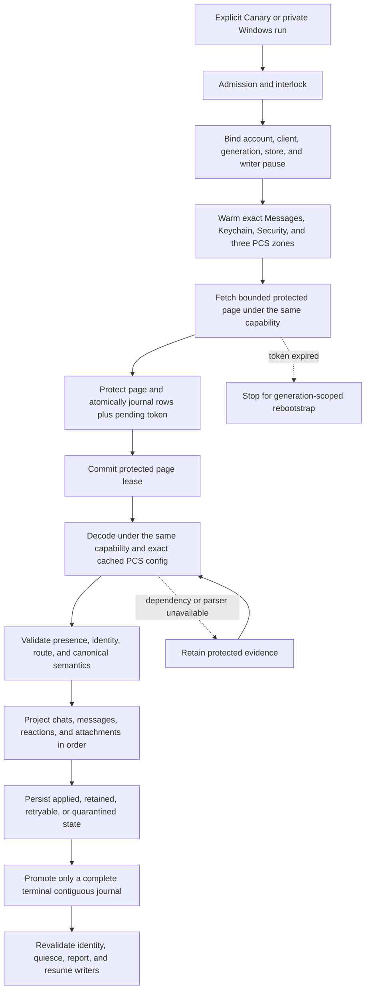
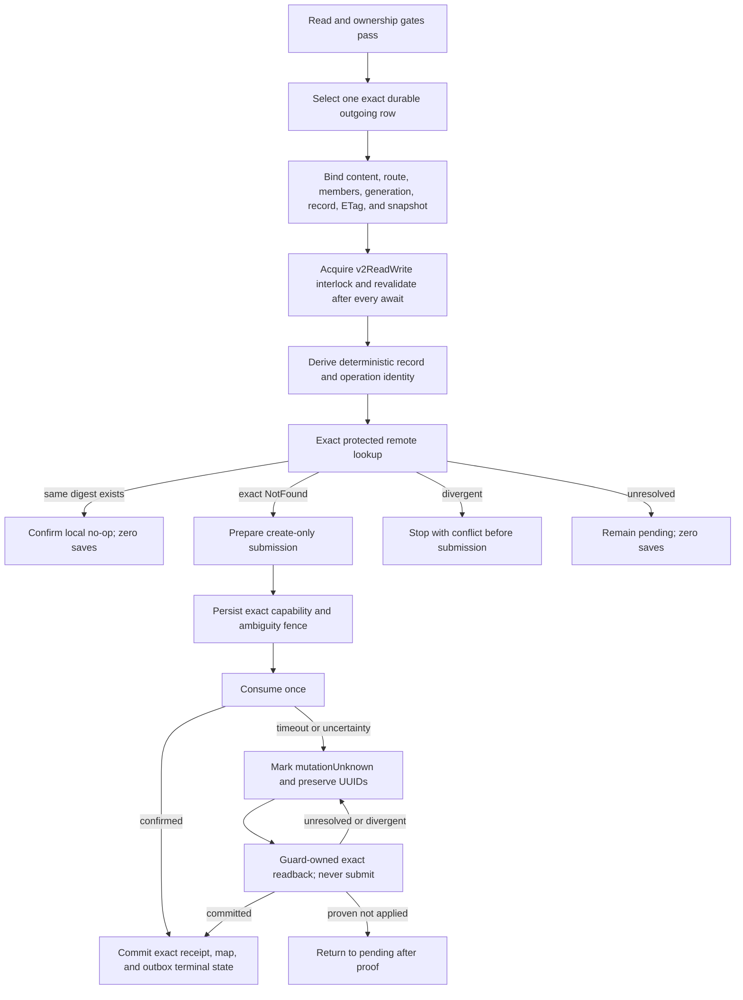

# Cloud Sync V2 current connection treemap

This document is the short operational source of truth. It contains current
architecture, safety rules, qualification state, and the next falsification
test. Dated investigations, obsolete candidates, run-by-run notes, patents,
and historical evidence remain intact in the
[investigation log](cloud_sync_v2/history/CLOUD_SYNC_V2_INVESTIGATION_LOG_THROUGH_2026-09-07.md).
The [bundle index](cloud_sync_v2/index.md) points to both documents and the
current evidence set.

## Decision

Treat Messages in iCloud as a durable replicated log. Remote ingestion and
local projection are separate progress clocks. A successful fetch is not a
successful sync. Undecryptable or temporarily unprojectable records remain
durable repair work and never disappear merely because a later token exists.

Every protected operation must remain bound to one exact tuple:

```text
account fingerprint
  + live CloudMessagesClient identity
  + read-authentication generation
  + protected-store identity
  + native writer-pause permit
  + container/database/zone
  + checkpoint generation
```

If any member changes, fail closed and retain the evidence. Never borrow a
different identity or container, create PCS state from the read path, fall
back to legacy sync, clear a cursor, or continue under a replacement account.

## Status legend

| Status | Meaning |
| --- | --- |
| `LIVE-PROVEN` | A content-free trace exercised the exact boundary on the named platform. Proof does not transfer between platforms. |
| `TEST-PROVEN` | Source-contract or behavioral tests cover the boundary; current-device proof remains. |
| `SOURCE-IMPLEMENTED` | The repair is in the candidate, but full exact-source qualification is incomplete. |
| `IN REPAIR` | A concrete counterexample invalidated the previous candidate. |
| `GAP` | A safe end-to-end behavior is not implemented or needs a product decision. |

## Current candidate

| Item | Current state |
| --- | --- |
| App branch | `agent/cloudkit-v2-sms-chat-contract` |
| Installed Android candidate | Code `e060bcb41` repairs retained-queue scheduling above persisted IDS-proof base `731988a3d` and positive-acknowledgment native base `35551340c`. Pre-proof rows retain version 0 and cannot initiate a new CloudKit save; original envelopes remain recoverable. Prior live Android read proof remains `ad822f37cbf468a6bc74d602965e78ae02a852d1`. |
| Windows candidate | Qualified source `6abbeede2`, manual-write variant: 30 focused Dart and 48 real Rust-DLL codec tests, 380 app Rust and 261 rustpush tests. One-time sender repair succeeded. At 16:20:53Z a fresh direct message was confirmed/admitted and exact-readback proof persisted; restart admitted zero new writes and retained one canonical message. Independent Apple-device display and ordinary Pixel composer convergence remain open. |
| Qualification | GCE `34485566441` passed 2,566 Dart tests plus 14 semantic outbox and 3 evidence-output cases on exact source `7df4fced8`, including the new real ObjectBox manual-selection tests. Cleanup succeeded and both VM and registration inventories were empty. This dart-only run did not build an APK or native Windows binary. Earlier full signed qualification `34444190598` covers installed code `e060bcb41`, not the new patches. Native base `35551340c` passed 377 app Rust and 260 rustpush tests. Live ordinary-send/save/readback remains separate. |
| Main change | Direct and restored-group plaintext admission, IDS receipt recovery, protected reset proof, crash-safe generation rebootstrap, bounded replay, manual read/write gates, and a Canary-only durable Android metadata wake are wired with automatic uploads off. The wake stores only the exact semantic-scope hash, revalidates the live account and safety state in Dart, and cannot invoke the outbound writer. |
| Dependency | `f2e8ea3` adds original-IDS plaintext verification and passed 275 tests in GCE `34529638374`. Only explicit IDS status 0 qualifies; missing intended group targets remain unconfirmed. |
| Prior-source qualification | GCE run `34437410835` fully succeeded for exact source `75440cafc`: full Dart suite, 373 app Rust tests, 253 rustpush tests, 34 protector tests, bridge drift checks, APK/native-library verification, Android JVM tests, trusted signing, and cleanup. This APK lacks the new positive-acknowledgment repair and is not a write-qualified release candidate. Older `fc132e5f8` also has the headless ready-handshake deadlock. |
| Android release proof | The signed `ad822f37c` APK was installed in place with Canary data preserved and Alpha untouched. Its live read-only pull drained the remote head in one pass and finished without an unsafe failure. The final local sweep completed Chats with the exact 476-row durable backlog, kept remote save/delete disabled, and kept outbox `0 -> 0`. Messages and Attachments remain honestly degraded with 1,893 and 1,693 blocking saves respectively. |
| Production claim | Not yet allowed. |

Windows next gate: extend the controlled qualification route to one exact
restored group, then qualify reactions and independent Apple-device visibility.
The September 10 offline Windows inventory found **zero** chats with exactly
the two approved test recipients. Do not select another personal group. The
new request-v3 route binds the entire member set and exact restored group GUID;
its journal/adapter selection passed local qualification (174 focused tests,
including exact adopted-group selection after database reopen). This does not create
groups or bypass the existing protected semantic dependency. Live group proof
needs the approved conversation restored/created first. Direct-reaction work
and attachment integration can proceed independently of that prerequisite.
Current private request `qualification-20260910-03` is claimed: do not change
it or send it again. The runtime is in `../windows-cloudkit-qualified-6abbeede2`;
the older runtime and receipt remain rollback material.

Source `955d8acad` adds exact-group qualification and the native attachment
envelope core, not a functioning attachment uploader. GCE run `34505595606`
passed all 389 native tests on T2D-32 (`app-rust-only`), including nine
attachment-codec cases. Cleanup passed; independent inventories showed zero
VMs and runner registrations. No APK or replacement Windows runtime was requested.

Source `11de45796` with rustpush `f041db67` passed isolated GCE runs
`34508598558` (397 app Rust tests) and `34508602298` (265 rustpush tests).
Both cleanup jobs passed; independent inventories returned zero VMs/runners.
These prove randomized upload-plan recovery and validation components, not an
end-to-end attachment send. Source `da428b635` then passed GCE `34517138488`:
414 app-native tests, bridge reproducibility, and cleanup. Independent inventories
returned zero instances/runners. Source staging, prepared-message validation and
source-bound receipt recovery are qualified components. The current source now
wires composer stage/adopt/commit and exact protected retry reconstruction.
GCE `34521476151` compiled source `4164ea771` and passed 418 app-native tests.
Its only failure was the expected bridge-drift gate; artifact `10170133961`
was reviewed and imported. All 475 cases in the twelve targeted Dart suites
passed against that bridge. Analyzer found zero errors and four pre-existing
brace-style infos. Both cloud instance and runner inventories were empty after
cleanup. Combined source `42647ee3a` passed GCE `34523305646`, including
native tests and bridge reproducibility. Cleanup passed and both inventories
returned zero. The actual CloudKit attachment uploader remains integration work.

Current upload integration separates three states of evidence:
`original IDS source -> durable byte-upload attempt/result -> final record-save
outbox -> exact attachment readback -> parent message dependency`. A new
content-free upload journal adds entity 34 and preserves every prior
entity/property/index definition. Source `78a872dda` passed 419 app-native tests
and bridge reproducibility in GCE `34526397409`; dependency `975015f` passed
269 tests in `34526397036`. Both cleanup jobs passed, with zero VM/runner inventory.
Parent then reproduced and fixed a real journal handoff bug: production IDs
are `op1:<digest>`, not bare hashes. The journal now requires the exact Attachment
initial-create identity; 221 targeted Dart cases passed. A shared Dart/Rust
identity vector and record prepare/readback routes are added in the next
candidate, along with version-2 protected plans retaining original HTTP/operation
UUIDs. Version-1 plans stay readable but cannot invent new upload authority.
Source `d8136c9b9` compiled and passed 428 app-native tests in GCE `34529635517`.
Its expected bridge-drift failure produced artifact `10173280244`; all seven
generated files were manifest/hash-verified and imported. No runtime was built.
Both cleanup jobs passed and independent inventories were empty. Afterward,
parent found the actual canonical-GUID constructor in `rustpush_service.dart`:
initial reflection uses the explicit indexed-part index, or the current rendered
attachment count, not MMCS `part`. The corrected source projects that same
algorithm and rejects duplicate/missing final body references. This later
correction, immutable-source integration and Dart routing await qualification.
Source `04a0d6384` connects the pinned IDS envelope, reflected metadata
and private immutable file to the native upload-plan staging API. It revalidates
the same live account/store/container after preparation; the original randomized
plan must be adopted before upload. Attachment record prepare, consume and exact
unknown-outcome readback now route through Attachment-specific bindings in Dart
and its mutation guard. GCE `34532764241` passed all 441 app-native cases. The
expected bridge drift produced artifact `10174428804`; all seven files were
manifest/hash-verified and imported. The earlier N2D attempt `34532630728` hit
zone capacity exhaustion before compilation. Both cleanup jobs passed; independent
inventories returned zero instances and runner registrations.
The later local candidate atomically admits a completed upload, record mapping
and Attachment-v1 outbox save, then revalidates its upload journal at dispatch.
All 340 cases in eight targeted Dart suites passed against the imported bindings;
the three changed journal/store/test files analyze cleanly. A store without the
exact attachment-upload journal cannot lease these saves. Runtime injection of
that journal and the byte-upload consumer still require integration.
Production byte-upload consumption, protected attempt/result recovery,
runtime final-save handoff and parent wiring remain open. Metadata is derived from
the pinned body's projection, never a caller-supplied GUID guess. Neither
upload success nor a missing record proves
parent-message synchronization.
The known-good local executable is still the qualified `6abbeede2` bundle.

The first September 10 attempt failed on retained IDS credentials before send.
Explicit request-bound sender authentication from the same retained GSA session
then succeeded on `6abbeede2`. It did not reset onboarding or clear CloudKit
state. `setup_push` rewrites saved APS connection material, so the full hardware
file hash is not a hardware-identity comparison. The OS-config fingerprint and
immutable request claim stayed unchanged across the subsequent restart.

Retained Windows exact-source qualification: app `6abbeede2`, rustpush `f33dcac`, pilot
`a2680baac`. GCE app Rust `34497413348` passed 380 tests and rustpush
`34497413071` passed 261. Both cleanup jobs passed; independent inventories
showed zero VMs and zero runner registrations. Neither run built an APK or
accessed Apple credentials. Windows `34497409120` attempt 2 passed in 24m17s
(Flutter compile 945.8s), following one package-download failure before compile.
All 78 bundle files were verified before extraction. Local signing preserved
the vendor ObjectBox DLL, native load/unload passed, and the invalid-launch
marker was observed with zero dummy-profile files. No PC policy was changed.

Offline inspection of the retained September 7 test on a disposable database
copy confirmed one canonical legible message with a valid source binding, but
IDS proof remains version 0 and the exact-readback marker is absent. The
retained confirmed outbox row alone is not full write proof. Source database,
request and claim stayed unchanged; the temporary database copy was removed.
The new September 10 request independently passed all these checks with IDS
version 2, valid source binding, legible text, exact-readback marker and released
receipt. Restart kept those proofs and one canonical message with zero new
admissions. This closes that bounded Windows gate, not full production parity.

Keep native compilation isolated: the local signed `slab` build script remains
blocked by App Control error 4551. No security policy was changed. Targeted
Dart tests work with the matching ObjectBox library on PATH. The approved
cloud budget is $200 through September 15; Apple credentials and message stores
remain local. [Build runbook](WINDOWS_HOST_BUILD_ENVIRONMENT.md) contains setup
and import boundaries; the investigation log retains failed-run evidence.

Installed Canary remains the result of full signed GCE run `34444190598`, app source
`3dc614c9eced02b49f130a2752ce531d9e6aec7a` (code `e060bcb41`): build,
GitHub-hosted signing, and cleanup jobs all succeeded. The signature-verified
APK was installed in place on Canary at 2026-09-09 23:43:18 Pacific; Alpha's
package snapshot and Canary's UID/data directory/first-install time were
preserved. Host preflight verifies artifact identity, not the running Dart
build: `sourceCommitDeviceVerified` remains false. The manual write harness
still needs its runtime-mode check resolved before a controlled remote save.

Latest live observation, 2026-09-10 05:43-05:50 Pacific: two user-triggered
plaintext sends received native confirmations which were journaled. The test
conversation rendered the edited message and the subsequent unsend notice.
This qualifies that local live-send/UI boundary only. No exact CloudKit
save/readback, restart, or independent-device edit/unsend proof was obtained.
The conversation-list preview still displayed the retracted message's text,
an observed stale-preview defect. A semantic pull remained active and was not
restarted. See the current investigation log for timestamps and private
evidence paths. Causal edit/unsend writes remain a gap, not a passed gate.

### What the candidate includes

- Native and Dart compute the same deterministic group-routing digest from the
  canonical group, current raw group ID, service/style, group version, and
  normalized participants.
- Both sides use UTF-8 byte ordering. Exact `urn:biz:<UUID>` participants are
  retained; arbitrary schemes remain rejected.
- Older applied groups can receive a missing digest only through protected
  null-to-non-null projection repair with an otherwise exact snapshot match.
- Restored, nonprovisional group plaintext uses opaque dependency binding tag
  3. It binds generation, owner, aliases, server record, ETag/raw reference,
  latest applied save, and routing digest.
- Direct tag-1 and reaction tag-2 encoders and bindings remain unchanged.
- Provisional group creation, group reactions, group-state mutations, remote
  deletion, and update merge remain closed.
- Exact out-of-scope chat satellites and retained tombstones no longer make a
  valid physical-retention result fail the whole Chats zone.
- Retained message and attachment blockers are counted separately from the
  larger physical backlog. The current live blocker is therefore 3,586 saves,
  not all 10,108 retained rows.
- Content-free Windows inspection proved all 189 native `msgProto` field-2
  wire mismatches are classes 4-7, whose Apple schemas use int64 rather than
  the ordinary message string. The same inspection found five class-3 system
  events. The decoder base `12035ec0c` validates all five variant schemas and retains
  them as `UnsupportedMessageType`; it does not invent projection semantics.
- Existing-history write deferrals report fixed counts for local-chat, snapshot,
  alias, prior-origin, record-map, and tombstone conflicts. The classifier is
  observational only and does not authorize adoption or alter failure precedence.
- Canary ADB control is package-scoped, challenge-confirmed, and read-only by
  default. Host parsing accounts for Android SharedPreferences key prefixes and
  harmless Windows PowerShell native-stderr promotion.
- Receipt discovery keeps only a bounded candidate window in memory and reads at
  most 64 receipts per replay page. Its cursor advances past invalid receipts,
  while leaving later valid receipts discoverable on subsequent pages.
- Startup receipt replay completes before stale-send normalization. The
  ObjectBox startup claim then retains native-confirmation work and clears only
  sends that are proven untracked in the same transaction.
- Canary can register one exact, content-free semantic-scope hash with Android
  WorkManager. Foreground, headless APNs, and network hints coalesce into a
  metadata-only read. The native waiter is bounded to five attempts and eight
  minutes; Flutter-engine readiness is cancellable and bounded to one minute.
  The repaired Dart drain requests cooperative cancellation after five minutes
  and awaits protected quiescence. A native timeout does not prove Dart stopped.
  Engine leases survive waiter cancellation until Dart replies; delayed teardown
  rechecks exact engine identity, active calls, and the idle generation on Main.
  Alpha, Beta, production, media-prefetch, and every outbound lane remain closed.

## Scope and current evidence

| Capability | Status | Remaining proof or work |
| --- | --- | --- |
| Chat and message history | `LIVE-PROVEN` for restored readable history | Qualify sustained incremental sync, restart, and account lifecycle on the release candidate. |
| Reactions on read | `LIVE-PROVEN` for representative records | Continue retaining unavailable parents; qualify current candidate on Pixel. |
| Photos and videos on read | `SOURCE-IMPLEMENTED` after prior live proof | Current source resolves generic and UTI-only image/video records consistently across profile and message surfaces. Pixel must prove HEIC, video, and tap-to-open behavior; GIF data remains preserved but profile animation is not a release requirement. |
| Documents and plugin payloads | `TEST-PROVEN` | Supported documents remain visible, unknown opaque files remain available, and only the exact `.pluginPayloadAttachment` suffix is hidden from profile media/documents without deleting its row. Pixel UI proof remains. |
| Direct plaintext create | `LIVE-PROVEN` for bounded Windows request `qualification-20260910-03` | Positive IDS version 2, exact-readback marker, one canonical legible message and restart with zero new admissions passed. Independent Apple-device display and ordinary Pixel composer convergence remain open. |
| Restored-group plaintext create | `SOURCE-IMPLEMENTED` and exact-source qualified | Perform one authorized live group test with pinned route/binding plus exact readback/restart proof. Provisional group creation remains closed. |
| Write-send provenance | `SOURCE-IMPLEMENTED` | Native positive-acceptance tests pass. Qualify the additive persisted-proof upgrade and dispatch/reconciliation tests. Old deferred/ready intents cannot promote or enter fresh admission without new proof; old adopted pending entries are retained and skipped for new leases. Submission rechecks proof. Exact readback remains allowed and does not retroactively prove IDS acceptance. A fresh v2 native confirmation can requalify the exact unchanged old source without resending it. Automatic uploads remain off pending execution and live proof. |
| Retained writer queue usability | `TEST-PROVEN` | One journal-bound, read-only classifier covers queue drain, queued Chat observation, and preflight. It exempts only pristine pending creates with proof version 0, exact protected envelope/mapping, current owner/generation, no lease, attempt, Apple UUID or receipt. All rows remain counted and fingerprinted; no upload, acknowledgement, deletion, or proof upgrade occurs. GCE passed the real consumer/admission/store regression with a fresh qualified send beside retained work and reopen without duplicate submission. Apple responses are synthetic in this test; live proof remains. Unknown/retried/leased/malformed rows still block. |
| Direct reactions | `TEST-PROVEN` | Live Apple save/readback and independent-reader display remain. |
| Edits and unsends | `GAP` | Require distinct causal mutation and anti-resurrection contracts. |
| Attachment writes | `GAP` end to end; preparation components `TEST-PROVEN` | Protected randomized preparation, completed-asset envelope and stable readback checks passed 397 app-native and 265 dependency tests. Source ownership/GC are being connected to exact IDS descriptors. Actual composer capture, source-bound success, durable upload attempts, record create/readback and parent-message integration remain required. Upload receipt is not record-save proof. |
| Tombstones and deletion | Closed | Define exact ownership and recoverable semantics before enabling any local or remote delete. |
| Token expiry | `TEST-PROVEN` | Live expired-token/restart proof remains. The exact-source path requires an authenticated protected reset proof, releases the semantic read boundary, reacquires the destructive-reset interlock and native pause, advances once, reconciles authority after process death, and replays once. |
| Android background catch-up | `IN REPAIR` | The prior native `ready` handler resumed Kotlin without replying to the Dart call that startup awaited. Current repair acknowledges it, pins each engine until Dart replies, serializes dispatch/disposal on Main, and requests cooperative read cancellation after five minutes. All 89 Android JVM tests and 32 focused Dart tests pass; exact-source APK and Pixel lifecycle proof remain. |
| SMS, MMS, and RCS | Out of scope | Do not add them to this CloudKit V2 release path. |

## Safety gates

These gates are non-negotiable:

1. Bind account, live client, credential generation, protected store, zone,
   checkpoint generation, and writer-pause capability at every external wait.
2. Journal each protected page and pending token atomically before committing
   the native page lease.
3. Project in dependency order: chats, messages, reactions, attachments.
4. Promote a token only across a complete contiguous terminal journal.
5. Keep fetched, retained, and exactly projected progress separate.
6. Keep live IDS/APNs receive readiness independent from archive repair.
7. Admit a write only from an exact durable row and a fresh protected
   dependency binding.
8. Prove exact remote absence before first create. Persist the ambiguity fence
   before consuming a prepared mutation.
9. After submission uncertainty, reconcile by exact readback only. Never
   automatically replay, update-merge, quarantine away ambiguity, or delete.
10. Require an exact protected receipt before committing a record map and
    terminal outbox state together.
11. Preserve Alpha, its hardware identity, its database, and its messages.
12. Keep Windows Smart App Control enabled. Use GCE or a trusted signed
    environment when local policy blocks an executable.

## Explicitly forbidden fallbacks

- Use of a general or write-capable container when semantic read authentication
  is cold.
- Cross-account, cross-client, cross-generation, cross-zone, or cross-store
  authentication and decryption.
- `ZoneSaveOperation`, PCS creation, clique reset, or remote mutation from the
  semantic read path.
- Silent fallback to legacy CloudKit sync.
- Cursor clearing for an unknown, malformed, or inconvenient error.
- Treating `retainedUnprojected` as successful local projection.
- Advancing past an incomplete journal.
- Deleting local rows for read-path tombstones.
- Letting optional CloudKit work delay live message startup or acknowledgment.
- Using GCE as a live Apple client or exporting account, relay, PCS, or device
  identity to CI.

## Read state machine



The durable journal between fetch and projection is the critical cut. It makes
projection repair possible without refetching or losing the exact server
evidence.

## Outbound create state machine



Direct, reaction, and group operations use distinct protected binding tags.
One lane cannot be cast into another. Confirmed replay is readback-only and
must prove zero saves.

### Attachment-write integration boundary

The next vertical slice must connect the existing composer journal to this
entire chain, not merely add an upload validator:

```text
exact attachment descriptor actually sent through IDS
  -> protected descriptor + metadata + one retained record identity
  -> verified original MMCS bytes, exact pinned length
  -> existing account/container + attachment-zone PCS + boundary-key lookup
  -> byte upload, retaining its receipt or unresolved-upload state
  -> create-only CloudAttachment(cm metadata, lqa asset)
  -> exact record readback and confirmed dependency
  -> parent Message with the same attachment references
```

- The Dart staging/admission path still supports only Messages/Chats. The native
  completed-attachment codec passed qualification, but is not an uploader.
  In-progress native integration separates protected pre-upload preparation
  (`outboundAttachmentUpload`) from completed record-create material
  (`outboundAttachment`). Neither grants network permission or parent admission.
- Existing `Attachment.metadata["rustpush"]` stores an MMCS descriptor with
  decryption material at upload-finish, before IDS send success. It is mutable,
  not an encrypted receipt or proof of what IDS sent. Pin the actual wire
  descriptor into protected admission before send, then bind native success to
  it. The v3 receipt now carries the protected source binding, not raw keys or
  descriptors. Composer staging/adoption is still being integrated.
- Do not put the source only inside the IDS receipt: acknowledgment deletes
  that file immediately after durable confirmation, before outbound admission.
  A protected source needs its own durable reference and recovery/GC ownership
  through parent adoption. The additive journal `protectedSourceBinding` field
  now owns that reference independently; old rows remain null and unqualified.
- Re-fetching that pinned MMCS object avoids a second permanent plaintext-byte
  journal and mutable-file reuse. It needs APS/MMCS availability, complete
  target/chunk validation, and the pinned plaintext length. A missing or expired
  object must defer, not substitute a different local file. Chunk integrity and
  length do not validate a guessed CTR key; the key must be the one actually sent.
- Reuse `CloudMessagesPreparedSaveSubmission` for record-save correlation and
  single consumption; the next native candidate supplies typed preparation
  and checked readback without enabling admission. Do not use
  legacy `save_attachments`, which enters generic update-capable saving.
- Legacy `prepare_file` calls `get_boundary_key`, which can create a keychain
  item. V2 lookup must also use keystore `get_secret`, not `ensure_secret`, when
  unwrapping existing boundary material. Keep the DSID and entry under the same
  state lock; a missing key fails without generating either local or remote keys.
- Reuse the outbox dependency mechanism, but extend admission and parent
  encoding together. Current local-send encoding deliberately rejects media.
- Record identity must be persisted before first upload and reused on retry.
  Legacy allocates a random attachment record ID; do not assume the proven
  Message GUID HMAC naming rule also applies to attachment records.
- `prepare_put_v2` randomizes chunk keys, FORD key and IV. Re-preparing identical
  plaintext retains neither the original encrypted descriptor nor its reference.
  Preserve the entire `PreparedPut`, including each chunk's key/signature/length,
  under platform protection before upload. Bind it to the original parent source,
  attachment metadata, full container-issued record identifier and file digest.
  A returned asset must match that exact preparation before record-create staging.
- Upload uncertainty and record-save uncertainty are distinct. Record NotFound
  cannot authorize blind byte re-upload or record-ID replacement.
- Next integration order: protected actual-IDS descriptor ownership in the
  local-send journal; durable pre-upload plan and attempt state; exact completed
  upload adoption; existing create-only record transport/readback; parent message
  dependency and encoding. Do not bypass the missing journal ownership by calling
  the legacy uploader or treating native codec tests as end-to-end qualification.
- Native send preparation is a separate boundary: `IMClient.send` calls
  `MessageInst.prepare_send`, which assigns a new send timestamp and may add
  the sender/conversation GUID. Capturing a Dart-built MessageInst and then
  allowing preparation to mutate it is not proof of the final wire. Integration
  must validate the final attachment descriptors and bind positive IDS success
  to the original source. Prefer an explicit validator for the three known
  preparation changes (timestamp, generated conversation GUID, added self
  participant), with all body/recipient/attachment fields unchanged, if that
  avoids a new two-phase send API. Freezing the prepared submission is an
  alternative, not a prerequisite. Do not ignore arbitrary changed fields.
- Local reflection is another normal transformation: `indexedPartsToAttributedBodyDyn`
  changes attachment GUIDs to `<messageGuid>_<part>` and inserts a space where
  the composer may use an object placeholder. Source identity must bind ordered
  descriptors and actual text/formatting, not these local aliases. Resolve each
  body reference to its exact attachment; do not accept count-only matching,
  unrelated rows, substituted descriptors or changed text. The native protected
  source still pins the actual sent descriptor, independently of local UI IDs.

## Fast qualification loop

Use the cheapest boundary that can falsify the current hypothesis:

```text
source contract or behavioral logic
  -> focused local test when policy allows, otherwise GCE
  -> full exact-source GCE suite and APK build

Apple protocol, PCS, save, readback, or replay behavior
  -> exact-source trusted minimal Windows harness when available
  -> otherwise signed Canary on Pixel

Android registration, ObjectBox/UI, background, lock, or lifecycle behavior
  -> signed Canary on Pixel

cross-device convergence
  -> independent Apple device confirmation
```

Do not rebuild a Canary for every code edit. GCE handles exact-source Dart,
Rust, bridge-generation, identity, projection, and reconciliation tests. The
existing Windows ARM harness is stale relative to the current branch head;
both app and rustpush revisions moved, so its reports cannot qualify the
candidate.
Smart App Control blocks the locally self-signed DLL and Cargo build-script
executables with error 4551 before CloudKit starts. Keep that policy enabled.
Restore Windows hot reload only after a trusted-provider-signed exact-source
minimal harness exists. Credentials and PCS state remain on a private local
profile, never on GCE. Pixel remains the live protocol and final release proof.

Use five promotion lanes and do not skip upward:

1. **Focused local lane:** handwritten Dart contracts and structural guards for
   the changed boundary. It may reject a patch but cannot qualify native Rust.
2. **Fast GCE lane:** `app-rust-only` regenerates and verifies FRB bindings,
   checks the Rust bridge, and runs the app Rust library without Android SDK,
   Gradle, signing, or APK work.
3. **Full GCE lane:** only a promotion candidate runs every Dart/Rust/rustpush/
   protector test and produces the signed, ABI-verified Canary APK.
4. **Windows protocol lane:** exact-source minimal harnesses may falsify Apple
   request, PCS, save, readback, and replay behavior without an APK. They do not
   qualify Android lifecycle or UI behavior.
5. **Pixel release lane:** batch direct send, process-death recovery, group send,
   readback, restart, lifecycle, and UI evidence into as few signed-APK sessions
   as safety permits. Manual Apple-device display remains independent evidence.

The manual-writer Pixel lane now has a host-controlled three-phase gate:
[`pixel_cloudkit_write_gate.ps1`](../tooling/pixel_cloudkit_write_gate.ps1)
and [`vm_trigger_cloudkit_write.dart`](../tooling/vm_trigger_cloudkit_write.dart).
`prepare` establishes V2 ownership locally and returns only a candidate GUID
hash; `run` restarts Canary, reselects that exact hash, and invokes the existing
one-intent production path; optional `verify` restarts again and requires zero
new admissions. Every phase pins the app source and host-tool hashes, takes the
recipient only from a process environment variable bound to a separately
supplied SHA-256, emits content-free evidence, and requires the automatic
worker to be absent. The tooling is test-proven but does not replace live
CloudKit readback or independent Apple-device display.

## Recovery policy

| Failure | Safe response |
| --- | --- |
| Read credential cold or revoked | Warm the in-memory same-account credential, restore the encrypted same-account credential, or perform one bounded refresh. Then require user action. |
| Account or client changes | Stop before projection or acknowledgment and preserve journal, source, and checkpoint. |
| PCS key unavailable | Warm or look up only the exact same-scope zone. Retain the protected record if still unavailable. |
| Network or throttling | Preserve token and evidence, honor bounded retry-after, and retry later. |
| Missing parent or parser | Retain protected evidence and retry projection after the dependency or parser repair. |
| Malformed record | Store a fixed content-free reason and explicit repairability classification. Never guess identity. |
| Process death after fetch | Recover the protected lease, replay the durable journal, and keep the prior token until terminal. |
| Token expired | Stop, require the account-bound protected reset proof, release the read boundary, reacquire the destructive-reset interlock and native pause, advance the exact zone generation once, fence old evidence, reconcile authority after interruption, and replay at most once. |
| Write result unknown | Preserve request and operation UUIDs, protected receipt, and fence. Exact readback is the only next network action. |

## Source-linked boundary map

| Boundary | Primary source | Current status |
| --- | --- | --- |
| Product admission and interlock | [`cloud_sync_manual_semantic_pull_sampler.dart`](../lib/services/rustpush/cloud_sync/cloud_sync_manual_semantic_pull_sampler.dart), [`cloudkit_operation_interlock.dart`](../lib/services/rustpush/cloud_sync/cloudkit_operation_interlock.dart) | Read live-proven; full session replacement qualification remains. |
| Read authentication and exact PCS | [`cloud_sync_production_sampler_adapter.dart`](../lib/services/rustpush/cloud_sync/cloud_sync_production_sampler_adapter.dart), [`cloudkit.rs`](../rustpush/src/icloud/cloudkit.rs) | Exact `ad822f37c` live read-only pull completed; cold/account lifecycle proof remains. |
| Protected fetch, journal, and token | [`native_protected_cloud_sync_transport.dart`](../lib/services/rustpush/cloud_sync/native_protected_cloud_sync_transport.dart), [`objectbox_cloud_sync_store.dart`](../lib/services/rustpush/cloud_sync/objectbox_cloud_sync_store.dart) | Test and prior live proof. |
| Authenticated reset and restart recovery | [`cloud_sync_reset_coordinator.dart`](../lib/services/rustpush/cloud_sync/cloud_sync_reset_coordinator.dart), [`cloud_sync_manual_semantic_pull_sampler.dart`](../lib/services/rustpush/cloud_sync/cloud_sync_manual_semantic_pull_sampler.dart), [`cloudkit_writer_authority.dart`](../lib/services/rustpush/cloud_sync/cloudkit_writer_authority.dart), [`objectbox_cloud_sync_preflight.dart`](../lib/services/rustpush/cloud_sync/objectbox_cloud_sync_preflight.dart) | Exact-source qualified at `0b86a6465`; live expired-token/restart proof remains. |
| Decode and canonical conversion | [`rust_cloud_semantic_decoder.dart`](../lib/services/rustpush/cloud_sync/rust_cloud_semantic_decoder.dart), [`cloud_sync_canonical_converter.rs`](../rust/src/cloud_sync_canonical_converter.rs) | Test and representative live proof. |
| Ordered projection and retained repair | [`cloud_inbox_applier.dart`](../lib/services/rustpush/cloud_sync/cloud_inbox_applier.dart), [`objectbox_cloud_semantic_store_gateway.dart`](../lib/services/rustpush/cloud_sync/objectbox_cloud_semantic_store_gateway.dart) | Read live-proven; current backlog must be explicit. |
| Composer origin, IDS completion, and write admission | [`rustpush_service.dart`](../lib/services/rustpush/rustpush_service.dart), [`cloud_sync_local_send_journal.dart`](../lib/services/rustpush/cloud_sync/cloud_sync_local_send_journal.dart), [`cloud_sync_manual_outbound_canary.dart`](../lib/services/rustpush/cloud_sync/cloud_sync_manual_outbound_canary.dart), [`cloudkit_writer_mutation_guard.dart`](../lib/services/rustpush/cloud_sync/cloudkit_writer_mutation_guard.dart) | Atomic direct/restored-group composer admission, bounded awaited receipt replay, atomic startup claim, protected receipt recovery, and reset-required fencing are exact-source qualified through `0b86a6465`; live Pixel process-death recovery, remote readback, and duplicate suppression remain. |
| Direct and group encoders | [`cloud_sync_local_send_encoder.dart`](../lib/services/rustpush/cloud_sync/cloud_sync_local_send_encoder.dart), [`cloud_sync_outbound_group_binding.dart`](../lib/services/rustpush/cloud_sync/cloud_sync_outbound_group_binding.dart) | Direct live-proven on Windows; group source-implemented. |
| Native create/readback receipt | [`api.rs`](../rust/src/api/api.rs), [`cloud_messages.rs`](../rustpush/src/imessage/cloud_messages.rs), [`chat_create.rs`](../rustpush/src/imessage/cloud_messages/chat_create.rs) | Direct Windows proof; exact-source suite and group live proof pending. |
| Android durable read wake | [`CloudSyncV2Worker.kt`](../android/app/src/main/kotlin/com/bluebubbles/messaging/services/rustpush/CloudSyncV2Worker.kt), [`DartWorker.kt`](../android/app/src/main/kotlin/com/bluebubbles/messaging/services/backend_ui_interop/DartWorker.kt), [`cloud_sync_semantic_drain_controller.dart`](../lib/services/rustpush/cloud_sync/cloud_sync_semantic_drain_controller.dart) | Current ready/lease/budget repair has focused behavioral proof. Prior `fc132e5f8` compilation did not detect the startup deadlock; Pixel lifecycle proof remains. |

## Release gates

### Candidate qualification

- [x] Reset-proof base `7df608af7` passed the full exact-source suite and
  signed-APK path in GCE run `34407071539`, with automatic uploads off.
- [x] Current app code `0b86a6465` reproduced bindings and passed 2,522 Dart,
  359 app Rust, 226 rustpush, 34 protector, and 14 semantic-outbox contract
  tests in run `34414062044`.
- [x] The `0b86a6465` Canary contains every required ARM64 native library and
  is signed on the existing trusted GitHub-hosted signing path.
- [x] Run `34414062044` deleted its VM and deregistered its runner; independent
  inventories confirmed zero remaining runners and zero GCE instances.
- [x] Exact source `fc132e5f8` reproduced 2,542 Dart, 359 app Rust, 226
  rustpush, 34 protector, 14 semantic-outbox, and 3 evidence-output cases in
  run `34423632222`; bindings reproduced and the signed ARM64 Canary contains
  every required native library. Runner and VM inventories both returned zero.

### Read qualification

- [x] Representative chats and readable messages project on Canary.
- [x] Representative reactions and media metadata project without deleting
  unavailable evidence.
- [ ] A cold-start candidate executes authentication, pause, three-zone warm,
  fetch, decode, journal, projection, and token promotion in one process.
- [ ] A second pull is idempotent and reports fetched, retained, and projected
  counts separately.
- [ ] Restart, background/lock, account replacement, and expired-token paths
  preserve evidence and fail closed.

### Write qualification

- [x] Source `6abbeede2` direct plaintext request `qualification-20260910-03`
  has positive IDS version-2 confirmation, a persisted exact-readback marker,
  one canonical legible message, and restart with zero new admissions. The
  earlier pre-repair failure and September 7 weaker proof remain historical
  counterexamples, not substitutes for this fresh observation.
- [x] Host-controlled Pixel prepare/run/verify tooling exercises the existing
  exact-intent production path across fresh Canary processes, rejects candidate
  drift, redacts arbitrary failures, and requires automatic uploads off. Live
  execution against Apple remains below.
- [ ] Confirmed direct replay proves zero saves and independent Apple-device
  display for the release candidate.
- [ ] Restored-group plaintext passes exact-source tests, one authorized live
  group create, exact readback, restart, and independent display.
- [ ] Direct reactions pass live save/readback/restart and independent display.
- [ ] Ordinary composer queue admission atomically commits the first durable
  outgoing Message and state-0 local-send intent. Native IDS success is durably
  recorded before `SendConfirm`; restart recovery promotes it to state 3 and
  acknowledges that receipt only after the ObjectBox commit. Protected staging
  then atomically adopts the intent into the outbox and converges automatically.
- [ ] Attachment write, edits, unsends, and supported tombstone semantics each
  receive an implemented and verified causal/recovery path before full release.

### Production qualification

- [ ] One signed Canary survives foreground/background, lock, reconnect,
  process restart, and account repair without duplicate sends or lost tokens.
- [ ] Current retained backlog is zero or every retained category has an
  explicit non-destructive repair or honest unavailable state.
- [ ] User-visible status distinguishes remote ingestion, projection, media
  materialization, live delivery, and write reconciliation.
- [ ] Scope documentation names supported operations precisely. Initial text
  creation must not be advertised as complete Messages parity.

## Current critical path

1. Connect attachment local origin to the protected upload plan. Extend the
   local-send journal's ownership of the exact native attachment descriptor,
   then add durable upload-attempt/result state, record-create/readback and
   parent dependency. The additive `protectedSourceBinding` field and immutable
   journal adoption now retain the source independently of the acknowledged IDS
   receipt. GC and native lease recovery include it. Source staging and native
   pre-send/prepared-message validation now have an API hook; source-bound v3
   receipt/replay/ack and Dart promotion checks passed native qualification.
   The source candidate now selects attachment identity from the composer,
   journals the pending row, stages/adopts/commits the native source, and passes
   its binding into IDS. Retry reuses the MMCS descriptor and reconstructs the
   original native message, including conversation ordering/profile fields.
   Qualify the new retry bridge; do not rebuild upload material after sending.
   GCE `34517138488` passed all 414 native tests and bridge reproducibility after
   the receipt fix, with the native-seam guard unchanged. The local attachment
   identity now survives reflection aliases and database reopen in journal tests.
   Source staging currently rejects a busy cross-process CloudKit lock promptly
   and retains the pending message without sending. This prevents an untracked
   source but is NOT the final background-read/send UX. Before runtime enablement,
   provide bounded coordination with long reads and prove no starvation or lost
   source, then connect durable upload attempts and parent dependencies.
2. Preserve qualified Windows direct request `qualification-20260910-03` and
   its proof. No additional direct send is needed merely to recheck that result.
   The exact restored-group route is implemented/tested, but no group with the
   approved two test recipients exists in the retained Windows profile. Restore
   or create that approved conversation before live group qualification. Never
   substitute another personal group.
3. Use Windows for direct reactions and subsequent attachment/causal-write
   qualification, preserving exact readback, restart/no-save recovery and
   independent Apple-device display as separate gates. Implement group creation,
   group reactions and supported edits/unsends, not just restored plaintext.
4. Qualify lifecycle P0 before automatic sync: expired-token reset must advance
   exactly once and replay once; a second reset signal must stop. Process death
   must recover prepared or unknown authority without losing old evidence.
   Same-generation authentication may refresh once; account replacement must
   preserve evidence and fail closed.
5. The durable Android metadata entrypoint is under lifecycle repair after a
   concrete ready-handshake counterexample. Requalify it and prove background, lock,
   APNs, reconnect, process restart, bounded retry, and stale-identity behavior
   on Pixel before considering production enablement.
6. Run lifecycle soak and produce one release-candidate report that proves
   identity stability, token continuity, zero duplicate writes, and honest
   retained counts. Complete attachment writes, reactions, edits/unsends, and
   supported group/deletion semantics for the full production goal. Keep each
   unqualified operation disabled during development, not excluded from completion.

## Next falsification test

The isolated Windows direct test and restart passed. Source-only tests passed
randomized preparation restoration, purpose/record separation, changed-source
rejection and completed-asset correlation. Journal source ownership, migration,
GC, admission, reference/lease retention and restored-group regressions passed
398 focused Dart/ObjectBox tests in the final combined run. Native source capture
and a validator for the actual `prepare_send` timestamp/routing changes are now
qualified by GCE `34513911095` on source `8bbffb1ab`: 408 native tests passed,
including all 11 new source cases; cleanup passed. The preceding T2D run failed
before compilation due to zone capacity, so the existing N2D-16 option was used.
The source-bound receipt/API integration passed 414 native tests in
`34517138488`. The next exact-source run must regenerate and qualify the retry
reconstruction bridge and rerun the composer/staging suites. Then connect
positive-IDS proof to the uploader's durable attempt state.
None of these tests alone proves an attachment was sent or saved.
When the approved group is present, falsify exact selection, acceptance by every
intended target, group encoding, readback and restart without resending. Preserve
the direct claim. The inspector must distinguish readable text, positive IDS
confirmation and exact-readback proof.
Then qualify the ready/lease/budget repair with Android behavioral tests and
an exact-source signed APK. Do not install `fc132e5f8` as background-qualified.
Use one batched Pixel session: cold read, idempotent
second read, background/lock/APNs/reconnect, expired-token/restart recovery, and
the authorized direct process-death write test. The write must recover state 3,
adopt exactly one
protected outbox operation, obtain exact CloudKit readback and independent
Apple-device display, and create zero duplicate local or remote records.
Automatic uploads remain disabled during this proof.
Existing-history adoption remains a separate write gate; diagnostic counts
cannot authorize or perform adoption.

## Existing-history adoption evidence gate

Automatic adoption is not safe from the offline checkout alone. For each
queued intent, a content-free live observation must first distinguish the six
`existing_history` categories and prove exactly one current direct-iMessage Chat
owner under the same account, protected store, scope, generation, writer epoch,
and native session. The proof must bind the canonical Chat lookup hash, semantic
snapshot, service-identifier alias, canonical/member record map, latest applied
non-tombstone save, ETag, protected record reference, and payload digest. A
later retained save, tombstone, competing owner, or native `overlaps` /
`incomplete` result remains a defer.

Only after that proof may the production local-send admission seam atomically
re-read the state-1 journal intent and unchanged provisional Message/Chat,
adopt the exact existing relationship, and persist its durable reconciliation
binding under the existing `v2ReadWrite` interlock and auth fence. That
transaction must create no Chat stage, outbox row, record-map mutation, remote
save, merge-update, or delete. Restart must repeat as a no-op; any mismatch must
roll back and leave the intent ready/deferred. A bare Message reparent is not a
fallback because the journal source digest binds the original Chat row and UUID.

## Edit and unsend evidence gate

Apple carries edit history and retracted parts inside the existing message's
`msgProto.messageSummaryInfo` blob (`ec`, `ep`, `otr`, and `rp`). The read path
already validates part-key consistency, monotonic edit revisions, and the rule
that present-but-empty collections are absent rather than an explicit clear.
The legacy `Message.toCloud` already serializes these fields, and generic
`CloudMessagesClient.save_records` is called by `save_messages` for message
updates. Reuse that encoding. Its `SaveRecordOperation::try_new(update=true)`
does not set a predecessor record ETag; it is not evidence of V2-safe causal
conflict handling. V2 transport currently remains initial-create-only.

Do not enable update transport from structural inference alone. First capture
one genuine Apple edit and one unsend read-only, proving the same record name,
the before/after protected system fields and change tag, the complete rewritten
or merged field set, and the resulting `messageSummaryInfo` bytes. Then require
stale-tag refetch and reapply, exact retry identity, and anti-resurrection proof.
Explicit `NOT_FOUND` is not permission to recreate a previously known message.

An older review mentioned a three-file identity scaffold without identifying
its paths. It was not located in the current checkout and must not be counted
as implementation. Historical discussion remains in the investigation log.
