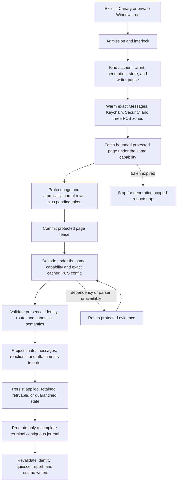
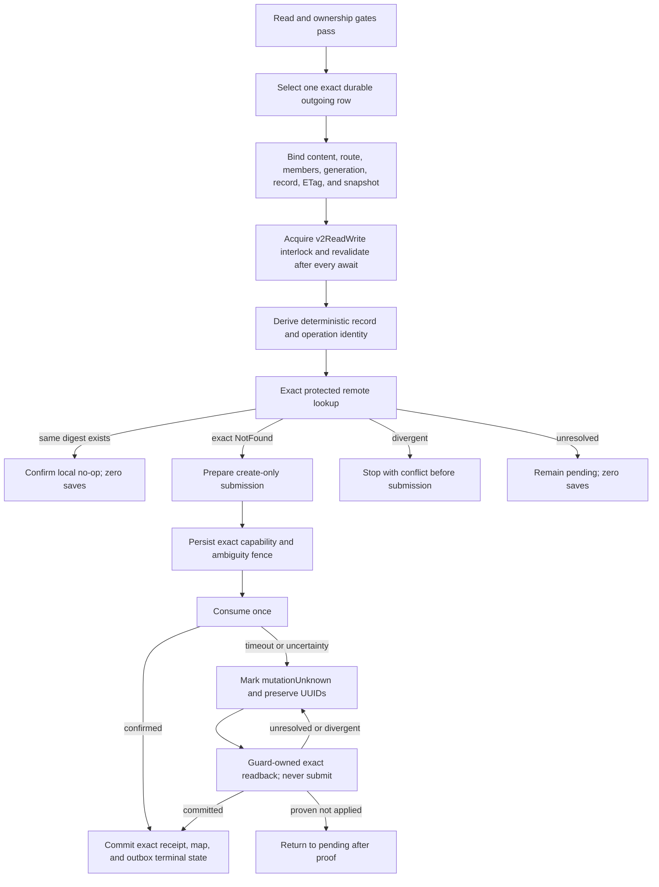

# Cloud Sync V2 current connection treemap

This document is the short operational source of truth. It contains current
architecture, safety rules, qualification state, and the next falsification
test. Dated investigations, obsolete candidates, run-by-run notes, patents,
and historical evidence remain intact in the
[investigation log](cloud_sync_v2/history/CLOUD_SYNC_V2_INVESTIGATION_LOG_FROM_2026-09-07.md).
The [bundle index](cloud_sync_v2/index.md) points to both documents and the
current evidence set.

## Decision

Treat Messages in iCloud as a durable replicated log. Remote ingestion and
local projection are separate progress clocks. A successful fetch is not a
successful sync. Undecryptable or temporarily unprojectable records remain
durable repair work and never disappear merely because a later token exists.

Every protected operation must remain bound to one exact tuple:

```text
account fingerprint
  + live CloudMessagesClient identity
  + read-authentication generation
  + protected-store identity
  + native writer-pause permit
  + container/database/zone
  + checkpoint generation
```

If any member changes, fail closed and retain the evidence. Never borrow a
different identity or container, create PCS state from the read path, fall
back to legacy sync, clear a cursor, or continue under a replacement account.

## Status legend

| Status | Meaning |
| --- | --- |
| `LIVE-PROVEN` | A content-free trace exercised the exact boundary on the named platform. Proof does not transfer between platforms. |
| `TEST-PROVEN` | Source-contract or behavioral tests cover the boundary; current-device proof remains. |
| `SOURCE-IMPLEMENTED` | The repair is in the candidate, but full exact-source qualification is incomplete. |
| `IN REPAIR` | A concrete counterexample invalidated the previous candidate. |
| `GAP` | A safe end-to-end behavior is not implemented or needs a product decision. |

## Current candidate

### Resume checkpoint: September 16, post-build offline work

This checkpoint supersedes older qualification history. Current product source is
`f027aad2a17c131f7d68687ea68f58b334473e8f`; installed Pixel source remains
`710003e7b`. Rustpush remains `5522fa0ced1c1fe7ed70262ac230261889ca06c5`.

- **Media: live-proven for the failed HEIC.** The user confirmed download and
  reopen; production cache restoration verified the authenticated 2,302,773-byte
  body without changing the original 1,048,576-byte metadata.
- **Profile onboarding: implemented and locally tested, not installed.**
  `1e534e48c` adds normal Profile encryption preparation, readiness/progress and
  plain-language failure handling. Legacy-on behavior stays intact. The normal
  background writer still needs its separate public-rollout review.
- **Edit/unsend: in repair.** Pixel attempts failed during mutation preparation
  with `cloudkit_interlock_busy`, before dispatch. A terminated-isolate local
  runtime probe reproduced a retained named-port mapping that denies the next
  owner. This proves the mechanism, not the exact phone owner. Do not reclaim
  the mapping on elapsed time alone or resend an unknown-outcome mutation.
  Candidate `0696757b2` fixes draft/dialog recovery. Candidate `f027aad2a`
  closes admission and drains actual interlocks, retains direct mutation receipt
  tails, and prevents native host teardown until owned work and IPC replies end.
  It passed 33 Dart cases plus eight Kotlin lifetime tests. No Android live proof.
- **Verified APK ready:** GitHub-hosted Build `35058684776` passed, exact
  `f027aad2a`, canary_only=true; Alpha skipped. Artifact10432532324 archive
  SHA256 `27e6279c323de585ec27b1e7baa0457cc125a77369dda20f43ed40105b54b39a`
  matched after download. APK452,999,643 bytes, SHA256
  `d34e72bb78add5f5654adf04e5183cffd8c786bdb5a526ab2a19a424b8e7ab50`.
  Stable Canary v2/v3 signatures, exact package, four ARM64 libraries, no dotenv,
  and the new native lifecycle markers independently pass. Evidence is under
  `build-evidence/github-canary-f027aad-35058684776`; not installed. This workflow
  compiled/packaged the app, not the full Flutter/JVM test suites.
- **Group history: two separate findings.** Alpha contains 27 historical
  messages absent from both qualified Canary and Windows copies; none has a
  cloud-synced flag or message record ID, and Alpha legacy sync was disabled.
  This supports an upload gap, not proof of remote absence. Separately, Canary
  has a restored canonical group row and a newer live-receive row sharing exact
  aliases. Investigate alias-aware routing; never merge by title or membership.
- **Write ambiguity remains.** The latest Canary copy has eight confirmed
  outbox rows and one unknown-outcome row. Reconcile the latter by exact readback
  only. The older unresolved mutation is not one of the user's latest attempts.
- **Incoming archival gap, source-confirmed:** the V2 automatic uploader drains
  only locally sent positive-receipt intents. Incoming and other-device mirrored
  rows have no V2 archive producer; the old all-unsynced uploader is disabled
  under V2 ownership. Full two-way sync requires a separate received-archive
  origin, not weakening outgoing receipt checks. See the
  [implementation boundary](cloud_sync_v2/INCOMING_ARCHIVE_DESIGN.md).
- **Pixel reconnected wirelessly, read-only preflight complete.** September16
  snapshot and both native log generations are saved under
  `device-evidence/20260916-outbox-preflight`. Auth/UI report ready and sync idle,
  but outbox is blocked: eight confirmed rows, one unknown outcome, ten ready
  send intents (one has changed source). Latest worker still reports
  `cloudkit_interlock_busy`. Database three-way SHA256 begins `2ec96eee37ef`;
  source-copy inspection made no device changes. In-place restart/update was
  requested; approval remains pending. No reset, resend or installation.
- **Find My observer: isolated test-qualified, not integrated.** Rustpush
  `576f466ce33ea424ae1f617f750c48b0dea4d938` / app `fe9b9f306` passed hosted
  bridge run `35031241619` (685 app, 332 rustpush, 11 Anisette, 40 protector).
  This does not establish working People coordinates or Items.
- **Resources:** no paid GCE launch without renewed approval; C:29.03GiB free.
  Five reviewed clean agent worktrees were removed with retained Git refs;
  manifest `build-evidence/agent-cleanup-20260915-profile/manifest.json` records
  406,196,141 logical bytes. Sessions/transcripts were retained because supported
  session deletion is unavailable. Current agent work and evidence are protected.

Next: on Pixel reconnect, qualify detached-engine recovery and edit/unsend with
the verified APK in one session, after safe installed-state preflight. Do not reset app data,
enable Alpha uploads, replay the ambiguous outbox, or claim production readiness.

Current work handles after resume:

- Parent integrated the four mutation-UI files and corrected cleanup when an
  error occurs before the dialog's first build. Ten focused tests pass, including
  early failure, a newer dialog, another route and host disposal. Full widget
  file analysis reports pre-existing warnings; no analyzer errors. This is local
  candidate work, not installed or proof of successful backend edit/unsend.
- Parent added unique exact CloudKit alias fallback after existing live GUID and
  guidRefs lookup, restricted to iMessage/non-routing-stub receives. Six real
  ObjectBox routing tests plus 20 existing resolution tests and the ten UI cases
  pass together (36 total). Lookup does not normalize, merge, reparent or mutate
  aliases. It prevents new splits in unambiguous cases; already-split rows retain
  their direct route and still need a separately proven repair.
- Offline three-profile comparison was rerun against hash-qualified temporary
  copies: all 27 Alpha message GUIDs absent from both other stores, all source
  bytes unchanged, zero remote calls. Alpha uploads were not enabled.
  Column-level follow-up confirms the live GUID equals the restored cloudGuid
  but is absent from restored guidRefs. The new fallback addresses that exact
  lookup gap; it still deliberately leaves the already-split rows untouched.
  Additional saved-copy check: the live row's13 messages are all incoming;
  both rows have zero local-send/adopted-send/mutation journal references. This
  is a repair prerequisite only, not permission to merge or proof of every
  canonical/source dependency. A resumed helper returned no report, so parent
  continued this check directly and did not count it as an independent review.
  Follow-up production group-binding validation on copies passes for canonical
  Canary695 and Windows664 (generation1); live Canary701 is provisional and
  fails `cloud_sync_local_send_chat_not_ready`. This validates stored metadata
  bindings only: native protected blobs were not opened and no live write was
  authorized. `Chat.merge` is a UI value merge, not a durable row repair.
- All five reviewed helper tasks are stopped or idle; the final engine reviewer
  and FaceTime/Find My helpers were archived through supported app controls.
  Native agent handles disappeared after the host reload; app status and final
  reports were checked before archival. Unique uncommitted/rejected work and
  evidence remain protected; no session/transcript deletion is supported.
- Noether `01a0a8d7-b079-7dc2-961d-ff7efd9c6400` and Rawls
  `01a0a8f2-4c11-76f0-bff2-b9ad08685326` finished their bounded reviews and
  were closed through native controls; subsequent lookup returns not_found.
  Both isolated worktrees contain uncommitted review material and are retained.
  Session/transcript deletion is unsupported. No agent files were deleted.
- Received-archive eligibility is an unhooked two-file source component, not an
  enabled uploader. Parent fixed outgoing-sender dependence, same-row canonical
  adoption drift and deleted-chat admission. Native-source follow-up corrected
  the helper's mistaken SMS-only interpretation of MessageInst.target: normal
  iMessage also carries a reply-device token. The digest now binds the separately
  captured local recipient, never an inferred current chat default. Thirty-six
  synthetic eligibility tests and 232 existing send/mutation/chat regressions
  pass together (268); focused analysis is clean. Native recipient propagation,
  protected source, durable received intent and Apple-first deduplication are
  still missing. No APK/native change or live received upload is claimed.
- Noether's transport review confirms the standalone Find My probe has no
  normal dispatch loop, while APS has an independent auto-ACK task. Source
  alone does not establish safe server delivery ownership, so no live standalone
  observer is enabled. Cache-only prototype remains isolated, without native
  compile/live qualification. Existing findmy.plist is present; missing bootstrap
  is conditional, not the proven cause of this user's missing coordinates.
- Rawls was briefly resumed for the distinct native-reuse handoff, then reviewed
  and closed again. Both current child handles now return not_found; no helper
  is producing work and no build/test session remains. Unique worktrees and
  transcripts are retained. Do not treat the original isolated prototype as the
  reviewed main revision.
- Parent rejected both first sidecar patches as stale-base duplicate fixes;
  current main already handles empty People handles and exact call-timeout
  ownership. Agents were redirected to current-source native/tester boundaries.
  Initial engine-exit candidate also remains rejected. Parent's smaller actual
  native-retention implementation passed independent review; diagnostic-only
  stall reporting never authorizes teardown or lock takeover.
- Windows baseline session `c936a56175d792b302385e4df76a1f63` completed three
  fresh processes: five fetched/applied changes, then two empty terminal passes;
  outbox stayed 24 and retained total 6,252. Process cleanup is confirmed and
  raw output removed. This matched Dart/native `b9c567f89`, with writes disabled.
  This is an existing-runtime check, not f027 Android qualification. Current
  Dart/native pairing was not relabeled: b9->f027 changes the rustpush gitlink
  for a test-only assertion update and the strict compatibility guard rejects it.
- FaceTime Windows opens an external browser, not the Android WebView/probe.
  There is no newer native call trace. Next approved device call needs both
  diagnostics flags enabled before setup and both bounded native log generations.
- Find My Windows has no IDS receive listener feeding the qualified observer.
  Calling full `FindMyClient.handle` would ACK and mutate share state, including
  possible remote deletes. Do not use it as a read-only diagnostic. A separate
  reviewed receive/observe path and no-message-loss proof are required.

Older qualification rows are preserved in the [September 15 archive](cloud_sync_v2/history/CLOUD_SYNC_V2_INVESTIGATION_LOG_FROM_2026-09-07.md#september-15-historical-qualification-rows-moved-from-treemap). The resume checkpoint above is current.

## Scope and current evidence

| Capability | Established | Remaining |
| --- | --- | --- |
| History read | Fresh Canary visibly restores chats/messages. | Terminal ingestion, actionable retained repair or explained unavailability, repeat/incremental/restart proof. |
| Media/documents/reactions read | Earlier representative live results; current materialization/filtering implemented. | Current Pixel photos, video, transcript GIFs, documents and incremental updates. GIFs need not appear in profile media. |
| Direct writes | Fresh exact-source Windows parent send, edit, unsend and new-process no-submit replay, plus earlier reaction and image protocol results. | Ordinary Pixel composition, restart recovery, group/media cases and independent client display. |
| Incoming/mirrored archival | Local receive persistence works; no V2 automatic archive producer exists. | Separate durable received origin, archive identity/deduplication, protected create/readback and independent-client proof. |
| Groups | Restored-group binding implemented/tested. | Approved two-recipient text, attachments, reactions and supported mutations. No personal group substitution. |
| Edits/deletes | Direct single-part Windows send/edit/unsend, exact CloudKit confirmation/local reflection, terminal retraction and zero-submit restart replay. | Pixel, groups, conflicts, independent display, supported tombstones and mid-flight recovery. |
| Lifecycle | Identity/reset fences and bounded Android worker implemented/tested. | Current background/lock, reconnect, process death, token expiry and account repair. |
| Progress/speed | Card and smaller Regular workload implemented. | Integrated qualification, Pixel UX and measured performance. |
| Newest history first | Local recent-chat admission fixed. | Durable fresh-stream direction plus multi-page/restart/incremental qualification. |
| FaceTime | Lifecycle/layout candidate; offline leave analysis repaired. | Actual two-way media beyond 30 seconds, remote hangup, subsequent and incoming calls. |
| Find My | [Windows service test](FINDMY_ASTRA_20260910.md) reaches the real account and user-confirmed sole shared person. Fresh roster and selected reads return that entry without coordinates. | Native response/secure-location handling, independent UI refresh, Devices/Items inventory and supported per-device actions. No stopped-sharing inference or Items success claim. |
| SMS/MMS/RCS | Excluded by user. | Preserve and label exclusion separately from iMessage failures. |

## Safety gates

These gates are non-negotiable:

1. Bind account, live client, credential generation, protected store, zone,
   checkpoint generation, and writer-pause capability at every external wait.
2. Journal each protected page and pending token atomically before committing
   the native page lease.
3. Project in dependency order: chats, messages, reactions, attachments.
4. Promote a token only across a complete contiguous terminal journal.
5. Keep fetched, retained, and exactly projected progress separate.
6. Keep live IDS/APNs receive readiness independent from archive repair.
7. Admit a write only from an exact durable row and a fresh protected
   dependency binding.
8. Prove exact remote absence before first create. Persist the ambiguity fence
   before consuming a prepared mutation.
9. After submission uncertainty, reconcile by exact readback only. Never
   automatically replay, update-merge, quarantine away ambiguity, or delete.
10. Require an exact protected receipt before committing a record map and
    terminal outbox state together.
11. Preserve Alpha, its hardware identity, its database, and its messages.
12. Keep Windows Smart App Control enabled. Use GCE or a trusted signed
    environment when local policy blocks an executable.

## Explicitly forbidden fallbacks

- Use of a general or write-capable container when semantic read authentication
  is cold.
- Cross-account, cross-client, cross-generation, cross-zone, or cross-store
  authentication and decryption.
- `ZoneSaveOperation`, PCS creation, clique reset, or remote mutation from the
  semantic read path.
- Silent fallback to legacy CloudKit sync.
- Cursor clearing for an unknown, malformed, or inconvenient error.
- Treating `retainedUnprojected` as successful local projection.
- Advancing past an incomplete journal.
- Deleting local rows for read-path tombstones.
- Letting optional CloudKit work delay live message startup or acknowledgment.
- Using GCE as a live Apple client or exporting account, relay, PCS, or device
  identity to CI.

## Read state machine



The durable journal between fetch and projection is the critical cut. It makes
projection repair possible without refetching or losing the exact server
evidence.

## Outbound create state machine



Direct, reaction, and group operations use distinct protected binding tags.
One lane cannot be cast into another. Confirmed replay is readback-only and
must prove zero saves.

### Attachment-write integration boundary

The next vertical slice must connect the existing composer journal to this
entire chain, not merely add an upload validator:

```text
exact attachment descriptor actually sent through IDS
  -> protected descriptor + metadata + one retained record identity
  -> verified original MMCS bytes, exact pinned length
  -> existing account/container + attachment-zone PCS + boundary-key lookup
  -> byte upload, retaining its receipt or unresolved-upload state
  -> create-only CloudAttachment(cm metadata, lqa asset)
  -> exact record readback and confirmed dependency
  -> parent Message with the same attachment references
```

- The Dart store atomically admits completed Attachment-v1 uploads, and the
  runtime byte-upload coordinator and parent-message connection are implemented.
  Live byte upload has succeeded; child/parent record readback remains open.
  Native integration separates protected pre-upload preparation
  (`outboundAttachmentUpload`) from completed record-create material
  (`outboundAttachment`). Neither grants network permission or parent admission.
- Existing `Attachment.metadata["rustpush"]` stores an MMCS descriptor with
  decryption material at upload-finish, before IDS send success. It is mutable,
  not an encrypted receipt or proof of what IDS sent. Pin the actual wire
  descriptor into protected admission before send, then bind native success to
  it. The v3 receipt now carries the protected source binding, not raw keys or
  descriptors. Composer source staging/adoption is connected; whole-runtime
  attachment qualification remains separate.
- Do not put the source only inside the IDS receipt: acknowledgment deletes
  that file immediately after durable confirmation, before outbound admission.
  A protected source needs its own durable reference and recovery/GC ownership
  through parent adoption. The additive journal `protectedSourceBinding` field
  now owns that reference independently; old rows remain null and unqualified.
- Re-fetching that pinned MMCS object avoids a second permanent plaintext-byte
  journal and mutable-file reuse. It needs APS/MMCS availability, complete
  target/chunk validation, and the pinned plaintext length. A missing or expired
  object must defer, not substitute a different local file. Chunk integrity and
  length do not validate a guessed CTR key; the key must be the one actually sent.
- Reuse `CloudMessagesPreparedSaveSubmission` for record-save correlation and
  single consumption; the next native candidate supplies typed preparation
  and checked readback without enabling admission. Do not use
  legacy `save_attachments`, which enters generic update-capable saving.
- Legacy `prepare_file` calls `get_boundary_key`, which can create a keychain
  item. V2 lookup must also use keystore `get_secret`, not `ensure_secret`, when
  unwrapping existing boundary material. Keep the DSID and entry under the same
  state lock; a missing key fails without generating either local or remote keys.
- The attachment-specific local-send path extends outbox admission and parent
  encoding together. The plaintext-only path still rejects media.
- Record identity must be persisted before first upload and reused on retry.
  Legacy allocates a random attachment record ID; do not assume the proven
  Message GUID HMAC naming rule also applies to attachment records.
- `prepare_put_v2` randomizes chunk keys, FORD key and IV. Re-preparing identical
  plaintext retains neither the original encrypted descriptor nor its reference.
  Preserve the entire `PreparedPut`, including each chunk's key/signature/length,
  under platform protection before upload. Bind it to the original parent source,
  attachment metadata, full container-issued record identifier and file digest.
  A returned asset must match that exact preparation before record-create staging.
- Upload uncertainty and record-save uncertainty are distinct. Record NotFound
  cannot authorize blind byte re-upload or record-ID replacement.
- Next integration order: protected actual-IDS descriptor ownership in the
  local-send journal; durable pre-upload plan and attempt state; exact completed
  upload adoption; existing create-only record transport/readback; parent message
  dependency and encoding. Do not bypass the missing journal ownership by calling
  the legacy uploader or treating native codec tests as end-to-end qualification.
- Native send preparation is a separate boundary: `IMClient.send` calls
  `MessageInst.prepare_send`, which assigns a new send timestamp and may add
  the sender/conversation GUID. Capturing a Dart-built MessageInst and then
  allowing preparation to mutate it is not proof of the final wire. Integration
  must validate the final attachment descriptors and bind positive IDS success
  to the original source. Prefer an explicit validator for the three known
  preparation changes (timestamp, generated conversation GUID, added self
  participant), with all body/recipient/attachment fields unchanged, if that
  avoids a new two-phase send API. Freezing the prepared submission is an
  alternative, not a prerequisite. Do not ignore arbitrary changed fields.
- Local reflection is another normal transformation: `indexedPartsToAttributedBodyDyn`
  changes attachment GUIDs to `<messageGuid>_<part>` and inserts a space where
  the composer may use an object placeholder. Source identity must bind ordered
  descriptors and actual text/formatting, not these local aliases. Resolve each
  body reference to its exact attachment; do not accept count-only matching,
  unrelated rows, substituted descriptors or changed text. The native protected
  source still pins the actual sent descriptor, independently of local UI IDs.

## Fast qualification loop

Use the cheapest boundary that can falsify the current hypothesis:

```text
source contract or behavioral logic
  -> focused local test when policy allows, otherwise GitHub-hosted Actions
  -> full exact-source GCE suite and APK build

Apple protocol, PCS, save, readback, or replay behavior
  -> exact-source trusted minimal Windows harness when available
  -> otherwise signed Canary on Pixel

Android registration, ObjectBox/UI, background, lock, or lifecycle behavior
  -> signed Canary on Pixel

cross-device convergence
  -> independent Apple device confirmation
```

Do not rebuild a Canary for every code edit. Use GitHub-hosted jobs for native
compilation and focused local Flutter tests. GCE credits are exhausted and
new paid GCE work requires renewed approval. The established GCE lanes below
remain a reference, not authorization to dispatch them.
Windows ARM64 bundles are built on the isolated GitHub runner and imported
only after archive, native-codec, source/configuration and launch verification.
The retained `6abbeede2` runtime proves its bounded direct write, not newer
attachment code; `3ebcc81c9` must pass import and its own live test.
Local Cargo compilation remains blocked by App Control 4551. Keep that policy
enabled. The verified cloud bundle runs with the existing engineering signing
path when the original ObjectBox vendor DLL is preserved; re-signing that
vendor DLL caused the earlier startup block. Credentials and PCS state remain
local, never on GCE. Windows qualifies protocol boundaries, not Pixel lifecycle
or final Android release behavior.

Use five promotion lanes and do not skip upward:

1. **Focused local lane:** handwritten Dart contracts and structural guards for
   the changed boundary. It may reject a patch but cannot qualify native Rust.
2. **Fast hosted native lane:** bridge qualification regenerates and verifies FRB bindings,
   checks the Rust bridge, and runs the app Rust library without Android SDK,
   Gradle, signing, or APK work.
3. **Full hosted lane:** only a promotion candidate runs every Dart/Rust/rustpush/
   protector test and produces the signed, ABI-verified Canary APK.
4. **Windows protocol lane:** exact-source minimal harnesses may falsify Apple
   request, PCS, save, readback, and replay behavior without an APK. They do not
   qualify Android lifecycle or UI behavior.
5. **Pixel release lane:** batch direct send, process-death recovery, group send,
   readback, restart, lifecycle, and UI evidence into as few signed-APK sessions
   as safety permits. Manual Apple-device display remains independent evidence.

The manual-writer Pixel lane now has a host-controlled three-phase gate:
[`pixel_cloudkit_write_gate.ps1`](../tooling/pixel_cloudkit_write_gate.ps1)
and [`vm_trigger_cloudkit_write.dart`](../tooling/vm_trigger_cloudkit_write.dart).
`prepare` establishes V2 ownership locally and returns only a candidate GUID
hash; `run` restarts Canary, reselects that exact hash, and invokes the existing
one-intent production path; optional `verify` restarts again and requires zero
new admissions. Every phase pins the app source and host-tool hashes, takes the
recipient only from a process environment variable bound to a separately
supplied SHA-256, emits content-free evidence, and requires the automatic
worker to be absent. The tooling is test-proven but does not replace live
CloudKit readback or independent Apple-device display.

## Recovery policy

| Failure | Safe response |
| --- | --- |
| Read credential cold or revoked | Warm the in-memory same-account credential, restore the encrypted same-account credential, or perform one bounded refresh. Then require user action. |
| Account or client changes | Stop before projection or acknowledgment and preserve journal, source, and checkpoint. |
| PCS key unavailable | Warm or look up only the exact same-scope zone. Retain the protected record if still unavailable. |
| Network or throttling | Preserve token and evidence, honor bounded retry-after, and retry later. |
| Missing parent or parser | Retain protected evidence and retry projection after the dependency or parser repair. |
| Malformed record | Store a fixed content-free reason and explicit repairability classification. Never guess identity. |
| Process death after fetch | Recover the protected lease, replay the durable journal, and keep the prior token until terminal. |
| Token expired | Stop, require the account-bound protected reset proof, release the read boundary, reacquire the destructive-reset interlock and native pause, advance the exact zone generation once, fence old evidence, reconcile authority after interruption, and replay at most once. |
| Write result unknown | Preserve request and operation UUIDs, protected receipt, and fence. Exact readback is the only next network action. |

## Source-linked boundary map

| Boundary | Primary source | Current status |
| --- | --- | --- |
| Product admission and interlock | [`cloud_sync_manual_semantic_pull_sampler.dart`](../lib/services/rustpush/cloud_sync/cloud_sync_manual_semantic_pull_sampler.dart), [`cloudkit_operation_interlock.dart`](../lib/services/rustpush/cloud_sync/cloudkit_operation_interlock.dart) | Read live-proven; full session replacement qualification remains. |
| Read authentication and exact PCS | [`cloud_sync_production_sampler_adapter.dart`](../lib/services/rustpush/cloud_sync/cloud_sync_production_sampler_adapter.dart), [`cloudkit.rs`](../rustpush/src/icloud/cloudkit.rs) | Exact `ad822f37c` live read-only pull completed; cold/account lifecycle proof remains. |
| Protected fetch, journal, and token | [`native_protected_cloud_sync_transport.dart`](../lib/services/rustpush/cloud_sync/native_protected_cloud_sync_transport.dart), [`objectbox_cloud_sync_store.dart`](../lib/services/rustpush/cloud_sync/objectbox_cloud_sync_store.dart) | Test and prior live proof. |
| Authenticated reset and restart recovery | [`cloud_sync_reset_coordinator.dart`](../lib/services/rustpush/cloud_sync/cloud_sync_reset_coordinator.dart), [`cloud_sync_manual_semantic_pull_sampler.dart`](../lib/services/rustpush/cloud_sync/cloud_sync_manual_semantic_pull_sampler.dart), [`cloudkit_writer_authority.dart`](../lib/services/rustpush/cloud_sync/cloudkit_writer_authority.dart), [`objectbox_cloud_sync_preflight.dart`](../lib/services/rustpush/cloud_sync/objectbox_cloud_sync_preflight.dart) | Exact-source qualified at `0b86a6465`; live expired-token/restart proof remains. |
| Decode and canonical conversion | [`rust_cloud_semantic_decoder.dart`](../lib/services/rustpush/cloud_sync/rust_cloud_semantic_decoder.dart), [`cloud_sync_canonical_converter.rs`](../rust/src/cloud_sync_canonical_converter.rs) | Test and representative live proof. |
| Ordered projection and retained repair | [`cloud_inbox_applier.dart`](../lib/services/rustpush/cloud_sync/cloud_inbox_applier.dart), [`objectbox_cloud_semantic_store_gateway.dart`](../lib/services/rustpush/cloud_sync/objectbox_cloud_semantic_store_gateway.dart) | Read live-proven; current backlog must be explicit. |
| Composer origin, IDS completion, and write admission | [`rustpush_service.dart`](../lib/services/rustpush/rustpush_service.dart), [`cloud_sync_local_send_journal.dart`](../lib/services/rustpush/cloud_sync/cloud_sync_local_send_journal.dart), [`cloud_sync_manual_outbound_canary.dart`](../lib/services/rustpush/cloud_sync/cloud_sync_manual_outbound_canary.dart), [`cloudkit_writer_mutation_guard.dart`](../lib/services/rustpush/cloud_sync/cloudkit_writer_mutation_guard.dart) | Atomic direct/restored-group composer admission, bounded awaited receipt replay, atomic startup claim, protected receipt recovery, and reset-required fencing are exact-source qualified through `0b86a6465`; live Pixel process-death recovery, remote readback, and duplicate suppression remain. |
| Direct and group encoders | [`cloud_sync_local_send_encoder.dart`](../lib/services/rustpush/cloud_sync/cloud_sync_local_send_encoder.dart), [`cloud_sync_outbound_group_binding.dart`](../lib/services/rustpush/cloud_sync/cloud_sync_outbound_group_binding.dart) | Direct live-proven on Windows; group source-implemented. |
| Native create/readback receipt | [`api.rs`](../rust/src/api/api.rs), [`cloud_messages.rs`](../rustpush/src/imessage/cloud_messages.rs), [`chat_create.rs`](../rustpush/src/imessage/cloud_messages/chat_create.rs) | Direct Windows proof; exact-source suite and group live proof pending. |
| Android durable read wake | [`CloudSyncV2Worker.kt`](../android/app/src/main/kotlin/com/bluebubbles/messaging/services/rustpush/CloudSyncV2Worker.kt), [`DartWorker.kt`](../android/app/src/main/kotlin/com/bluebubbles/messaging/services/backend_ui_interop/DartWorker.kt), [`cloud_sync_semantic_drain_controller.dart`](../lib/services/rustpush/cloud_sync/cloud_sync_semantic_drain_controller.dart) | Current ready/lease/budget repair has focused behavioral proof. Prior `fc132e5f8` compilation did not detect the startup deadlock; Pixel lifecycle proof remains. |

## Release gates

- [x] Prior APK source 6f778c99 passed full GCE 34741584069 and signing verification (not installed).
- [x] That run completed cleanup; later GCE inventory was empty.
- [x] Fresh Canary visibly projects readable chats/messages.
- [x] Source-specific Windows text/reaction/image checks and direct single-part send/edit/edit/unsend, exact echoed history/retraction, completed restart.
- [x] Exact source `78d0f8cf2` passed full integrated GCE qualification, package/native verification, Android JVM tests and GitHub-hosted signing (34983806715).
- [x] Install that exact signed hash on Pixel in place without touching Alpha; package, version, certificate and retained state verified.
- [ ] Complete remote history and classify/repair actionable retained saves.
- [ ] Repeat with stable cursors, no duplicates and readable media/documents.
- [ ] Pause/resume, background/lock, reconnect, cold restart and token/account recovery.
- [ ] Ordinary Pixel send through IDS acceptance, durable admission, CloudKit save/update,
  exact readback and independent client display.
- [ ] Restart reconciliation with zero duplicate IDS/CloudKit operations.
- [ ] Approved group text/attachments/reactions and supported mutations.
- [ ] Pixel/group mutation chains, mid-flight conflict/unknown-outcome recovery and deletion semantics.
- [x] Newest-history bootstrap source implementation with direction durably bound before request one, existing cursors preserved and exact app-Rust qualification (GCE 34982392496, 682/682).
- [x] Full exact-source GCE packaging/signing qualification for newest-history bootstrap (34983806715).
- [ ] Pixel multi-page, restart, cancellation and incremental-follow-up qualification for newest-history bootstrap.
- [ ] Accurate status for fetched, projected, retained, media and outgoing reconciliation.
- [ ] Measured Regular/Turbo behavior, then real FaceTime call qualification.
- [ ] Find My People location retrieval and ongoing/stale-location behavior with the user's confirmed sharing intact.
- [ ] Find My Devices/Items inventory and supported per-device actions, including correct behavior while CloudKit reads pause native writers.
- [ ] Document supported operations and limitations. No upstream draft until user confirmation.

## Current critical path

1. Preserve the verified f027 APK/manifest from successful build35058684776.
   Wait for the Pixel connection and inspect installed identity/state. No
   installation while its owner is busy; an idle snapshot is not an atomic lease.
2. Batch Pixel qualification: Profile encryption/read progress, actual host
   detach during work, reopen without a stranded lock, ordinary approved test
   send/edit/unsend, exact readback and no-submit restart replay. Preserve Alpha.
3. Reconcile the existing ambiguous Canary outbox by readback only. Preserve
   older Windows epoch-2 mutations; current epoch-18 authority cannot rebind them.
4. Prove a repair for already-split group rows independently of the new routing
   prevention. Determine upload availability for Alpha-only history before
   calling its absence a download regression. Never merge by name or membership.
   Add received-message archival as a distinct production lane; an empty local
   journal is not proof of remote absence or a reason to forge send receipts.
5. Close supported group/media/conflict and independent-device display gates,
   plus normal Profile/public writer readiness. Keep current read direction,
   receipt integrity, carrier exclusions and retained-data safety unchanged.
6. Use genuine Android media traces for FaceTime and a reviewed receive-only
   observation boundary for Find My. Neither Windows external-browser launch,
   synthetic observer tests nor absent coordinates prove those products work.

Detailed September 15 wire, installation, retained-record and media evidence is preserved in the [investigation log](cloud_sync_v2/history/CLOUD_SYNC_V2_INVESTIGATION_LOG_FROM_2026-09-07.md#september-15-detailed-evidence-moved-from-treemap).

## Current ownership and continuation rules

- `cloud_sync_extension_metadata.rs` is the pure JSON/schema boundary shared by
  the canonical DTO, archive decoder and protector harness. Keep it independent
  of rustpush/IDS/network code. New metadata fields require both app and harness
  qualification; do not stub the harness to satisfy compilation.
- New projector failure literals require the exact reviewed vocabulary and
  safe-error tests. The Windows lane now includes these downstream checks.
- Parent owns account operations and integration. Current job and helper status
  is in the resume checkpoint. Prior experiments and launch IDs are historical
  evidence, not running work.
- Windows session c936 is closed with process cleanup confirmed. GitHub build
  35058684776 and its watch session19890 completed successfully. No build is
  running. Do not dispatch a duplicate or weaken source compatibility for a DLL.
  Preserve exact bundles, receipts, bounded aggregates and rollback evidence.
- Preserve the qualified DLLs, source manifests and rollback evidence. Current
  generated bindings already include extensionMetadataJson; a metadata JSON
  schema change inside that string is not a new FRB ABI by itself.
- Version-2 extension context separates wire session identity from the archive
  UUID. Base/predecessor ownership, chat/provider and timestamps are validated.
  Late-content repair is atomic and paged; attachment owners are never moved.
- Do not rebuild or install an APK for Dart-only Windows qualification. An actual
  native/ABI change needs its matching cloud-built, separately verified runtime.
- Follow AGENTS.md before compaction: reconcile docs, review agents and preserve
  exact resume handles. Do not restart a job solely after a polling timeout.

## Existing-history adoption evidence gate

Automatic adoption is not safe from the offline checkout alone. For each
queued intent, a content-free live observation must first distinguish the six
`existing_history` categories and prove exactly one current direct-iMessage Chat
owner under the same account, protected store, scope, generation, writer epoch,
and native session. The proof must bind the canonical Chat lookup hash, semantic
snapshot, service-identifier alias, canonical/member record map, latest applied
non-tombstone save, ETag, protected record reference, and payload digest. A
later retained save, tombstone, competing owner, or native `overlaps` /
`incomplete` result remains a defer.

Only after that proof may the production local-send admission seam atomically
re-read the state-1 journal intent and unchanged provisional Message/Chat,
adopt the exact existing relationship, and persist its durable reconciliation
binding under the existing `v2ReadWrite` interlock and auth fence. That
transaction must create no Chat stage, outbox row, record-map mutation, remote
save, merge-update, or delete. Restart must repeat as a no-op; any mismatch must
roll back and leave the intent ready/deferred. A bare Message reparent is not a
fallback because the journal source digest binds the original Chat row and UUID.

## Edit and unsend invariants

- Message history/retractions live in the existing message's summary fields
  (`ec`, `ep`, `otr`, `rp`). Revision indexes are payload-local, not global clocks.
  Displayed body and history must remain one compatible snapshot.
- Retractions are monotonic for the exact owned message. Older history cannot
  overwrite newer text or resurrect an unsent message. Unknown parts and
  incompatible histories remain retained; never flatten unsupported bodies.
- Patch retained summary/plist/protobuf values and preserve unknown fields.
  Do not rebuild an existing record with the lossy legacy Message.toCloud path.
  Native message patching changes only the intended field spans.
- Conditional updates bind the exact predecessor record and ETag. Persist the
  mutation intent, prepared time/source, positive IDS receipt, reflection and
  request identity before submission. Unknown outcomes reconcile by readback;
  they do not authorize a retry, recreation, or overwrite.
- A completed edit can provide read-only predecessor evidence for a later mutation
  only when its exact reflected history and confirmed operation/map still match.
  The previous source remains terminal. New mutations have distinct identities.
- Current direct Windows chain/readback/restart proof is in the candidate table.
  It does not establish independent recipient rendering, group behavior, ordinary
  Pixel capture, or all interruption points.

The superseded implementation chronology, wire-experiment details and older
qualification commands are preserved verbatim in the
[historical treemap tail](cloud_sync_v2/history/TREEMAP_PRE_MULTIPART_2026-09-13.md).
