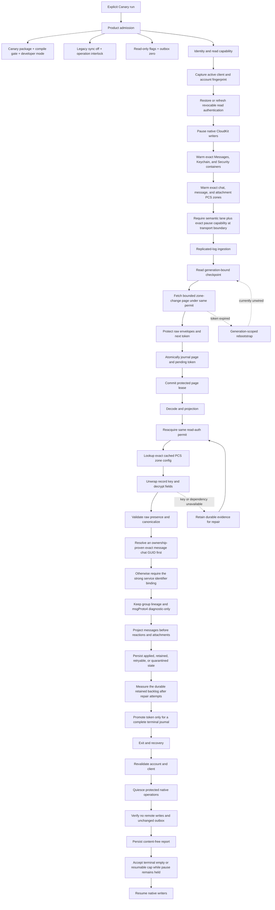
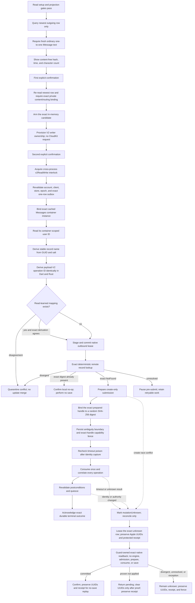
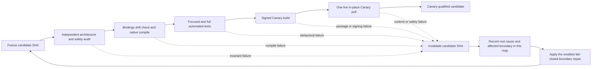
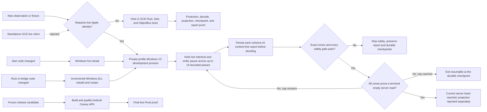

# Cloud Sync V2 connection treemap and recovery state machine

## Decision

Treat Messages in iCloud as a durable replicated log whose ingestion is
separate from local message projection. A successful network fetch is not a
successful sync, and an undecryptable or temporarily unprojectable record must
not disappear merely because a later CloudKit cursor exists.

Every protected operation in one run must remain bound to the same tuple:

```text
account fingerprint
  + live CloudMessagesClient identity
  + read-authentication generation
  + protected-store identity
  + native writer-pause permit
  + container/database/zone
  + checkpoint generation
```

If any member changes, the run fails closed. It must not borrow another
container, create PCS state, fall back to legacy sync, clear a cursor, or
continue under a new account.

## Status legend

| Status | Meaning |
| --- | --- |
| `LIVE-PROVEN` | A content-free report or device trace has exercised the boundary on the Pixel. |
| `TEST-PROVEN` | Focused source-contract or behavioral tests cover the boundary, but current-device proof is incomplete. |
| `REPAIRED; LIVE PROOF PENDING` | Source contains the intended repair; generated bindings, signed APK, or device proof remains. |
| `IN REPAIR` | A concrete counterexample invalidated the prior candidate and the replacement has not passed every gate yet. |
| `GAP / POLICY DECISION` | The safe behavior is not wired end to end or needs an explicit product decision. |

## Latest integration checkpoint, 2026-09-06

### Production scope, clarified by the user

The completion target covers both reads and writes and the application features
backed by Messages in iCloud. A single text create is a qualification step, not
a smaller substitute for that target. SMS/MMS/RCS remain outside the earlier
agreed iMessage scope; do not silently add them back or discard iMessage features.

| Capability | Current evidence / explicit remaining gap |
| --- | --- |
| Message history and conversation projection | User has observed restored readable chats; sustained incremental/restart behavior must be qualified on the release candidate. |
| Photos, video, GIF and documents | Photos and video playback are user-confirmed. Installed `dcef0e9bf` automatically fetched three gallery attachments after navigation/scrolling without card taps. One HEIC still fails exact-size validation. GIF support is explicitly deferred; attachments are preserved, not deleted or hidden. Each media surface/type still needs user-facing validation, not metadata-only success. |
| Chat-first ordinary text writing | Installed `98772e7d2` still deferred after native confirmation. The local tombstone-only admission repair below passes the complete 1,722-test CloudKit suite; it is not installed or live-write qualified. Windows inspection proves 81 retained deletions plus 44 unresolved Chat saves, which remain blocking. |
| Reaction, edit/undo and attachment writing | Not production-ready: `rust/src/cloud_sync_outbound.rs` intentionally admits only plain iMessage text; `CloudSyncLocalSendIdentity.capture` also rejects those forms. Requires actual encoders, ownership/conflict/retry semantics and cross-device proof, not gate removal alone. |
| Conversation/group state | Existing canonical adapter supports versioned participants and presentation fields; direct Chat creation does not qualify group mutations, group photos or all conversation state. |
| Deletion/tombstone and recovery | `ObjectBoxCanonicalSemanticEntityAdapter.applyTombstone` currently rejects incomplete identity DTOs, and native transport is create-only. Needs exact entity ownership and recoverable semantics before any deletion is enabled. Never test deletion against Alpha history. |
| Ongoing sync and account lifecycle | Missing automatic writer setup is repaired and installed in `463a19881`; fresh logs and a stable database now prove V2 ownership and worker readiness. Automatic save/readback remains unverified. Native send callbacks have a pre-journal process-death gap. Background/foreground transitions, account repair, expiry, restart, unknown outcomes and multi-device convergence remain release gates. |

### Conversation Documents list: internal payload classification repaired locally

The reported Documents list exposed files ending in `.pluginPayloadAttachment`
as downloadable/openable user documents. `GetChatAttachmentOverview` classified
all non-image/video attachments as documents, while `UrlPreview` separately
consumes these internal attachments. This is a presentation classification
defect, not evidence that ordinary PDFs or DOCX contents are corrupt.

The local repair filters only that exact case-insensitive extension from the
overview before document limits. It does not delete, modify, or unlink source
attachments, alter sync, or change preview loading. Real documents from the
same message, unknown file types and filename substring lookalikes remain
visible. Four characterization failures reproduced the defect before the fix;
all five new real-ObjectBox cases and the related gallery/auto-download/MIME
checks now pass, 35 tests total. Source repair only, not yet in an installed
APK. Include it in the next qualified candidate rather than a separate rebuild.

### Current installed write test: not passed, investigate before rebuilding

At 13:14:51Z, installed `98772e7d2` emitted `SendFinished` and journaled native
send confirmation. At 13:14:52Z, the automatic upload pass reported admitted=0,
deferred=1, outboxBlocked=false, chatReadbackPending=false, with
`messages_cloud_tombstone_projection_unavailable`. At 13:15:02Z, deferred=2
with the same code. This is a successful native-send handoff, not a successful
CloudKit write. Full CI success did not qualify this live history shape.

The current Chat-create guard deliberately still requires fully projected Chat
history. Two focused real-ObjectBox tests now assert the exact retained Chat
save and tombstone failure codes, and both pass before staging any upload.
Those tests establish a possible cause, not the identity of this device's
blocking zone. Do not remove the guard or claim a zone-specific diagnosis from
the shared error string alone.

The first current capture changed during transfer and is unqualified. Canary
was then force-stopped for a consistent capture, without clearing data or
touching Alpha. Subsequent transfers timed out or lost ADB connectivity. All
failed captures remain unqualified and must not be inspected. Reconnecting to
the observed wireless endpoint also timed out. No further send is needed yet.

Next: obtain a capture with matching device-before, device-after and local
hashes. The offline upload inspector now emits content-free checkpoint/zone
status counts and ready-source Chat-route flags. Use that evidence to identify
the exact dependency, update this board, and select the smallest repair before
another APK. Do not relabel retained rows as applied, erase tombstones, reset
cursors, or replay the explicitly excluded unsent origin to make the test pass.

### Remote log export follow-up, September 6

The user supplied Dart/native log exports while away. Direct private downloads
were hashed and the ZIP inspected in memory. The latest Dart log contains 313
upload-pass reports from 08:05:53Z through 18:53:36Z, all admitted=0 and all
deferred with `messages_cloud_tombstone_projection_unavailable`. There are
213 one-origin and 100 two-origin deferrals. These are local admission checks,
not 313 remote saves. The worker is running, but admission has not succeeded.

Eight verbose semantic reports exist across the archive; none is from
September 6. The latest internal report timestamp is September 5, 07:06:17Z,
build `6517f86612a0cf229f2ab8dbc56cf9b70928e182`. Its retained Chat backlog is
476: 81 tombstones, three `unsupported_service` blocking saves, and 392
explicitly out-of-scope service saves. This supports the offline contract
counterexample below, but these historical counts are not a qualified current
database snapshot or proof of the exact current admission route. Clearing
tombstones alone would not resolve the other retained Chat categories.

The local-day attachment log records 19 successful downloads and one
`cloud_attachment_size_mismatch` at 08:16:49Z. After the newest candidate's
approximately 13:08Z installation boundary it records six successes and no
fetch errors. Neither event counts nor native WARN-level successful MMCS
validation diagnostics substitute for visible media validation. Keep size and
integrity checks intact; earlier-build errors must not be attributed to the
new candidate without reproduction.

Two unhandled optional chat-screen checks at 13:15:02Z and 13:15:03Z use a
stored sender handle no longer recognized by the current account. The paths
are `ChatManager.setActiveChatSync` and conversation-details initialization;
the header's FaceTime check catches the same failure. Queue guarded optional
initialization and explicit stale-sender handling. Do not silently change
sending identity or reset the account. The export's `6005` warnings are from
September 5, not new registration failures. Alpha remains untouched.

### Offline cross-boundary reproduction and revised repair plan

Two added cases run the real `CloudSyncEngine`,
`TransactionalCloudInboxApplier`, ObjectBox semantic gateway and journal-bound
Chat admission with synthetic transport/auth only. A Chat deletion is fetched
and retained without decoding its identity. The fetch token advances, the
exact-applied floor stays zero, and the reader correctly reports
`retained_projection_incomplete`. A second empty read does not resolve it.
Fresh-chat admission then rejects with the same tombstone code; reopening the
database preserves that result. The full Chat-origin file passes 75 tests.
This proves the read/write contract mismatch for this input, not that the
unavailable current device snapshot contains that input.

```text
read-only Chat tombstone -> durable retained record -> fetch continues
                                  |
                                  v
new-send Chat admission requires all Chat rows applied -> deferred
```

A bounded independent review initially proposed resolving every tombstone to
a recipient. Parent review rejected that as a universal prerequisite: a deleted
record never previously seen may have no recoverable recipient identity. A
new, explicitly native-confirmed send can justify a new conversation shell;
it must not justify replaying any deleted message or old operation. The reviewer
accepted this distinction. Preserve record/history no-resurrection, not an
unintended rule that a recipient can never be contacted again.

Simply relaxing the guard remains insufficient. The current semantic gateway
binds one server record to one logical Chat key and rejects a second record
with `semantic_record_mapping_conflict`. The canonical adapter also rejects
conflicting recipient aliases. A local success followed by a duplicate-record
readback conflict would be another regression, not a working writer.

Initial repair order (superseded by the narrower September 6 repair below):

1. Characterize authenticated duplicate direct-Chat records, their per-record
   provenance, and alias ownership. Keep group/SMS behavior unchanged.
2. Define a record-aware direct-Chat membership/merge path. Retiring an older
   record must not remove a newer shell or its new messages. Preserve exact
   replay and unknown-outcome recovery, including concurrent-device cases.
3. Only then make new-send admission independent of unrelated retained
   tombstones. Pending/unknown live Chat saves and observed deletions of the
   exact new target still require explicit handling. Never relabel old rows,
   reset generations, or clear history to manufacture readiness.
4. Qualify one installed native-confirmed send through Chat readback, Message
   readback, restart and a zero-extra-save retry. Keep the excluded unsent
   origin excluded. Do not call current writes production-ready.

### Windows write fast loop: use now for contract repair

The user requested Windows-based progress while the Pixel is unavailable.
The existing Windows app harness has read, drain, attachment and projection
viewer operations, not a live-write operation. Its launcher does not opt into
outbound writing, and `CloudSyncDevGate.isCanaryRuntime` remains Android-Canary
only. Do not call a successful Windows read an outbound qualification or bypass
this fence by pretending Windows is Android.

For the present Dart/ObjectBox blocker, the existing Windows Flutter test
runner already exercises the production admission, canonical projection and
transactional persistence classes without an APK or native application
rebuild. Measured September 6: the 75 Chat-origin tests passed in 10.86 seconds
including startup. Six new direct-Chat readback characterization cases passed
in 7.22 seconds; the combined 143 origin/gateway tests passed in 9.25 seconds.
These are local offline tests with synthetic transport/authentication, not
Apple acceptance or device UI proof.

The new cases use the semantic persistence lane, real transient identity
registry, real canonical adapter and real ObjectBox gateway. They establish
the same results before and after reopening the database:

- An updated version of the same server record projects successfully and
  preserves the existing Chat and linked Message.
- A second server record claiming the same logical Chat fails with
  `semantic_record_mapping_conflict`.
- A different logical Chat claiming the existing direct recipient alias fails
  with `canonical_chat_alias_conflict`.
- Both failures roll back record maps, snapshots, replay state, ownership and
  checkpoints, leave the second inbox row pending, and create no outbox entry.

The negative cases document the current limitation, not desired permanent
behavior. They convert the predicted next readback regression into a repeatable
counterexample. Broader admission of unresolved saved Chats must handle
legitimate per-record provenance and direct-chat convergence. The narrower
tombstone-only exception below does not admit those saved Chats. Keep record
identity collisions and cross-account/recipient mismatches rejected. Full
native/CI qualification and a controlled live save/readback still follow the
offline repair; use the Pixel for final installed-app/background behavior.
No real profile, credentials, messages or retained device capture was opened
or mutated in this test pass. No APK or GCE build was launched.

### Windows live-write authorization and profile preflight

The user now explicitly authorizes testing CloudKit writes on their account
through the Windows fast loop. The existing restriction to the previously
authorized test number remains; no Alpha changes, remote/local history
deletion, or broad replay is authorized by this test. Authorization is no
longer a missing prerequisite. Keep the recipient in private test inputs.

The isolated Windows profile is present and its signing certificate has a
private key and is unexpired. The previous runner executable and native DLL
are absent from this checkout's Debug output, so a live launch needs a rebuild.
No OpenBubbles process was running at the inspection checkpoint. Credential
files were checked for presence only; current Apple authentication was not
exercised and must not be described as verified.

A fresh offline inspection held the original Windows `data.mdb` open with
read-only sharing, inspected a disposable copy, and compared the original's
SHA-256 before/after. The source was unchanged. Inspection took 11.83 seconds.
The current saved Windows profile reports:

| Semantic zone | Fetched sequence | Contiguous applied sequence | Applied rows | Retained rows |
| --- | ---: | ---: | ---: | ---: |
| Chat | 793 | 1 | 668 | 125 |
| Message | 18992 | 4 | 12258 | 6734 |
| Attachment | 3626 | 0 | 2237 | 1389 |

All three checkpoints have generation 1, no pending batch/token, no error
category, and no retry backoff. The applied sequence is a contiguous prefix,
not the count of visible or successfully projected rows. These are current
saved Windows-profile measurements, not a new Apple fetch or Pixel snapshot.

Parent review accepted a bounded source audit: reuse
`CloudSyncProductionOutboundCanaryAdapter` for the controlled writer rather
than calling Android-only service wrappers or supplying test overrides. But
its journal-free manual admission still requires complete three-zone
projection. An already mapped Chat and a synthetic fresh Message do not
qualify for the separate native-confirmed local-send exception. This profile
therefore cannot pass the existing manual admission contract. Do not launch
a knowingly ineligible write or fabricate a native-send journal receipt.

The audit also identified a repeat-loop limitation: manual fresh preflight
requires an empty outbox, while confirmed audit rows remain after no-save
replay. Keep those receipts; any repeated manual harness must explicitly
select/reconcile its exact operation instead of deleting evidence to re-arm.

No writer was provisioned, no account was reset, and no remote save or send was
attempted in this preflight. The prior six-case record/alias counterexample
remains a prerequisite for admitting unresolved saved Chats, not for the
narrower tombstone-only exception below. Once the applicable repair and
genuinely new-operation provenance are qualified, use one pinned
plain-text operation, initial-owner-only provisioning, protected exact
readback, and no-save replay. Leave automatic uploads off in the diagnostic
Windows composition. Do not claim a live-write result from these checks.

### Narrow fresh-Chat repair: retained deletions are not saved identities

Parent review and a bounded independent audit corrected an overly broad
prerequisite in the initial plan: duplicate direct-Chat convergence is not
needed to tolerate only unrelated retained deletions. Existing freshness
checks reject known canonical recipient rows, snapshots, aliases, maps and
prior operation identities. A new journal-proven native send creates a new
random server record; it does not authorize old-message replay or deletion.

The source now revalidates the same narrow exception at origin capture,
atomic admission, leasing and final submission. Chat history must be a complete
current-generation journal containing only applied rows or retained deletion
rows with `isTombstone=true` and no failure/preflight classification. Every
unresolved Chat save still blocks, including unsupported and out-of-scope
saves. Exact-target tombstones, prior identity, pending work, journal gaps,
account/generation drift and source changes still block. No record-map,
alias, canonical merge, remote deletion, or schema migration was changed.

The real ObjectBox tests now take retained reader tombstones through fresh Chat
admission, reopen, exact synthetic receipt/readback, same-row canonical adoption
and Message admission. The old tombstone remains retained and the exact-applied
floor stays behind it. Classified or malformed tombstones fail after restart.
Engine tests cover a new blocking save appearing before leasing and during
remote preflight. Native authentication and network receipts are synthetic:
these results are not live Apple acceptance.

Verification: all **1,722** tests under `test/services/cloud_sync` passed in
2m37s of runner time. Targeted analyzer checks were clean. A separate real
ObjectBox inspector test passed, checking retention classification, original
database hash preservation and exclusion of synthetic private identifiers.

The bounded audit was accepted and its suggested preflight race case added.
The reviewer was closed and shutdown verified; it created no files, worktree,
build or descendants. Supported session deletion was unavailable, so no shared
session storage was altered. C: had approximately 62 GiB free; no cleanup was
necessary.

A second read-only Windows-profile inspection, with the original database held
read-shared and unchanged SHA-256 before/after, separates the saved backlog:
Chat has **81 unclassified retained tombstones and 44 unresolved saved records**.
The outbox is currently zero. The new exception removes the 81 deletion barriers
but deliberately does not bypass those 44 saves. The inspector now emits these
closed-set counts and zone labels (schema 6); it emits no record identifiers or
message content. Refresh the Windows decoder/projection using current source
before attempting live writes. Manual Windows writing still requires a genuine
new-operation admission path, not a fabricated native-send confirmation.

The expected Windows Debug executable/DLL are absent. The three known
`build-cache/ck2-win*` directories contain no compiled target subdirectories,
only wrapper/metadata files. Do not describe the next native build as a verified
warm incremental build. A scoped Local Reach artifact search did not return
promptly and was stopped; this is not proof that no alternate artifact exists.
No native rebuild, APK, remote save/send or account reset was launched in this
repair pass. Keep credentials local and use build provenance before reusing any
alternative executable.

While the user is away, Developer Tools provides `Download / Share Logs` and
`Export OB logs`. With verbose CloudKit diagnostics already enabled, the Dart
log can contain the final per-zone semantic report. These exports may narrow
the blocker but are not substitutes for an unavailable current database
snapshot when the required fields are absent. Do not request passwords,
hardware identity, a new login, public log uploads, or internet-exposed ADB.

### Windows replay refresh, September 6 evening

First current-source replay completed at 01:10:26Z September 7 (September 6
local), without a new login. It recovered **29 Chat, 311 Message and 133
Attachment records** across the initial pass and exact local sweep. It also
repaired 543 Chat ordering caches. Remote head was proved; projection remained
partial. The remaining Chat saves are 2 group-photo dependencies,
3 unsupported-service records, and 10 historically excluded records. All 81
Chat tombstones stayed retained. These are native Windows results on the
isolated profile, not Pixel UI or remote-write qualification.

The cold harness build took 610.8 seconds. Initial startup was blocked by Smart
App Control on `objectbox_flutter_libs_plugin.dll`, before any current-run
profile stage. Signing only the Rust DLL was incomplete. The launcher now
selects only top-level EXE/DLL files in its physical output directory, rejects
reparse-point binaries, preserves valid signatures, and signs/verifies the
remaining build binaries with the existing development certificate. Behavioral
tests pass. Smart App Control remains enabled. The warm rebuild took **17.5
seconds**, then successfully initialized CloudKit and completed the drain.

The explicit Windows operation `-Drain -ReplayExcludedChats` completed at
01:19:09Z September 7. Its
build identifier includes the diagnostic variant, preventing silent reuse of
a non-recovery binary. Default application/retry behavior is unchanged. Only
sequence-bounded semantic Chat windows reconsider historical exclusions;
ordinary retry scans and carrier message bodies remain excluded. Successful
current decoding uses the normal fenced projection transaction. Still-excluded
records remain untouched. If current decoding/projection fails, the formerly
excluded Chat is preserved as blocking dependency debt, never falsely reported
as an understood exclusion or marked applied. The original protected reference
and payload digest remain intact. Focused applier, durable gateway and outbound
Chat-origin tests pass (204 total). The full CloudKit Dart suite also passed,
1,726 tests. The native replay freshly classified all 10 excluded Chats as
RCS; none was silently rescued or reclassified. They remain deliberately out
of scope. The same run narrowed the other five saves to two direct SMS Chats
with `gp` assets and three unrecognized service values. No alias conflict was
observed in those Chat conversion failures.

The next narrow repair admits routing metadata for those direct SMS Chats
while leaving the unproven group-photo field absent. A direct Chat photo does
not establish a group identity. The protected asset remains retained; no image,
Chat or source record is deleted. Other photo validation, including the
unobserved iMessage-direct case, stays unchanged. The actual ARM64 regression
test passes with and without a photo GUID and preserves the protected source
reference. All 288 native CloudKit tests also pass, execution time 1.06 seconds.
The updated profile replay completed at 01:44:21Z September 7 with build
`0a7f821359d0-dirty-4a1b9def2fd4-replay-excluded-chats`. Both direct SMS Chats
applied. No additional Messages or Attachments applied in this iteration;
their remaining failures are independent of these two Chat records.

An offline inspection then held the original database read-shared, inspected
a disposable copy and verified its source SHA-256 was unchanged. Durable
applied counts are Chat 699, Message 12,569 and Attachment 2,370, with 15,638
matching snapshots, record maps and replay rows. This session's total recovery
is **31 Chat, 311 Message and 133 Attachment records**, not a claim that every
record represents a new visible conversation. Outbox remains zero; all three
checkpoint generations stay one, with no pending batch/token or error/backoff.
The exact Chat applied floor advanced normally to 55 while fetched sequence
remains 793. No checkpoint was reset or artificially advanced.

The remaining Chat saves are three unrecognized services and ten explicitly
excluded RCS records; all 81 Chat tombstones remain retained. The message
backlog still contains 2,736 blocking saves, including 181 unresolved Chat
references and 58 invalid-sender outcomes in the completed local sweep.
Do not attribute those to the now-resolved direct-photo case or silently mark
the unknown services out of scope. Full read fidelity and live write
qualification remain incomplete.

The Windows harness now defaults to warning-level native logs plus redacted
transient-decoder diagnostics; explicit
`OPENBUBBLES_CLOUD_SYNC_V2_WINDOWS_VERBOSE_NATIVE_LOGS=1` restores full native
debug logging for that process. Normal desktop and Android defaults are
unchanged. The dependency-free log-policy module compiles and passes its native
ARM64 test independently, without rebuilding the application. This reduces
bulk logging and preserves useful decoder diagnostics through a long replay.

Native test-cache compatibility: direct Cargo tests must match the launcher,
not just share its target directory. Use the repository root with
`--manifest-path rust/Cargo.toml`, empty effective Rust flags, four jobs,
disabled dev symbols/incremental output, and the same signing wrapper/toolchain.
The initial direct test attempt accidentally loaded `rust/.cargo/config.toml`
and its `tokio_unstable` flags; it was canceled without deleting artifacts.
The `cc` build dependency also tracks `VSTEL_MSBuildProjectFullPath`. Preserve
the generated CargoKit project path used by MSBuild when running standalone
tests, or OpenSSL and other C dependencies rebuild when switching modes.
The aligned Rust test build took 454.2 seconds because that MSBuild value was
still missing on the first standalone command. Its signed test executable then
ran successfully. An apparently warm target directory alone does not prove a
warm build; the second dependency rebuild is setup debt, not a claimed
seconds-long Rust iteration. Subsequent standalone commands must preserve both
the effective flags and this observed environment value.

Use `tooling/windows/test_cloud_sync_v2_native.ps1` for repeat native tests.
It uses the harness build context, validates the Cargo-emitted executable path,
signs/verifies that executable, rejects empty test selections, keeps evidence
outside the checkout and restores the caller's compiler environment. It never
opens an account profile. The helper's first benchmark exposed a PowerShell
null-coercion bug: `CC` was set to an empty string instead of removed. Cargo's
fingerprint trace proved `EnvVarChanged`, and the helper now explicitly removes
unset variables. After rebuilding the affected dependencies, its repeated run
needed **0.70 seconds to check/build and 1.06 seconds to execute all 288 tests**.
The compiler environment restoration assertion also passed. The next app
build still took 464 seconds, exposing one more cross-mode mismatch: MSBuild
provides the compiler on PATH, while the standalone test searched the registry
and observed a different set of SDK fingerprint inputs. The helper now takes
the ARM64 SDK search paths from Visual Studio, verifies its compiler matches
the cached Flutter CMake compiler, and preserves MSBuild's environment shape.
After that repair, an app-to-test transition recompiled **only the application
Rust library**, not native dependencies: 27.72 seconds for the build and 2.99
seconds for test startup/execution, with all 288 tests passing. Cargo artifact
reports and the OpenSSL fingerprints confirm dependency reuse.

The repeat read-only profile replay completed at 02:05:41Z September 7. It
applied zero additional records in all three zones; retained counts remain
94 Chat, 6,423 Message and 1,256 Attachment records, with outbox zero. Thus the
recovered records were not duplicated on the repeated sweep. This does not
change the outstanding read-fidelity or write gates.

The Windows loop is the primary qualification path while the user is away.
Do not build another APK to diagnose the saved Windows backlog. The source
baseline is `0a7f82135` plus the existing decoder/binding working-tree changes;
the launcher fingerprints those source changes rather than claiming a clean
HEAD build. The ARM64 debug harness restore completed, using the existing
signed procedural-macro wrapper, four Cargo jobs, and disabled Rust debug
symbols/incremental output to limit local resource use. The launcher completed
its bounded read-only CloudKit drains and retained-save projection sweeps.
No source edit during that compile is permitted to invalidate its provenance.

A pre-replay schema-6 inspection held the original ObjectBox data file read-shared
and verified unchanged SHA-256 around inspection of a disposable copy. The
44 retained Chat saves are **29 malformedRecord, 2 dependency,
3 unsupportedService, and 10 outOfScopeService**. There are also 81 clean
retained Chat tombstones, and no outbox operations. The earlier category
allowlist obscured the last two service categories as unknown; they are now
explicit, not new failures.

Before the current-source refresh, the old saved Windows report identified both dependency entries as
freshly decoded `native_out_of_scope_sms_family`, rejected by
`retained_projection_out_of_scope_previous_failure_rejected`. They are not
proven alias collisions. The 29 malformed-property entries match the known
empty optional `prop` repair in `normalize_empty_optional_chat_property` in
`rust/src/cloud_sync_transient_bridge.rs`. The first current-source replay
recovered those 29 Chats. Preserve this chronology: the earlier SMS exclusion
was an older decoder outcome, not the current cause of the two remaining
photo dependencies.

Investigation order: restore matching native runtime, replay saved evidence,
measure remaining categories, then change only a reproduced blocker. Audit
the out-of-scope transition and fresh-Chat admission rules separately from
unknown services or previously projected record revisions. Never relabel a
retained record as applied, advance the exact-applied floor artificially, or
erase existing ownership merely to make admission pass. Keep user content
and authentication local; Alpha remains untouched.

### Ordinary-send completion investigation

Source `dcef0e9bf3066310a7dfabef80b80b77fa7783de` is pushed to the fork only
and installed in Canary. Full GCE qualification run `34019592343` succeeded
with one T2D-60 primary runner, Canary flavor, outbound writer and automatic
uploads enabled. Full Dart, parent Rust, rustpush and protector suites, bridge
reproducibility, compiled feature flags, APK verification and hosted signing
passed. Total time was 24m20s; APK compilation took 6m58s. Independent cleanup
readbacks found zero instances and zero registered repository runners.

Local verification checked the pinned signer, v2/v3 signatures, Canary package
and four ARM64 native libraries. Signed APK SHA-256:
`998af63d3ba3e2379a43c6e6d1c8659159e4a155510cfe4240711150f0732338`.
`adb install -r -t` succeeded at 01:02:52 PDT, preserving Canary's original
install time and Alpha's install/update timestamps. No data clear, uninstall,
credential reconfiguration or Alpha interaction. Canary resumed automatically;
no blocked launch/debug command was retried. No device captures or credentials
were sent to GCE. Private artifact provenance retains exact verification data.

At 08:05:44Z the fresh send produced the durable native-completion log; later
UI inspection showed Delivered and an empty composer. At 08:05:53Z the worker
reported admitted=0, deferred=1, outboxBlocked=false, chatReadbackPending=false,
reason `messages_cloud_tombstone_projection_unavailable`. This qualifies the
native completion handoff, not a CloudKit save. Old delivered state-0 intents
were not retroactively promoted. The new-composer navigation path still needs
its own installed-device test.

### Observed prior-build write blocker: Chat dependency, not native send completion

```text
native-confirmed local Message intent [live-proven handoff]
  -> provisional local Chat has no authenticated CloudKit dependency
  -> captureFreshOutboundChatOrigin
       -> global three-zone full-projection guard [observed deferral]
  -> stage/adopt -> lease -> pre-submit [not reached on this device test]
  -> exact Chat readback adopts original local row
  -> original Message admission -> save/readback [still unqualified]
```

In installed `dcef0e9bf`, `CloudSyncProductionSamplerAdapter` injects the local-send journal. However,
`CloudSyncOutboundChatAdmissionCoordinator` carries only an in-memory origin
validation callback. Persisted `localChatOrigin` proves Chat row identity, not
durable journal authorization. The Message-specific history exception does
not apply to Chat capture, adoption, lease or pre-submit. Removing just the
capture guard would strand a blocking outbox operation behind the next guard.

Two reviewed characterization tests exercise real journal confirmation,
promotion, terminal retained-page transitions and Chat admission. Retained
attachment/Message saves produce `messages_cloud_account_projection_incomplete`;
a retained Message tombstone produces the observed tombstone code. Both reject
before encoding/staging and preserve the intent, local rows and history. The
focused file passes 40 tests. Synthetic native/auth edges and empty Chat history
mean these are not a complete transport/restart qualification.

The repair must bind any Chat-specific create permission durably to the exact
confirmed journal origin, account/epoch, local row, canonical recipient,
generation and immutable envelope, then revalidate all four gates. A new random
server record name is not a new logical recipient. Known prior canonical Chats,
their mappings/aliases and deletion evidence cannot be ignored; unmapped Chat
history is not proven unrelated. Unrelated terminal attachment/Message history
may be separable, but pending pages, ambiguous Chat ownership and uncertain
remote outcomes remain fenced. Existing immutable-envelope recovery must not
require permission to create a different envelope. Do not implement broad
tombstone deletion to make this qualification pass.

### Journal-bound Chat create candidate, 2026-09-06 (installed; live proof pending)

Candidate source `98772e7d296dc2fe4352e4342e2b25f3a8ddb458` is pushed to
the fork only. Full GCE run `34032672777` was dispatched at 12:17:41Z with
T2D-60, primary lane, Canary, writer and automatic uploads enabled. Workflow
source remains isolated pilot `4e27caefffdb32a1f821c63dfafe3fb20f4e0750`.
The full run succeeded at 12:41:36Z (23m55s overall). Full Dart tests,
302 parent Rust tests, 222 rustpush tests, 31 protector tests, bridge
reproducibility, automatic-upload flags, ARM64 native libraries and hosted
signing passed. Independent readbacks confirmed zero GCE instances and zero
repository runner registrations afterward.

Signed APK SHA-256:
`dc0a89392026d3c0d7d15e9983798bdb2b92ea7e134e5412840eb03fea30cf24`
(449,112,446 bytes). Local verification confirmed the pinned certificate,
v2/v3 signatures, Canary package and all four required ARM64 ELF libraries.
Wireless `adb install -r -t` succeeded at 06:08:23 PDT. Canary's original
install date and both Alpha install/update timestamps are unchanged. No data
clear, uninstall or credential reconfiguration occurred. The user was asked to
open Canary for the live write/readback test; the phone was showing ChatGPT,
and no app-launch or VM-attach command was attempted.

The new candidate passes the exact native-confirmed local-send source through
Chat capture and atomic admission. Origin version 2 adds a journal/envelope
digest to the existing version 1 Chat identity. The digest binds the account,
writer epoch, original journal intent, local Message and Chat IDs, source hash,
generation and immutable operation envelope. Version 3 records consumption of
that capability atomically with the first submission UUIDs and is never reset
by retry or reconciliation. Version 4 marks a verified local cancellation.
These are local origin encodings, not ObjectBox schema or Apple wire versions.
The immutable proof is revalidated after Store
reopen, at lease and immediately before the submission ambiguity boundary.
Version 1 callers retain the strict original projection requirement.

```text
native-confirmed journal source
  -> full Chat-zone projection + no known prior recipient identity
     (local Chats, canonical snapshots, aliases, prior origins/maps)
  -> bound Chat capture -> atomic protected adoption
  -> restart/lease validation -> authenticated no-save preparation
  -> source/dependency validation -> persisted submission UUIDs -> remote save
  -> exact Chat readback -> original Message admission (intent remains state 1)

source deleted/edited before any submission
  -> exact current journal/envelope/map proof + unconsumed origin capability
     + no submission UUIDs or active lease (preparation retries are preserved)
  -> local cancelled quarantine, immutable evidence and native lease retained
  -> inert read preflight / no submission / no receipt acknowledgement
```

Only terminal unrelated Message/attachment history is exempted. Pending pages,
retained Chat changes/tombstones, prior logical recipient identity, changed
account/epoch and uncertain outcomes still block. No history is removed or
relabelled. The prior whole-account tombstone gate is not globally disabled.

Independent review caught two concrete holes before deployment: a store reopened
without a journal could bypass the per-operation proof check, and a removed
source could leave a blocking pending Chat forever. Lease and pre-submit now
always run the per-operation check. A separately committed, bounded cancellation
transaction handles only proven never-submitted retired sources. A follow-up
review showed that preparation failures increment retry counts without sending;
the durable v2-to-v3 submission marker replaces the incorrect zero-retry test.
Pre-submission pending, paused and quarantined rows retain their native marker.
The retirement query bounds only unconsumed candidates, not acknowledged or
retired history. A test covers 4,097 settled rows plus one cancellation.
The disposition preserves
the native adoption marker for recovery and is recognized by the same strict
audit predicate in lease liveness, queue draining and semantic preflight.
Diagnostic selection still ends when its source becomes invalid; it never
silently switches to a different intent. A later fresh intent for the same
cancelled Chat currently defers with `cloud_sync_outbound_chat_source_retired`.
Safe explicit reauthorization remains a known write-recovery gap.

Accepted deferred review finding: v4 cancellations retain native lease markers,
so 4,097 distinct retained outbound leases still exceed the lifecycle recovery
bound of 4,096. The candidate filter fix does not solve that native lifetime
capacity limit. A cancellation-specific, evidence-preserving native receipt
finalization path is required before claiming unbounded production operation.
Do not drop adoption markers, raise limits blindly or delete protected envelopes
to hide this. It does not block the bounded single-recipient Canary write gate;
native cleanup is intentionally not bundled into this Dart-only candidate.

Targeted local validation: 309 tests across Chat origin/admission, local-send
journal, queue drain, ObjectBox preflight, production preflight and real engine
behavior passed. The real engine test consumes one prepared submission on the
valid path and zero when source/dependency changes during preparation. Ten
retirement cases cover delete, edit, missing row, expired/active lease boundary,
exact diagnostic selection, UUID evidence, consumed capabilities, large retained
history and live-source rejection. Three real-engine tests cover preparation
retry/pause/quarantine followed by source deletion and restart. Another proves
that clearing UUIDs after authoritative non-application does not restore the
never-submitted capability or authorize local cancellation.
These use real ObjectBox reopen/adoption/projection and synthetic native/auth
edges. They do not prove current-device CloudKit write/readback. Full GCE
qualification and installation are now complete as recorded above. Eight
changed runtime/test paths also passed targeted analysis with no issues.

### Installed gallery and capture qualification

Opening the approved contact gallery and scrolling, with no card taps, produced
three downloads in 3377ms, 1499ms and 1766ms at 08:18:17-21Z. Private screenshots
show decoded photos. A remaining HEIC reports `cloud_attachment_size_mismatch`:
canonical metadata expects 4,659,935 bytes; the fully returned body has 1,538,793
bytes and an ISO-BMFF header. MMCS asset metadata is 1,540,096 bytes and the
selected single Ford reference passes existing key/chunk validation. The closed
lookup fetches `CloudAttachment.lqa`, while exact-size validation uses `cm.tb`.
This is evidence for investigating a representation-size mismatch, not proof
that the file is truncated or safe to accept unchanged. Do not remove integrity
checks or label it a deleted asset. GIF support remains deferred by the user.
The phone was locked after capture; no user media or messages were removed.

Two live database copies changed during transfer, including the compressed
attempt. The first was mistakenly inspected before its failed capture status
was checked; all results from that copy are disqualified. Both copies remain
private, marked unqualified. The capture tool now writes a stable=false manifest
before transfer and qualifies only matching before/after-device and local hashes.
The offline inspector rejects missing/failed qualification before copying or
opening ObjectBox; a targeted negative run confirmed rejection. Compression is
only a transfer optimization, not a snapshot guarantee. Do not requalify an old
copy from its unchanged local hash or repeatedly copy a busy database.

The characterization agent's work was reviewed and accepted, then the agent
was closed and shutdown verified. No dedicated worktree or per-agent cache was
created; its transcript remains because supported session deletion is unavailable.
The earlier composer agent was also closed after integration. C: has 62.78 GiB
free at this checkpoint; private captures and rollback/provenance remain retained.

```text
mounted New Conversation composer
  -> frozen draft snapshot before navigation [local repair; real widget tested]
  -> destination controller + mutable conversion copy
  -> origin journal state 0 before IDS submission
  -> native api.send
       false: synchronous send completion -> deferred proof
       true: background SendJob pending; NOT completion
          -> SendConfirm(error == null) -> exact existing origin/source match
          -> journal state 3 (durable IDS success)
          -> fresh account/store/ownership authorization -> state 1
          -> Chat dependency guard [current observed deferral]
          -> existing outbox admission and writer -> remote readback [live pending]
       SendConfirm(error != null): no proof, no upload
```

- Fresh installed `463a19881` logs prove `automatic writer ready`. The stable
  capture has one V2 authority. A new-composer test navigated away without a
  saved message or intent; an existing-composer test sent and received delivery
  plus `SendFinished`, but the durable intent stayed state 0 and outbox count 0.
  The offline inspector confirms the source still matches the submitted
  identity. This is a completion-handoff failure, not proof of bad credentials.
- `rust/src/api/api.rs::send` returns true while its background job runs. The
  Dart wrapper previously discarded that distinction and the `SendConfirm`
  handler only cleared UI transport bookkeeping. Local code now waits for the
  actual successful event, binds the exact existing account/epoch/GUID/source,
  records state 3, then separately reacquires upload authorization. Failure,
  edits, deletion, changed identity and duplicate callbacks cannot invent origin
  or authorize an unrelated payload. Fixed rejection codes expose the reason
  without message text. This does not retroactively promote old state-0 rows.
- Parent-reviewed composer repair captures the actual mounted editor rather
  than the stale fallback controller. Formatting, replies and attachment
  selection survive navigation. Snapshot runs remain frozen, but downstream
  conversion gets a mutable copy because `Message.attributedBodyToMessagePart`
  sorts them in place. Eight new composer checks cover this boundary.
- 118 combined journal/runtime/diagnostic/composer/receive checks pass locally.
  This includes eight new journal cases and three structural cross-language
  handoff checks. A test-only local-vs-UTC assertion and nullable closure compile
  error were corrected before the passing run. No new APK has qualified these
  repairs yet, and automatic CloudKit save/readback is not passed.
- Important recovery limit: `rust/src/native.rs::QUEUED_MESSAGES` is an in-memory
  map with five retries at 30-second intervals, not a durable queue. If the
  process dies before the native success reaches state 3, the old state-0 row
  remains safely non-uploadable. Durable native completion or a separately
  proven reconciliation path is still needed for that crash window. Never
  recover it by assuming a stable GUID or delivery flag proves IDS success.
- Two hash-qualified private ObjectBox snapshots and an aggregate findings
  report are retained outside the repository under `device-evidence/20260906-auto-writer-check`.
  Neither snapshot was changed. No deleted/unsent origin was admitted, no Alpha
  data was touched, and no private message contents were placed in this document.

### Wi-Fi resume checkpoint

- Gallery follow-up: the user confirms video works, GIFs do not, and every
  uncached photo required a tap. `MediaGalleryCard.initState` previously only
  joined an existing download or loaded a cached file. It never admitted an
  automatic download. The local repair queues nearby photo tiles once after
  layout, using the existing shared queue without manual priority. The preview
  remains capped at six; the full gallery remains lazy. Videos, GIFs and
  documents retain explicit taps. Auto-download, Wi-Fi-only and hidden-media
  settings gate admission; disposed widgets, manual-tap races, an existing
  controller and files cached during the network check cannot create duplicate
  downloads. Failed automatic attempts remain manually retryable without an
  automatic rebuild loop or a toast for every unavailable old attachment.
  `AttachmentsService.canAutoDownload` no longer requests legacy Android
  storage permission for `fs.appDocDir` files. App-internal files do not require
  that permission, per [Android's app-specific storage documentation](https://developer.android.com/training/data-storage/app-specific#internal).
  This is separate from exporting/saving to shared storage. The gallery,
  settings, file-gate, lazy-paging and actual V2 queue tests pass locally
  (44 checks). The two newly added test files cover 22 cases. Analyzer has no
  errors/warnings; two existing `surfaceVariant` deprecation infos remain.
  This follow-up was initially excluded from installed source `463a19881` and
  is now included in installed `dcef0e9bf`; see the live gallery checkpoint above.
  No user media or messages were removed.

- Latest device/CI checkpoint: full GCE run `34016745531` passed for frozen
  source `463a19881bf8d4b764eaae8eaa2a662cac81a868`. It passed the full Dart
  suite, 302 parent Rust tests, 222 rustpush tests, 31 protector tests, compiled
  automatic flags, bridge reproducibility, APK verification and hosted signing.
  Total run time was 24m11s; the APK build step took 7m01s. Cleanup passed,
  with independent listings showing zero instances and registered runners.
  Local checks verified the pinned Canary signer, v2/v3 signatures, package
  and four required ARM64 libraries. APK SHA-256 is
  `882e76582fbe7eafbd6089ce8bd521664349ec9b73619cd6178e7b5296d1d2c6`
  (449,083,774 bytes). `adb install -r -t` succeeded; Canary update time is
  `2026-09-05 23:58:26`, its original install time is unchanged, and Alpha's
  timestamps are unchanged. No data clear, credential change or uninstall.
  Installation returned to the launcher; a background process alone does not
  establish writer readiness. The earlier blocked launch/debug command was
  not retried or routed around. Automatic save/readback is still open.
  Follow-ons `2b2fa5685` and `01fc88858` are local-only and excluded from this APK.

- Before that installation, the already-open old Canary permitted a real
  contact-profile media check. An unloaded `video/quicktime` card became a
  thumbnail/duration and opened to a decoded fullscreen frame. Native evidence
  showed two checksum candidates, exactly one qualified candidate and successful
  validation of a 4,202,496-byte asset. This exercises the installed MMCS
  key-qualified sibling-selection fix rather than merely compiling it. Two
  captures showed the same frame, so continuous playback/audio are not passed.
  A later screen differed from the expected flow; additional taps were paused
  instead of guessing at the cause. The GIF was not retried. Six small private
  evidence files total about 5.6 MiB and remain outside the repository.

- Fresh evidence after the user's existing-thread and delete-local-thread/new-send
  tests: current logs contain ordinary IDS delivery acknowledgements and two
  local-send worker failures, but the errors discarded their causes. A stable
  110,698,496-byte private ObjectBox snapshot has **zero writer authorities,
  zero local-send journal entries and zero outbox operations**. Source confirms
  the gap: the automatic worker required V2 ownership while only manual test
  flows called its provisioner; ordinary send capture silently returned without
  a journal when that owner was missing. This is a local activation-flow defect,
  not evidence that Apple rejected these CloudKit saves. No save was proven.
  The excluded user-unsent origin remains absent.

- Repair uses the existing provisioner before the automatic worker's first drain
  in each account lifetime. The new initial-only mode holds the same transition
  interlock, revalidates identity, preserves all measurement checks, refuses
  legacy/unstable ownership and never quarantines legacy deletion queues. Setup
  releases its lock before the attachment/worker gate; logout waits for setup
  and suppresses the drain. Manual provisioning behavior is unchanged. Fixed
  allowlisted error codes now distinguish local-send failures without emitting
  exception text. This repairs initial setup, not full production readiness.

- Already sent, unjournaled messages are not retroactively scanned, invented as
  eligible intents, or replayed. A fresh ordinary send after setup succeeds is
  required for the next live write/readback qualification. Sends racing initial
  setup, background execution, and media/
  reaction/edit/undo writes remain explicit follow-up gates. The two earlier
  test messages cannot prove automatic CloudKit upload merely by IDS delivery.

- A regression test also reproduced permanent stalling after a temporary
  interlock-busy exception: the scheduler logged the error but scheduled no
  wakeup. Known lock contention and typed network/server/throttling failures
  now use increasing delayed retries (base delay through 16 times the base),
  respecting a longer server retry hint. Identity, authorization, PCS, conflict,
  malformed and unknown failures do not gain generic retries. This schedules the
  existing journal/outbox reconciliation worker, not a replay of an IDS send or
  an unguarded remote save. Logout cancels delayed work.

- Local verification for this repair: **191 tests passed** across runtime,
  real ObjectBox provisioner, diagnostics, rollout gates, startup contracts,
  local journal, outbound admission and Chat-origin suites. The separately
  compiled automatic-on flag matrix passed all three gate tests. Analysis of
  changed source/tests reported zero errors or warnings and four existing style
  infos in `rustpush_service.dart`. The retry regression first failed with one
  preparation call instead of two, then passed after the fix. Device snapshot
  inspection used a disposable clone and verified its source unchanged. No new
  IDS test message, data clear, account repair, or Alpha change occurred.

- Repair source `463a19881bf8d4b764eaae8eaa2a662cac81a868` was pushed only to
  the fork feature branch. Full automatic Canary qualification was dispatched
  as GCE run `34016745531` on T2D-60, primary lane. Before launch, independent
  checks found no VMs or registered runners; quotas showed global CPU 164/0
  used, regional T2D 100/0 used, SSD 500 GB/0 used, and IPv4 8/0 used. Existing
  isolated pilot and signing path are unchanged. At dispatch the installed
  source was `475f9d082`; the newer completion/install checkpoint above
  supersedes that state. Live automatic save/readback remains pending.

- Focused independent audit of frozen `463a19881` found no demonstrated
  cross-profile provisioning, transition/attachment lock cycle, automatic
  legacy migration, deletion-queue quarantine, or unknown-outcome retry bypass.
  Parent checked the cited logout barrier and all-queue recovery barrier and
  accepted the findings as static evidence only. Real native stalls/contention
  and profile replacement outside the inspected teardown path remain unproven.
  The auditor made no edits, builds or device/cloud changes. Its completed work
  is retained here; no dedicated disposable artifact ownership was established.

- Follow-on diagnostics, deliberately not part of the frozen `463a19881` APK:
  automatic and exact consumers now retain immutable per-pass counts of
  allowlisted admission-failure codes, including when recovery blocks the
  queue. The production adapter carries these counts through, and service logs
  aggregate admitted/deferred/blocked/readback-pending state without content,
  recipient or record identifiers. Chat-origin validation codes were reviewed
  and allowlisted; raw exceptions still become `cloud_sync_unknown_failure`.
  **79 tests passed**, including both consumer modes, privacy filtering,
  immutable reports and retained recovery behavior. Analysis reported zero
  errors/warnings (five existing style infos). Admission eligibility, ordering,
  retry disposition and remote submission behavior are unchanged. Persistent
  per-intent admission failures still require explicit production retry-policy
  qualification; counts alone do not make those operations successful.

- Follow-on read/write handoff, also outside the frozen `463a19881` APK:
  one-pass/deep manual semantic pulls now wake already opted-in automatic
  uploads after clearing their in-flight barrier, matching automatic catch-up.
  The automatic writer's own Chat readback and the exact-intent manual writer
  explicitly suppress this wakeup. They retain delayed retries and exact-intent
  isolation rather than recursively retriggering the queue. Existing rollout,
  identity, legacy-sync and quiescence gates still control any wakeup.
  **44 focused tests passed** across composition, exact-intent contracts and
  runtime behavior; analyzer reported zero errors/warnings and four existing
  style infos. A new contract test first caught an unfinished patch in the
  wrong completion callback; correction and strengthened assertions passed
  before commit. No affected candidate was built or installed. One local test
  launcher attempt failed in PowerShell startup with `0xC0000005`, before Dart
  started; the unchanged test invocation subsequently completed successfully.
  Actual device upload/readback and first-send/setup-race coverage remain open.

- Both full runs `34013640516` (manual) and `34014225330` (automatic) completed
  successfully. The automatic run passed Dart, parent Rust, rustpush, protector,
  automatic-mode flag, bridge reproducibility, APK/native-library and signing
  steps. Independent GCE/GitHub listings showed no instances or runner
  registrations afterward. The signed automatic artifact was downloaded and
  its Canary package, four ARM64 libraries, v2 signature and pinned certificate
  were independently verified before `adb install -r -t` succeeded.
  That earlier installed source was `475f9d082fcb9bc66aecbe5fd6fcfff8d76497f4`, APK SHA-256
  `d15aa514203438686818ff0c274a9ba7c3628f5ed2cdd64597903469a322e48a`,
  size 449,075,582 bytes. Device-reported update time is 2026-09-05 23:11:45;
  Canary's original first-install time and Alpha's package timestamps remained
  unchanged. No app-data clear or uninstall was used.
  The subsequent launch/debug-verification command was rejected by execution
  policy before it ran. Do not route around that rejection. Compiled automatic
  mode is qualified and installed, but foreground worker activity and the first
  live automatic upload/readback remain unverified. User opening Canary is the
  next device step; installation alone is not production qualification.

- User explicitly approved parallel GCE builds. Live quota showed 164 global
  CPUs and 100 T2D CPUs in us-west1, with 60 T2D CPUs in use. The auto-upload
  qualification therefore uses T2D-32 alongside the existing T2D-60 (92 total),
  rather than attempting two T2D-60 runners. The isolated pilot has two fixed
  concurrency lanes: primary preserves the original group and parallel is a
  separate bounded group. Both retain per-run VM names, output runner labels,
  exact-name cleanup and the 75-minute lifetime. Queued run `34014079210` was
  canceled only after verifying it had no jobs and no VM. Replacement
  `34014225330` uses the parallel lane, automatic uploads=true, full qualification,
  and frozen source `475f9d082fcb9bc66aecbe5fd6fcfff8d76497f4`. Existing run
  `34013640516` remains untouched. No quota, IAM, secret, network or signing change.

- User approved automatic uploads in Canary, including earlier eligible journaled
  sends. This is CloudKit upload authorization, not permission to send new IDS
  test texts to additional people; assistant-originated test sends remain limited
  to the previously approved test destination. The user-unsent test stays excluded.
  A fresh 110,698,496-byte Canary snapshot passed device-before/device-after/copy
  SHA-256 equality. Offline inspection found zero journal entries and zero outbox
  operations, including zero excluded-origin entries. The source was not opened
  as a database or changed; only the dedicated scratch copy was removed. The
  private snapshot remains local outside Git/CI. This is point-in-time queue
  evidence, not an upload or account-readiness claim.
  The isolated pilot now has `automatic_uploads`, default false, requiring the
  full Canary writer build. It supplies the existing runtime opt-in and labels
  producer/signed artifacts with the automatic mode. Alpha/Beta defaults, signing,
  infrastructure, credentials and cleanup are unchanged. Default gate tests (3),
  manual-writer gate/runtime tests (10), and automatic-on gate tests (3) pass.
  The initial attempt to run the manual-only negative test under automatic-on
  correctly failed its default-off assertion; it remains in manual/default
  qualification rather than weakening that assertion. The opt-in CI step checks
  the automatic flags separately. Existing run `34013640516` retains the manual
  configuration at `070865904285cd4035b24d5ca508e4c8aaf3382a`; it is not canceled
  or modified mid-run. The next automatic build must pass full qualification and
  signer/provenance checks before installation. Enabling this worker does not
  implement attachment, reaction, edit, undo, group or deletion writes.

- Native media qualification is separated into GCE run `34011715096`,
  `rustpush-only`, T2D-60, source
  `590f5b2cc5c9ade549775e395d11a047c0eb4dd8`, writer=false. It must exercise
  generated Ford sibling selection in either order, wrong/ambiguous keys,
  malformed sibling metadata, and unchanged single-reference behavior. It
  passed all 222 production-feature rustpush tests, including the three key
  selection regressions, with zero failures. Cleanup succeeded, and independent
  project/runner listings were empty. This cannot qualify parent Rust changes,
  Dart changes, APK behavior or live media.
  Dispatch `34011685610` was rejected before VM creation because the parent
  supplied an abbreviated SHA; cleanup completed before this corrected run.

- The local developer control now selects the newest existing current-owner
  journal entry without scanning historical Message rows, asks two confirmations,
  and calls the same adapter's exact-intent mode. It holds the shared outbound
  lifetime through a bounded Chat semantic readback between write passes, while
  releasing writer/interlock/attachment locks for the reader. Automatic uploads
  remain disabled. Parent review and 264 targeted tests across eleven suites
  passed, including selection, journal, canonical adoption, queue recovery,
  runtime and maintenance coverage. Analyzer found no errors or warnings (six
  pre-existing informational lints remain). Service/UI checks are composition
  tests, not proof of actual device or lock-lifecycle behavior. Full GCE and
  live qualification of this batch are still pending.

- Exact-selection review reproduced two retry blockers before an APK build.
  Fully settled prior operations are now pinned as immutable audit history and
  excluded from diagnostic reconcile/acknowledgment callbacks. Unrelated active
  work still blocks, and mutation or removal of pinned history aborts the pass.
  The audit fingerprint now includes `localChatOrigin`. Already-adopted Message
  recovery also accepts canonical `ckRecordId`/`ckSyncState` bookkeeping only
  after durable envelope, map and Chat ownership validation. It validates an
  unpersisted independent Message view, never rewrites metadata or fabricates a
  historical origin. The 28 dedicated tests include restart and source, route,
  account, ownership, deletion, attachment and envelope drift rejection.
  The implementation agent's work was reviewed, accepted and preserved in this
  shared worktree; shutdown was verified. No dedicated disposable artifacts were
  proven, so no transcripts, logs, evidence or worktrees were deleted. C: had
  approximately 65 GiB free at this checkpoint.

- Full GCE run `34009821113` ended at the Dart suite: 1,847 tests passed,
  one old startup source-contract test failed because it counted the removed
  independent timeout calls. Bridge generation and Rust library checking passed;
  Rust unit suites and APK/signing were skipped. The updated contract checks
  both callers use the same maintenance owner. All 15 startup-contract plus
  behavioral maintenance tests passed locally. Cleanup succeeded; independent
  project-instance and GitHub-runner listings were both empty afterward.
- Controlled Chat-first qualification needs an exact-intent entry point.
  The existing manual selector requires a canonical Chat and admits only its
  Message. The ordinary worker drains all eligible account work before selecting
  ready intents, so simply enabling it cannot isolate one authorized test.
  A scoped mode must reject unrelated outbox operations before any reconciliation
  or save, avoid promoting other intents, and reuse the ordinary Chat-first
  pipeline. Automatic runtime remains disabled. Combined origin and queue tests
  independently rerun: 56 passed. Commit `0779c14ac` is pushed to the fork.

- Combined offline coverage exposed a first-submit adoption defect: real
  `markOutboxSubmissionStarted` assigns request/operation UUIDs and unknown
  outcome state without incrementing `attemptCount`. Successful first receipts
  therefore retain zero. The former adoption guard rejected those receipts;
  its fixture incorrectly manufactured a count of one. The local repair uses
  valid submission UUIDs, allowed state and the existing exact authenticated
  record/payload bindings, allowing zero while rejecting negative counts.
  Three combined cases now cover real journal/admission, receipt persistence,
  restart, semantic gateway adoption and subsequent Message admission, with
  changed-account and changed-route rejection. All 29 origin tests passed,
  including ten added rejection cases for missing/malformed submission UUIDs
  and negative attempt counts. The production guard also passed Dart analysis.
  These are synthetic network receipts, not live CloudKit or service-lock
  release proof. This repair and these tests are NOT in frozen run 34009821113.
- Pending local GIF diagnostics classify at most 12 bytes into fixed format
  labels only on the existing size-mismatch failure. No raw bytes or user
  content are logged; exact-size admission remains unchanged. Native compile
  and execution are pending. This is evidence collection, not a GIF repair.

- Frozen source `a8653ecfd3ab5170c6246486f6b46ceae623f7f4` is pushed
  to the user's fork. Full qualification run `34009821113` is dispatched on
  one T2D-60 runner in us-west1-b, Canary, outbound_writer=false. It includes
  the native Chat bridge, Dart integration and rustpush media candidate
  `a3e7983`. It produced no APK; see the failed qualification result above.

- Production worker now drains Chat and Message queues together. It recovers
  and inspects both before any fresh save, reconciles at most one unknown
  outcome in a separate pass, and acknowledges confirmed receipts using the
  exact zone-specific readback. Global settled-outbox preflight still follows.
  Provisional ready intents admit their Chat first; the original message is
  revalidated again inside Chat admission's transaction. After writer and
  attachment-gate release, a settled Chat dependency requests one bounded pass
  through the existing semantic reader. Message admission still requires its
  authenticated canonical Chat ownership proof. The automatic runtime compile
  flag remains false by default and is not enabled by the current pilot.
  Queue/origin/runtime/production-adapter/composition tests: 102 passed.
  Reviewer found no concrete additional auth/lock bypass, but a combined
  production-orchestration test and native/live roundtrip remain required.

- First-send journal integration now captures a provisional direct Chat with
  a separate v2 source hash bound to the original Chat UUID, local row ID,
  recipient, normalized sender, message UUID and text. Existing canonical
  v1 hashes remain unchanged. Revalidation selects v2 only against the
  original persisted hash, never by rewriting an intent after adoption.
  Five added tests cover canonical adoption/restart, changed identity,
  nullable provisional routing fields, original-wire/stable-GUID retries, and
  URI scheme compatibility. The production capture path recovers a retry's
  original hash under the same journal account/owner instead of choosing a
  new v1 hash after adoption. Route normalization rejects email-under-tel and
  phone-under-mailto rather than treating them as equivalent. Agent review
  found the two retry gaps and the scheme gap; parent fixed and tested them.
  Journal/admission tests: 84 passed.
  Production Chat-first scheduling and authenticated adoption proof are still
  required; this change grants no upload permission or automatic runtime enablement.
- Startup/recurring iCloud maintenance shares native-operation ownership until
  the underlying future settles, not merely until Dart's 30-second timer fires.
  Timed-out work cannot launch follow-on maintenance or publish late clique
  results. A bounded latest-state queue prevents a new login's startup from
  being lost behind an old pending request. Parent review caught that queue
  gap in the first candidate; the revised 12 maintenance tests and 6 registration
  regression tests passed independently. Never-settling native work still blocks
  the queue; this is not proof of native cancellation or resolved device timeouts.

- New ordinary-send evidence after the user's registration repair: the fresh
  message reached SendFinished and delivered
  at 20:22 PDT. This is IDS evidence, not CloudKit write evidence. Initial
  password sync and subsequent clique-status query each hit a 30-second
  timeout; neither proves lost trust. No reset or extra outbound test occurred.
- Media candidate rustpush commit `a3e7983` replaces checksum-first selection
  with a unique checksum-and-key-qualified index used by both validation and
  download target construction. Parent reviewed source and generated-sibling
  test; native execution and live video proof remain pending. GIF exact-size
  rejection remains unchanged. The media worker was closed after review; its
  report and shared-worktree artifacts remain required qualification evidence,
  so no session, transcript, worktree or evidence deletion was attempted.
- Writer bridge qualification source is now fork commit `f158879f7`, containing
  only the reviewed native Chat stage/prepare/reconcile additions and their
  tests. GCE run `34008654682` uses `bindings-only`, T2D-60 and writer=false.
  Generation, normalization and the Rust library check passed. The build job
  failed only its final generated-drift gate. The seven allowlisted generated
  files were imported from artifact 9981871990 after checking the new Chat
  API surface; unrelated generated files were not replaced. This run did not
  execute native unit tests or build an APK, so it is not production qualification.
  Generated files are committed separately as `1c6edada2`. Cleanup completed
  successfully, followed by independent checks showing zero GCE instances in
  the project and zero registered repository runners.
- Pending Dart integration adds explicit Chat binding capability to transport
  and mutation-fence recovery. Chat schema/payload is zone `chatManateeZone`,
  stream `messages`, schema 2, payload 1; Message remains zone
  `messageManateeZone`, payload 2. Wrong zone/version must fail before native
  lookup, and missing Chat support must never fall back to Message lookup.
  After importing the bridge, all 121 tests across mutation guard, native
  transport, Chat origin/gateway, ObjectBox compatibility and the operation
  identity contract passed locally. Native code generation normalizers also
  passed verification. These tests unblock integration, not live write approval.
  A separate 79-test Message admission/local-send journal regression run also
  passed. Total for these seven targeted files is 200 passing tests; this is
  not the full Dart suite and does not execute native Rust unit tests.
- Remaining writer critical path:

  ```text
  native Chat bridge + generated bindings
    -> scope-aware transport / original-submission recovery
    -> explicit local-origin admission and single Chat create
    -> authenticated readback through real canonical gateway
    -> same-row canonical Chat binding
    -> fresh Message create and readback
    -> automatic first-send journal and restart/cross-device qualification
  ```

  The last two stages are not implemented by merely exposing the Chat API.
  First-send capture now preserves provisional intent across canonical adoption;
  no historical-row scan or retrospective origin creation was added. Chat-first
  runtime wiring is in source with targeted tests, not yet qualified end to end.
  Keep automatic runtime disabled until the complete transition is exercised.
- Frozen full GCE run `33997373450` succeeded, including hosted signing and
  cleanup. Independent readback found no GCE instances and zero registered
  repository runners. Signed `f5271153f` was installed in place over wireless
  ADB at 20:14 PDT. APK SHA-256 is
  `80f420e9a92996fa53fa540447d9eae410d00be01fd97a156273c65185316921`.
  Package name and signing certificate match Canary; ARM64 native libraries
  are present. Alpha's package/version/update timestamp is unchanged.
- Post-install Keychain, keystore, CloudKit state and install-secret hashes
  match pre-install. `hw_info.plist` changed during app restart; source
  `setup_push` rewrites this file with refreshed push state and saved identity.
  No hardware reconfiguration was requested, but the whole-file hash does not
  prove stable inner hardware fields. No pre-install field-level snapshot was
  captured in this continuation, so do not claim byte-identical hardware state.
  AndroidRuntime error readback was empty; GIF/video retest remains pending.
- Subsequent user retest at 20:14:59 and 20:15:01 PDT produced distinct
  failures. Video: Ford-key-binding rejection, asset bytes 7,118,848 and two
  matching file references. Ambiguous-reference evidence deliberately omits
  selected-chunk/key-binding details; this does not prove both are equivalent.
  GIF: MMCS validation succeeds with one selected chunk and matching Ford key
  signature, then size validation rejects 4,326,728 downloaded bytes versus
  4,797,699 canonical bytes (asset metadata is 4,333,568 bytes). Neither is
  currently a playback/codec failure. Do not bypass integrity checks or assume
  the size mismatch means truncation without tracing the selected asset.
- Parent review found the pending native Chat operation identity used stream
  `chats`, while the actual Dart scope uses `messages`. Corrected the native
  domain and rejection fixture. Dart computation now matches independently
  calculated fixed vector
  `op1:a78f1b167797724168f9233a56838cfef90e17e3dd90d2328de23c33658945db`.
  The fixture-parity test does not substitute for executing native tests.
- Parent independently ran 21 targeted tests successfully: 14 Chat-origin
  cases, six model compatibility cases, and one identity-vector case.
  The upgrade test creates a property-26 predecessor database and preserves
  messages, relations, checkpoints and uncertain outbox operations through
  two reopens. Adapter replay fixtures model ownership snapshots manually;
  full gateway transaction coverage remains a separate required check.
- Focused analysis of four production Dart files found no errors or warnings,
  with three constructor-style infos. Native bridge compilation, generated
  bindings, runtime wiring and live Chat-then-Message verification remain
  unfinished. None of these pending changes is in the frozen diagnostic APK.

### User-requested pause checkpoint

- Qualified/installable source remains separate from ongoing source edits.
  Full GCE run `33997373450` uses frozen `f5271153f` / rustpush `8e1f676`.
  It was live at **Run Rust library tests** when the user requested a pause.
  No duplicate workflow was dispatched. Recheck this exact run and its cleanup
  before any new build or installation; its final result is not yet known.
- The installed Canary remains `ad204c0d7`; Alpha is untouched. No outbound
  message, CloudKit create, deletion, login repair or device installation was
  performed during this continuation. Only the previously approved recipient
  ending `6179` is authorized for outbound tests when work resumes.
- Uncommitted next-iteration work adds a nullable local Chat-origin binding
  to the existing outbox entity, explicit Chat-v1 local admission, recovery
  lookup before restaging, and exact-record same-row projection. The generated
  model changes add one property without replacing existing IDs. This is not
  wired to live submission and is not production-qualified. Required tests
  still include real Store upgrade/restart, adoption/ACK races, alias conflicts,
  ordinary-message regression and end-to-end first-send capture.
- Focused analysis of the origin helper, projection adapter and store found no
  compile errors. A subsequent admission-coordinator analysis found a missing
  required `dependencyOperationIds`; the explicit empty set was added, but
  analysis has not been rerun. Constructor-style infos remain. Do not describe
  this work as a passing test suite.
- The Astra native worker saved Chat stage/prepare/reconcile bridge changes in
  `rust/src/api/api.rs` and `rust/src/cloud_sync_outbound_chat.rs`, with seven
  proposed zero-network tests. The patch is retained for independent review,
  not accepted into the frozen APK. No generated bindings or runtime adapter
  integration is present yet, and the new Rust code has not been compiled.
- The two workers were requested to stop for this pause. Their reviewed media
  patch is integrated; the new native patch remains pending. No transcripts,
  worktrees, device evidence, credentials or uncommitted work were deleted.
  C: had approximately 66.46 GiB free. Resume from this working tree, not an
  older source directory, and preserve the unrelated preexisting dirty files.

### Prior verified checkpoints

- Installed Canary is now `ad204c0d7`, updated in place over USB on September 5.
  Full run `33986853124` passed 1,771 Dart tests, 287 app Rust, 209 rustpush,
  30 protector tests, 14 semantic outbox contracts and three evidence-output
  cases, bridge drift, packaging and signing. Compilation took 422 seconds;
  total run time was 24 minutes 5 seconds. GCE instances and GitHub runner
  registrations are empty after cleanup. Local package, expected signer and
  four required ARM64 ELF libraries were verified before installation. The
  post-install keystore, keychain, CloudKit state and install-secret hashes
  match; Alpha's package/version/update timestamp is unchanged. The hardware
  state file is not byte-identical: unchanged startup code rewrites APS state
  and re-encrypts the restored IDS identity. A raw-file hash is not a semantic
  hardware-identity comparison; no plaintext baseline was captured.
- A fresh ordinary send on `ad204c0d7` at 19:54 UTC completed and displayed
  Delivered. The subsequent manual CloudKit candidate was not selected for
  confirmation. A read-only `Database.chats.get` through the installed VM
  confirmed that this new conversation has a provisional UUID, null
  `chatIdentifier`, null style and no CloudKit record. These fields explicitly
  fail the candidate's canonical direct-chat check. No CloudKit create was
  confirmed or admitted by this attempt. This is live proof of the new-chat
  integration gap, not a new Apple authentication or upload-protocol failure.
  The standalone VM has no expression compiler; `vm_read_canary_chat.dart`
  uses the compiled read-only Box getter and emits only structural metadata.
- Previously on `317adb489`, the user confirmed working photos and completed
  sign-in. At 19:11 UTC on September 5, a fresh ordinary test send
  completed and the log recorded delivered status. The user then unsent that
  test; it is excluded from any CloudKit create experiment. Alpha and the source
  inspection databases are untouched. The first attempt at 19:08 UTC failed
  locally before IDS because send preparation awaited a disposed scroll
  controller. The composer preserved the draft, and reopening the chat allowed
  the same draft to send. The reviewed repair makes transcript scrolling
  optional to queue admission, defers scroll-controller disposal until active
  scrolls settle, and rejects sends from closed routes. Ten controller tests
  and a combined 66-test controller/transport-gate/runtime/candidate run pass.
  The new code has now passed full GCE and a fresh ordinary Pixel send; the
  specific scrolling-under-disposal device reproduction remains separate.
- Reviewed gallery/document, recipient-validation, FaceTime and Find My fixes
  passed full GCE run `33981816999` at exact `d5413ec9c`: complete Dart suite,
  287 app Rust, 209 rustpush and 30 protector tests, bridge-drift checks, Android
  build and separate signing. APK compilation took 424 seconds; total run time
  was 24 minutes 16 seconds. The runner VM and GitHub registration are absent
  after successful cleanup. The downloaded APK's expected Canary signer and
  four required ARM64 ELF libraries are verified. It is not installed yet and
  does not include the later immutable chat-dependency repair below. Local
  checks additionally pass 107 Dart and 10 JavaScript tests.
- The later writer patch passes 311 focused Dart persistence, admission,
  receipt, transport, ownership and model-upgrade tests. An offline copy of the
  preserved September 5 Canary database validates all 133 direct-chat bindings
  both before and after Store restart, without opening the source as a database
  or making any remote call. Its source hash is unchanged. The first probe was
  pointed at the older September 2 pre-chat capture, found zero candidates and
  failed its nonempty gate; that result is not evidence against the newer data.
- An account-bound foreground journal consumer is now wired behind the new,
  independently default-off `OPENBUBBLES_CLOUD_SYNC_V2_LOCAL_SEND_RUNTIME` flag.
  Startup, connection recovery, ordinary-send completion and semantic catch-up
  enqueue work without awaiting CloudKit in live delivery. Current APKs and
  workflows do not enable this flag. Full production background/read scheduling,
  origin-capture failures and initial-message capture remain open.
- Confirmed IDS completion is now a durable deferred state before the next
  awaited auth check. Recovery binds the account, protected store and writer
  epoch, not the native process pointer. A newly added Store-restart test
  reproduced the rejected session-bound design, then passed after repair;
  in-flight account/session/client changes still stop work. The expanded
  12-file persistence, admission, scheduler, ownership, interlock and composition
  run passed 258 tests. Seven runtime tests also passed with the existing manual
  writer flags enabled, proving those flags alone cannot activate this consumer.
  Analysis reports only four preexisting brace-style infos in `rustpush_service.dart`,
  not a clean analyzer exit. These synthetic/offline tests are not live-upload proof.
- GCE full run `33985376550` on `e8afd9c89` stopped before APK compilation:
  1,766 Dart tests passed and one source-contract test still counted three
  protected transports instead of the four reviewed adapters. The corrected
  test checks one constructor per adapter and the independent local-send gate
  before construction. Eleven focused tests pass with default flags and again
  with the manual-writer flags enabled. VM cleanup succeeded; project instances
  and repository runner registrations are empty. This is not a qualified APK.
- Next write gate: complete new-chat support or qualify a fresh authorized
  send in an already-restored direct chat, then exact CloudKit create/readback
  and interruption recovery. Ordinary IDS sending has fresh current-build
  device evidence. Automatic upload remains off.
- Build `33986853124` is frozen at installed `ad204c0d7`. Video/GIF profile
  findings belong only to the next implementation batch; the installed APK
  has not been rebuilt or replaced to include the following work.
- Fresh profile-media attempts on installed `317adb489` at 12:32 PDT produced
  `cloud_attachment_size_mismatch`, followed by the native Ford-key-binding
  rejection and `cloud_attachment_integrity_mismatch`. Two subsequent transfers
  succeeded. These errors precede rendering; the content-free trace cannot
  identify which failure belongs to the video versus GIF. No fresh missing-asset
  evidence was reported. The expected-size check in
  `cloud_sync_attachment_materialization.rs::verify_or_place_temp`, `lqa`
  selection in `CloudMessagesClient` and Ford binding check in
  `mmcs.rs::validate_preauthorized_download_response` are unchanged in `ad204c0d7`.
  The media review remains open for a narrow next-iteration fix; neither removing
  integrity checks nor assuming every size difference is a valid rendition is
  justified by this evidence. A static JPEG gallery preview is a separate issue
  from failure to retrieve original GIF bytes.
  The follow-up review found that the positive Ford fixture derives its
  `keys_container` using the same `ford_key_signature` as the validator; it
  cannot independently prove Apple's binding contract. Before changing
  acceptance, compare the authenticated asset reference with the authorization
  reference and capture only expected/asset/actual lengths, completion status
  and equality booleans. Never log keys, hashes, URLs, identifiers or media.
  Parent review accepts this evidence gap, not a proposed size/integrity bypass.
- The first-message source review confirms a separate new-chat dependency gap.
  `RustPushBackend.createChat` saves a provisional UUID Chat without identifier
  or style; `_applyChatUpsert` requires the canonical identity and does not
  adopt that row by participant matching. Calling legacy `Chat.toCloud` first
  does not repair this: it builds a canonical wire GUID but mutates the local
  identifier/cloud GUID without canonicalizing the local row's UUID. That
  leaves inconsistent local identities and can create an alias conflict.
  The installed protected outbound boundary supports Message records only.
  Parent source review accepted these findings; a Chat create plus exact
  same-row adoption is new work, not a relaxed Message admission check.
- Next-iteration source now contains the first native Chat-create boundary in
  `rustpush/src/imessage/cloud_messages/chat_create.rs`: a validated direct
  iMessage Chat, one persisted random record name and operation UUID, only
  `chatManateeZone`, exact warmed writer-container/PCS binding, create-only
  semantics and the existing single-use/no-replay submission owner. Exact-name
  lookup requires an etag-bearing receipt and fallible typed decoding; only
  explicit server NotFound proves absence. No legacy save/update method is
  called. `rust/src/cloud_sync_outbound_chat.rs` stages the original Chat and
  record name together under a separate `outboundChat` protection purpose and
  Chat zone. Existing Message envelope version and context are unchanged.
  New tests cover identity/correlation rejection, cold prepare/lookup making
  zero transport calls, PCS encode/decode identity, envelope round-trip and
  tamper/domain separation. Compilation/execution is pending qualification.
  This is **not yet an enabled upload path**: the bridge, durable Chat admission,
  same-row canonical adoption and dependent first-message capture remain to be
  implemented before any device/Apple create. Keep strict Message dependency
  checks and automatic upload off.
- Astra's next-iteration media diagnostics were reviewed against the actual
  ordered asset/download tuples. They record only canonical/asset/actual byte
  counts, reference/key lengths and equality booleans. Size/integrity acceptance
  is unchanged. New diagnostic tests and a cold Chat transport test are added;
  execution of the new compiled source remains pending. Existing prebuilt test
  passes do not qualify these changes. The reusable Astra worker was retained
  for follow-up, but the supported agent control now returns `not_found` for
  its ID. Do not claim that it is active or that shutdown was independently
  verified; no replacement was spawned for this focused parent review.
- Qualification of exact `b6bdb70498f75dc28cc60f0252ce451822c39e4c`
  (rustpush `07b1afb`), full GCE run `33990146275` on `t2d-standard-60`,
  failed before tests/APK packaging during bridge generation. Rust reported
  E0616: the new Chat module accessed private `PCSZoneConfig.identifier`.
  This is a parent-introduced source compile error, not an Apple/phone failure.
  The pending correction uses a crate-private exact-zone predicate, keeps key
  fields private, and gives cross-module tests a test-only fixture constructor.
  It also checks a same-name zone with a different owner. No acceptance check
  is removed. Run lifetime was 10 minutes 13 seconds; cleanup succeeded and
  live project/repository readback returned zero instances and zero runners.
  No APK was produced or installed. The correction still needs compiled tests.
  The local protector-harness attempt did not run tests: the transitive
  OpenSSL build failed under MSVC ARM64. Do not repeat that cold local build
  as a supposedly lightweight check. Resolver-only Cargo.lock drift was
  reversed and content verified unchanged. Its newly created 345,739,064-byte
  target directory is recorded in the external cleanup manifest; execution
  policy rejected removal, so no bypass or deletion occurred.
- The correction at parent `3ed2be5c7`, rustpush `35caf1a`, passed native-only
  GCE run `33996242128`: 218 tests, zero failures/ignored tests, including the
  five Chat-create tests, cold Chat zero-transport test and three asset-evidence
  tests. Total elapsed time was 5m03s. Cleanup succeeded; independent readback
  found zero project instances and zero repository runners. This qualifies the
  rustpush correction, not the new parent Rust protected-Chat envelope, Dart
  integration or an APK. The installed `ad204c0d7` remains unchanged.
- A bounded fresh Canary database copy passed source-before/source-after/copy
  SHA-256 equality. The offline helper again validates 133/133 restored direct
  bindings through Store restart. Its optional recipient-only metadata probe
  finds exactly one row for the now exclusively authorized outbound recipient:
  local Chat 320, null style, absent identifier, noncanonical GUID and no
  restored binding. The original was not opened as a database; remote calls
  were zero. This resolves the critical-path branch below: new-chat support is
  required for this recipient. No test was sent to another recipient and the
  unsent test remains excluded. The 106 MiB capture and bounded logs stay local,
  outside Git/CI, with a preservation manifest.
- Separate profile taps now identify the media failures on installed `ad204`:
  the 4.69 MB GIF fails with `cloud_attachment_size_mismatch` at 22:47:35Z;
  the 6.95 MB QuickTime video, tapped at 22:48:19Z, fails native Ford-key binding
  at 22:48:20Z and reports `cloud_attachment_integrity_mismatch`. Still photos
  in the same gallery render. These are retrieval/validation failures before
  playback, not proof of a GIF/MOV renderer defect or missing cloud assets.
  The existing Astra reviewer was successfully resumed through supported
  controls for this next-iteration investigation; the earlier `not_found`
  response did not establish that its session was deleted. No replacement or
  extra worktree was created.
- Parent review accepted the media worker's four additional observations for
  `for_chunks.container`: length and equality with the asset reference, derived
  Ford reference and `keys_container`. Both descriptor fields were already
  independently shape-checked. The change touches only the diagnostic helper
  and tests; missing/ambiguous references remain unavailable and validators,
  validation results and network functions are unchanged. This closes a
  diagnostic gap before the next APK, not an integrity or size workaround.
  New-source compiled tests and real GIF/video retries remain required.

### Critical-path review, 2026-09-05

**Decision: keep the existing tests and full release qualification; change the
order of product proof.** The two most recent successful full qualifications
took 24m05s and 24m16s, while APK compilation itself took 422s and 424s. More
compute does not connect an unwired coordinator. Avoid another full APK cycle
unless the source changes a named device acceptance result.

| Previous next step | Next evidence-driven step | Boundary retained |
| --- | --- | --- |
| Finish Chat creation before any live Message write | First preflight an already-restored direct chat with a previously authorized recipient | No participant-only adoption or invented binding |
| Build disconnected primitives and infer progress from test counts | One fresh message: ordinary delivery, exact CloudKit create/readback, semantic presentation, restart and duplicate check | IDS success alone is not CloudKit proof |
| Full APK iteration for every source check | Existing `rustpush-only` or `bindings-only` modes where applicable, then full qualification for an integrated candidate | No reduced release suite; native-only result cannot qualify parent Rust or Android |
| Reopen broad audits and parallel features | Parent owns one write milestone; delegate bounded independent defects only | Video/GIF work stays in the next APK; no Alpha changes |

  The installed `ad204c0d7` already has the manual Message writer. One read-only
preflight must establish that an authorized recipient really has a restored
binding; the 133/133 offline result does not establish that any particular
recipient is included. Never replay the user-unsent test. If no authorized
restored conversation is available, the new-chat work is genuinely on the
critical path and resumes; do not spend repeated cycles searching or ask for
unnecessary login/reset/builds.

**Preflight outcome:** the exclusively authorized test number has only the
provisional row described above. Resume the new-chat branch. The next write
milestone is one protected Chat create, exact-name recovery/readback and
same-row canonical adoption, followed by a fresh Message through the existing
manual writer. No alternative-recipient experiment is authorized now. Keep
the original row ID/message relations intact and prove restart/competing-owner
behavior before any remote create; no selector or admission bypass is allowed.

New-chat support is **deferred behind the first write proof, not removed from
production scope**. Its new native foundation remains preserved. Inspection
also found that `CloudSyncLocalSendIdentity.capture` requires style 45, a
canonical direct GUID and a matching nonempty identifier; its source digest
includes that identity. A provisional first send cannot enter the current
journal. The diagram below is therefore a target design, not current behavior.
Origin capture, canonical adoption and recovery must be designed together;
relaxing the selector alone cannot fix this.

After the initial write proof, qualify new-chat/first-message adoption and then
enable automatic foreground/background consumption in Canary with offline,
process-restart, account-change and duplicate/replay coverage. Keep production
off until the supported feature set, edits/undo/reaction and attachment-write
behavior, two-client convergence, rollback and soak criteria are explicitly
met or accurately declared unsupported. A text-only proof is a milestone, not
"full CloudKit". Broader refactoring, new CI infrastructure and feature work
outside this critical path do not advance the current gate.

### New-chat write dependency, next integration slice

```text
Ordinary IDS send succeeds and its local origin is durably recorded
  -> No restored Chat binding? Defer the Message; do not weaken its check
  -> Capture exact local Chat row ID + provisional GUID + account/store epoch
  -> Stage one protected Chat payload and original random server record name
  -> Atomically adopt that same envelope into the Chat-zone outbox
  -> Prepare and consume one create-only request
       uncertain outcome -> lookup the ORIGINAL name; never allocate a retry name
  -> Validate exact save receipt and read back the same Chat
  -> Project into the captured local row, with canonical GUID/aliases atomically
       reject a competing canonical/alias owner or a changed participant/source
  -> Existing strict restored-Chat check now admits the dependent Message
```

Native preparation, lookup and payload protection above are the current
qualification batch. The bridge and durable coordinator are not wired yet.
The local-origin proof must survive restart; participant-only lookup is not a
substitute for it. Do not repurpose Message dependency JSON or add unreviewed
cross-zone outbox dependency IDs. Chat readback must enter the normal semantic
transaction so snapshot, aliases, record map, inbox outcome and checkpoint
remain coherent. Tests must prove one Chat row and preserved Message relations
before and after restart, not merely a successful CloudKit HTTP response.

## Live investigation board: personal integration review, 2026-09-04

This board supersedes the historical board below. Reviewed baseline:
`7db9ed89b9443ffa5beef07b373e8d281ccaac40`, including its pinned rustpush
`722fa440e9458459290bfb09ceda20c4e578161e`, plus the focused settled-outbox
repair described below. Do not infer current installed-device behavior from an old checkpoint,
an APK build, or a test count. The user has since observed real chats and
photos; sequence 475 and zero displayed messages are historical failures, not
the current universal blocker. No fresh device read or live remote write was
performed during this first review.

The highest-value remaining work is integration, not another decoder rewrite:

```text
Relay identity -> Apple account -> Keychain clique / PCS -> CloudMessagesClient
  |
  +-- V2 developer read -> protected journal -> canonical projection -> UI
  |     |                                                         |
  |     +-- durable cursors / replay                               +-- on-demand media
  |     +-- no startup/reconnect/background production caller
  |
  +-- normal composer -> IDS live delivery -> local Message save
  |     +-- local-origin intent + Message saved in one transaction
  |           pending -> IDS-confirmed/deferred -> ready after identity proof
  |           +-- protected stage -> atomic outbox/map/intent adoption
  |           +-- restart resolves exact adopted envelope, never re-encodes
  |           +-- foreground consumer wired; independent rollout flag OFF
  |
  +-- developer one-message writer -> protected outbox -> create-only CloudKit
        -> exact receipt -> confirmed-only readback -> retained terminal row
        -> acknowledged, immutable settled row -> next semantic read
           (Windows ObjectBox restart test passes; live Apple cycle pending)
```

| Boundary | Current source evidence | Status / required proof |
| --- | --- | --- |
| Identity and read prerequisites | Ordinary Apple login and Keychain clique preparation are separate. The dedicated V2 preparation path exists; historical live read and the user's restored messages prove the private read protocol is reachable. | Preserve the working identity. Do not reset Alpha, copy platform-bound keys, or reopen a solved login investigation without fresh evidence. Fresh-device setup remains a separate qualification gate. |
| Read and visible projection | `RustPushService.runCloudSyncV2AutomaticSemanticCatchUpConfirmed` loops bounded semantic batches. `ObjectBoxCanonicalSemanticEntityAdapter` projects owned records. The user has confirmed readable chats and working photos. | Useful restore exists. Requalify the exact current build and specific gallery/GIF case; do not report all media as broken or all media as proven. |
| Persistent automatic sync | The automatic catch-up method is called by `troubleshoot_panel.dart`, not startup, reconnect, or a background worker. `CloudSyncShadowRuntime` is shadow-only. The Android scheduling worker is explicitly dormant. | **Production gap.** One-click foreground catch-up is not continuous cross-device sync. Compose one durable account-scoped runtime before enabling background scheduling. |
| Outgoing integration | The gated normal-send path journals supported fresh local sends with the Message transaction. Actual IDS text/route and native account/session/store identity are checked; interrupted sends remain pending. Confirmed IDS success is separately durable even if the next auth check fails. `admitLocalSend` atomically binds the intent to its protected outbox and record map. The new foreground consumer recovers old outcomes before admission and verifies/acknowledges receipts before more work. | **Wired behind a separate default-off flag, not live-qualified automatic upload.** Initial `createChat` messages and capture failure remain gaps. Restarts reuse exact adopted envelopes; do not enqueue restored history or make CloudKit availability determine live-send success. |
| Read after write | The reader now distinguishes completely settled, confirmed rows from blocking work in one ObjectBox snapshot. The semantic sampler compares fingerprints of every durable outbox column before/after its paused read; receipts are not deleted. Pending, leased, paused, quarantined, unknown, invalid states and unacknowledged protected receipts still block. Shadow reads retain their zero-row rule. Schema 7 reports only counts and the equality result, never the fingerprint; the device reader preserves schema 6's zero-row gate. | **TEST-PROVEN on Windows ObjectBox.** The test performs an initial read, exact receipt commit, restart, blocked unreconciled read, durable receipt acknowledgement, restart, then two successful reads with zero transport saves. Same-count mutation is rejected. Restoring the original guard makes this regression test fail with `outbox_not_empty`. This is synthetic Apple transport evidence, not a live upload claim. |
| Final native admission | The unfinished generation-fence patch moved `claimForConsumption` inside the armed mutation action. A wrong persisted UUID returned an unknown-outcome result without a native call. | **Reproduced and repaired locally.** Claim validation now follows the durable generation recheck but precedes fence arming. The regression test proves rejection, zero native calls, no fence, reuse with the correct identity, and harmless rejection of repeated consumption. The focused Dart set passes 107 tests. |
| Rust CI capability tests | Runs `33930475652` and `33930441506` exposed a test-keystore dependency, not a demonstrated parallelism failure. The replacement injects only key loading into the same private consume implementation; the public entry point always uses protected storage. Run `33936071705` on exact `7db9ed89b` passed 285 app Rust tests, 203 rustpush tests, and 30 protector tests. | **TEST-PROVEN on GCE Linux.** Failure, retry and single-use assertions now run through the production consume logic. Do not confuse these passing code gates with the separate failed APK packaging gate. |
| Media responsiveness during catch-up | Both CloudKit media lanes and native semantic sessions share a FIFO gate on V2 Canary. The final retained-record sweep now yields after at most 32 candidates, reacquiring native permission and validating account, all zone generations/sequences/tokens, and the settled outbox before continuing. Alpha and IDS scheduling are unchanged. | **GCE-QUALIFIED at `a5f84f30a`; Pixel installation/concurrency proof pending.** The 210-test sampler/adapter/report/media/drain/interlock set passes. The installed build's completed sweep took 23.7 minutes and applied zero records. A fresh HEIC then downloaded and opened full-screen in the gallery. The remaining multi-pass remote session can still delay media; unchanged failed rows can still be retried on a later invocation. |
| Remote deletion and message operations | `applyTombstone` intentionally returns `canonical_tombstone_dto_incomplete`. Edit/retracted-part fields have projection code, but outgoing transport supports initial create only. | Do not promise deletion propagation or write-side edit/unsend parity. Preserve history while establishing exact causality and ownership. These are separate capabilities, not automatically provided by a successful text create. |
| Test versus installed build | GCE run `33943836515` qualified exact `6517f86612a0cf229f2ab8dbc56cf9b70928e182`; it remains installed in place with history preserved. The later user-started pull produced fresh remote-head and final projection reports, unlike the initial timed-out VM probe. | **Current read and specific gallery HEIC proven; production integration incomplete.** The installed build excludes the local settled-outbox boundary, local-send journal, VM observation, and scheduling follow-ups. Those changes require their own frozen-source qualification. No live Apple upload claim. |
| Later cleanup | The user requested cleanup of unnecessary or disorganized code after correctness work. | Keep cleanup in separate commits: remove proven dead/duplicate paths, superseded diagnostics and misleading documentation, with tests unchanged or stronger. Do not combine a broad refactor with protocol or persistence changes. |

### Review scope and restraint

The first pass personally traced authentication/PCS, protected fetch and
projection, the media UI/downloader route, writer admission and reconciliation,
runtime callers, and build/test composition. This is not a claim to have read
every line of unrelated FaceTime/Find My code or to have live-verified all
message types. No new review agents were used after the user requested a
personal pass. Alpha, the private Windows profile, and Apple data were not
modified. The later follow-ups repair the settled-outbox contract and add the
local ordinary-send journal described below, with bounded Sol test/audit help.
Broad runtime and tombstone changes remain outside these repairs.

### Settled-outbox audit follow-up, 2026-09-04

The bounded Sol audit of `6517f8661` found two contract mismatches, not a
receipt bypass. Preflight now rejects counts above the schema-7 report limit
of 65,535 before store/transport creation. The successful device probe prints
the validated before/after counts instead of claiming `0 -> 0` unconditionally.
Both new tests failed on the prior source. After repair, 91 focused Dart tests,
14 PowerShell contract cases and three evidence-output cases pass; targeted
analysis is clean. This report-size limit is a Canary limitation, not a
production receipt-retention strategy.

GCE run `33943836515` successfully qualified the earlier exact `6517f8661`
source, not this follow-up. Do not call its artifact the follow-up build. The
review agents are closed; their read-only reports remain audit provenance.
No dedicated build worktree was created for either review. Platform-supported
session deletion is unavailable in this session, so transcripts are retained.

### Ordinary-send integration decision

`RustPushBackend.sendMessage` persists a stable staging GUID before IDS and
the final message after IDS. `ActionHandler.sendMessage` then reconciles the
returned message. The gated V2 Canary path now shares those save transactions
with an explicitly local send journal; ordinary generic `Message.save` and
remote projection do not create intents.
`CloudSyncOutboundAdmissionCoordinator.admitLocalSend` starts from that durable
origin, awaits native protected staging, and commits the intent's adoption in
the same transaction as its outbox and record map. Calling the older
`admitMessage` unawaited after `Message.save` would still leave a crash window.

The additive `CloudSyncLocalSendIntentEntity` is entity 33. Existing entity and
property UIDs are unchanged. The real ObjectBox upgrade test opens the old
model whose last entity ID was 32, saves synthetic message/attachment/chat/checkpoint sentinels,
then upgrades and reopens without losing them. State 0 is awaiting IDS success;
state 1 is ready for protected admission; state 2 links the exact adopted
operation; state 3 records actual IDS completion awaiting authorization for
upload. State 3 uses the existing binding column for a discriminated digest
of account/protected-store identity, not a new schema field. The table holds
only hashes, local row ID, account scope, epoch,
timestamps, the opaque operation ID and its immutable payload-binding digest,
not raw GUIDs, bodies or recipients. The two optional fields are additive;
upgrading existing pending
and ready rows preserves their state and a null link across reopen. Preserve
the intent after adoption and distinguish confirmed IDS
submission from an interrupted or failed send. CloudKit being
offline must not turn a delivered iMessage into a failed live send. Do not
derive intent from `ckSyncState == false`: V2 restored messages also retain
that default. Do not use `Message.metadata`, which belongs to link previews
and can be replaced independently.

The bounded Sol integration audit identified three P1 provenance hazards:
restored records entering the fresh-GUID path, mutable local content differing
from the actual wire payload, and in-place native account drift escaping an
object-identity check. Repairs reject existing CloudKit provenance, require the
temporary local GUID path for new origin, compare the actual IDS payload and
route on first construction and retry, and recapture the complete native auth
snapshot immediately before each joint save. A changed retry cannot promote
the original intent. The two restored-origin negative controls failed before
repair. The 38 journal/wire/auth tests pass, including account teardown during
an awaited capture, same-client account/session/store replacement, rollback,
restart and unsupported shape rejection. The broader eight-file regression
suite passes 280 tests. A direct model comparison confirms all 24 existing
entity definitions are unchanged (the highest entity ID was 32). These tests use synthetic data and
do not claim a real IDS send. The audit agent is closed; its report is retained.

Two origin gaps remain open: the one-second initial native capture timeout or
missing V2 authority can leave no journal row, and the initial `createChat`
send bypasses this producer. Post-IDS auth failure is no longer conflated with
an interrupted send: the synchronous completion transaction records state 3
before awaiting native auth. Only matching account/store/epoch proof promotes
it. A native client-generation tag is derived from `Arc::as_ptr` in
`cloud_sync_capture_auth_snapshot`, so it remains an in-flight fence and must
not be used as a durable restart identity. Unmatched deferred evidence is
retained and excluded from the matching bounded recovery query. State 0 is
never promoted by inspecting a Message GUID. Before rollout, handle the two
remaining origin gaps with exact account provenance and visible unresolved
status; an unbound row cannot prove which Apple account may upload it.

Local verification also caught `build_runner` deleting the unrelated generated
`lib/src/rust/api/api.freezed.dart`. Only that unchanged tracked generated file
was restored from HEAD and its zero diff verified. Preserve the generated Rust
API when doing another filtered ObjectBox generation; no bridge behavior was
intentionally changed by the entity addition.

Before wiring automatic admission, resolve its remaining scheduling dependency:
semantic reads still block on pending/unknown outbox work, while
`_requireMessagesCloudAccountProjectionReadyLocked` requires all three zones
fully projected and rejects retained tombstones before leasing writes. Simply
hooking sends into the existing queue can strand both lanes. Keep local intents
distinct from prepared remote mutations, prove recovery ordering, and establish
new-create ownership/tombstone handling before relaxing any gate. Fresh protected
admission now checks this prerequisite before creating a blocking outbox row;
the ordering repair below does not relax the writer's projection requirement.
A one-message manual upload is not evidence that this production integration exists.

The protected admission boundary now has 22 focused tests, including native
commit failure followed by database reopen and replay with the local Message
removed. Recovery returns the original operation and protected envelope with
no second encoding or stage. Text, recipient-route, writer-epoch, native-session
and journal changes during staging reject adoption and roll back the outbox,
map, revision counter and intent transition together. Missing adopted outbox
state fails closed; a repeated IDS callback cannot downgrade state 2. Combined
journal, admission, old-model upgrade and store tests pass 154 cases. These are
synthetic persistence/ordering tests, not Apple write proof. No automatic
consumer, projection-readiness relaxation or remote mutation was added.

The follow-up Sol audit was reviewed and closed. Two accepted findings now
have negative controls: construction rejects a writer authority from another
Store, and restart validates the current generation, record mapping, immutable
payload-binding digest and protected-reference shapes in the same transaction
as the journal link. Missing maps or altered payload references/hashes do not
cause re-encoding. Lease clearing after an acknowledged receipt remains valid;
native recovery/submission still verifies the live lease's protected contents.
The recommendation to re-encode on every receipt/timestamp change was not
adopted: these are mutable observations, not a second local send. The staged
snapshot remains authoritative, while text/routing or unsupported semantic
changes still reject admission. A regression pins that distinction. Later
metadata-update support requires its own ordered mutation, not a replacement
initial create.

### Admission ordering and native evidence review, 2026-09-05

The completed Pixel report `obcs2-semantic-1788591977487853.json` retains
694 deletion markers: 81 Chat, 494 Message and 119 Attachment records.
They are not failed message sends. Allowing only non-tombstone projection debt
would therefore still block this account's writes. Do not label these markers
applied or remove their evidence to obtain an artificial green state.

The reproduced ordering defect was earlier than submission: new protected
admission accepted an outbox row even when the unchanged lease/submission
guard could already prove it ineligible. Semantic reads then saw that blocking
row. Seven negative controls reproduced this acceptance before the repair.

```text
IDS-confirmed local intent (ready, no remote work yet)
  -> read-only projection preflight before encoding / native staging
     -> not ready: preserve intent, create no outbox/map/revision
                   do not introduce an outbox blocker for future reads
     -> ready: stage the protected original payload
               -> one write transaction rechecks all sibling checkpoints
                  -> changed: roll back new lease; keep intent ready
                  -> unchanged: atomically adopt outbox/map/intent
  -> already adopted: recover exact existing envelope without re-encoding
                      leasing/submission still enforce current readiness
```

The final check also protects direct protected admission, not just the ordinary
send coordinator. No automatic caller or remote operation was enabled. The
production runtime must still serialize reads and admissions, reconcile unknown
outcomes first, and decide when a fresh create can be independent of unrelated
history. The repair prevents admission behind already-known debt; it is not a
claim that every future ordering dependency is solved.

Verification: 31 admission tests and the combined 248-test journal, ObjectBox,
model-upgrade, writer-authority and production-adapter set pass; targeted
analysis is clean. New tests cover missing sibling checkpoints, retained saves
and tombstones, pending pages, backoff, history arriving during native staging,
direct admission, restart after read recovery, and exact adopted-envelope
recovery despite later debt. The actual leasing guard still rejects that last
case. Alpha and the Pixel were not modified by these tests.

Two native release questions remain distinct from this local ordering fix:

- The pinned writer saves only `MessageEncryptedV3` in `messageManateeZone`.
  Its local Chat/routing validation is not evidence of a remote
  `chatEncryptedv2` record. There is no Chat-zone lookup/save in
  `prepare_message_save_submission`; do not promise discovery of a brand-new
  conversation on another Apple device without a Chat dependency or observed
  synthesis. The bounded Sol lookup was independently checked and closed.
- The builder selects `save_semantics = 2` with the update flag false.
  Independent Apple-client enum evidence is now recorded below. A controlled
  live collision/readback test remains a separate release gate; client enum
  evidence does not establish that a particular live write succeeded.

The documentation lookup used Apple's current page directly after the Agent
Reach reader rejected anonymous access. No credentials were sent to a research
service. The 04:59 PDT device check found the same installed `6517f8661` package
at 6 percent, unplugged, and the latest persisted report still ended at 00:06
PDT. VM status discovery was unavailable, so this is not proof that no pull was
in flight. No update, force-stop or new pull was performed. The signed
`a5f84f30a` media APK remains a separate, not-yet-installed artifact.

### Qualified fresh-create readiness, 2026-09-05

The `StringAsSaveSemantics:` implementation in independently published Apple
client decompilations maps `failIfOutdated` to 1, `failIfExists` to 2, and
`override` to 3. The mapping agrees in both
[iOS 18.2, pinned source](https://github.com/EthanArbuckle/iPhone17-1_18.2_22C152_Restore/blob/e26ed4563f78871c59d2d96856756a65d62517e5/System/Library/PrivateFrameworks/CloudKitDaemon.framework/CKDPRecordSaveRequest.m)
and [iOS 26.1, pinned source](https://github.com/EthanArbuckle/iPhone18-3_26.1_23B85_Restore/blob/90aa0cfe59d9682b4265e1354c8b19ec3c7823ab/System/Library/PrivateFrameworks/CloudKitDaemon.framework/CloudKitDaemon/CKDPRecordSaveRequest.mm).
Only protocol facts are used here, not copied implementation code. This is
independent client evidence, not an Apple-published private API contract or a
live server-collision result. In particular, value 3 must not be described as
conditional updating.

An explicitly configured `ObjectBoxCloudSyncStore(localSendJournal: ...)`
can now admit and lease an initial create with durable local-origin evidence
despite unrelated retained history. The default store and generic admissions
retain the original full-projection requirement.

```text
ready local intent + stable V2 authority + exact account/epoch
  -> all three zones have complete durable terminal journals
     (applied or retained, not pending/holed/backed-off)
  -> stage original protected envelope
  -> atomic adoption rechecks origin, account, history and target tombstones
  -> lease and submission independently recheck adopted envelope/map/authority
  -> native explicit failIfExists create
  -> exact receipt or unknown-outcome reconciliation, never blind replay
```

An observed tombstone for the exact target record still blocks the create,
whether retained or already applied. No historical row is relabeled, applied,
deleted or inferred to be locally authored. Restart recovers the original
adopted envelope without reading or re-encoding a changed/deleted Message.
Unknown-outcome reconciliation remains independent of new-send readiness.

Verification: 258 focused journal/admission/store/model/authority/canary tests
pass. The optional journal must be composed into the same store used for
admission and submission. **No production consumer has been connected and no
live write has been qualified by these tests.** New-chat remote dependencies,
durable handling of origin-capture failures, continuous read/write scheduling
and real receipt/readback qualification remain open.

### Pixel media and registration incident, 2026-09-05 morning

The installed build remains `6517f8661`; no APK was installed or account reset
by the operator during this session. The 12:58:41 UTC semantic report records
zero new fetched/applied records, retained historical debt, an unchanged empty
outbox and remote saves/deletes disabled. Subsequent user testing is a separate
event and must not be covered by that earlier report's safety counts.

- At 12:56:42 UTC, an attachment failed during the native exact-record fetch.
  Dart collapsed its native result into `cloud_attachment_source_invalid`.
  Another attachment completed in 2326 ms. The user subsequently reported only
  a few working gallery photos and five unsuccessful taps. Do not classify all
  those attempts as queued, missing or decoded without per-attempt evidence.
- At 13:03:13 UTC, the recipient dialog produced a disposed TextEditingController
  error and cascading widget-tree errors. Its caller disposed the controller
  when the showDialog Future completed, before route teardown. The repaired
  dialog owns its controller until State.dispose; three widget tests cover
  the closing animation, cancellation/reopening and empty input. Not deployed.
- At 13:03:33 UTC, IDS returned 6005 and attempted re-registration. Later normal
  sends failed with `Resource has been closed`; account reset was deferred by
  `cloudkit_interlock_busy`. The user confirms the Developer Settings write
  test came before the failed ordinary chat send. Do not retry the remote write
  without checking durable outbox state.
- The installed native ResourceManager publishes a terminal failure and then
  overwrites it with Closed. Installed Dart treats that non-retryable state as
  "Logged out by Apple" and starts an automatic reset. The source repair below
  preserves the cause and removes that automatic account transition. Live
  Canary registration repair remains open; Alpha is not proof of readiness.

The media handoff APK is still pending installation. Photo presence alone is
not proof of current download reliability or a successful CloudKit write.

A later local control-state inspection used a 110,600,192-byte Canary database
copy whose SHA-256 matched before transfer, after transfer and locally. It
reported **zero outbox rows**, three checkpoints without pending page/token
markers, 318 chats, 10,126 messages and 2,391 attachment rows. These are current
stored counts, not counts restored overnight or proof of downloaded bodies.
No V2 upload remained queued in that snapshot. The inspection made no device
database changes; the private copy remains local as incident evidence.

### Registration lifecycle and explicit repair, 2026-09-05

The investigation identifies linked failures, not proof that a CloudKit save
revoked an Apple Account. The developer recipient dialog failed first; native
IDS later reported 6005; the resource worker then erased its terminal cause;
and Dart attempted an account transition while protected CloudKit work was
still active. A later snapshot had no V2 outbox operation queued.

The repaired dependency path is:

```text
native resource generation
  -> transient failure: retain retry delay; immediate retry can recover
  -> terminal failure: retain exact failure after worker exits; no blind retry
  -> explicit shutdown: Closed; refresh cannot report success
startup or live registration observation
  -> same observer: show failure, preserve account and CloudKit handles
  -> failure notification: open Profile, never claim an account-wide logout
Profile
  -> retryable: existing interlocked Retry now
  -> terminal: confirmation, recheck account/state, existing interlocked repair
     -> busy: preserve attached state; wait or ask the user to retry
     -> admitted: reopen sign-in without hardware reset or remote logout_all
```

Native commit `df74a78378e1f60fee41f16382190785816a4aa8`, pinned by app
`775bf22d5`, passed all **209 rustpush tests** on the T2D GCE runner in
[run 33970071687](https://github.com/Xare123/openbubbles-app/actions/runs/33970071687).
Six new tests exercise the actual resource worker without Apple credentials,
including late subscribers, permanent error refresh, transient recovery,
terminal failure after retry, healthy close and close during backoff.
Compilation took 47.43 seconds; tests took 5.71 seconds. Cleanup succeeded;
both the live runner-registration and VM inventories were empty afterward.
This was Rust-only validation, not an APK build or live authentication test.

Dart source now removes automatic resets from registration observation,
ordinary sends and target validation. Both startup and live state events use
`RegistrationStateObserver`; retryable-to-terminal transitions produce a new
notice, while repeated identical failure classes do not spam notifications.
Profile retains the terminal error and offers confirmed repair using
`hw: false`, `logout: false`, `ui: true`, with the existing quiescence and
interlock checks unchanged. Nine observer/confirmation tests and three
recipient-dialog tests pass. The earlier combined admission/journal/store/
canary/presentation set passes 267 tests. No new analyzer errors were found;
Profile still has five pre-existing unused/duplicate warnings.

At the subsequent USB check the Pixel remained on `6517f8661`, at 36 percent
and charging. No registration-success evidence appeared after the recorded
failure. No phone reset, install, send or writer retry was performed at that
check. Integrated APK qualification and live recovery were still required.

The same integration candidate adds a closed-set attachment-transfer diagnostic:
HTTP status, numeric CloudKit client/server code, I/O kind, or an existing safe
failure category. It never formats arbitrary PushError text, response bodies,
record identifiers or asset URLs. Two native tests pin cause separation and
redaction. This changes observability, not attachment permission, retry or
integrity policy; the five failed gallery taps are not yet classified.

The first integrated run, `33971506711` at `5eb6db19e`, failed at the Rust bridge
compile check with E0308: the new diagnostic combined `DoNotRetry(Box<_>)` and
`BatchError(Arc<_>)` in one pattern. This was an introduced compile defect,
not a device or Apple protocol failure. Split arms preserve both concrete
types, and the redaction test now includes both wrappers. No APK was produced;
cleanup completed and both live runner and VM inventories were empty. The
replacement full run is qualified below.

### Qualified integrated repair and restored-chat admission, 2026-09-05

[Run 33972171533](https://github.com/Xare123/openbubbles-app/actions/runs/33972171533)
at exact `317adb4891805a059dd37fa2ae7413724a09548c` passed **1,688 Dart,
287 app Rust, 209 rustpush and 30 protector tests**. APK compilation took
423 seconds; total through cleanup was 24 minutes 16 seconds. Its own VM
`gce-33972171533-1` and GitHub runner were deleted. An unrelated CYTV VM
remained and was not modified. Production credentials were not added to GCE.

The signed Canary APK passed local signature, package and four ARM64 ELF
checks before wireless `install -r` at 08:07:50 PDT. First-install time and
the complete ObjectBox database hash stayed unchanged. Alpha was untouched.
Local artifact qualification is retained with the APK in
`artifacts/gce-33972171533-signed-317adb489/qualification.json`. No live
registration repair or photo retry was attempted; installation is not proof
of either recovery.
This supersedes the historical installed-build references above for source
identity only, not their live-protocol findings.

The next, separate source patch binds fresh local-create admission to the
restored remote chat. `cloud_sync_outbound_chat_binding.dart` verifies the
current Chat-zone generation, canonical snapshot, unique service alias, exact
record map and latest applied save. It rejects missing, conflicting, stale,
tombstoned or retained dependencies without staging or introducing an outbox
blocker. After staging, the same check runs inside atomic adoption; failure
rolls back the new protected lease and retains the ready local intent.

The combined focused suite passes **283 tests**. An offline diagnostic on a
disposable copy of the preserved Canary database accepted **133 of 133 direct
iMessage chats**, with zero remote calls and no message content emitted. The
copy was removed after closing it; the source snapshot was preserved.

This admission patch is **not included in the installed 317adb489 APK** and
does not enable an automatic writer. Remaining work is to carry immutable chat
dependency proof through dispatch/restart, handle genuinely new remote chats,
connect the account-scoped runtime and prove a live write/readback cycle.
Existing adopted envelopes remain recoverable without re-encoding mutable
messages. This is not a permanent restriction of production scope to restored
direct chats.

### Document/gallery usability and fresh IDS failure, 2026-09-05

The user reports that photos now work on installed `317adb489`. This is
user-facing read/media evidence, not proof of successful IDS sending or CloudKit
writing. The newly captured native log records a fresh IDS 6005 at 08:59:04 PDT,
followed by unsuccessful registration recovery. Later target lookup/create-chat
calls receive the retained terminal failure. Do not attribute that rejection to
an outbox save: there is no automatic writer consumer in this build.

```text
Profile attachment overview
  -> six newest photo/video tiles (no older-page fetch on profile scroll)
  -> See all -> lazy paged gallery -> existing fullscreen/swipe viewer
  -> Documents & files immediately below the compact photo preview

Verified attachment body -> local path or bytes
  -> declared MIME, otherwise filename/path/UTI inference
  -> document card and operating-system open/share handler
```

`MediaGalleryCard` incorrectly required in-memory bytes to render a document
after download, even though the CloudKit materializer returns a verified local
file path. The source repair accepts that path without reading the entire
document into memory. MIME inference and document routing must agree between
the profile and message bubble. A card label does not prove bytes are available:
the fresh logs separately contain `cloud_attachment_source_unavailable` and
`cloud_attachment_size_mismatch`. Those require source recovery or integrity
diagnosis, not weakening verification or declaring all missing files fixed.

The compact/full gallery widget tests cover the six-item limit, reachable
documents, return navigation, lazy tile construction, paged loading and bounded
error/retry behavior. Physical-device verification of this new UI remains
pending an updated qualified APK.

For terminal IDS failure, the existing explicit Profile repair preserves chats,
hardware identity and CloudKit state, but removes the failed IDS identity/cache
and reopens account setup. It requires operator confirmation and CloudKit
quiescence. A green relay check is not proof of successful IDS registration.
Do not reset Alpha or loop repairs if Apple rejects registration again.

#### Write production gates, in dependency order

1. Repair Canary IDS registration and prove one ordinary text send. CloudKit
   must not become a prerequisite for live messaging or silently retry that
   text through a different delivery path.
2. Carry the exact restored Chat dependency into the immutable admitted send
   and revalidate it at dispatch/restart. Admission-only proof in `10a069d5c`
   is not sufficient. Handle genuinely new remote chats separately.
3. Compose an account-scoped durable consumer using the same journal, Store,
   auth fence and protected-admission coordinator. Only confirmed local origins
   may enter it. Recover original envelopes, never scan outgoing history or
   re-encode adopted messages. Handle origin-capture failure explicitly and
   cover the initial-message `createChat` path, which currently bypasses the
   ordinary-send journal.
4. Prove one create-only upload and exact server readback, then repeated runs,
   process death, reconnect and unknown-outcome recovery without duplicates.
   Enable ongoing uploads only after these pass. Group/media writes, edits and
   undo require their own supported contracts; text-create success is not proof
   of those operations.

The present change does not connect the automatic consumer or claim production
write readiness. No database schema, Apple credentials or remote cloud records
were changed in this investigation.

#### Reviewed integration candidate and repair handoff

The media, document, recipient-validation, registration-dialog and attachment
coordinator regression set passes 66 tests together on Windows ARM64. An actual
`MediaGalleryCard` test drives a path-only completion, displays `OtherFile`, and
verifies both callback subscriptions detach on exit. Targeted analysis of the
new helpers and widget fixtures reports no issues. Full Android qualification
and physical document opening remain pending; a synthetic local file is not
evidence that an unavailable CloudKit source has recovered.

The user explicitly approved one Canary registration repair. It reopened the
normal onboarding flow. Hardware, CloudKit and Keychain files retained their
pre-repair hashes. ObjectBox changed during the transition, so byte-for-byte
database preservation is not claimed; the repair path does not delete chat or
attachment rows. Alpha was untouched. Ordinary send and live CloudKit write
qualification still require completing Canary sign-in.

The bounded Astra implementation was reviewed and retained, and its worker
was closed. FaceTime now reads resolved asynchronous media evidence from the
trusted top-level Apple origin, rejects stale call/navigation results, and
keeps native hang-up available. Find My refreshes People, Devices and Items
independently, retains last-good data on failure, and does not mark a failed
Items fetch fresh. Parent verification passes 41 focused Dart tests and 10
JavaScript tests; the worker also reports 39 host Kotlin tests passed. These
do not prove a working live FaceTime handshake or a location-sharing record.

#### Immutable restored-chat dependency, 2026-09-05

Two negative controls failed on the predecessor: a queued local create could
lease after its chat snapshot disappeared across restart, and could enter
submission after an applied tombstone for that chat. The journal now captures
the restored chat's exact scope/generation, local row, canonical identity,
logical/server identity and service-alias hashes in the same transaction as
protected outbox adoption. No message body, address or raw GUID is added.

```text
confirmed local origin -> protected message envelope
  -> one transaction: outbox + record map + immutable chat binding
  -> lease: revalidate exact binding and current applied chat evidence
  -> submission: revalidate again before recording request identity
  -> unknown outcome: reconcile original envelope, even if chat proof changed
```

The optional `admittedChatBinding` is property 13 of entity 33. Existing entity
and property UIDs are unchanged. The v2 admission digest includes the binding.
Old v1 envelopes remain readable for recovery, but their missing dependency
cannot be manufactured from a current Message or used for dispatch. A newer
fully applied save of the same chat is allowed; the ETag is checked against
current evidence but is not frozen in the binding. A changed remote mapping,
missing/stale/conflicting proof or observed deletion blocks sending. Recovery
does not read or re-encode a subsequently edited/deleted local Message.

The 311-test set includes the two repaired negative controls, a consistent but
different remote-chat remap, tampered binding, older-envelope recovery, a newer
valid ETag, and database upgrade/reopen. Targeted analysis is clean. This patch
is not in GCE run `33981816999` and does not enable an automatic consumer.

#### Offline document-source check

The preserved September 5 Canary database contains 46 V2 PDFs and four Word
documents with positive sizes, materializable capability and an exact resolved
source chain. Another eight PDFs use the legacy CloudKit lane. This rules out
a universal PDF/Word provenance or file-type ban; it does not establish a live
download. There are also 114 other-type V2 rows with missing/zero size and the
explicit unsupported-media-credentials capability. Their protected source
chains resolve, but current policy deliberately cannot download those bodies.
Do not silently route those rows through IDS/legacy or infer that Apple deleted
them. The tooling-only aggregate probe emits no filenames, identifiers, bodies
or credentials, makes zero remote calls, deletes its disposable copy and checks
the source database hash remains unchanged. An initial nullable-filename compile
error in the probe was corrected before this passing inspection.

### Installed Canary and VM observation follow-up

The signed `6517f8661` APK passed application-ID, native-library, signing and
SHA-256 checks before an in-place Canary-only install. Pixel's first-install
time remained unchanged; Alpha and existing reports were not modified. The
probe ended with `probe_new_report_not_emitted`, not a successful CloudKit
read. The checked exit history contained the expected package update and
probe restart, with no later recorded crash or ANR. That does not establish
whether the attempted pull started or completed.

The newest retained report still belongs to older source `e62a73297`: 476
Chat, 8,864 Message and 1,853 Attachment records retained as unprojected, with
`retained_projection_incomplete`. Those counts are not new-build evidence.
The phone remains connected but locked; do not force-stop an unresolved pull
merely to recover a VM endpoint.

The diagnostic driver previously treated a VM reference to the returned
Future as an invocation result without observing its outcome. It now selects
a ready UI isolate, schedules a fixed semantic method after evaluation returns,
and polls a content-free completion/error observer. Five real child-Dart-VM
tests cover delayed success, catch-up, immediate asynchronous failure, error
redaction and an unresolved timeout that leaves the remote operation alone.
Inline invocation reproduced a missed immediate error in that test; event-
queued invocation passes. No specific Dart SDK defect is claimed. The device
probe gives this observer its own 240-second budget instead of the ordinary
60-second child-process budget. These are tooling repairs, not new APK or live
Apple protocol proof. Recover current read-only status before another pull.

The `8d430e032` qualification run `33952316640` stopped before APK compilation:
1,629 Dart tests passed and two tooling tests failed. The command-line contract
still expected the pre-`--status` spelling, and the child-VM fixture printed
its readiness marker before the separate VM-service process wrote its
connection file. The fixture now waits, bounded to 20 seconds, for complete
service JSON. Missing/partial-file and invalid-mode regressions are covered;
all 31 VM/composition checks pass locally. No runtime sync logic was weakened
to pass these checks. Runner deletion succeeded and live inventories confirmed
zero GCE instances and zero GitHub runners. This failed run produced no
qualified APK; the scheduling patch still needs a new full qualification.

### Qualified media-handoff build, 2026-09-05

The replacement run `33962908484` qualified exact source
`a5f84f30a12c2123759eb8b98e4ff2bffa1b1d3a`: 1,638 Dart tests, 285 app Rust
tests, 203 rustpush tests and 30 protector tests passed, followed by APK
compilation, native-library verification, GitHub-hosted signing and cleanup.
Live GCE and GitHub inventories both confirmed zero remaining runners.

The downloaded APK is 448,551,294 bytes, SHA-256
`BA6D6F74433A6E9DE0A01015B80E830E4A6955A269208DA0DE0A06B3EFD96298`.
Local signature verification passed v2/v3 with the established Canary signer
`0ea17c1b67581ca79660d33db45af0a36b71ea36a4cbafec5293d3ae80570d79`.
The manifest is `com.bluebubbles.messaging.cloudkitcanary`, version code
20002227 / 1.15.0, and the embedded Rust ARM64 library is ELF64/AArch64
(machine 183). This is not an Alpha package.

Installation and live concurrent-media verification were deferred: the Pixel
was reachable wirelessly but at 7 percent, unplugged. No package update,
force-stop, message deletion or new pull was performed during that check.
The separately committed local-send adoption patch `f0cfa5eb2` passes 239
focused local tests and clean analysis but is **not in this qualified APK**.
It grants no automatic upload capability. Keep those two qualification states
separate; the installed device remains on `6517f8661` until an explicit
in-place update is verified.

### On-demand media handoff

The previous media wait observed `_cloudSyncV2SemanticPullInFlight`, which
covers every automatic batch. The replacement schedules the transport body and
each bounded semantic batch through `CloudAttachmentSyncGate`. It never locks
the whole automatic loop. Existing `synchronized` implementation inspection and
the regression test establish FIFO ordering: batch A, queued media, batch B,
with at most one operation active. A failed body does not poison the queue.

Queued work rechecks service teardown, client identity and private-store path
before running. Media also checks cancellation and rejects changed attachment
GUID or transport lane. These scheduling checks do not replace the V2 body's
full native account, source and integrity checks. Teardown quiesces admission,
then drains queued/active media before disposing the client; a barrier timeout
does not enqueue a delayed destructive action or release a still-active lock.
The change is limited to the V2 Canary runtime; Alpha and IDS retain their
existing scheduling. No native writer-pause or account-ownership gate was
relaxed. The Sol test work was reviewed and the agent closed. Current-device
gallery responsiveness and image decoding remain unverified for this patch.

### Pixel gallery qualification follow-up, 2026-09-05 UTC

The user manually started a semantic pull and limited photo testing to
Gizelle's conversation. Fresh schema-7 report
`obcs2-semantic-1788590554560231.json` identifies installed `6517f8661`, with
all three zones observing a terminal empty remote read, zero fetched records,
outbox `0 -> 0`, `settledOutboxUnchanged=true`, remote saves/deletes disabled
and retained evidence preserved. Retained counts remain 476 Chats, 8,864
Messages and 1,853 Attachments. The content-free report is retained under
`evidence/device-6517f8661-20260905/` outside this worktree; SHA-256 is
`6720d4d33e37474a5a2be7ebac60bed7bcf412fcc02c4eb4260391e0a8918b63`.
This is fresh remote-read evidence, not completed local projection.

On the actual Pixel UI, an already-available conversation image rendered,
while a requested PNG in the same contact's gallery remained a spinner.
Native logs continued processing retained records for more than ten minutes
after the remote report, including `invalid_snapshot` and nested Message
protobuf field-2 wire-type mismatches. No photo contents or message text belong
in this report. One private temporary UI capture was discarded from the PC;
no phone image, message, account data or app package was deleted or reset.

This observation exposed a remaining limit of the first scheduling patch:
`_catchUpWithinConfirmedSession` runs the entire `_sweepRetainedSavesAtHead`
inside the same confirmed native pause. That sweep restarts its cursor at zero
for every run and retries windows of retained saves. Yielding between outer
catch-up batches cannot interrupt this long final sweep. Do not qualify gallery
responsiveness merely because the FIFO tests pass. The next repair must split
retained projection into resumable, bounded work that revalidates the exact
account, checkpoint bounds and write fence between sessions. It must preserve
unresolved records and distinguish known unchanged conversion failures from
records whose dependencies or converter have changed. Simply dropping the
session-proof or native-pause checks is not a repair. Verify the same gallery
request after that handoff before diagnosing asset absence or HEIC decoding.

### Bounded projection handoffs and completed device evidence, 2026-09-05 UTC

Final installed-build report `obcs2-semantic-1788591977487853.json`, timestamp
`2026-09-05T07:06:17.487853Z`, confirms the retry sweep finished. It examined
3 chat, 2,937 message, and 1,734 attachment saves, retained every candidate,
and applied zero. Zone elapsed times were 1,007, 816,869, and 604,042 ms.
The settled outbox remained `0 -> 0`; retained totals remained 476, 8,864,
and 1,853. The content-free report is kept with the previous device evidence;
SHA-256: `d01728ef62f292209adf247d9a9898d7d8cfb25553f5d9013b38d2a0757beb88`.
The long work was local retry debt, not further network history retrieval.

After the sweep, a previously undownloaded 244.46 KB HEIC in the authorized
conversation gallery changed from cloud icon to rendered photo after a tap.
A second tap opened the full-screen viewer (5 of 24); a horizontal swipe
displayed the adjacent image (4 of 24). This is installed-build
evidence for that gallery item and decoder, not proof for every old asset,
GIF, source lane, or concurrent-sync behavior. Private photo contents are not
included in source or reports.

The follow-up changes the actual native session boundary:

```text
persist terminal remote-head report under the read pause
  -> capture account + every zone generation/sequence/token + settled outbox
  -> release native pause and durable interlock
  -> FIFO admission (queued media may acquire its own native session)
  -> fresh native pause + auth preparation + exact captured-state validation
  -> acquire a fresh zone lease, project at most 32 retained candidates
  -> verify lease and captured state, release lease/pause/interlock
  -> advance in-memory cursor; repeat, allowing queued media between windows
  -> final fresh admission, recount all zones, persist aggregate evidence
```

The old session-bound proof is not reused as permission. Each applier is
created inside the new session with its new pause token. The immutable head
snapshot only bounds local work and must match at every handoff. Neither a
changed token with unchanged sequence nor a same-count outbox mutation may
pass. No transport is created during projection. Cancellation or a changed
fence returns no completed sweep; already committed rows remain durable.
Uncertain native release retains the sampler's fail-closed latch.

Validation: 54 sampler tests and the combined 210-test production-adapter,
report, attachment, drain and interlock set pass. A media handoff test acquires
a different operation kind and native pause between windows, not just a Dart
callback. Tests cover account/session replacement, another zone's generation
or token change, outbox mutation, cancellation, lease loss, final evidence
revalidation, and the 32-candidate cap. Targeted analysis is clean; the service
still has four preexisting informational braces lints. A bounded independent
read-only audit found no additional actionable issue and the agent was closed.

Still open: the remote multi-pass phase is one session, not a strict latency
bound; projection cursors are in-memory, so an interrupted invocation may
replay failed rows; a later pull can repeat unchanged conversion failures.
Do not claim durable failure scheduling or new Pixel concurrency proof yet.

## Historical investigation board

The following table preserves evidence and prior decisions. Its references to
"current", "next", installed SHAs, and counts describe earlier checkpoints;
use the live board and current critical path above/below for work selection.

| Node | Current evidence | Status | Next falsification test |
| --- | --- | --- | --- |
| Windows private profile and identity | The isolated `cloudkit-v2-dev` profile and marker are present. A current read-only inspection of the real profile proves 668 chats, 12,258 messages, 2,237 attachments, and outbox zero. It contains one pre-existing contentless local row with no CloudKit record identity; the same row remains in the disposable copy and is not a V2 replay regression. Its 48,319-file tree hash was identical before and after the policy experiment, proving the source profile was untouched. The disposable copy now contains 12,569 messages and 2,370 attachments after replay. | Real profile and local projection `LIVE-PROVEN`; isolated policy candidate `LIVE-PROVEN` | Freeze the qualified source, retain the real profile as rollback evidence, and perform mutations only in disposable copies until Android qualification. |
| Relay activation and saved identity | Alpha's existing relay health check is green. A consumed sharing code is rejected by the registration relay with HTTP 401, while a fresh iPhone-relay code entered into the signed Canary was accepted and advanced through Apple password login to SMS 2FA. The OABS/QR exporter deliberately supports only `MacOSConfig`; `RelayConfig` has no encoded transfer payload. A Windows `hw_info.plist` contains a usable `RelayConfig`, but its NGM identity is bound to the Windows keystore. Android KeyMint rejected that copied identity, so it is not a portable login bundle. The repair now stages only the saved relay configuration and creates fresh Android-local NGM and APNS state through the same setup path Alpha uses. | Root cause `LIVE-PROVEN`; repaired path `TEST-PROVEN` | Qualify and install the repaired Canary, verify that Activation shows the saved relay device, then advance through Apple login without requesting another relay code. |
| Fresh Apple account and PCS bootstrap | The active CloudKit branch had diverged from the installed Alpha and omitted `201661268` and `b0ea2abbc`, Alpha's stale-login-attempt and Rust-handle lifetime repairs. Canary now restores Alpha's guarded login controller while retaining the content-free SRP response classifier. Exact source `6bb6a506db2f525a756d4e773fe1c98884bbcc05` completed fresh Android login, created Android-local identity state, and reached CloudKit. Its first V2 pull then stopped at `cloud_sync_native_auth_pcs_zones_failed`. A trusted-device PIN bootstrap through the existing legacy setup enlarged the local Keychain state, and the next V2 pull passed PCS authorization and fetched 450 protected changes with writes disabled. This isolates ordinary Apple login from the separate iCloud Keychain clique requirement. The dedicated V2 preparation action now checks clique membership, fetches existing escrow bottles, prompts for one trusted-device credential, and joins without enabling legacy sync. Empty recovery data fails closed, non-credential join failures are treated as outcome-unknown and rechecked before any retry, account teardown waits for the foreground operation, and the path contains no encrypted-data reset call. | Login and PCS boundary `LIVE-PROVEN`; dedicated V2 preparation `TEST-PROVEN` | Qualify the exact SHA, install it over Canary without clearing data, and prove the preparation action reports already-ready on the existing trusted profile. A fresh untrusted Canary remains a separate live join test. |
| Apple network path | On the current military Wi-Fi, the PC reached `gateway.icloud.com:443`, the APNS bag endpoint, and the same APNS courier host on TCP 5223 and 443. The committed rustpush revision tries 5223 then 443 with bounded timeouts. GitHub SSH 22 was blocked, so source submodules use a command-local HTTPS rewrite only. | `TEST-PROVEN`; live active APNS port not yet recorded | Record the selected APNS port and a successful CloudKit request from the signed Windows harness without logging credentials or content. |
| Session-wide no-write boundary | Independent audit disproved the first controller design: one-shot sampler calls resumed native writers between reports, before terminal-empty acceptance. The replacement holds one operation interlock and one native-writer pause across every pass, report persistence, and terminal decision. Every controller construction now requires an explicit session runner; the unsafe one-shot fallback is gone. The durable fence renews throughout the session. Exit settles an in-flight renewal and checks the actual operation state, while same-kind nested work is rejected immediately after fence loss. Sixty-six focused tests pass, targeted analysis is clean, and the post-fix independent audit found no P0-P3 issue. | `TEST-PROVEN`; GCE/live pending | Full Dart/Rust/GCE qualification on the frozen replacement SHA. |
| Crash-recovery interlock feedback | A force-stop during a live legacy sync correctly releases the process and file locks but leaves the durable database fence valid for its five-minute crash-safety lease. Immediate legacy and V2 retries fail closed. The interlock now reads only the active lease expiry through an optional owner-free status surface, bounds that advice to its own maximum lease duration, and gives the user an approximate retry interval. Missing, corrupt, or clock-skewed status falls back to the five-minute maximum. It never clears, steals, renews, or identifies the lease. | Safety behavior `LIVE-PROVEN`; repair and expiry tests `TEST-PROVEN`; device copy pending | Force-stop one Canary pull, restart, and require the busy message to explain the interrupted lease. Retry after expiry and require acquisition without clearing state. |
| Drain termination and launcher identity | The 16-pass outcome is now distinct resumable non-success. Every status is bound to a cryptographic launch ID and exact Dart PID, launchers are profile-serialized, and timeout or identity mismatch leaves the active exact process running. A later invocation rejects that retained harness before touching build artifacts and rechecks immediately before launch. The status reader now retries transient Windows sharing violations without accepting stale or malformed state. No-build drain selection chooses the latest matching read-only semantic report rather than an unrelated newer projection report. The local-only projection viewer uses a source-bound, artifact-hash build receipt; mutated-artifact and changed-source receipt tests fail closed. CloudKit-capable no-build operations retain the stricter fresh-report gate. | Viewer restart and status/report handling `LIVE-PROVEN`; drain terminal behavior `LIVE-PROVEN` on the isolated copy | Keep launch identity and report-selection contracts in the focused PowerShell suite, then repeat on the frozen Android candidate. |
| Initial-sync workload controls | The first authenticated Android semantic pass used four pages of 50 changes per zone. It fetched 200 chat, 50 message, and 200 attachment changes; attachment metadata processing alone took about 65 seconds, while no message could project because the eligible message preceded its owning iMessage chat behind an SMS-heavy change stream. CloudKit continuation is an opaque per-zone token plus `moreComing`, so the client can resume but cannot safely date-seek. The installed Canary offers one, four, or sixteen passes under one interlock and native-writer pause. It has now fetched through chat sequence 524, but the pending page is held behind sequence 475 rather than needing another page. A content-free comparison with the already-drained Windows profile places its corresponding heads at 793, 18,992, and 3,626 changes. The comparison is directional rather than a cursor equivalence proof, but it shows why one small run cannot complete history and why sixteen passes can reach the chat head long before the message head. | Workload and resumability `LIVE-PROVEN`; bounded composition `TEST-PROVEN`; current chat page blocked locally | Repair and replay the exact local barrier before fetching another chat page. Require persisted reports after every pass and increasing chat ownership. Escalate to Deep only after the current page drains. Do not fetch attachment bodies during initial history. |
| Remote-ingestion head | Engine evidence distinguishes a durably journaled terminal empty server page from a duplicate nonempty page that inserts zero rows. The isolated Windows profile reached a terminal empty read for all three zones with content-free checkpoint totals of 793 chat, 18,992 message, and 3,626 attachment changes. The preserved Android Canary has not reached any zone head; its message zone still has one protected pending page. | Windows topology `LIVE-PROVEN`; current Canary incomplete | Resume the Canary from its protected tokens. Treat a pass-limit exit as progress, not completion, and accept head only when each exact zone records an empty terminal read. |
| Exact local projection | Earlier signed Android state held 599 owned chats and projected 87 messages. The preserved Windows profile holds 668 owned chats and 12,258 owned messages. The isolated compatibility replay recovered 311 additional historical iMessage messages and 133 attachment metadata rows, reaching 12,569 messages and 2,370 attachments. All 311 replay-added messages are renderable. The full copy has 12,503 plain-text bodies, 65 attachment-only rows, and the same one pre-existing non-CloudKit blank row as its source. Its projected bodies contain zero replacement characters, unexpected controls, malformed UTF-16, common mojibake signatures, HTML error documents, or invisible-only text. Outbox remains zero, and a second drain applied zero rows. The read-only Windows list and detail viewers reached ready state in responsive signed windows. Of 262 current-provenance V2 attachments, all 262 resolve to exact protected sources; 115 are materializable and 147 are honestly metadata-only. A signed live probe transferred one 1,150-byte plugin payload through exact record fetch, ETag binding, PCS decryption, MMCS/Ford V2 authentication, and atomic placement. A second production-adapter call returned `alreadyReferenced=true`, preserved the file digest and timestamp, created no materialization partials, and left exactly one final `referenced` row. | Windows projection, replay, viewer, one attachment transfer, and live idempotency `LIVE-PROVEN`; Android presentation pending | Qualify one exact source and require the preserved Canary to show the same recovered history without a restart, orphan, new blank row, duplicate, or write. Then repeat one small on-demand attachment on Android and require one verified local body with no partial state. |
| Android projection-to-UI handoff | `ChatsService` ignores its first zero-to-nonzero count transition and its incremental watcher adds only one chat when a transaction creates many. The Windows replay exposed a second defect: direct semantic message writes never maintained `Chat.dbOnlyLatestMessageDate`, so all 545 chats with visible messages had a null ordering cache. The adapter now updates that cache monotonically per message, and a local-only post-pull repair backfills older projected profiles before the full chat-list refresh. On the disposable profile it repaired 545 rows, produced 545 exact matches with zero null/stale/ahead rows, and changed zero rows on repeat. A refresh failure still preserves the completed CloudKit result and gives an explicit restart fallback. CloudKit URL balloons also carried a valid projected URL while `hasDdResults` was false; the legacy getter therefore misclassified them as unsupported interactive messages. The getter now recognizes a URL-balloon marker plus a validated URL, preserves the first URL when multiple distinct links are present, and fails closed for invalid text and nullable legacy flags. | Ordering repair `LIVE-PROVEN` on Windows; URL-balloon repair and Android source contract `TEST-PROVEN`; device proof pending | Install only after full qualification, then require recent chats to appear in correct order immediately after catch-up and after app restart. Open a pulled multi-link URL balloon and prove a usable preview target without exposing message content. |
| Canonical ownership bootstrap | Exact source `046bea639793163e3343e67c8367c44e8a08a526` passed the full GCE, signing, runner-cleanup, and native-library gates in run `33622711864`, then installed over the preserved Canary with Alpha unchanged. The corrected nullable-style bootstrap committed one authenticated Chat snapshot and three iMessage aliases, proving the circular bootstrap repair works. The next Standard run reached chat sequence 524, but sequence 475 became a local barrier. The auth-drift repair let that exact protected row pass a stable before/after identity fence and reach `native_ready`. Content-free decoder instrumentation then isolated the remaining conflict as `decoder_chat_service_mismatch`: Rust intentionally emitted typed SMS `CloudChat` metadata for the mixed-route historical-iMessage resolver, while Dart still enforced the older iMessage-only Chat contract. The candidate removes only that stale Chat rejection; SMS/RCS Message and Reaction bodies remain rejected or typed out of scope. The current content-free census remains 176 local iMessage chat shells, one Chat snapshot, one record map, one replay row, zero projected Messages, and 49 later Chat rows ordered behind sequence 475. | Bootstrap and exact barrier cause `LIVE-PROVEN`; decoder contract repair `TEST-PROVEN` | Qualify and install the repaired Canary in place, replay sequence 475, and require sequences 476-524 to drain. Then require Chat snapshots to rise above one, the retained Message to gain an independently proven owner, visible chats/messages in the actual UI, unchanged outbox `0 -> 0`, and unchanged Alpha state. |
| Outbound authority and exclusion | The Android-Canary-only UI selects the newest eligible existing one-to-one iMessage text, shows only a GUID hash, timestamp, and character count, and requires two single-use confirmations. The operator must enter the exact recipient; the persisted candidate must use canonical iMessage endpoint forms and agree across chat GUID, chat identifier, sole participant, and one current IDS sending handle. The encoded native `CloudMessage` is then checked against that same exact route before any admission. Before provisioning and again inside the final `v2ReadWrite` exclusion, it re-reads only that newest row and requires an exact private content/routing binding; edits, deletion, rerouting, active-handle replacement, expiry, or a newer outgoing row cancel the operation without falling back. The core holds the cross-process interlock through native quiescence. Every native writer boundary independently requires that active interlock. A changed account, exact Dart transport client, protected-store identity, authority epoch, or exact cached writer-container instance revokes the permit; an ambiguous postcondition durably marks authority `mutationUnknown`. The guard rechecks timeout poisoning after asynchronous identity capture and before it can arm mutation state. Each native prepared handle has a random SHA-256 binding recorded in the durable capability fence, so a capability for one handle cannot consume another. The native consume boundary accepts that one digest-bound capability and revalidates the retained container on both sides of submission. | `TEST-PROVEN`; no live write yet | Qualify the exact source in CI, then prove one bounded Canary create while legacy/read-only owners cannot overlap it. |
| Deterministic Messages record identity | Apple derives a missing message record name as full lowercase hexadecimal HMAC-SHA256 with `ckAppInit.cloudKitUserId` as the UTF-8 key and the unchanged message GUID as UTF-8 data. A signed ARM64 Windows debug DLL from CI run `33484931375` compared that derivation with 142 Apple-created message records in the isolated profile: 142 matched and zero differed. No content or identity input was logged. The diagnostic oracle has been removed from the candidate. | `LIVE-PROVEN`; 142/142 exact matches | Keep the synthetic fixture in CI and reject any staged, prepared, or reconciled mapping that disagrees with the deterministic derivation. |
| Exact first-create reconciliation | V2 now initializes the exact general Messages container, resolves only the existing `messageManateeZone` PCS configuration, and keeps its container-scoped user ID native-only. It derives the stable name before staging, then recomputes the derivation at prepare and reconcile. A non-forgeable native binding retains the exact container `Arc`; same-user replacement fails before proof or submission and a post-submit replacement becomes mutation-unknown. Exact absence may admit create-only; an exact matching digest is a local confirmed no-op; divergent state is quarantined; unresolved state stays pre-submit. A post-submit create conflict is ambiguous until exact reconciliation proves same, divergent, or unresolved state. Recovery accepts one exact `pending` or `unknownOutcome` create and automatically routes an exact `confirmed` row into no-save replay. The Canary's transition policy retains the confirmed native receipt durably; protected-store recovery treats that receipt as live across restart. Exact readback returns an opaque proof bound to the operation and receipt. Only that proof can release the local receipt, while quarantined and ordinary confirmed rows keep terminal cleanup behavior. Neither lane admits a new message. | `REPAIRED`; live write pending | Run one exact remote-absence/create/confirmed-only-replay sequence and prove one remote record, one durable terminal outcome, and zero replay saves. |
| Outbound durability before live write | The first durability repair adds an all-or-none, scope- and generation-bound compare-and-swap renewal for the exact outbox batch. It renews both `leased` and ambiguity-fenced `unknownOutcome` rows through mapping preparation, native preflight, submission, response handling, and unknown-outcome reconciliation. Losing the renewal after submission fails the run without confirming or replaying the row. The receipt repair now binds every confirmed create to the exact operation ID, logical-key hash, server-record hash, and nonempty ETag hash. Rust accepts success only when Apple's full returned record identity matches the submitted identity; Dart rejects missing, malformed, mismatched, or wrongly correlated receipts; and the store updates the existing record map plus outbox terminal state atomically. Exact already-present preflight and unknown-outcome readback carry the same receipt contract. The manual unknown-recovery lane now commits that exact receipt through the same atomic store operation instead of using a generic confirmed transition; a failed or mismatched receipt remains unknown with backoff. A receiptless confirmation becomes outcome-unknown with backoff, and if a later per-record commit fails, the engine finalizes only the already-durable prefix while every remaining row keeps its submission identity for reconciliation. The expanded receipt, engine, manual-Canary, and production-composition surface passes 255 focused tests; generated bindings remain drift-clean. The first full GCE qualification passed the Dart suite but exposed three parallel Rust capability-test failures before APK packaging, so the exact follow-up source is not yet qualified. Local message mutation and outbox admission are still not one ObjectBox transaction; tombstone causality has no safe anti-resurrection proof; and account/generation fencing at the final native commit boundary plus live legacy/V2 one-writer coexistence remain unproven. | Receipt and lease repairs `TEST-PROVEN` locally; overall `NO-GO` for remote writes | Repair and qualify the Rust capability tests, then rerun the exact receipt stack on GCE, including Rust, ObjectBox transaction/reopen, full Dart, generated bindings, and APK packaging. Then close the final account/generation commit fence and make local mutation plus outbox admission atomic. Keep remote writes disabled until tombstones, account fencing, and coexistence pass restart and ambiguity tests. |
| Candidate qualification | GCE run `33622711864` qualified exact source `046bea639793163e3343e67c8367c44e8a08a526`: generated bindings, full Dart, Rust, rustpush, protector, Canary APK/native-library verification, GitHub-hosted signing, runner deregistration, and VM deletion all passed. The signed artifact was installed in place without clearing Canary data. Live login, PCS, protected read, no-write tripwires, and one Chat ownership bootstrap passed. The auth-drift repair and single-use barrier migration pass 237 focused decoder, engine, and ObjectBox tests. The follow-on SMS-Chat contract repair passes the 58-test decoder/safe-code set and the exact mixed-route ObjectBox integration test; full clean qualification is pending. | Installed predecessor `LIVE-PROVEN`; current repair `TEST-PROVEN`; end-user projection incomplete | Qualify and install the repair in place without clearing Canary data, inspect a read-only post-run copy, and use visible readable UI state as the release gate. |

### Investigation checkpoint: preserved retry generation after contract repair

Exact source `e78eb7ab11310878758bc01dc0c1dc7fab7e2621` passed generated-
binding drift, the full Dart suite, Rust library and production-feature tests,
the protector harness, Canary APK/native-library verification, GitHub-hosted
signing, runner deregistration, and VM deletion in GCE run `33720501924`. The
signed artifact installed in place with Canary's first-install time and signing
identity unchanged and Alpha untouched. The live Standard pull performed zero
remote saves or deletes, but the UI still showed no chats.

A stopped, read-only ObjectBox copy proved why. Chat sequence 475 remained the
first nonterminal row: quarantined as `conflict`, with no preflight, replay, or
record-map evidence and retry count 3. The repaired typed-SMS Chat decoder was
therefore never reached. The original migration accepted retry count 1 only;
two earlier signed diagnostic retries that isolated the decoder mismatch had
preserved the row and advanced that same historical count to 3.

The replacement migration admits only the non-adjacent historical counts 1 and
3 under the existing exact scope, active-fence, first-barrier, protected-source,
no-semantic-evidence, and fixed-cutoff constraints. Counts 2 and 4 are rejected,
so a failed retry from either admitted state cannot re-enter. Focused and full
ObjectBox tests prove both admitted states, both adjacent rejection states,
idempotence, checkpoint preservation, and evidence rejection. The next
falsification gate is a no-rebuild device replay: sequence 475 must reach the
repaired decoder and the ordered remainder through 524 must drain before a new
signed GCE artifact is produced.

### Investigation checkpoint: why projection worked before but not here

The apparent regression is multiple distinct states behind the same “pull
finished” UI. Authentication and PCS decoding worked, but the local ordered
projection stopped before its transaction.

1. The historical signed Android store had 599 independently authenticated
   Chat snapshots before it committed 87 Message snapshots. Seventy messages
   belonged to iMessage chats and 17 to SMS chats.
2. The isolated Windows fast-loop store reached all three remote heads and has
   668 Chat, 12,258 Message, and 2,108 Attachment snapshots. All 12,258 messages
   have a local chat; 10,125 belong to iMessage chats.
3. The current Canary has 176 local iMessage chat shells, but only one V2 Chat
   snapshot, one record map, and one replay row. It has zero projected Messages.
   The chat checkpoint fetched through sequence 524 but cannot apply beyond
   sequence 474 because sequence 475 is quarantined; 49 later valid rows remain
   ordered behind it.
4. Sequence 475 reached Rust `native_ready`. Before starting the semantic
   transaction, the decoder recaptured its native authentication snapshot and
   found that the client/session identity had changed. The old implementation
   classified this transient authorization drift as a nonretryable semantic
   conflict, even though no replay or record-map evidence was written.
5. A content-free comparison found no exact server-record hash for sequence 475
   in the isolated Windows snapshot. That absence means the profiles cannot be
   used to infer semantic equality or override the Android record's identity.
6. CloudKit Chat record names are generated identifiers, not a derivation of
   `Message.chatID`. The client therefore cannot safely exact-fetch the parent
   Chat by converting the message field into a record name.
7. The repair keeps the strict before/after identity fence. Drift now produces
   a retryable, content-free authorization code and no projection. A fixed-cutoff
   migration may reopen only this first current-generation Chat save, only at
   retry count one, only under the active coordinator fence, and only when no
   replay or record mapping exists. It preserves the protected source,
   checkpoint, token, and attempt history. A second real conflict cannot enter
   the migration again.
8. The bounded retry then passed a stable identity fence and returned native
   `ready`, but the newly split content-free decoder codes identified the next
   conflict as `decoder_chat_service_mismatch` rather than generic conflict.
9. This was a cross-layer contract regression. Commit `fa51bd5c4` deliberately
   retained typed SMS `CloudChat` metadata so one proven current SMS group can
   own its historical iMessages. Dart still carried the earlier iMessage-only
   Chat assertion from `b41f3df2b`, so the valid dependency could never reach
   the already-tested mixed-route resolver.
10. The repair admits typed SMS metadata only in the Chat lane. The existing
    native exact-service check remains authoritative, while SMS/RCS Message and
    Reaction bodies stay rejected or typed out of scope. Focused decoder,
    safe-code, and mixed-route ObjectBox tests pass.
11. After that page drains, safe recovery returns to the same ordering that
    succeeded before: authenticate and commit Chat owners and aliases, then
    replay retained Messages. A message-derived owner, copied Windows snapshot,
    legacy `ckRecordId`, or relaxed account boundary remains rejected.

The next experiment requires one in-place repair build while preserving Canary
state. On the first Standard pull, sequence 475 must commit as typed Chat
metadata, then sequences 476-524 must drain before another chat page is fetched.
Success requires more than a completed snackbar: Chat ownership must increase,
the retained Message must project, at least one readable chat/message must be
visible after an app restart, outbox must remain `0 -> 0`, and Alpha must remain
unchanged.

For Dart-only barrier diagnosis, the existing signed debug Canary now has a
proven no-rebuild loop: attach Flutter with the Canary's four exact compile-time
defines, hot-reload the bounded content-free diagnostic change, invoke the
existing semantic action, and inspect only the reviewed report vocabulary. The
initial attach took about 21 seconds and a one-to-two-library reload about one
second. This lane cannot qualify a release and cannot test Rust/native changes;
the final candidate still requires a clean exact-SHA build, native-library
inspection, signing, and in-place install.

### Investigation checkpoint: Windows projection and usability proof

A fresh read-only inspection of the isolated Windows ObjectBox profile on
2026-09-02 confirmed that CloudKit data is not merely downloaded and journaled:

1. all 12,258 projected messages are attached to one of 668 chats;
2. 12,192 use plain-text bodies and 1,828 carry attachment relationships; 65
   are attachment-only, while one pre-existing local row has neither content
   nor a CloudKit record identity;
3. the local outbox remained zero, with 15,034 semantic snapshots and matching
   record maps still present; and
4. a dedicated local-only viewer bypassed CloudKit authentication, exposed no
   send/delete controls, and displayed both the conversation list and a full
   conversation from the existing projection.

The full-conversation view rendered ten current viewport rows after the
latest-message positioning correction, retained an explicit read-only banner,
and showed no load error or empty-content placeholder. The exact signed build
then closed and reopened from a source- and artifact-hash receipt in 1.42
seconds, producing the same content-free UI result. The process remained
responsive on both launches. The Windows capture helper could read the Flutter
accessibility tree but could not foreground the custom window for a bitmap
capture; this is a test-helper limitation and is not counted as visual proof.

The later disposable replay added 311 messages without adding any blank or
malformed body. Its production body-selection path resolves 12,503 rows from
plain text and 65 from an attachment fallback; the sole contentless row is the
same non-CloudKit row already present in the source. A content-free scan found
zero replacement characters, unexpected control bytes, unpaired UTF-16,
common mojibake signatures, HTML error documents, or invisible-only projected
text. The untouched source and replayed copy also have the same 78 messages at
risk of an empty attachment placeholder, the same 137 missing referenced
attachment rows across 90 messages, and zero missing attachment relations.
Those placeholder risks are therefore pre-existing legacy projection debt,
not a V2 replay regression. No message body was printed, copied into a report,
or retained as a test artifact.

This closes a major ambiguity: the canonical converter, durable projection,
chat linkage, and basic rendering model can produce usable message history.
It does not prove Android Canary ownership catch-up, Android database refresh,
or production UI integration. Those remain the release gate.

Static review then found a deterministic Android presentation gap behind that
last boundary. The normal chat-count watcher ignores the first transition from
zero chats and cannot enumerate a multi-chat semantic transaction. The Canary
catch-up action now awaits one full `ChatsService` refresh after the durable
semantic session returns. The refresh uses the app's existing asynchronous chat
loader, remains outside the CloudKit transaction, and has a content-free
restart fallback so a presentation error cannot be mistaken for lost history.
Focused composition and presentation tests pass; signed-device proof remains
required.

### Investigation checkpoint: session and launcher safety

The 2026-08-31 controller/launcher checkpoint closed five concrete
counterexamples before another live request:

1. native writers no longer reopen between bounded drain passes;
2. the database fence heartbeat remains active for the whole confirmed session;
3. an in-flight renewal is settled and its concrete operation state is checked
   before success can escape (the earlier post-Zone static check was ineffective);
4. disposal closes admission and cannot start a later pass after the current
   persisted report; and
5. pass-limit, timeout, stale status, and concurrent-launch outcomes cannot be
   mistaken for a successful exact-process drain, and a retained timeout/2FA
   process blocks rebuilding its executable or DLL;
6. no controller construction can silently replace a confirmed session with
   repeated one-shot pulls; and
7. same-kind nested interlock work checks the concrete lost-fence state before
   entering its action.

Evidence at this checkpoint is 66 focused session/launcher Dart tests, 140
focused engine/report/mutation/composition tests, a clean targeted analyzer,
the PowerShell launcher behavioral suite, and `git diff --check`. The engine
batch includes the explicit duplicate-nonempty-page counterexample. This is
host proof only. The candidate remains unqualified until a fresh independent
audit, the full GCE matrix, and the signed isolated Windows profile all pass on
one exact commit. The broad local suite is not treated as evidence because this
shell lacks `objectbox.dll`; the pinned GCE image is the full-suite authority.
The bounded post-fix audit found no remaining P0-P3 issue in the session,
interlock, harness, or launcher diff.

### Investigation checkpoint: deterministic Messages record identity

Apple's current and iOS 18.2 implementations agree on the complete first-create
record-name function:

```text
lowercase_hex(HMAC-SHA256(
  key  = UTF8(container_scoped_cloudkit_user_id),
  data = UTF8(message_guid)
))
```

There is no input normalization, case folding, delimiter, prefix, Base64
encoding, or truncation. `CKRecordUtilities.recordNameUsingSalt:guid:` calls
the exported `IMSharedHelperHMACSHA256`; its CommonCrypto implementation passes
the salt as the HMAC key and GUID as data. Independently, CloudKit's private
container initialization returns JSON field `cloudKitUserId`, and rustpush
already stores that exact value as `CloudKitOpenContainer.user_id`. Apple's
container implementation exposes the same container-scoped value as the
current user's `CKRecordID.recordName`, which is the salt consumed by Messages.

This invalidates V2's former `allocate_or_reuse_record_name(None)` UUIDv4 path.
The content-free local oracle passed on 2026-09-01: a CI-built, SHA-256-checked,
ARM64-verified, locally signed debug DLL compared 142 already-fetched Apple
message records and emitted 142 `match=true` observations with zero mismatches.
No GUID, salt, record name, message body, credential, or derived digest was
logged or crossed FFI. The temporary oracle was then removed. V2 staging now
derives the record name inside Rust from the validated general Messages
container, and prepare plus reconcile independently recompute the same binding
before remote I/O.

## End-to-end treemap



The important cut is between `D4` and `E`: remote progress first becomes a
durable local journal. Projection may then retry without refetching or losing
the exact remote evidence.

### Outbound create state machine



This writer is deliberately create-only. Exact absence is proven before the
first save, but the ambiguity boundary is still durable before consumption
because absence and create are not atomic. Once consumption may have happened,
no automatic replay is legal. A later exact lookup may confirm the same digest;
authoritatively prove that no create was applied; or leave the operation unknown.
Only pre-submission divergence may quarantine. Once native consumption may have
occurred, divergence, a readback error, and an unresolved result all preserve
the ambiguity evidence and stop.

There are four deliberately separate operator lanes:

1. **Initial create:** exact candidate selection, private binding revalidation,
   arm, local writer provisioning, final confirmation, then at most one create.
2. **Pending resubmission:** requires one exact `pending` row and a fresh second
   confirmation. It may use the ordinary one-row engine path, but cannot admit
   another message.
3. **Unknown-outcome reconciliation:** requires one exact `unknownOutcome` row
   and a fresh second confirmation. Its session has only read, quiesce, lease,
   exact-readback, and closed-transition capabilities. It never constructs the
   write transport, engine, admission coordinator, writer permit, conflict
   merge, quarantine, delete, prepare, consume, or submit surfaces.
4. **Confirmed-only replay verification:** requires the existing durable row to
   be terminal-confirmed before entry and performs an exact protected remote
   digest lookup. It never invokes native prepare, consume, or save, and must
   finish with zero saves, quarantines, or retries. The readback returns an
   opaque proof bound to the exact operation and protected receipt. Only that
   proof may release the receipt. Release consumes the proof, atomically
   compares every durable operation field, and clears the ObjectBox adoption
   marker before idempotently acknowledging the native receipt. If the process
   dies after the durable clear, startup recovery removes the now-unadopted
   receipt while the separate protected payload reference remains live. A
   stale row never loses its marker. Replay cannot silently become initial
   admission or a second create.

Provisioning is tracked as in-flight state. Account reset and teardown wait for
bounded provisioning quiescence, and synchronous disposal refuses to release
native handles underneath provisioning or a protected write.

Recovery and postflight validation use a closed lifecycle relation, not merely
an operation ID. A recoverable initial `pending` row has no Apple submission
UUIDs, lease, confirmation, or retry metadata. A retried `pending` row has both
failure and next-eligible metadata. An `unknownOutcome` row has the exact Apple
request/operation UUID pair, `unknown` failure, and no live lease or
confirmation. A `confirmed` row has that UUID pair and `confirmedAt`, with no
retry metadata or live lease. Postflight may preserve or newly assign the UUID
pair, but once assigned it cannot be cleared or replaced unless authoritative
`notApplied` readback returns the row to `pending`. Unknown recovery can only
confirm while preserving the pair and receipt, return to pending while clearing
the pair after proof and preserving the receipt, or remain unknown while
preserving all evidence. It cannot quarantine. `paused` is rejected until a
separately reviewed paused-resumption protocol exists.

### Canary installation identity boundary

The signed Canary is installed as
`com.bluebubbles.messaging.cloudkitcanary`, separate from Alpha. Its APK does
not contain the registration-relay token. For the owned Mac mini, setup imports
only the app's hardware-only `OABS` profile through Canary onboarding after
installation. Import creates fresh Canary-local UDID and NGM state. It does not
copy Alpha's `hw_info.plist`, Apple session, database, or messages.

Before import, check only Canary's private state. If Canary already has
`files/hw_info.plist`, stop and preserve it rather than re-importing. Keep the
OABS value out of command lines, logs, CI artifacts, and preferences; discard
the temporary transfer after successful onboarding. No setup command may read
or write Alpha's package path.

### Candidate qualification feedback loop



A passing downstream job never erases an upstream audit failure. Any source
change creates a new candidate SHA and restarts qualification. Failed GCE runs
are allowed to execute their cleanup path, but their APKs are never installed.

### Fast iteration split



The live development boundary must own the exact in-process
`CloudMessagesClient`, revocable read-auth generation, cached PCS configuration,
platform secret storage, and writer-pause capability. Windows already provides
current-user DPAPI protection and the production semantic path admits Windows
x64 and ARM64, so a separately identifiable Windows V2 development build can
provide the fast loop without a phone. It must use a private profile and must
never open the Store app's profile concurrently. Dart changes may hot reload;
Rust or bridge changes require an incremental Windows DLL rebuild and process
restart, but an unchanged signed build may use `-SkipBuild` only when its latest
report proves the current source fingerprint and its native DLL signature is
still valid. That guarded path completed in 17 seconds on 2026-08-31, with no
Android APK. Synthetic records, checkpoint state, canonical
conversion, ObjectBox projection, and report logic remain host or GCE tests.
GCE must never become a live CloudKit client because that would require
exporting the Windows profile's credentials, identity, and PCS state. Android
Canary remains the final release proof, not the everyday edit/retry loop.

Initial catch-up is not one unbounded fetch and cannot be inferred from the
number of newly inserted journal rows. A nonempty duplicate CloudKit page may
insert zero rows, so `fetched == 0` is not proof that the server is empty. The
engine now emits `observedEmptyTerminalRead` only after it durably journals a
terminal page and every server page observed in that run contained zero
changes. The schema-v5 report carries that evidence independently for the exact
chat, message, and attachment zones.

[`run_cloud_sync_v2_dev.ps1`](../tooling/windows/run_cloud_sync_v2_dev.ps1)
launches `-Drain` once. The in-process controller repeats the existing
four-page, 50-change-per-page semantic operation, persists every content-free
report before inspecting it, and stops immediately on any status, quarantine,
retry, zone-shape, or outbox inconsistency. It declares remote catch-up only
when all three zones prove an empty terminal read. A 16-pass ceiling bounds one
session to 3,200 observed changes per zone and exits as explicitly resumable,
not complete. One operation interlock and one native-writer pause enclose the
whole loop, including report persistence and terminal acceptance; reopening
writers between one-shot reports is not a valid drain. ObjectBox checkpoints
remain the only cursor state. Local
projection completeness is reported separately because a terminal remote head
may still contain retained evidence awaiting a safe parser or dependency
repair. Focused engine, sampler, report, and controller tests cover duplicate
nonempty pages, terminal evidence, persistence ordering, unsafe-report abort,
overlap, disposal, and the resumable ceiling. The Windows launcher must also
bind status to its exact launch ID and PID, serialize profile launches, treat
the pass cap as non-success, and never force-kill an active native operation on
timeout. Signed Windows live qualification remains pending.

### Two progress clocks

The implementation intentionally has two different progress clocks. They must
not be collapsed into one user-visible "sync complete" state:

1. **Remote-ingestion progress** is the opaque fetched token. It may advance
   only when the current generation has a complete contiguous journal and
   every row is either exactly applied or explicitly `retainedUnprojected`.
2. **Exact-projection progress** is the contiguous applied sequence. It advances
   only across rows whose canonical projection committed atomically.

`retainedUnprojected` therefore prevents a parser or dependency defect from
pinning the remote cursor forever, but it is not success. The protected source,
digest, record mapping evidence, scope, and generation remain durable; the row
is retried locally; and Messages-in-iCloud write admission requires all three
zones to contain only exactly applied rows. Canary reports and future UI must
show fetched, retained, and projected counts separately.

## Source-linked audit

| Boundary | Current source | Required invariant | Status |
| --- | --- | --- | --- |
| Manual admission | [`troubleshoot_panel.dart`](../lib/app/layouts/settings/pages/misc/troubleshoot_panel.dart#L436), [`rustpush_service.dart`](../lib/services/rustpush/rustpush_service.dart#L7448) | User-confirmed Canary entry only; no automatic semantic pull. | `LIVE-PROVEN` |
| Process and database exclusion | [`CloudKitOperationInterlock.runExclusive`](../lib/services/rustpush/cloud_sync/cloudkit_operation_interlock.dart), [`CloudSyncManualSemanticPullSampler.runConfirmedSession`](../lib/services/rustpush/cloud_sync/cloud_sync_manual_semantic_pull_sampler.dart) | One CloudKit owner, durable renewing fence, one native-writer pause across all reports/decisions, settlement of any in-flight renewal before exit, direct final fence-state validation, and writer resume in `finally`. | `TEST-PROVEN`; session replacement not yet live-qualified |
| Account-bound read authentication | [`CloudSyncProductionAuthSnapshotProvider`](../lib/services/rustpush/cloud_sync/cloud_sync_production_sampler_adapter.dart#L775), [`cloud_sync_ensure_read_authentication`](../rust/src/api/api.rs#L7520) | Restore or refresh only the active client's revocable read credential; reject a raced session replacement. | `TEST-PROVEN`; persisted restore exercised live |
| Writer-pause capability | [`prepareReadAuthenticationUnderNativeWriterPause`](../lib/services/rustpush/cloud_sync/cloud_sync_production_sampler_adapter.dart#L826), [`NativeProtectedCloudSyncTransport.fetchChanges`](../lib/services/rustpush/cloud_sync/native_protected_cloud_sync_transport.dart#L810), [`cloud_sync_warm_read_authentication_under_writer_pause`](../rust/src/api/api.rs#L319) | Exact positive 64-bit token, active interlock, and same client/account before and after warmup. An unbound fetch is legal only for the non-projecting shadow lane; a bound fetch is legal only for the semantic lane. | `TEST-PROVEN; LIVE-PROVEN ON SIGNED WINDOWS ARM64 HARNESS` |
| Exact PCS-zone warmup | [`warm_semantic_read_zone_encryption_configs`](../rustpush/src/imessage/cloud_messages.rs#L2201), [`get_cached_zone_encryption_config_exact`](../rustpush/src/icloud/cloudkit.rs#L3579) | Lookup only `chatManateeZone`, `messageManateeZone`, and `attachmentManateeZone` on the read-auth container. Never create a zone or use the general container. | `LIVE-PROVEN` across all three exact zones |
| Capability-bound protected fetch | [`cloud_sync_fetch_protected_page_under_writer_pause`](../rust/src/api/api.rs#L2190), [`sync_records_page_for_read_authentication`](../rustpush/src/imessage/cloud_messages.rs#L2388), [`CloudSyncEngine._pullChangesWhileStoreExclusive`](../lib/services/rustpush/cloud_sync/cloud_sync_engine.dart#L898) | Semantic fetch must acquire the exact active writer-pause capability, use only the permit-validated cached read-auth container, and hold it through the remote page read. Previous token and generation remain opaque; page, record, byte, and time limits remain enforced. The separate unbound entry point is restricted at composition and transport boundaries to the compile-gated, non-projecting shadow diagnostic. | `TEST-PROVEN; LIVE-PROVEN` for bounded 200-record windows per zone |
| Page adoption and crash recovery | [`CloudProtectedPageLeaseLifecycle`](../lib/services/rustpush/cloud_sync/cloud_protected_page_lease_lifecycle.dart#L11), [`journalFetchedBatch`](../lib/services/rustpush/cloud_sync/objectbox_cloud_sync_store.dart#L104) | Protect page before Dart exposure; atomically journal before committing the native page lease. | `TEST-PROVEN`; live reports show admitted pages |
| Same-capability protected decode | [`RustCloudSemanticDecoder`](../lib/services/rustpush/cloud_sync/cloud_sync_production_sampler_adapter.dart#L577), [`cloud_sync_decode_protected_change`](../rust/src/api/api.rs#L3545), [`cloud_sync_decode_transient_record_cached_only`](../rust/src/cloud_sync_transient_bridge.rs#L1605) | Decode uses the same writer-pause permit and exact cached read-auth container/PCS key as fetch preparation. Deterministic nested-protobuf schema failures are malformed retained evidence; actual panics remain internal decoder failures. | `TEST-PROVEN; LIVE-PROVEN` without a page retry barrier |
| Post-decode identity fence and pretransaction recovery | [`RustCloudSemanticDecoder`](../lib/services/rustpush/cloud_sync/rust_cloud_semantic_decoder.dart), [`CloudPretransactionChatConflictBarrierRecoveryStore`](../lib/services/rustpush/cloud_sync/cloud_sync_store.dart), [`ObjectBoxCloudSyncStore.requeuePretransactionChatConflictBarrier`](../lib/services/rustpush/cloud_sync/objectbox_cloud_sync_store.dart) | Recapture the native client, account, protected-store, and session identity after decode. Any drift stops before projection and is retryable authorization, never semantic conflict. The migration may reopen only the first current-generation `chatManateeZone` save that an older build quarantined as conflict before a transaction, with retry count exactly one, a fixed historical cutoff, an active coordinator fence, protected source intact, and no replay or record mapping. It does not change a checkpoint, token, source, digest, or prior attempt. | `TEST-PROVEN`; 237 focused decoder, engine, and ObjectBox tests pass; device replay pending |
| Canonical conversion | [`cloud_sync_canonical_converter.rs`](../rust/src/cloud_sync_canonical_converter.rs), [`parse_associated_parent`](../rust/src/cloud_sync_canonical_dto.rs#L2023) | Preserve wire presence, reject malformed identity, and do not invent clear/delete semantics. | `TEST-PROVEN`; representative records decoded live |
| Ordered local projection | [`TransactionalCloudInboxApplier`](../lib/services/rustpush/cloud_sync/cloud_inbox_applier.dart#L866), [`ObjectBoxCanonicalSemanticEntityAdapter`](../lib/services/rustpush/cloud_sync/objectbox_canonical_semantic_entity_adapter.dart#L204), [`ObjectBoxCloudSemanticStoreGateway`](../lib/services/rustpush/cloud_sync/objectbox_cloud_semantic_store_gateway.dart#L305) | One local transaction records canonical state, replay metadata, record mapping, and terminal inbox state. Chat aliases precede messages; messages precede reactions and attachments. | `LIVE-PROVEN`, with remaining unsupported fields/attachments retained |
| Pre-digest ownership repair | [`TransactionalCloudInboxApplier.repairLegacyOwnershipEvidence`](../lib/services/rustpush/cloud_sync/cloud_inbox_applier.dart), [`ObjectBoxCloudSemanticStoreGateway.repairLegacyOwnershipEvidence`](../lib/services/rustpush/cloud_sync/objectbox_cloud_semantic_store_gateway.dart), [`ObjectBoxCanonicalSemanticEntityAdapter.proveLegacyCanonicalOwnership`](../lib/services/rustpush/cloud_sync/objectbox_canonical_semantic_entity_adapter.dart) | Run locally before transport under the current coordinator fence. Admit only a current applied save with unique replay, current record map, exact protected re-decode, exact stored snapshot, and exact immutable canonical identity. Cover every historically writable kind: chat, message, reaction, and attachment. Require reaction parents and attachment owners to resolve through an exact durable Message-zone owner in the current account and dependency generation. Update only `canonicalGuidHash` plus `canonicalGuidLookupHash`; never mutate canonical rows, aliases, inbox, replay, checkpoint, token, outbox, or transport state. The global null-owner barrier remains until every legacy owner in that scope is proven. | `TEST-PROVEN`; GCE and signed Canary proof pending |
| Pre-semantic canonical bootstrap | [`CloudLegacyCanonicalOwnershipProofAdapter.provePreexistingCanonicalOwnership`](../lib/services/rustpush/cloud_sync/objectbox_cloud_semantic_store_gateway.dart), [`ObjectBoxCanonicalSemanticEntityAdapter.provePreexistingCanonicalOwnership`](../lib/services/rustpush/cloud_sync/objectbox_canonical_semantic_entity_adapter.dart), [`_ObjectBoxCloudSemanticStoreTransaction.applyEntity`](../lib/services/rustpush/cloud_sync/objectbox_cloud_semantic_store_gateway.dart) | Use only after the normal ownership check reports `canonical_identity_owner_unproven`, only when no semantic snapshot exists for the incoming logical key, and only when the exact canonical row predates V2. Require the transient decoded owner plus exact immutable canonical identity. A null legacy Chat style is missing mutable projection state, not contrary identity; any non-null style must still equal the decoded direct/group style and the canonical upsert fills a null style atomically. Stage both ownership digests on the incoming snapshot in the same write transaction, rerun the full global ownership check, then atomically commit canonical state, snapshot, map, replay, inbox terminal state, and checkpoint. A missing row follows the ordinary create path; any partial, unrelated, ambiguous, cross-kind, mismatched, or competing ownership evidence remains blocking and rolls back the provisional proof. | Circular dependency and nullable-style cause `LIVE-PROVEN`; corrected candidate analyzer clean, GCE pending |
| Legacy unknown-row retry | [`CloudUnknownInboxBarrierRecoveryStore`](../lib/services/rustpush/cloud_sync/cloud_sync_store.dart#L290), [`ObjectBoxCloudSyncStore.requeueUnknownInboxBarrier`](../lib/services/rustpush/cloud_sync/objectbox_cloud_sync_store.dart#L974) | Reopen only the first unresolved current-generation save in the still-pending batch, only if it predates the fixed migration cutoff. Preserve retry history, protected reference, digest, checkpoint, and token. Reject tombstones and preflight failures. | `TEST-PROVEN`; bounded one-time migration, not a general fallback |
| Retained projection repair | [`TransactionalCloudInboxApplier.reprojectRetainedUnprojected`](../lib/services/rustpush/cloud_sync/cloud_inbox_applier.dart#L894), [`CloudRetainedProjectionStoreGateway`](../lib/services/rustpush/cloud_sync/cloud_inbox_applier.dart#L797) | Candidate selection is scope- and generation-bound. A retained row becomes applied only in the same transaction that commits its complete canonical projection; failures rotate fairly without changing token or source evidence. | `TEST-PROVEN`; exercised live with unresolved rows remaining |
| Cursor promotion | [`_promotePendingFetchedTokenIfTerminalLocked`](../lib/services/rustpush/cloud_sync/objectbox_cloud_sync_store.dart#L2456) | Promote the pending token only when every sequence exists and is terminal. `retainedUnprojected` may release fetch progress but remains repairable and never counts as fully applied. | `TEST-PROVEN`; exercised live |
| Honest Canary completion | [`CloudRetainedUnprojectedBacklogStore`](../lib/services/rustpush/cloud_sync/cloud_sync_store.dart#L290), [`ObjectBoxCloudSyncStore.readRetainedUnprojectedInboxCount`](../lib/services/rustpush/cloud_sync/objectbox_cloud_sync_store.dart#L752), [`CloudSyncManualSemanticPullSampler`](../lib/services/rustpush/cloud_sync/cloud_sync_manual_semantic_pull_sampler.dart#L285), [`cloudSyncV2SemanticCanaryPresentation`](../lib/app/layouts/settings/pages/misc/troubleshoot_panel.dart#L46) | Read the current-generation durable retained backlog after repair attempts, then sum it across all zones. A zero per-run transition count is insufficient. Report `Complete` only when the original three-zone/status/quarantine/retry/write-tripwire gates pass and durable retained count is zero; a completed read with retained evidence is degraded/`Partial`, while a blocking failure is `Stopped Safely`. | `TEST-PROVEN; LIVE-PROVEN` |
| Token-expiry reset | [`CloudSyncStore.rebootstrapAfterReset`](../lib/services/rustpush/cloud_sync/cloud_sync_store.dart#L150), [`ObjectBoxCloudSyncStore.rebootstrapAfterReset`](../lib/services/rustpush/cloud_sync/objectbox_cloud_sync_store.dart#L1312) | Obtain an account-bound remote-reset proof, quiesce the coordinator, atomically fence old evidence, increment generation, and restart from no token. The coordinator must also prove how unresolved old-generation saves and tombstones remain repairable or are reconciled by the full refetch. | `GAP / POLICY DECISION`: durable primitive exists, but production orchestration has no caller and current-generation reprojection cannot consume generation-zero evidence |
| No-write exit tripwire | [`CloudSyncManualSemanticPullSampler._runConfirmedUnderInterlock`](../lib/services/rustpush/cloud_sync/cloud_sync_manual_semantic_pull_sampler.dart#L194) | Remote confirmations remain zero, outbox count is unchanged, active identity is revalidated, native operations quiesce, and writers resume. | `LIVE-PROVEN` |
| Manual writer admission | [`troubleshoot_panel.dart`](../lib/app/layouts/settings/pages/misc/troubleshoot_panel.dart), [`CloudSyncManualOutboundCanary.runDoubleConfirmed`](../lib/services/rustpush/cloud_sync/cloud_sync_manual_outbound_canary.dart), [`CloudKitOperationInterlock`](../lib/services/rustpush/cloud_sync/cloudkit_operation_interlock.dart) | Expose controls only in the compile-gated Android Canary. Initial create, interrupted recovery, and confirmed-only replay are separate two-confirmation lanes. Consume the confirmation before the first await, then hold one durable `v2ReadWrite` exclusion across fresh candidate or exact-operation revalidation, the second preflight, admission or reconciliation, one-row flush, terminal checks, and native quiescence. | `TEST-PROVEN`; live write pending |
| Exact local candidate binding | [`CloudSyncOutboundCanaryCandidateSelector`](../lib/services/rustpush/cloud_sync/cloud_sync_outbound_canary_candidate.dart), [`RustPushService.armCloudSyncV2OutboundConfirmed`](../lib/services/rustpush/rustpush_service.dart) | Query only the newest outgoing row. Require one fresh ordinary one-to-one iMessage text with no subject; never fall back. Require canonical persisted endpoint forms and exact agreement with the operator-entered recipient across chat GUID, chat identifier, and sole participant, plus a current IDS sending handle. Validate the encoded `CloudMessage` service, type, error, chat ID, sender, destination caller ID, and GUID against that route. Re-read current IDS handles and the exact row before arming and once more inside the final run exclusion; require the same private SHA-256 binding over content, route, time, and state. Keep the binding, body, recipient, and handles out of diagnostics. | `TEST-PROVEN`; live write pending |
| Writer provisioning quiescence | [`RustPushService.prepareCloudSyncV2OutboundWriter`](../lib/services/rustpush/rustpush_service.dart), [`RustPushService.resetAppleState`](../lib/services/rustpush/rustpush_service.dart), [`RustPushService.onClose`](../lib/services/rustpush/rustpush_service.dart) | Arm before provisioning. Track the provisioning future, reject concurrent admission, wait boundedly during account reset, and never dispose native handles underneath provisioning or an active write. | `TEST-PROVEN`; live write pending |
| Recovery and no-save replay | [`CloudSyncManualOutboundCanary.armRecoveryConfirmed`](../lib/services/rustpush/cloud_sync/cloud_sync_manual_outbound_canary.dart), [`CloudSyncManualOutboundCanary.armConfirmedReplay`](../lib/services/rustpush/cloud_sync/cloud_sync_manual_outbound_canary.dart), [`CloudKitWriterMutationGuard.reconcileUnknownOutcome`](../lib/services/rustpush/cloud_sync/cloudkit_writer_mutation_guard.dart), [`NativeProtectedCloudSyncTransport.releaseConfirmedReplayReceipt`](../lib/services/rustpush/cloud_sync/native_protected_cloud_sync_transport.dart) | Recovery snapshots the complete exact durable row and passes its explicit kind plus snapshot to a disjoint session factory. Pending resubmission, unknown readback, and confirmed replay cannot be cast into one another. The unknown lane constructs no engine, admission coordinator, write transport, writer permit, prepare, consume, conflict merge, quarantine, or delete capability. Guard-owned native readback is exhaustive: committed carries an exact create receipt into the atomic record-map plus outbox commit while preserving UUIDs and the protected receipt; a missing or mismatched receipt stays unknown with backoff; proven-not-applied clears UUIDs only after proof while preserving the receipt and returning pending; divergent, unresolved, quarantined-envelope, and exception outcomes remain unknown and preserve UUIDs, receipt, and fence. ObjectBox reopen tests pin that evidence across restart. Confirmed replay remains exact no-save proof and is the only lane that can release a retained receipt after exact durable comparison. | `TEST-PROVEN`; live write pending |
| Revocable write authority | [`CloudKitWriterMutationGuard`](../lib/services/rustpush/cloud_sync/cloudkit_writer_mutation_guard.dart), [`NativeProtectedCloudSyncTransport`](../lib/services/rustpush/cloud_sync/native_protected_cloud_sync_transport.dart), [`CloudMessagesWriterPreparationBinding`](../rustpush/src/imessage/cloud_messages.rs) | Every native writer boundary requires `v2ReadWrite`. Account, exact Dart transport client object, store, epoch, and exact cached writer-container instance must remain exact before and after action. Timeout poisoning is rechecked after asynchronous identity capture and before mutation state can be armed. Ambiguity moves authority from stable epoch `E` to `mutationUnknown` at `E+1`; exact committed/not-applied readback reconciles to stable `E+2`, while unresolved evidence remains fenced at `E+1`. Fence schema v3 binds the exact lowercase reconciliation SHA-256 before and after native submission. | `TEST-PROVEN`; live write pending |
| Exact prepared-handle capability | [`CloudKitWriterMutationGuard`](../lib/services/rustpush/cloud_sync/cloudkit_writer_mutation_guard.dart), [`cloud_sync_consume_prepared_message_create`](../rust/src/api/api.rs) | Every native prepared handle owns a content-free random SHA-256 binding. The durable fence must contain that exact binding plus the capability digest, account, store, owner, and scope. A capability/fence for one prepared handle cannot consume another, and a rejected attempt does not consume either handle. | `TEST-PROVEN`; live write pending |
| Cross-language operation identity | [`CloudOperationIdentity.forInitialCreate`](../lib/services/rustpush/cloud_sync/cloud_operation_identity.dart), [`initial_message_create_operation_id`](../rust/src/cloud_sync_outbound.rs) | Dart and Rust must hash the same semantic persistence lane and payload schema version. The semantic/payload-V2 synthetic fixture is pinned on both sides; a legacy-lane or V1 operation ID cannot enter a V2 prepared envelope. | `TEST-PROVEN`; live write pending |
| Exact first-create proof | [`NativeProtectedCloudSyncTransport.prepareSubmission`](../lib/services/rustpush/cloud_sync/native_protected_cloud_sync_transport.dart) | Use the native exact record lookup before prepare. Only exact NotFound may create; exact digest match is a no-save confirmation with the exact server-record and ETag receipt; divergence conflicts; unresolved proof stays pre-submit. Mixed batches must partition exactly into remote operations and preconfirmed receipts, with no duplicate or missing operation ID. | `TEST-PROVEN`; GCE and live write pending |
| Create-only race handling | [`NativeProtectedCloudSyncTransport.consumePreparedSubmission`](../lib/services/rustpush/cloud_sync/native_protected_cloud_sync_transport.dart) | Persist the ambiguity boundary before consume and correlate the complete operation set. After capability consumption, every non-confirmed result is durably `unknownOutcome` with its diagnostic failure category retained; a create conflict cannot quarantine, update-merge, or automatically replay until exact readback proves the outcome. | `TEST-PROVEN`; live write pending |
| Exact create-receipt commit | [`CloudSyncEngine._commitConfirmedCreateReceipts`](../lib/services/rustpush/cloud_sync/cloud_sync_engine.dart), [`CloudSyncStore.commitOutboxCreateReceipt`](../lib/services/rustpush/cloud_sync/cloud_sync_store.dart), [`CloudMessagesSaveReceipt`](../rustpush/src/imessage/cloud_messages.rs) | A confirmed create requires one content-free receipt bound to the operation, logical entity, full server record, and ETag. The current-generation record map must already bind that server hash. Mapping ETag and outbox confirmation commit atomically. Missing or mismatched proof stays reconciliation-only. A mid-batch local failure acknowledges only the durable terminal prefix; no uncommitted suffix receipt is released or resubmitted. | `TEST-PROVEN` locally; GCE ObjectBox/Rust qualification and live write pending |

## Recovery policy

| Failure | Safe lane | Current audit |
| --- | --- | --- |
| Read credential cold or revoked | Warm in-memory credential, otherwise restore encrypted same-account credential, otherwise perform one bounded same-account refresh. Pause and require explicit user action after that. | Implemented and tested; current capability-bound fetch and decoder handoffs await live proof. |
| Account/client changes mid-run | Stop before projection or acknowledgement under the old identity and preserve journal, protected source, and checkpoint. Report a bounded content-free authorization reason so ordinary retry can reacquire stable identity. An older pretransaction `conflict` is eligible for the single-use Chat-only migration only when no projection evidence exists. | Implemented at sampler, transport, decoder, projection, and bounded migration boundaries; focused tests pass, device replay pending. |
| PCS key unavailable | Lookup exact cached zone config, then one bounded same-scope warm/refresh. Retain the raw protected record and checkpoint evidence if unavailable. | Exact lookup repaired; live proof pending. |
| Network or server failure | Preserve prior token, record bounded backoff, honor server retry-after, and retry later. | Implemented. |
| Throttling | Honor bounded retry-after and do not spin or clear state. | Implemented. |
| Missing chat/message dependency | In the developer-only read-only Canary, a recognized dependency code may immediately become `retainedUnprojected`; ordinary sync requires the bounded attempt-and-age policy. Keep protected evidence and retry ordered projection after the parent or parser repair exists. | Implemented and compile-time/configuration gated away from write-capable sync. |
| Typed message-to-chat route | Preserve each canonical chat GUID owner. Exact canonical ownership is considered first and must agree with every present route-specific proof. When exact ownership is absent, an authenticated-service direct composite `chatID` (`<service>;-;<cid>`) may fall back only to the one-to-one `serviceIdentifier` owner; an authenticated-service group composite (`<service>;+;<gid>`) may fall back only to one validated current `groupId` owner whose projected chat has group style 43. A bare `chatID` is ambiguous and must be adjudicated by exact ownership plus chat style, a unique style-45 service owner, or a unique style-43 current-group owner. Disagreement, duplicate current-group owners, a foreign or structurally invalid composite, or a direct-style current-group owner is a conflict or malformed record. `originalGroupId`, legacy aliases, and `msgProto4.groupId` remain diagnostic-only and can neither select nor veto an owner. | `LIVE-PROVEN ON SIGNED WINDOWS ARM64`: route-kind selection is unit-proven across bare and composite direct/group variants, collisions, disagreement, malformed composites, and foreign service prefixes. The first signed route replay applied 56 of 59 decoder-ready messages: 46 through the unique current `groupId` owner and 10 through exact GUID ownership. Three unavailable routes remained retained, no route conflict was reported, remote saves/deletes stayed disabled, and the outbox remained `0 -> 0`. Legacy `alias1` rows remain preserved but non-authoritative. |
| Malformed or unsupported record | Persist a fixed content-free reason. Retain or quarantine according to whether a future parser can safely repair it; never guess identity or deletion. | Implemented, but every new reason needs an explicit repairability classification. |
| Tombstone in read-only Canary | Retain as unprojected evidence. Do not delete a local message and do not issue a remote delete. | Implemented and write-gated. |
| Process death after fetch | Recover/rollback the native page lease, replay the durable journal, and keep the previous token until the journal is terminal. | Implemented and crash-tested. |
| Change token expired | Verify same account and server reset condition, obtain a protected reset proof, stop all coordinators, atomically increment generation and fence old rows, then refetch. Before activation, define reconciliation for retained saves and tombstones from the old generation so evidence is not merely preserved but stranded. Never merely clear the token. | Primitive exists; production decision/orchestrator and cross-generation reconciliation policy are missing. |
| Attachment body unavailable | Project validated metadata first; materialize through bounded native MMCS work later. Retain inline bodies until a proven native path exists. | Partial implementation; not a release blocker for text/history if represented honestly. |
| Live message delivery | IDS/APNs continues independently of CloudKit archive repair. CloudKit work must never block receive readiness. | Architectural invariant; covered by the critical-path map. |

## Explicitly forbidden fallbacks

The following are not recovery mechanisms:

- using a general or write-capable CloudKit container when the read-auth
  container is cold;
- authenticating or decoding under a different account, client, credential
  generation, writer-pause token, protected-store identity, zone, or checkpoint
  generation;
- invoking `ZoneSaveOperation`, PCS creation, keychain clique reset, or remote
  record mutation from the semantic read path;
- silently enabling the legacy CloudKit path after a V2 failure;
- clearing a token because an error is unknown, malformed, or inconvenient;
- treating `retainedUnprojected` as a successful local projection;
- advancing past an incomplete or nonterminal page journal;
- deleting local messages for tombstones during the read-only Canary;
- allowing optional CloudKit work to delay IDS/APNs startup or acknowledgement.

## What likely matches Apple's engineering model

This section separates public evidence from inference. It does not claim that a
patent or public framework describes the private Messages implementation.

### Direct public evidence

- Apple documents `CKSyncEngine` state as opaque state that the client persists;
  it includes server change tokens and pending work. Account changes and fetched
  record-zone changes are explicit events.
- `CKFetchRecordZoneChangesOperation` uses per-zone opaque tokens and delivers
  successive batches. A client caches tokens on disk and must not infer their
  contents or ordering.
- Apple Platform Security describes private CloudKit data as protected by a
  per-user hierarchy, with record keys generated on trusted devices and wrapped
  into that hierarchy.
- Apple's CKSyncEngine sample persists local changes before queuing upload,
  applies remote modifications/deletions to its local store, and retains
  last-known server records for conflict handling.

Primary references:

- [CKSyncEngine](https://developer.apple.com/documentation/cloudkit/cksyncengine-5sie5)
- [CKSyncEngine.State](https://developer.apple.com/documentation/cloudkit/cksyncenginestate)
- [CKFetchRecordZoneChangesOperation](https://developer.apple.com/documentation/cloudkit/ckfetchrecordzonechangesoperation)
- [Apple Platform Security: iCloud encryption](https://support.apple.com/guide/security/icloud-encryption-sec3cac31735/web)
- [Apple sample: CKSyncEngine](https://github.com/apple/sample-cloudkit-sync-engine)

### Architectural inference

The most plausible Apple-style design is a small number of independently
recoverable state machines:

1. account/trust establishes a revocable read capability;
2. a per-zone replication engine durably ingests opaque changes and tokens;
3. PCS resolves record keys under the same account/trust generation;
4. a local semantic projector applies records in dependency order;
5. live IDS/APNs delivery remains independent from archive reconciliation;
6. reset or account-change events create a new generation rather than mutating
   old evidence in place.

That model explains why one malformed or temporarily undecryptable record
should become durable repair work instead of forcing the server cursor backward
forever. Our journal, protected page lease, retained-unprojected state, and
generation fence already approximate this model. The read-capability handoff is
now repaired in source for both fetch and decode, but still needs generated-
binding and live proof. The missing production reset orchestrator remains the
major unimplemented state transition.

## Patent evidence rules

Apple patent records are useful for vocabulary, component boundaries, and
possible failure-state designs. They are not proof that current iOS, CloudKit,
PCS, or Messages uses the disclosed embodiment. Patent evidence must therefore
be recorded as:

```text
publication + family
  -> exact claim, paragraph, or figure
  -> direct disclosed mechanism
  -> narrow architectural inference
  -> source/code boundary it may inform
```

Do not copy patented implementation expression into the product. Prefer public
API behavior, device evidence, clean-room protocol facts, and independently
designed state-machine logic. No patent-derived inference is a code requirement.

### Patent ledger

| Publication/family | Direct disclosure | Narrow inference for this design | Explicit limit |
| --- | --- | --- | --- |
| [US10742732B1, Cloud storage and synchronization of messages](https://patents.google.com/patent/US10742732B1/en), continuation [US11190586B2](https://patents.google.com/patent/US11190586B2/en); Apple; priority 2017-03-02 | Claims 14-16 and Figures 3-6 describe a temporary delivery store separate from a long-term archival “truth zone,” bounded batches instead of a whole database, conversation state before message batches, stable cross-device record identifiers for duplicate avoidance, per-device time tags (claims 7 and 19), and recent-first recovery in Figure 5C. | Keep live delivery separate from archival restore; process chat/conversation identity before messages; deduplicate by stable record identity; retain per-device opaque progress; consider recent-first initial backfill only as a later optimization. | It does not disclose the private CloudKit protobuf, current Manatee schema, PCS, or exact server cursor semantics. “Truth zone” is not proof of a CloudKit zone name. |
| [US11012428B1, Cloud messaging system](https://patents.google.com/patent/US11012428B1/en) and its family; Apple; priority 2017-03-02 | The abstract, Figures 10, 14A-C, 16-17, and claims 1, 6, and 8 describe application-specific isolated containers, a user-private encrypted container, public/private databases, an account zone with short- and long-term records, and encrypted attachment assets addressed separately from access records. | Bind message reads to one application/account container. Keep protected record metadata separate from attachment bytes, and fail closed when expected read identity is unavailable. | It does not prove CloudKit, PCS, MMCS, current zone names, exact asset fields, or current credentials. Its cryptographic deletion is not a sync tombstone. |
| [US20160352518A1, Backup system with multiple recovery keys](https://patents.google.com/patent/US20160352518A1/en), issued as [US9904629B2](https://patents.google.com/patent/US9904629B2/en); Apple; priority 2015-05-31 | Section V, Figures 19-20, and claims 1, 6, 9, 11, and 13 describe a service identity that unlocks a container private key, then a zone private key, then a per-record key, plus separately wrapped device recovery material. | This is the strongest patent support for the capability chain `service identity -> container key -> zone key -> record key`. A successful account login does not prove the active device has the correct content-key generation. | It does not prove the PCS name/current API, current CKKS/Octagon recovery, Messages-specific service identities, or cached-only production behavior. |
| [US20140281540A1, Keychain syncing](https://patents.google.com/patent/US20140281540A1/en), issued as US9197700B2; Apple; priority 2013-01-18 | Figure 3 and claims 1, 4, 6, and 11-20 describe signed sync-circle membership, authenticated join approval, and keychain/private-key synchronization only among admitted devices. | Model trust membership and content access as revocable generations. Bind cached key material to the exact client/account generation and pause rather than substituting a broader identity. | It is a trust-state pattern, not proof of current iCloud Keychain, Octagon, CKKS, PCS, or Messages recovery policy. |
| [US7747784B2, Data synchronization protocol](https://patents.google.com/patent/US7747784B2/en), publication US20090228606A1; Apple; priority 2008-03-04 | Figures 30-31 and 41-43 and claims 1-5 describe opaque checkpoint anchors, persistence after interruption, explicit expired-anchor reset/slower synchronization, add/modify/delete changes, conflict resolution, and two-sided anchor commit. | Keep progress opaque and scope-bound; advance only after durable processing; handle token expiry through an explicit generation-scoped rebootstrap, not an unproved cursor clear. | It is generic synchronization evidence, not CloudKit, Messages, PCS, or `CKServerChangeTokenExpired` semantics. |
| [US20100198784A1, Reusable state information for synchronization and maintenance of data](https://patents.google.com/patent/US20100198784A1/en) and family; Apple; priority 2004-07-01 | The specification and claim 1 describe durable deleted/soft-deleted history, ancestry for conflict analysis, and garbage collection only after known peers no longer require the state. | Retain deletion evidence and prior record mappings until local deletion is safely projected and the relevant consumers have crossed the state. | It is tombstone-like generic sync evidence, not a CloudKit or Messages tombstone schema. |
| [US8589680B2, Synchronizing encrypted data on a device having file-level content protection](https://patents.google.com/patent/US8589680B2/en); Apple; priority 2010-04-07 | Synchronization initialization retrieves an escrow keybag, derives/decrypts protection-class keys from a sync ticket, and only then synchronizes protected data. | Authentication, protected-key warmup, and semantic decode are distinct gates. The same-permit PCS warmup remains necessary even after account login succeeds. | The file-protection mechanism predates current CloudKit/PCS and supplies no private Messages wire facts. |

The first family is the most useful message-specific result. The recovery-key
family supplies the strongest key-hierarchy analogy, and the older generic sync
families support explicit reset and conservative deletion-history handling.
Together they reinforce, but do not prove, this composite architecture:

```text
trusted/recovered service identity
  -> cached application container key
  -> exact zone key
  -> per-record key
  -> record or attachment decode
  -> stable-identity reconciliation or retained deletion evidence
  -> committed protected checkpoint
```

None of these patents justifies replacing opaque CloudKit tokens with
timestamps, inferring private field names, resetting trust from a read path, or
enabling writes.

## Release gates derived from the map

1. Generated bridge bindings expose the separate writer-pause-bound protected
   fetch and include the writer-pause token on protected decode, with no
   unrelated drift. Dart also rejects a semantic-lane fetch before the bridge
   when the exact writer-pause capability is absent, and rejects a bound fetch
   for every non-semantic persistence lane.
2. Focused Dart, Rust, rustpush, protector, and source-contract tests pass.
3. A cold-start integration test executes this exact chain in one process:
   `restore/refresh auth -> pause writers -> warm three PCS zones -> fetch ->
   decode with same permit -> journal -> project -> promote token`.
4. Synthetic token-expiry validation proves no automatic clear and then tests
   the approved generation-scoped rebootstrap workflow.
5. Crash injection covers fetch-before-journal, journal-before-lease-commit,
   projection-before-terminal-mark, and terminal-mark-before-token-promotion.
6. Account replacement at every external wait fails closed and preserves old
   evidence.
7. A signed in-place Canary run preserves `firstInstallTime`, creates exactly
   one report for the invocation, restores representative text/reaction/link
   records, and reports zero remote writes/deletes and outbox `0 -> 0`.
8. A second pull is idempotent: no duplicate canonical rows, no skipped page,
   and no repeated projection except explicitly retained repair work.
9. Reports distinguish remote-ingestion completeness from exact-projection
   completeness. Their retained count is the durable current backlog after
   repair attempts, not the number newly retained during this invocation.
   Production readiness requires that backlog to be zero or to have an
   explicitly reviewed, non-destructive repair policy.
10. The fixed-cutoff legacy unknown-row migration is removed after affected
    Canary databases have been retried, or remains covered by a source-contract
    test proving it cannot touch a newer row, tombstone, preflight failure,
    checkpoint, token, protected reference, or payload digest.
11. Every writer bridge boundary rejects calls without the exact active
    `v2ReadWrite` interlock or digest-bound mutation capability. The retained
    native preparation binding must still match the exact cached container
    instance immediately before and after submission; collision and same-user
    replacement tests fail before admitting a normal retry.
12. First-create tests cover exact absence, exact existing digest, divergence,
    indeterminate proof, swapped proof references, create races, and restart
    reconciliation after a persisted ambiguity boundary.
13. The first live write is one plain-text Canary message to the explicit test
    recipient. A confirmed-only replay of that exact durable operation must
    perform no save, and content-free
    evidence must prove one remote record, one local terminal operation, no
    delete, no update merge, and no automatic replay.

## Current critical path

Do not broaden scope to FaceTime, Find My, Windows ARM, or SMS/RCS while this
sequence is active. Keep the working read path and identity intact:

1. Finish exact-source GCE qualification. Final-admission and native capability
   tests passed on `7db9ed89b`; APK packaging failed with no underlying cause
   in the default log. The next pilot captures the full packaging stack and
   disk state. Keep live credentials out of GCE and do not skip native tests.
2. Include the tested settled-outbox repair in that qualification. The Windows
   real-ObjectBox read/receipt/restart/read sequence passes with synthetic
   transport; pending, unknown, invalid and unreconciled work still blocks.
   This local proof does not replace exact live remote readback/no-save replay.
3. Exercise one explicitly confirmed text create on Canary, followed by exact
   readback and no-save replay. Verify the text on the other Apple client and
   prove no duplicate. Keep Alpha untouched and remote deletes disabled.
4. Connect the normal composer/local save to durable V2 outbox admission in one
   transaction. Add one account-scoped foreground sync coordinator for wake,
   reconnect, and pending work; reuse tested engines rather than a parallel
   implementation. Keep read versus IDS live delivery distinct.
5. Give explicit media requests a safe turn between bounded catch-up batches.
   Verify a gallery HEIC, a recent GIF, and swiping on Android. Retain honest
   unavailable state for genuinely absent historical assets.
6. Qualify restart, interrupted read/write, lease loss, account switching,
   expired tokens, and locked/background execution. Only then activate the
   dormant Android scheduling adapter. Measure user-visible progress and
   resource use, not just fetched counts.
7. Release narrowly documented capabilities. Tombstones and outgoing edits /
   unsends require their own causal and anti-resurrection proof; initial text
   create support must not be advertised as complete Messages parity.

### Historical bounded live proof

The signed Windows ARM64 harness completed a clean rebuild in 99.7 seconds on
2026-08-31 after bridge regeneration. Its first replay projected 143 chats but
retained all 110 decoder-ready messages. Content-free cardinality diagnostics
then proved the actual precedence defect: 109 messages had one exact,
ownership-proven `chatID == Chat.guid` owner, while `msgProto4.groupId` resolved
to no `CloudChat.gid` owner for all 110 and incorrectly erased those exact
matches during intersection.

The first repair made exact GUID ownership decisive. The next signed Windows
ARM64 replay built incrementally in 40.1 seconds, projected all 109 exactly
proven messages, and consequently projected six attachment records. A static
follow-up audit then found that a unique weak group-lineage claim could still
select a chat when exact proof was absent. The resolver is now stricter: only
exact GUID ownership or the one-to-one strong `serviceIdentifier` binding may
select a chat, disagreement is a conflict, and group lineage plus
`msgProto4.groupId` are diagnostic-only. Unit tests cover exact precedence,
strong fallback, strong-path disagreement, and weak-only failure; a signed
replay of this stricter boundary completed after a 41.7-second incremental
build. Of 81
decoder-ready records in the next bounded message page, 77 had exact current
ownership and were projected. Four lacked exact or strong-service ownership
and remained retained; one of those had a unique weak group/lineage claim that
the resolver deliberately refused to promote. Nine attachment records then
reprojected after their message parents became available. Remote saves, remote
deletes, automatic triggers, and tombstone semantic deletes remained disabled,
and the outbox stayed `0 -> 0` throughout.

The next resolver revision promotes only the protocol-defined current route:
exact ownership is considered first, authenticated-service direct composites
fall back to `serviceIdentifier`, and group composites fall back to the current
`groupId`. Bare identifiers remain explicitly
ambiguous until exact ownership and chat style, a unique style-45 service
owner, or a unique style-43 current-group owner resolves them. It still
resolves exact, service, and current-group ownership independently and fails
closed if they disagree, if a current group ID has multiple owners, if it
points to a direct-style chat, or if a composite carries a foreign service
prefix. `originalGroupId`, legacy aliases, and `msgProto4.groupId` remain
unable to select a chat even when all three agree. Seventy-four focused adapter
tests and the 1,016-test Cloud Sync suite pass. Exact source commit
`115ee3432d1e4a6087857f23e2f654e4d5713d53` then passed the full GCE producer,
binding-reproducibility, Dart, Rust, rustpush, protector, native-library,
GitHub-hosted signing, runner-deregistration, and VM-deletion gates in run
`33386865466`.

The signed Windows ARM64 route replay completed after a 104.0-second rebuild.
It fetched 100 message changes and applied 56 of the 59 decoder-ready records:
46 used `canonical_message_chat_reference_current_group_id`, 10 used
`canonical_message_chat_reference_exact_guid`, and three unavailable routes
remained retained. No route-conflict diagnostic appeared. Remote saves, remote
deletes, automatic triggers, and tombstone semantic deletes remained disabled,
and the outbox stayed `0 -> 0`. The durable message backlog is still 144,
including 21 retained malformed decoder records and 98 retained unsupported-
service records; attachment projection also remains dependency-limited. The
local harness report labels the checkout dirty because unrelated pre-existing
worktree edits were present, so the exact-SHA GCE result remains the clean
source qualification and Android must be built from that exact committed SHA.

The deterministic decoder-retention repair at source commit
`3366f1fc6979dcb45ca09557f3f1dcdf66e9addf` then passed bridge
reproducibility, the full Dart suite, Rust, rustpush, the protector harness,
Canary APK/native-library verification, GitHub-hosted signing, runner
deregistration, and VM deletion in GCE run `33389976371`. The local Windows
ARM64 fast loop rebuilt that revision in 44.5 seconds. Its first semantic pull
reported zero retries and retained the unsupported reaction shape under its
exact safe code instead of collapsing it to an unknown failure. A no-build
follow-up completed in 13.2 seconds with all remote-write/delete tripwires
still disabled and the outbox unchanged at `0 -> 0`.

That no-build replay applied eight of 39 decoder-ready iMessage records. Seven
resolved by exact GUID and one by the current group ID. The other 31 all used
bare `chatID` syntax and had no exact, raw-service, current-group, lineage, or
`msgProto4` owner. They showed no collision, conflict, or retry. The next
mapped experiment is therefore observational: for a bare `chatID`, derive the
service-qualified direct-CID alias (`iMessage;-;<bare>`) inside the native
authenticated boundary and report only whether it maps to zero, one style-45,
multiple, or wrong-style owners. It must not select an owner until live replay
proves the interpretation and disagreement rules are reviewed. SMS, MMS, and
RCS rows remain preserved evidence but are outside iMessage projection and
release-completion counts.

### Isolated full-history compatibility and presentation proof

The later full-drain analysis found that the remaining projection gap was not
one universal missing alias. It was a mixed-service history boundary: current
Android state can own a group as SMS while older CloudKit records for that same
group remain iMessage. Promoting every opposite-service alias would merge
unrelated direct chats, so the compatibility rule is intentionally narrow.

An historical iMessage may use one current SMS group owner only when all of
these facts hold at once:

1. exact, strong-service, current-group, weak-lineage, and `msgProto4` owners
   are absent in the iMessage namespace;
2. the reference is not a direct route;
3. the opposite-service `serviceIdentifier` owner is absent;
4. the opposite-service current `groupId` has exactly one owner; and
5. that owner is a style-43 group chat marked `isRpSms`.

Every other opposite-service shape fails closed. SMS message bodies and all RCS
rows remain outside this iMessage release. The converter keeps SMS `CloudChat`
metadata typed as SMS so the resolver can prove this boundary without
pretending that SMS message content belongs to CloudKit V2.

The rule was exercised only on a disposable copy of the drained Windows
profile. One build-and-drain recovered 311 messages and 133 attachment metadata
rows. The copy then contained 668 chats, 12,569 messages, and 2,370 attachments.
It had zero messages without chat owners, zero replay-added messages without
renderable content, zero cross-kind ownership mismatches, and outbox zero. The
one contentless non-CloudKit row was already present in the protected source.
The source and copy both retained exactly 78 legacy messages at risk of an empty
attachment placeholder and 137 missing referenced attachment rows across 90
messages, proving the replay did not create that backlog.
Recognized URL counts rose with the recovered messages, while parser mismatch
remained zero. Rich link-preview payload projection remains a separately
measured test-proven repair until a fresh replay populates those payloads.

The attachment-body lane then completed one bounded live proof on this copy.
All 262 current-provenance rows resolved to their exact durable source; 115
were materializable and 147 remained explicitly metadata-only. The smallest
candidate transferred 1,150 authenticated bytes through exact CloudKit record
read, ETag binding, PCS decrypt, MMCS response handling, Ford V2 chunk
authentication, and atomic placement. The root defect was destination code
revalidating already source-authenticated Ford plaintext as a legacy
double-SHA chunk. The repaired destination-only mode cannot be used as a
source and preserves the V1, V2, and legacy source checks. A repeat production
adapter call returned `alreadyReferenced=true`, left the content digest and
modification time unchanged, created no materialization partial, and left zero
intermediate stage rows plus one final `referenced` row.

A second no-build drain applied zero messages and zero attachments. It repaired
zero chat-order rows, made no remote save or delete, and left the same canonical
counts. The remaining 181 route-unavailable records stay durably retained
because they lack sufficient ownership evidence; the projector neither guesses
an owner nor advances by discarding them.

Before and after this experiment, the protected source profile contained
48,319 files totaling 304,413,096 bytes and had the same SHA-256 tree digest.
This proves the experiment did not mutate the real Windows profile. The signed
read-only list and automatic detail viewers both reached ready state and stayed
responsive. Message content was used only inside the local rendering boundary
and was not emitted into reports, diagnostics, or this document.

The projection also exposed a presentation invariant that protocol tests had
missed. All 545 chats with visible messages had a null denormalized latest-
message date. The local-only repair set all 545 to their exact latest visible
message instant, with zero null, behind, or ahead values. Its second run changed
zero rows. New semantic message writes now maintain the same field
monotonically, and Android catch-up runs the repair before refreshing the chat
list.

The next release gates are therefore smaller and explicit:

1. pass the full Dart, Rust, rustpush, protector, PowerShell, analyzer, binding,
   and native-library qualification on one clean source commit;
2. install that exact signed Canary without clearing its protected state;
3. run bounded catch-up and require visible, correctly ordered conversations in
   the real Messages screen, both immediately and after restart;
4. repeat catch-up and require zero duplicates, no orphan/blank regression,
   outbox `0 -> 0`, and no remote save/delete evidence; and
5. keep the 181 unresolved routes, unpopulated link-preview payloads, and the
   remaining on-demand attachment bodies as separately measured backlog rather
   than hiding them inside a success claim.

### Android fresh-profile barrier recovery and Message ownership gate

The Pixel Canary replay on 2026-09-03 proved that the Chat-zone stall was a
bounded migration barrier, not a decoder or transport failure. Sequence 475
was a pre-transaction Chat conflict at retry count three. Every migration
safety predicate passed except the fixed completion-time cutoff. Extending
only that cutoff through 06:00 UTC requeued the row after hot restart and
drained the Chat queue to 140 terminal rows: 139 canonical Chat projections
and one read-only tombstone acknowledgement. The run retained 504 explicitly
unsupported or dependency-limited rows, quarantined zero, kept automatic
triggers and remote saves/deletes disabled, and left the outbox `0 -> 0`.

The next contiguous barrier is Message-zone sequence 7. The checkpoint has 50
fetched rows, 44 pending rows, six retained rows, a pending batch/token, and no
canonical Message, Message-zone snapshot, replay, or record-map writes. Its
decoder reaches `decoder_ready`, then canonical projection returns
`canonical_identity_owner_unproven`. This places the failure after native
decode and before any durable Message mutation.

The current code-path audit identifies an Android fresh-profile difference
from the successful disposable Windows replay. Message routing first treats
the raw `chatID` as an exact Chat GUID. A preexisting legacy Chat can match that
GUID without carrying V2 ownership, causing exact-owner validation to throw
before the already-projected, durably proven service/group aliases are
examined. The bounded repair under qualification treats that one shape as an
untrusted candidate rather than an owner: it leaves the legacy row untouched,
continues through the normal proven-alias resolver, and accepts only one
route-compatible durable V2 owner. Conflicts, malformed exact owners,
ambiguous aliases, and a missing proven alias still fail closed; the original
`canonical_identity_owner_unproven` failure is restored if no proven route can
be found.

The bounded repair passed its first Android visible-chat proof on 2026-09-03.
Exact source commit `fd917a3e9d5a6e77a23846885458a887a7322895`
passed bridge reproducibility, the full Dart suite, Rust, rustpush, the
protector harness, Canary package/native-library verification, GitHub-hosted
signing, runner deregistration, and VM deletion in GCE run `33729517116`.
The signed APK was installed in place without clearing the Canary profile;
Alpha remained a separate installed package.

The first Small catch-up report was
`obcs2-semantic-1788423471746064.json`. It fetched/applied 149/148 Chats,
155/101 Messages, and 50/1 Attachments. It quarantined zero projection rows,
kept automatic triggers, remote saves, and remote deletes disabled, and left
the outbox `0 -> 0`. The real Android Messages screen immediately contained
conversation rows and readable message previews. Opening one conversation
showed readable incoming and outgoing message bodies. One list preview was
initially stale as `Empty message`; after a cold process restart the same
profile reopened with its chats, readable previews, and ordering intact.

The next Small catch-up report was
`obcs2-semantic-1788423853801676.json`. Its Chat stream was already at the
current head (`fetched=0`, `applied=0`). It advanced to the next nonempty
Message and Attachment pages, applying another 67 Messages and two Attachment
metadata rows while again leaving the outbox `0 -> 0` and every remote writer
disabled. Additional correctly ordered conversations became visible and no
duplicate conversation was observed in the list. Records without sufficient
ownership evidence remained retained instead of being guessed into a chat.

Three boundaries remain before calling this production-complete:

1. reach an empty terminal Message page, then repeat once more and require zero
   canonical changes so live idempotency is proven rather than inferred from
   the unit suite;
2. remove or explain the one immediate post-catch-up stale-preview transition
   so restart is a fallback, not a normal refresh requirement; and
3. keep malformed, unsupported SMS/RCS, unresolved ownership, and
   attachment-body backlog measured separately from the now-live iMessage text
   projection path.

### Bounded Apple-transport interruption recovery candidate

Two later Android catch-up runs, `obcs2-semantic-1788446032250325.json` and
`obcs2-semantic-1788446635803393.json`, stopped safely after Apple interrupted
an otherwise healthy protected drain. The first durable report was already
committed, pending pages and opaque tokens remained intact, and the outbox
stayed `0 -> 0`. The older classifier nevertheless described a server-category
failure with the misleading `native_auth_unavailable` safe code, so the manual
launcher could not distinguish a transient Apple transport interruption from
an identity failure and required another user-initiated run.

Exact source commit `b1de189f6499c47922ebc896465d8b753ba32bb5`
adds a bounded continuation policy without weakening any projection or
checkpoint gate. HTTP 408, HTTP 429, Apple 5xx responses, socket/WebSocket
closure, and provisioning-server interruption normalize to transport,
throttling, or server categories. After persisting the failed attempt, the
sampler releases the native-writer pause and operation interlock before any
wait or reconnect. It may create at most two fresh confirmed read sessions,
with no more than 60 cumulative seconds of delay, and only while account,
native-client, read-authentication, protected-store, checkpoint generation,
and stable pending-page evidence remain unchanged. Cancellation stops a wait
promptly; disposal is idempotent; a generation change aborts before a new
transport is constructed; and uncertain native resume fails closed. Remote
saves, remote deletes, automatic triggers, and tombstone semantic deletes
remain disabled.

The final focused sampler/controller suite passed 62 tests and the targeted
Dart analyzer was clean. The same exact commit then passed bridge
reproducibility, the full Dart suite, Rust library tests, rustpush production-
feature tests, the protector harness, Canary APK/package/native-library
verification, and GitHub-hosted signing in GCE run `33781776979`. The ARM64 APK
build itself completed in 721 seconds. The ephemeral GCE VM and matching GitHub
runner registration were both verified absent after cleanup. The downloaded
signed artifact is 448,457,086 bytes with SHA-256
`B6CCD4B9562A375DE39EC5AF3E926CCB51D64CB49DA8A19A085A447943852F22`,
application ID `com.bluebubbles.messaging.cloudkitcanary`, the expected Canary
certificate, APK Signature Scheme v2 and v3, and all four required ARM64 native
libraries.

Android acceptance remains intentionally separate from build qualification.
Install this exact artifact in place without clearing Canary state or touching
Alpha, resume the protected pending pages to a terminal empty read in all three
zones, repeat once for zero-change idempotence, restart the process, and verify
recent readable messages plus a recent photo in the real Messages UI. Until
those gates pass, this commit is a qualified candidate rather than a completed
CloudKit release.

### One-action foreground catch-up qualification

Exact source commit `fe05bd8536c2f589a430e9504101ea793c16c4a1`
replaces the Small/Standard/Deep developer choices with one foreground,
checkpoint-resumable catch-up action. One confirmation may run eight
independently admitted units of at most 16 remote passes each. Every unit
releases and reacquires the operation interlock and native-writer pause,
revalidates the exact native client identity, and resumes only from durable
per-zone checkpoints. Normal logs contain aggregate counts only; an explicit
developer toggle adds bounded, content-free per-record disposition codes.
Neither mode records message text, contacts, credentials, keys, raw records,
or change tokens.

GitHub Actions run `33790763306` completed both the full OpenBubbles APK job and
the Beta Sampler APK job successfully for that exact commit. The signed Canary
artifact is 448,452,918 bytes with SHA-256
`7F861EA6B0F302258DD54AEB8925D237BEA5259245369D0EAFA17FAF3EA676E8`.
It passed package-ID, stable-certificate, APK Signature Scheme v2/v3, and all
four required ARM64 native-library checks. An in-place `adb install -r` on the
Pixel preserved the original install identity, all 20 retained reports, login
state, checkpoints, and visible chat database; Alpha remained separately
installed and untouched.

The first live one-action unit persisted 16 reports from
`2026-09-03T19:32:53Z` through `2026-09-03T20:23:29Z`. It fetched 3,026 Message
changes, projected 1,561 Messages and 278 Attachment records, reported zero
quarantine, kept the outbox `0 -> 0`, and kept remote saves, remote deletes,
and tombstone semantic deletes disabled. The user independently observed chats
and messages appearing incrementally in the real UI while the run continued.
The process remained responsive, with no observed ANR, fatal exception, or
process restart. Losing USB monitoring did not interrupt the device-local run;
the same PID and durable sequence continued and monitoring resumed over
wireless ADB.

The sixteenth pass ended with an Apple `http_server` result for Attachments.
The one-action wrapper released and reacquired ownership without another tap,
and new semantic outcomes began within approximately 20 seconds. The first
report of the second unit restored Attachments to a terminal read, projected 48
more Attachment records, and continued Message fetch/projection while a later
independent Chat request received `http_server`. No checkpoint, outbox, or
mutation invariant regressed. This is live evidence that transient per-zone
server failures no longer collapse the complete catch-up session or require a
new user confirmation.

This qualification is still in progress. Production readiness still requires
an all-zone terminal empty read, the exact retained-save projection sweep at
that proven head, a second zero-change/idempotence run, cold-restart UI checks
for readable recent messages/reactions/links/photos and duplicate absence, and
verification that disabling verbose diagnostics returns logs to aggregate-only
output. Newest-first history and OS background scheduling are not claimed by
this foreground checkpoint-ordered candidate.

The second independently admitted unit persisted another 16 reports from
`2026-09-03T20:27:19Z` through `2026-09-03T21:24:55Z`. It fetched 2,953
Message changes, projected 1,530 Messages, and linked 404 retained Attachment
records without fetching another Attachment page. Chats reached a terminal
empty read in 15 of 16 passes after one independently recovered Apple server
interruption; Attachments were terminal in all 16 passes; Messages remained
nonterminal. The final retained counts were 505 Chats, 7,612 Messages, and
2,335 Attachments. Every report kept quarantine at zero, the outbox `0 -> 0`,
and all remote mutation controls disabled. A third unit began automatically
without another tap and persisted its first report at
`2026-09-03T21:28:23Z`, directly proving a second release/revalidate/reacquire
handoff.

Content-free fixed-label diagnostics also isolated the dominant Message
blocker. Across 11,874 logged decoder events, all had top-level service class
`sms` and nested `msgProto4` service class `rcs`; 11,671 were normal-message
events and 203 were reaction events. These event counts include retries and
are not distinct-record counts, but the distribution is exact. Apple is
retaining carrier-message records across an SMS-to-RCS route transition; both
services remain outside this iMessage projection. Candidate commit
`55d5786c1a447051d016a6e3e1b606f26c0ee6d2` therefore permits only SMS/RCS
cross-carrier nested labels to become retained terminal out-of-scope rows.
Nested iMessage, FaceTime, unknown, and case-variant labels remain strict
quarantines, and the iMessage branch is unchanged. Cloud qualification and a
fresh retained-projection sweep are pending before this classification can be
called live-proven.

The third independently admitted unit persisted 16 reports from
`2026-09-03T21:28:23Z` through `2026-09-03T22:19:57Z`. It fetched 2,966
Messages, projected 1,760 Messages, and linked 482 Attachments. Chats and
Attachments were terminal in all 16 passes; Messages remained nonterminal.
The final retained counts were 505 Chats, 8,818 Messages, and 1,853
Attachments. Quarantine, outbox activity, and remote mutation again remained
zero. A fourth unit began automatically and its first report fetched 200 and
projected 177 Messages without an interlock error.

Candidate commit `55d5786c1a447051d016a6e3e1b606f26c0ee6d2`
passed the full 32-core GCE qualification in run `33808592803`, including
binding reproducibility, the full Dart suite, Rust, rustpush production-feature
tests, the protector harness, Canary APK/native-library checks, GitHub-hosted
signing, runner deregistration, and VM deletion. Flutter APK compilation took
approximately 805 seconds and the complete run took about 31 minutes. The
downloaded signed artifact is 448,444,798 bytes with SHA-256
`06B4D0DB0E55BDA86F8090F1077AACC91FF042389F9BCE6BCADA6DAA7A11534D`.
Independent post-run checks found zero matching GCE instances and zero matching
GitHub runner registrations. Installation remains deferred until the active
predecessor catch-up reaches a durable natural stop.

The fourth unit persisted the first all-zone terminal empty read in report
`obcs2-semantic-1788474657661228.json` at `2026-09-03T22:30:57Z`. All three
zones fetched and applied zero changes, no projection rows were examined in
that remote-read report, the outbox remained `0 -> 0`, and every remote
mutation control remained disabled. This proves that the checkpoint-ordered
remote catch-up reached the then-current CloudKit head. It does not by itself
prove local convergence: 8,864 retained Message rows and 1,853 retained
Attachment rows remained, so the same confirmed session immediately entered
the exact sequence-bounded retained-projection sweep required by
`runConfirmedCatchUpAndPersist`. That sweep emits its separate report only
after all bounded rows have been examined; the unchanged process remained
alive and continued producing content-free semantic outcomes while the report
was pending.

Attachment bodies are deliberately fetched on demand rather than during the
metadata catch-up. The on-demand CloudKit V2 body path and semantic catch-up
share the same exclusive operation interlock and native-writer pause. The
retained Android log contained 41 attachment-fetch error markers during the
catch-up. At least 33 bounded error blocks directly carried `CloudKit writer
operations are paused or pause is pending`; the same log contained no
`cloud_attachment_source_unavailable`, `cloud_attachment_size_unavailable`,
`cloud_attachment_final_file_missing`, or
`cloud_attachment_native_result_invalid` marker. This proves a transient
coordination failure for the observed batch rather than missing CloudKit asset
bodies. The production V2 attachment path now awaits the exact active semantic
pull future before attempting its independently validated body download. A
failed semantic pull still releases the waiter because completion is only a
coordination signal; source, account, size, and integrity checks remain owned
by the attachment path. The global queue continues to admit at most one V2
download at a time. Old assets removed from iCloud remain allowed to report
unavailable, and a recent retained asset still requires post-install Android
acceptance. The exact attachment coordination candidate is
`4a14a27f7f5ebecb4bbecad51fb216e3140436ed`.

The retained-projection sweep completed its row traversal at
`2026-09-03T23:24:18Z` but then stopped safely before report persistence with
`cloud_sync_semantic_report_zone_invalid`. Content-free timing reconstruction
from the fixed-label outcomes isolated the mismatch: Chats spanned 0.07
minutes, Messages spanned 39.42 minutes, and Attachments spanned 13.78 minutes.
The report writer imposed a fixed 30-minute per-zone ceiling even though the
sweep itself is sequence-bounded in batches and permits up to 4,096 batches.
The Messages zone therefore became invalid solely because a valid bounded
large-history sweep took longer than the unrelated fixed diagnostic ceiling.

The report duration guard now retains the 30-minute base but adds two minutes
for each declared projection batch. Batch count remains capped at 4,096, all
record-count and projection-balance invariants remain unchanged, and a duration
outside that scaled budget is still rejected. A red-green regression test
reproduced the live 40-minute rejection before the patch, then accepted it with
35 bounded batches; the inverse test rejects a 33-minute one-batch report. The
failed live report did not advance or fabricate a completion marker. A fresh
exact-build run must still persist the projection report, quantify the remaining
typed backlog, and pass the idempotence and recent-attachment UI gates. The
exact duration-bound candidate is
`7bca56dc3cb1ae65914ec15596d6fc99f6532da7`.

Exact combined source `447b513ac142ab3e142ca6946129fcaffaa4d86f`
passed the full 32-core GCE qualification in run `33818489639`. Bridge
reproducibility, the full Dart suite, Rust library tests, rustpush production-
feature tests, the protector harness, Canary package/native-library checks,
GitHub-hosted signing, runner deregistration, and VM deletion all passed. The
GCE build job completed in 21 minutes 16 seconds. Independent post-run
readback found zero registered repository runners and zero GCE instances. The
signed APK is 448,448,894 bytes with SHA-256
`40BB9EC1DB089E20CDC1DC002CC4C380FFA4E092ECB7261058EF7B0E9C85DF71` and
contains the ARM64 Flutter, ObjectBox, and rustpush libraries.

The signed APK was installed in place on the Pixel at
`2026-09-03T17:08:49-07:00`. Android preserved the Canary first-install time
(`2026-08-23T06:15:18-07:00`) and signing identity. All 20 semantic reports,
the 109,051,904-byte ObjectBox store, 47,361 native-store files, and the
nonempty profile, hardware-identity, read-authentication, CloudKit, and
keychain files remained present. Alpha's install/update times and signing
identity were unchanged. The fresh Canary process opened the Messages route
with zero observed crash, ANR, native-fatal, `not yet implemented`,
`cloudkit_interlock_busy`, or attachment-fetch-error markers. Live catch-up,
projection-report persistence, idempotence, and recent-attachment acceptance
remain the next device gates.

The first exact-build device sweep exposed a second attachment coordination
case without stopping projection. Five attachment-fetch errors between
`2026-09-04T00:17:02Z` and `2026-09-04T00:17:17Z` paired with ten native
writer-pause markers. Their production stack entered
`api.downloadCloudAttachments` from the `legacyCloudKit` branch, not the V2
body downloader, and no V2 source, size, final-file, or integrity failure was
present. Both CloudKit attachment lanes use the native client paused by the
semantic reader, while IDS does not. The attachment synchronization gate now
waits for the exact active semantic pull for `cloudSyncV2` and
`legacyCloudKit`; IDS and unavailable lanes remain independent. Cloud
qualification and a fresh in-pull attachment acceptance check remain pending.

The replacement attachment-coordination source
`5bc55262a881d8a1923a717c3773b8130a7c094b` passed the full GCE Canary
qualification in run `33821744950`. The 32-core build job completed in 22
minutes 39 seconds, GitHub-hosted signing and verification completed in 54
seconds, and runner deletion completed in 1 minute 51 seconds. Independent
post-run readback found zero registered repository runners and zero GCE
instances. The signed APK is 448,444,798 bytes with SHA-256
`405E65D98392D83ACF8BEB5C8EBFBF74B08D0933912A899CC3FB03965C05532C` and
contains the required ARM64 Flutter, ObjectBox, and rustpush libraries.

The exact installed `447b513ac142ab3e142ca6946129fcaffaa4d86f`
device run first persisted an all-zone terminal-empty remote report at
`2026-09-04T00:15:22.232604Z`. It reported 505 retained Chat records, 8,864
retained Message records, and 1,853 retained Attachment records while keeping
the outbox `0 -> 0` and every remote save, delete, and tombstone-semantic-delete
switch false. Its local retained-projection report then persisted successfully
at `2026-09-04T01:01:15.950030Z`, proving that the batch-scaled duration guard
accepts a real large-history sweep without weakening any count or tripwire
invariant. The report retained exact three-zone structure and every zone
satisfied `projectionExamined == applied + projectionRetained`.

That sweep did not newly apply a canonical row. Chats examined and retained 32
blocking saves in one batch; Messages examined and retained 6,003 rows in 24
batches; Attachments examined and retained 1,734 rows in seven batches. The
typed backlog summary now separates 5,825 durable out-of-scope SMS/RCS-family
records from 4,703 blocking iMessage-relevant saves: 32 Chats, 2,937 Messages,
and 1,734 Attachments. This makes the next critical path local and explicit.
Transport is at the CloudKit head; projection must resolve the remaining
malformed Chat shapes, Message chat/sender ownership failures, and Attachment
parent/legacy-ownership failures before another full sweep can materially
reduce debt.

The signed `5bc55262a881d8a1923a717c3773b8130a7c094b` APK was then installed
in place over Canary with `adb install -r -d`. Android preserved the original
first-install time and signing identity, all 20 retained reports, the
109,051,904-byte ObjectBox store, all 47,361 protected native-store files, and
the nonempty profile, hardware identity, read-authentication, CloudKit, and
keychain files. Alpha's install/update times and signing identity remained
unchanged. Fresh startup reached the Messages route with no observed crash,
ANR, `not yet implemented`, unique-violation, interlock-busy, attachment-fetch,
or native writer-pause marker. A recent-photo retry and an attachment request
held across an active semantic pull remain the user-facing acceptance gates.

### Investigation checkpoint: identity maintenance interrupted projection

The next diagnostic run proved that the apparent semantic stall was not a
decoder deadlock. Chat completed normally, Message records continued decoding,
and then the troubleshooting UI invoked IDS reregistration while the semantic
session was still active. Registration failed with Apple status 6005. That
failure entered account teardown from another Flutter engine in the same
Android process, nulled the account state, and disposed shared Rust resources
under the protected read. The resulting `Resource has been closed` and writer-
pause errors were consequences of that teardown, not malformed CloudKit data.
That first interrupted run persisted no completion report and issued no CloudKit
save, delete, or local message deletion.

The original teardown guard tracked only futures owned by one
`RustPushService` instance, so it could not see work owned by another Dart
isolate. Identity-cache clear, peer-cache invalidation, manual and relay-health
reregistration, explicit account reset, and service-close disposal now share
the existing profile-wide operation interlock. Active semantic work and
identity maintenance
exclude each other in both directions across isolates; account reset acquires
the destructive-reset lease before detaching state; a registration failure
during protected work defers teardown instead of releasing native handles.
All profile and troubleshooting UI entry points route through those guarded
service methods and display only allowlisted failure codes. The focused
two-isolate and production-composition suite passes 39 tests. A signed Android
rerun remains required to prove that an accidental identity action reports
busy while the pull completes and persists its diagnostic report.

A subsequent resync on the same installed build persisted schema-v6 report
`obcs2-semantic-1788497098780904.json` at `2026-09-04T04:44:58Z` before the
operator force-stopped the app. All three zones again recorded terminal empty
server reads, the outbox remained `0 -> 0`, and remote saves and deletes stayed
disabled. The report was correctly degraded rather than successful because
local retained projection is incomplete: 505 Chats, 8,864 Messages, and 1,853
Attachments remain retained. Its bounded diagnostic sample isolated the next
work without recording content. Chat examined 32 blocking saves and classified
29 as malformed nested property plists plus three unsupported services.
Message examined 150 retained rows; its overlapping counters included 65
native-ready payloads, 40 invalid canonical senders, 25 unavailable chat
owners, 61 malformed records, and six unsupported reaction shapes. Attachment
examined 150 rows, with 144 native-ready payloads, six malformed records, and
repeated missing-parent evidence. The force-stop did not invalidate this
already durable report. A newer schema-v6 local-projection report,
`obcs2-semantic-1788498328390583.json`, persisted at
`2026-09-04T05:05:28Z` and proves that the follow-on sweep also finished before
the process was stopped. It examined and retained all 32 currently blocking
Chat saves in one batch, 2,937 blocking Message saves in 12 batches, and 1,734
blocking Attachment saves in seven batches. It applied zero rows, left the
outbox at `0 -> 0`, and kept remote saves and deletes disabled. The force-stop
therefore did not interrupt an in-flight projection transaction; the visible
empty result is the current decoder, ownership, and dependency backlog rather
than lost progress.

The matching native Rust log narrows the opaque Message failure further without
exposing message content. It contains 17,141 successful
`optional_empty_normalized` events for `msgProto2`, 2,085 fixed-stage
`message_proto` failures, and the same 2,085 enclosing
`message_gzip_preflight` failures. The one-to-one count proves that the dominant
native malformed path reaches the required `msgProto` protobuf decoder after
bounded gzip handling. It is not evidence of a random CloudKit transport or PCS
ciphertext failure. The next diagnostic candidate therefore keeps the strict
failure disposition but classifies prost failures into a closed vocabulary such
as invalid UTF-8, wire-type mismatch, invalid varint, underflow, or other. It
never logs the prost error, bytes, identifiers, lengths, field values, or
message text. Chat nested-property failures receive an equally content-free
framing class: empty, gzip, zlib, binary plist, XML plist, or unknown. No shape
is accepted merely because it is classified. The 17
`invalid_canonical_payload` outcomes now likewise emit one fixed class for each
canonical validation variant, while a distinct `post_build_identity_binding`
class marks rejection after DTO construction. Both paths preserve the existing
quarantine result.

The replacement Android build initially failed before packaging because
rustpush quota hardening declared the live `AppleAccount.spd` dictionary as a
generic plist value and then called dictionary methods on it. This was a source
typing regression, not a device, CloudKit, or authentication regression.
Rustpush commit `ba17215` restores the dictionary contract and updates its
focused tests. The parent Rust crate compiles with that correction, the
content-free chat-shape test passes, and the new protobuf-classifier test
passes. A full GCE build and test run remains required before installing the
race-fixed Canary in place.

Exact source `87a026b0e196f412e7e55b3bfb53039e6a5080e8` passed the complete
32-core GCE Canary qualification in run `33842234699`, including bridge drift,
the full Dart and Rust suites, production-feature rustpush tests, native-library
verification, GitHub-hosted signing, runner deregistration, and VM deletion.
The signed APK was installed in place without changing Canary's first-install
time, signing identity, retained reports, ObjectBox store, protected native
store, profile, hardware identity, or CloudKit credentials. Alpha remained
untouched.

The resulting catch-up first persisted all-zone terminal-empty report
`obcs2-semantic-1788503467147086.json` at `2026-09-04T06:31:07Z`, then
completed the exact retained-projection sweep and persisted
`obcs2-semantic-1788504605483791.json` at `2026-09-04T06:50:05Z`. The sweep
took about 19 minutes: 6.8 seconds for Chat, 680.6 seconds for Message, and
450.2 seconds for Attachment. It examined and retained all 32 eligible Chat
saves, 2,937 Message saves, and 1,734 Attachment saves. No row was applied,
the outbox remained `0 -> 0`, and every remote-save, remote-delete, and
tombstone-semantic-delete switch remained false. CPU fell from more than one
core during the sweep to 0.3 percent after report persistence, proving the long
foreground indicator represented bounded work and then became stale UI state,
not a continuing sync.

This complete sweep converts two hypotheses into exact decoder work. All 29
blocking Chat property failures decrypted to zero bytes. `CloudChat.properties`
is optional, and the legacy `CloudKitBytes` decoder maps decrypted empty bytes
to `None`; V2 alone attempted to parse those bytes as a plist. The pending
compatibility candidate removes only an empty decrypted optional `prop` from
the locally decoded record, rebuilds effective raw presence so canonical
conversion sees absence, and leaves nonempty malformed properties fail-closed.
It never mutates the protected envelope or broadens any required field.

The first sampled pass emitted 16 fixed `message_proto` wire-type mismatches;
the complete sweep added 189, exactly matching its 189
`native_failure_malformed_record` outcomes. These failures occur after valid
PCS decryption and bounded gzip inflation, so changing transport or retry policy
cannot resolve them. The pending diagnostic candidate walks only top-level
protobuf tags, skips unknown fields by their actual wire type, and reports the
first schema-known mismatch as fixed stage, field number, expected wire type,
and actual wire type. It emits no values, bytes, lengths, identifiers, raw
errors, or message text and leaves the malformed disposition unchanged. The
protobuf schema will not change until this metadata identifies the exact live
field.

User validation on the exact `87a026b0e196f412e7e55b3bfb53039e6a5080e8`
Canary then passed the first Android attachment-body presentation gate: still
photos downloaded and rendered in message threads. One GIF failed before
Flutter rendering. The native log fixed the failure at
`requested-file-match` inside preauthorized MMCS response validation. CloudKit
had returned the explicitly requested checksum together with an unrequested
sibling asset reference in the same authorization response. The legacy matcher
already selects only requested files, but the closed V2 prevalidator rejected
the sibling before reaching the requested reference.

The pending rustpush compatibility patch now shape-validates every bundled
reference, ignores only structurally valid unrequested siblings, still requires
every requested checksum exactly once, preserves Ford-key binding, and reduces
network source chunks to the requested chunk-ID set. Three focused Rust tests
pass, including a distinct sibling chunk and malformed sibling Ford index. A
signed Android retry of that exact GIF remains the live acceptance gate.

The contact-details media gallery was a separate presentation fork. Unlike the
in-thread attachment holder, it treated only in-memory bytes as local, force-
unwrapped optional CloudKit filename and size metadata, and did not reuse the
shared prioritized retry queue. The pending Dart patch gives both paths the
same nonempty-file gate, safe metadata fallbacks, failed-controller retry, and
null-size progress fallback. The post-sync chat refresh also receives a bounded
30-second presentation timeout so durable completion cannot leave the UI
spinner indefinitely. Thirty-six focused Dart tests pass. Contact-profile
download, GIF playback, and spinner completion remain signed-Canary gates.

### Investigation checkpoint: unified attachment presentation qualified

Exact source `eb70c9733511463ec5b305ead899151ec5aceeac` passed the complete
32-core GCE Canary qualification in run `33852183295`. Bridge regeneration and
drift checks, 1,501 Dart tests, 282 parent Rust tests, 198 production-feature
rustpush tests, and 30 protector-harness tests passed. The producer package and
required ARM64 Flutter and rustpush libraries passed inspection. GitHub-hosted
signing verified APK Signature Schemes v2 and v3 with the expected dedicated
Canary certificate. Runner deregistration and VM deletion both passed, and
repository runner readback found no runner retained for the run.

The signed APK is 448,498,046 bytes with SHA-256
`1DCBE28FD862F4140646416DAF1B783DFAF5628EA41A9F7D1D9633DC7AA8532A`.
It was installed in place with `adb install -r -d` over only
`com.bluebubbles.messaging.cloudkitcanary`. Android retained the original
`2026-08-23T06:15:18-07:00` first-install time and the existing nonempty
CloudKit, Keychain, hardware-identity, and install-secret files. The upgraded
ARM64 process started with its foreground services active and no observed
Android, Flutter, or Rust fatal error. The device was then blocked at Android's
secure unlock screen. Retrying the exact GIF, a contact-profile shared-photo
download, and the bounded post-sync spinner are therefore the remaining live
presentation gates; none is claimed passed from CI alone.

### Investigation checkpoint: shared-media retry ownership

The contact-profile report exposed one more split in attachment ownership.
When a profile gallery joined an already-running transfer, it could display
that controller without subscribing to its completion. The downloader then
removed the shared controller before publishing the final local path. The
profile's bulk-download action also ignored every attachment that was not
already local, and fullscreen refresh created a second GetX controller instead
of joining the active transfer. Those paths could respectively leave a spinner,
silently do nothing, or wedge refresh after deleting the old cached file.

Source `24638c963` gives all three surfaces one get-or-start operation. A late
gallery or fullscreen subscriber now receives the same materialized local path
before controller disposal, explicit profile downloads enter the prioritized
queue, and an active fullscreen transfer is joined before any cached file is
removed. Invalid temporary rows fail and leave the queue instead of occupying a
zero-progress slot indefinitely. Sixteen focused attachment tests pass,
including active-transfer joining, target preservation during fullscreen
redownload, and temporary-row queue drainage. The exact contact-profile photo
tap, GIF playback, and bounded spinner still require signed-Canary acceptance;
these tests do not claim that user-facing gate.

Exact source `e62a73297f026f3f97ea1a3161bba798dbf91c22` then passed the
complete 32-core GCE Canary qualification in run `33856585608`: generated
binding checks, 1,504 Dart tests, 282 parent Rust tests, 198 production-feature
rustpush tests, 30 protector-harness tests, producer package and ARM64 native-
library inspection, GitHub-hosted signing, runner deregistration, and VM
deletion all passed. The signed APK is 448,502,142 bytes with SHA-256
`55538370916DF76C15AF1C19A4B54DA3A2D62A4C48EED63ED8F4CF637210344B`.
Local verification confirmed package
`com.bluebubbles.messaging.cloudkitcanary`, version `1.15.0` (`20002227`), the
dedicated Canary certificate, APK Signature Schemes v2 and v3, and the ARM64
rustpush library.

The artifact was installed in place with `adb install -r -d`. Android retained
the original `2026-08-23 06:15:18` first-install time and nonempty CloudKit,
Keychain, hardware-identity, and install-secret files; Alpha remained installed.
The upgraded process started without an observed Android, Flutter, Rust,
CloudKit, or MMCS fatal error. The device remained at its secure lock screen, so
the contact-profile photo tap and exact GIF retry remain deliberately unclaimed
live gates.

### Investigation checkpoint: Android attachment promotion policy

Two unlocked contact-profile gallery taps reached the V2 attachment download
coordinator and failed at native materialization with the closed
`local-storage` category. The Canary documents root and attachment directory
both existed, the protected cache root existed, and Android reported about
25.8 GB free. No body, manifest, or partial file survived either failed
attempt, so low storage, a missing Flutter documents directory, and a stale
partial were ruled out.

An isolated `run-as` probe then reproduced the boundary without reading or
changing message content. Android rejected a hard link from the protected cache
to the application attachment directory with `Permission denied`. It also
rejected a hard link created entirely inside the application attachment
directory, while an ordinary same-directory rename succeeded. The failure is
therefore the Pixel app-data policy, not CloudKit authorization, MMCS bytes,
HEIC decoding, or the profile-gallery tap route.

`rust/src/cloud_sync_attachment_materialization.rs` now treats every
non-`AlreadyExists` cache-to-documents hard-link failure as a request for the
existing bounded, hash-verified copy fallback. Fully verified temporary files
are promoted without replacement through the Linux `renameat2` syscall. The
syscall path avoids Android's API-30 libc wrapper because OpenBubbles supports
API 24, while preserving atomic visibility and the no-overwrite contract.
Successful cache reuse and recovery also consume deterministic partials before
their guards are committed.

The Windows fast loop passed all 20 focused native materialization tests,
including atomic no-replace promotion, existing-target preservation, crash
recovery, oversized-source rejection, and successful-reuse partial cleanup.
That proves the shared byte and filesystem state machine. Android compilation
and a signed in-place Canary retry remain required because Windows cannot prove
Android syscall availability, app-sandbox policy, HEIC/GIF rendering, or
touch-to-fullscreen behavior. The acceptance sequence is one profile HEIC tap,
the exact previously missing GIF, a second tap proving cache reuse, and a check
that no `.partial` file or `local-storage` failure remains. Alpha is outside
this gate and remains untouched.
