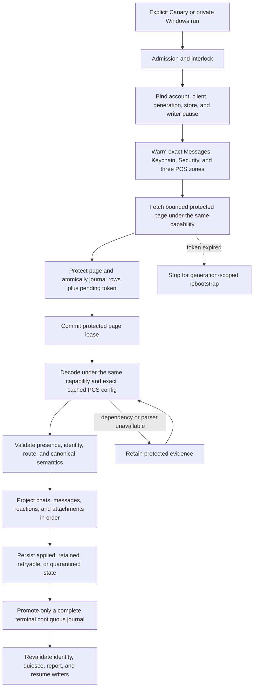
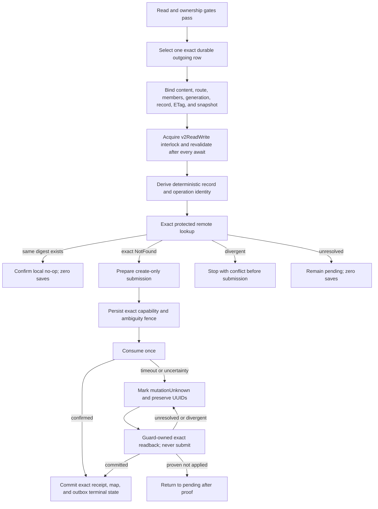

# Cloud Sync V2 current connection treemap

This document is the short operational source of truth. It contains current
architecture, safety rules, qualification state, and the next falsification
test. Dated investigations, obsolete candidates, run-by-run notes, patents,
and historical evidence remain intact in the
[investigation log](cloud_sync_v2/history/CLOUD_SYNC_V2_INVESTIGATION_LOG_THROUGH_2026-09-07.md).
The [bundle index](cloud_sync_v2/index.md) points to both documents and the
current evidence set.

## Decision

Treat Messages in iCloud as a durable replicated log. Remote ingestion and
local projection are separate progress clocks. A successful fetch is not a
successful sync. Undecryptable or temporarily unprojectable records remain
durable repair work and never disappear merely because a later token exists.

Every protected operation must remain bound to one exact tuple:

```text
account fingerprint
  + live CloudMessagesClient identity
  + read-authentication generation
  + protected-store identity
  + native writer-pause permit
  + container/database/zone
  + checkpoint generation
```

If any member changes, fail closed and retain the evidence. Never borrow a
different identity or container, create PCS state from the read path, fall
back to legacy sync, clear a cursor, or continue under a replacement account.

## Status legend

| Status | Meaning |
| --- | --- |
| `LIVE-PROVEN` | A content-free trace exercised the exact boundary on the named platform. Proof does not transfer between platforms. |
| `TEST-PROVEN` | Source-contract or behavioral tests cover the boundary; current-device proof remains. |
| `SOURCE-IMPLEMENTED` | The repair is in the candidate, but full exact-source qualification is incomplete. |
| `IN REPAIR` | A concrete counterexample invalidated the previous candidate. |
| `GAP` | A safe end-to-end behavior is not implemented or needs a product decision. |

## Current candidate

| Item | Current evidence |
| --- | --- |
| Latest CI-qualified APK | Source `fccca0bb5325fb9e2f7ccc3cbd0902d428003aaa`; [GCE 34779666716](https://github.com/Xare123/openbubbles-app/actions/runs/34779666716) passed actual selected-suite outcomes, bridge/native-library checks, packaging, signing and cleanup. Signed artifact 10324607303, archive digest `658ab5e31e9305ff7082183366a6a162d972cbb07727394a16b296981562696f`. Not downloaded/installed. Prior qualified 6f778c99 artifact remains rollback history. |
| Last observed Pixel | Canary 883f001868ac64a160c20018b2fb46e3aedb029e, version 1.15.0 (20002227). Fresh-account messages visibly restored. At 2026-09-13 04:01:18Z, Messages still fetched; Chats/Attachments had terminal empty reads. Outbox stayed 0 -> 0. Later ADB inventories were empty; recheck before device actions. |
| Qualified source / next candidate | Native fccca0bb5 is Windows-qualified; five formerly rejected extension records contain raw JPEG icons and now decode. Replay/sweep added 14 distinct extension-message rows and one attachment record. Next source `4e7121a18e8c011ae5472831111af86a61280178` fixes attachment creation dates passed through as Apple nanoseconds instead of Unix milliseconds. That native repair is not yet qualified. |
| Recent-first | Local recent-chat visibility implemented/tested. Account-wide newest-history fetching is NOT implemented. Persist a fresh-stream direction before its first request and bind continuation/restart before enabling legacy-style order. Existing cursors keep their direction. |
| Windows writes | Parent-31, edits-32/33 and unsend-34 passed a direct single-part chain: native receipts and one exact CloudKit confirmation per mutation. Fresh read proved all three history entries/text/milliseconds and one retracted part. Completed-unsend restart submitted zero updates. Evidence: private `windows-chain-20260913/qualification.json` and `windows-chain-echo-20260913/exact-chain-proof.json` under build-evidence. First attempt hit IDS 6005 before claim/send; explicit same-identity refresh worked. Pixel, groups, independent UI and persistent registration health remain open. |
| Release state | Full production is not established. Remaining gates below apply. |
| Logging repair | Logger lifetime and explicit Find My target are qualified in native 3496034e3. Awaiting `doFirstTimeInit` in the Windows hosts fixes startup ordering. Native Find My init/refresh diagnostics now show absent `locations`, not a coordinate-join failure. |
| Current native qualification | Windows 34779665447 passed fccca0bb5 / pilot 5fd8d03fe: 151 selected Rust tests, 658 Dart tests, 51 packaged-DLL codec cases. Parent verified 53 source inputs/12 logs/three ARM64 binaries; signed DLL `501f40e89d6268d52cd7e678a21b669d8952ca18c0421fba31ed1d0b2bb90e3f`. Local 51 codec and 24 harness tests passed; later date-shape harness has 25 passing tests. App Control remains enabled; vendor ObjectBox unchanged. |
| Next integration | Verify the timestamp candidate against the real offset-256 records, then replay with the normal applier. Continue diagnosing oversized extension strings and missing parent relationships without guessing identities, weakening bounds, or deleting retained evidence. Full interactive rendering/Pixel qualification remains independent of decoding and stored metadata. |
| Last full Canary attempt | GCE 34775818423 failed before APK packaging: 3563 Dart tests passed, one fixed-code vocabulary test failed, four skipped; protector harness failed E0432/E0433 on the missing extension module. App Rust, rustpush and automatic-upload tests passed. Signing skipped. Cleanup passed; independent inventories showed zero VMs and no matching runner. Step conclusions after continue-on-error are not test outcomes. |
| Completed qualification | Windows 34779665447 and full GCE Canary 34779666716 succeeded on fccca0bb5 / pilot 5fd8d03fe. All five actual suite outcomes passed; packaging/signing/cleanup succeeded. Independent inventories confirmed no old VM/runner. Windows artifact 10325461041 is locally verified; signed Canary artifact 10324607303 remains in GitHub, not installed. |
| Current qualified runtime | Source `4e7121a18e8c011ae5472831111af86a61280178`, pilot 5fd8d03fe: Windows 34782347926 passed 153 selected native / 658 Dart / 51 DLL-codec tests. Parent verified 53 inputs/12 logs/three ARM64 PEs, separately signed DLL `80f97298fad435f53b30cd4dc2b0479e3f350fb47136e644673b3a052d08b3c8`, and passed 51 local codec + 25 harness tests. GCE 34782416330 passed all 631 Rust tests and completed cleanup. No active build or new APK. |
| Fast Windows loop | Current Dart plus the verified native DLL opens the retained projection in 8.65 seconds. The stale Windows relay ticket was updated to the Pixel's working ticket after proving the same physical relay and preserving Windows installation IDs/keys. A real read then completed in about 31 seconds and exposed a quarantined own-edit echo. |
| Current merge repair | Real native-source/copy qualification passed the bounded production recovery and normal applier, preserving local history. Live Windows report `obcs2-semantic-1789278811033254.json` applied two pending messages; fresh-process repeat `1789278895014946` fetched/applied zero, with no conflict. Both observed empty terminal reads in all zones and kept outbox 15 -> 15 with remote writes disabled. Full native-crate qualification remains. |
| Current read result | Qualified reply replay added 34 distinct messages (32 replies), then a 5m5s drain added 250 distinct messages (246 replies) and applied 11 attachment records. Total 284 new messages, 278 replies. Outbox stayed 21; remote saves/deletes off. Drain proved remote-empty streams, but local projection remains partial with 6353 retained records. Private evidence: windows-multipart-20260913 and windows-multipart-drain-20260913 under build-evidence. New-text copies contain four replacement characters across both batches; full visual QA remains open. |
| Actual extension boundary | The 37-record inspection preserved durable state. A formerly ambiguous reply became ready with body/history intact. Five type-2 failures are 4.9-11.9 KiB raw-data live-layout archives; two type-3 records remain unsupported. Other preflight limit failures have total wire sizes about 19-200 KiB, below the 1 MiB input cap. Diagnose the exact internal bound, not an assumed oversized file. |
| Retained diagnosis | A non-projecting Windows sample inspected 37 current-generation retained saves with unchanged checkpoints, outbox and sampled rows. Seven sampled Message dependencies are unsupported extension payloads; all eight sampled Attachment dependencies lack a local parent, six otherwise materializable. This deliberate sample does not establish prevalence or parent causality. Native fixed-field diagnostics are prepared for the next Windows DLL; no parser admission was loosened. |
| Additional retained windows | Read-only probe offsets 128/256 preserve durable state and expose distinct records. Offset 256 finds extension strings 50,507-80,485 bytes against the 16,384-byte string limit, not the 1 MiB archive cap. Which field is large remains unproved. Eight sampled malformed Attachment records are native-ready but fail Dart date conversion at rust_cloud_semantic_decoder.dart:1239. Diagnose units/field semantics before changing bounds or dropping dates. Probe-only Dart changes are not part of the qualified native source. |
| Latest read/shape proof | Run-once `1789332457042301` added one row; 3m15s drain remote report `1789332557626821` plus local sweep `1789332723873549` added 13 distinct rows and one Attachment record. Retained total 6338; remote streams empty; outbox 21 -> 21. All 14 new rows have placeholder-only base text and separate extension display text/icon metadata; full rendering is not proved. Date probe shows all eight failed attachments have only createdAt populated, outside Dart range and matching the Apple-ns scale. Source write/cutoff paths establish the unit, not magnitude alone. |
| Date repair live proof / next boundary | All eight exact pre-repair record HMACs now decode with valid dates and one existing parent each. Normal 3m28s drain applied 86 Attachment records; retained total 6252, outbox 21 -> 21, remote streams empty. Copy audit proves all eight sampled sources transitioned retained -> applied with unchanged source identity/etag, bound canonical rows/parents, and successful production download-source resolution. Media bytes were not downloaded. Reports `1789335099312100` (remote) / `1789335274615314` (local sweep). Next: correlate missing Message chat references with cached protected Chat evidence; do not synthesize participants or treat missing as deleted. |
| Parent coverage result | Complete current-generation cached Chat scan: 794 physical records, 700 decoded, 81 tombstones and 13 out-of-scope. Eight sampled missing routes match neither current native identities nor legacy normalization; four applied controls correctly find proven parents. Five samples are bare UUIDs; three are explicit direct phone/email routes. No alias/index regression is established by these samples, and no remote-absence/deletion inference is made. |
| Pending raw discovery candidate | Separate opt-in protected Chat1 discovery API implemented, not compiled or live-qualified. It requires a read permit, fixes the zone to chat1ManateeZone and caps pages at 50; default semantic fetch still rejects all auxiliary streams, and auxiliary semantic decode remains forbidden. Rustpush dependency c4dd64b5afc086e87d508fed04090f8cd0abc555 is pushed to the fork. New FRB binding generation and native qualification are required before calling it. No general-container fallback. |
| Binding/runtime transition | All seven generated bridge files from GCE 34788562396 are imported together. That run passed 633 Rust tests but correctly failed binding drift because the new API output was not committed. Rustpush-only 34788563781 passed all 308 tests. Both cleanup jobs and independent inventories passed. SSE/diagnostic normalization checks and 31 local source-contract/harness tests passed after import. Current generated Dart must NOT be used with the old 4e7121a18 DLL. A matching Windows build and reproducible full qualification are next. |
| Active qualification / exact resume | Source c6091ddf92e13c902fc61bd911606def5ac373a7, pilot 3ac9ccadb26859e118ba471fa860739f12e34db8. Windows 34789713162 and full GCE Canary 34789714678 are active. GCE t2d-standard-60, primary lane, us-west1-b; expected VM/runner gce-34789714678-1. Existing signing path and 75-minute lifetime unchanged. Verify actual outcomes, binding reproducibility, signed artifacts and cleanup. Windows lane now pins native-fetch/source-contract inputs and runs the two discovery policy tests plus timestamp spot cases. |

Prior tables and obsolete next steps were preserved verbatim in the September 12
consolidation entry of the [investigation log](cloud_sync_v2/history/CLOUD_SYNC_V2_INVESTIGATION_LOG_FROM_2026-09-07.md).
Historical tests do not establish current-device behavior.

## Scope and current evidence

| Capability | Established | Remaining |
| --- | --- | --- |
| History read | Fresh Canary visibly restores chats/messages. | Terminal ingestion, actionable retained repair or explained unavailability, repeat/incremental/restart proof. |
| Media/documents/reactions read | Earlier representative live results; current materialization/filtering implemented. | Current Pixel photos, video, transcript GIFs, documents and incremental updates. GIFs need not appear in profile media. |
| Direct writes | Bounded Windows text, reaction, image, edit and unsend protocol results. | Ordinary Pixel composition, restart recovery and independent client display. |
| Groups | Restored-group binding implemented/tested. | Approved two-recipient text, attachments, reactions and supported mutations. No personal group substitution. |
| Edits/deletes | Direct single-part Windows send/edit/edit/unsend, exact echoed history/retraction and completed restart. | Pixel, groups, conflicts, independent display, supported tombstones and mid-flight recovery. |
| Lifecycle | Identity/reset fences and bounded Android worker implemented/tested. | Current background/lock, reconnect, process death, token expiry and account repair. |
| Progress/speed | Card and smaller Regular workload implemented. | Integrated qualification, Pixel UX and measured performance. |
| Newest history first | Local recent-chat admission fixed. | Durable fresh-stream direction plus multi-page/restart/incremental qualification. |
| FaceTime | Lifecycle/layout candidate; offline leave analysis repaired. | Actual two-way media beyond 30 seconds, remote hangup, subsequent and incoming calls. |
| Find My | [Windows service test](FINDMY_ASTRA_20260910.md) reaches the real account and user-confirmed sole shared person. Fresh roster and selected reads return that entry without coordinates. | Native response/secure-location handling, independent UI refresh, Devices/Items inventory and supported per-device actions. No stopped-sharing inference or Items success claim. |
| SMS/MMS/RCS | Excluded by user. | Preserve and label exclusion separately from iMessage failures. |

## Safety gates

These gates are non-negotiable:

1. Bind account, live client, credential generation, protected store, zone,
   checkpoint generation, and writer-pause capability at every external wait.
2. Journal each protected page and pending token atomically before committing
   the native page lease.
3. Project in dependency order: chats, messages, reactions, attachments.
4. Promote a token only across a complete contiguous terminal journal.
5. Keep fetched, retained, and exactly projected progress separate.
6. Keep live IDS/APNs receive readiness independent from archive repair.
7. Admit a write only from an exact durable row and a fresh protected
   dependency binding.
8. Prove exact remote absence before first create. Persist the ambiguity fence
   before consuming a prepared mutation.
9. After submission uncertainty, reconcile by exact readback only. Never
   automatically replay, update-merge, quarantine away ambiguity, or delete.
10. Require an exact protected receipt before committing a record map and
    terminal outbox state together.
11. Preserve Alpha, its hardware identity, its database, and its messages.
12. Keep Windows Smart App Control enabled. Use GCE or a trusted signed
    environment when local policy blocks an executable.

## Explicitly forbidden fallbacks

- Use of a general or write-capable container when semantic read authentication
  is cold.
- Cross-account, cross-client, cross-generation, cross-zone, or cross-store
  authentication and decryption.
- `ZoneSaveOperation`, PCS creation, clique reset, or remote mutation from the
  semantic read path.
- Silent fallback to legacy CloudKit sync.
- Cursor clearing for an unknown, malformed, or inconvenient error.
- Treating `retainedUnprojected` as successful local projection.
- Advancing past an incomplete journal.
- Deleting local rows for read-path tombstones.
- Letting optional CloudKit work delay live message startup or acknowledgment.
- Using GCE as a live Apple client or exporting account, relay, PCS, or device
  identity to CI.

## Read state machine



The durable journal between fetch and projection is the critical cut. It makes
projection repair possible without refetching or losing the exact server
evidence.

## Outbound create state machine



Direct, reaction, and group operations use distinct protected binding tags.
One lane cannot be cast into another. Confirmed replay is readback-only and
must prove zero saves.

### Attachment-write integration boundary

The next vertical slice must connect the existing composer journal to this
entire chain, not merely add an upload validator:

```text
exact attachment descriptor actually sent through IDS
  -> protected descriptor + metadata + one retained record identity
  -> verified original MMCS bytes, exact pinned length
  -> existing account/container + attachment-zone PCS + boundary-key lookup
  -> byte upload, retaining its receipt or unresolved-upload state
  -> create-only CloudAttachment(cm metadata, lqa asset)
  -> exact record readback and confirmed dependency
  -> parent Message with the same attachment references
```

- The Dart store atomically admits completed Attachment-v1 uploads, and the
  runtime byte-upload coordinator and parent-message connection are implemented.
  Live byte upload has succeeded; child/parent record readback remains open.
  Native integration separates protected pre-upload preparation
  (`outboundAttachmentUpload`) from completed record-create material
  (`outboundAttachment`). Neither grants network permission or parent admission.
- Existing `Attachment.metadata["rustpush"]` stores an MMCS descriptor with
  decryption material at upload-finish, before IDS send success. It is mutable,
  not an encrypted receipt or proof of what IDS sent. Pin the actual wire
  descriptor into protected admission before send, then bind native success to
  it. The v3 receipt now carries the protected source binding, not raw keys or
  descriptors. Composer source staging/adoption is connected; whole-runtime
  attachment qualification remains separate.
- Do not put the source only inside the IDS receipt: acknowledgment deletes
  that file immediately after durable confirmation, before outbound admission.
  A protected source needs its own durable reference and recovery/GC ownership
  through parent adoption. The additive journal `protectedSourceBinding` field
  now owns that reference independently; old rows remain null and unqualified.
- Re-fetching that pinned MMCS object avoids a second permanent plaintext-byte
  journal and mutable-file reuse. It needs APS/MMCS availability, complete
  target/chunk validation, and the pinned plaintext length. A missing or expired
  object must defer, not substitute a different local file. Chunk integrity and
  length do not validate a guessed CTR key; the key must be the one actually sent.
- Reuse `CloudMessagesPreparedSaveSubmission` for record-save correlation and
  single consumption; the next native candidate supplies typed preparation
  and checked readback without enabling admission. Do not use
  legacy `save_attachments`, which enters generic update-capable saving.
- Legacy `prepare_file` calls `get_boundary_key`, which can create a keychain
  item. V2 lookup must also use keystore `get_secret`, not `ensure_secret`, when
  unwrapping existing boundary material. Keep the DSID and entry under the same
  state lock; a missing key fails without generating either local or remote keys.
- The attachment-specific local-send path extends outbox admission and parent
  encoding together. The plaintext-only path still rejects media.
- Record identity must be persisted before first upload and reused on retry.
  Legacy allocates a random attachment record ID; do not assume the proven
  Message GUID HMAC naming rule also applies to attachment records.
- `prepare_put_v2` randomizes chunk keys, FORD key and IV. Re-preparing identical
  plaintext retains neither the original encrypted descriptor nor its reference.
  Preserve the entire `PreparedPut`, including each chunk's key/signature/length,
  under platform protection before upload. Bind it to the original parent source,
  attachment metadata, full container-issued record identifier and file digest.
  A returned asset must match that exact preparation before record-create staging.
- Upload uncertainty and record-save uncertainty are distinct. Record NotFound
  cannot authorize blind byte re-upload or record-ID replacement.
- Next integration order: protected actual-IDS descriptor ownership in the
  local-send journal; durable pre-upload plan and attempt state; exact completed
  upload adoption; existing create-only record transport/readback; parent message
  dependency and encoding. Do not bypass the missing journal ownership by calling
  the legacy uploader or treating native codec tests as end-to-end qualification.
- Native send preparation is a separate boundary: `IMClient.send` calls
  `MessageInst.prepare_send`, which assigns a new send timestamp and may add
  the sender/conversation GUID. Capturing a Dart-built MessageInst and then
  allowing preparation to mutate it is not proof of the final wire. Integration
  must validate the final attachment descriptors and bind positive IDS success
  to the original source. Prefer an explicit validator for the three known
  preparation changes (timestamp, generated conversation GUID, added self
  participant), with all body/recipient/attachment fields unchanged, if that
  avoids a new two-phase send API. Freezing the prepared submission is an
  alternative, not a prerequisite. Do not ignore arbitrary changed fields.
- Local reflection is another normal transformation: `indexedPartsToAttributedBodyDyn`
  changes attachment GUIDs to `<messageGuid>_<part>` and inserts a space where
  the composer may use an object placeholder. Source identity must bind ordered
  descriptors and actual text/formatting, not these local aliases. Resolve each
  body reference to its exact attachment; do not accept count-only matching,
  unrelated rows, substituted descriptors or changed text. The native protected
  source still pins the actual sent descriptor, independently of local UI IDs.

## Fast qualification loop

Use the cheapest boundary that can falsify the current hypothesis:

```text
source contract or behavioral logic
  -> focused local test when policy allows, otherwise GCE
  -> full exact-source GCE suite and APK build

Apple protocol, PCS, save, readback, or replay behavior
  -> exact-source trusted minimal Windows harness when available
  -> otherwise signed Canary on Pixel

Android registration, ObjectBox/UI, background, lock, or lifecycle behavior
  -> signed Canary on Pixel

cross-device convergence
  -> independent Apple device confirmation
```

Do not rebuild a Canary for every code edit. GCE handles exact-source Dart,
Rust, bridge-generation, identity, projection, and reconciliation tests.
Windows ARM64 bundles are built on the isolated GitHub runner and imported
only after archive, native-codec, source/configuration and launch verification.
The retained `6abbeede2` runtime proves its bounded direct write, not newer
attachment code; `3ebcc81c9` must pass import and its own live test.
Local Cargo compilation remains blocked by App Control 4551. Keep that policy
enabled. The verified cloud bundle runs with the existing engineering signing
path when the original ObjectBox vendor DLL is preserved; re-signing that
vendor DLL caused the earlier startup block. Credentials and PCS state remain
local, never on GCE. Windows qualifies protocol boundaries, not Pixel lifecycle
or final Android release behavior.

Use five promotion lanes and do not skip upward:

1. **Focused local lane:** handwritten Dart contracts and structural guards for
   the changed boundary. It may reject a patch but cannot qualify native Rust.
2. **Fast GCE lane:** `app-rust-only` regenerates and verifies FRB bindings,
   checks the Rust bridge, and runs the app Rust library without Android SDK,
   Gradle, signing, or APK work.
3. **Full GCE lane:** only a promotion candidate runs every Dart/Rust/rustpush/
   protector test and produces the signed, ABI-verified Canary APK.
4. **Windows protocol lane:** exact-source minimal harnesses may falsify Apple
   request, PCS, save, readback, and replay behavior without an APK. They do not
   qualify Android lifecycle or UI behavior.
5. **Pixel release lane:** batch direct send, process-death recovery, group send,
   readback, restart, lifecycle, and UI evidence into as few signed-APK sessions
   as safety permits. Manual Apple-device display remains independent evidence.

The manual-writer Pixel lane now has a host-controlled three-phase gate:
[`pixel_cloudkit_write_gate.ps1`](../tooling/pixel_cloudkit_write_gate.ps1)
and [`vm_trigger_cloudkit_write.dart`](../tooling/vm_trigger_cloudkit_write.dart).
`prepare` establishes V2 ownership locally and returns only a candidate GUID
hash; `run` restarts Canary, reselects that exact hash, and invokes the existing
one-intent production path; optional `verify` restarts again and requires zero
new admissions. Every phase pins the app source and host-tool hashes, takes the
recipient only from a process environment variable bound to a separately
supplied SHA-256, emits content-free evidence, and requires the automatic
worker to be absent. The tooling is test-proven but does not replace live
CloudKit readback or independent Apple-device display.

## Recovery policy

| Failure | Safe response |
| --- | --- |
| Read credential cold or revoked | Warm the in-memory same-account credential, restore the encrypted same-account credential, or perform one bounded refresh. Then require user action. |
| Account or client changes | Stop before projection or acknowledgment and preserve journal, source, and checkpoint. |
| PCS key unavailable | Warm or look up only the exact same-scope zone. Retain the protected record if still unavailable. |
| Network or throttling | Preserve token and evidence, honor bounded retry-after, and retry later. |
| Missing parent or parser | Retain protected evidence and retry projection after the dependency or parser repair. |
| Malformed record | Store a fixed content-free reason and explicit repairability classification. Never guess identity. |
| Process death after fetch | Recover the protected lease, replay the durable journal, and keep the prior token until terminal. |
| Token expired | Stop, require the account-bound protected reset proof, release the read boundary, reacquire the destructive-reset interlock and native pause, advance the exact zone generation once, fence old evidence, reconcile authority after interruption, and replay at most once. |
| Write result unknown | Preserve request and operation UUIDs, protected receipt, and fence. Exact readback is the only next network action. |

## Source-linked boundary map

| Boundary | Primary source | Current status |
| --- | --- | --- |
| Product admission and interlock | [`cloud_sync_manual_semantic_pull_sampler.dart`](../lib/services/rustpush/cloud_sync/cloud_sync_manual_semantic_pull_sampler.dart), [`cloudkit_operation_interlock.dart`](../lib/services/rustpush/cloud_sync/cloudkit_operation_interlock.dart) | Read live-proven; full session replacement qualification remains. |
| Read authentication and exact PCS | [`cloud_sync_production_sampler_adapter.dart`](../lib/services/rustpush/cloud_sync/cloud_sync_production_sampler_adapter.dart), [`cloudkit.rs`](../rustpush/src/icloud/cloudkit.rs) | Exact `ad822f37c` live read-only pull completed; cold/account lifecycle proof remains. |
| Protected fetch, journal, and token | [`native_protected_cloud_sync_transport.dart`](../lib/services/rustpush/cloud_sync/native_protected_cloud_sync_transport.dart), [`objectbox_cloud_sync_store.dart`](../lib/services/rustpush/cloud_sync/objectbox_cloud_sync_store.dart) | Test and prior live proof. |
| Authenticated reset and restart recovery | [`cloud_sync_reset_coordinator.dart`](../lib/services/rustpush/cloud_sync/cloud_sync_reset_coordinator.dart), [`cloud_sync_manual_semantic_pull_sampler.dart`](../lib/services/rustpush/cloud_sync/cloud_sync_manual_semantic_pull_sampler.dart), [`cloudkit_writer_authority.dart`](../lib/services/rustpush/cloud_sync/cloudkit_writer_authority.dart), [`objectbox_cloud_sync_preflight.dart`](../lib/services/rustpush/cloud_sync/objectbox_cloud_sync_preflight.dart) | Exact-source qualified at `0b86a6465`; live expired-token/restart proof remains. |
| Decode and canonical conversion | [`rust_cloud_semantic_decoder.dart`](../lib/services/rustpush/cloud_sync/rust_cloud_semantic_decoder.dart), [`cloud_sync_canonical_converter.rs`](../rust/src/cloud_sync_canonical_converter.rs) | Test and representative live proof. |
| Ordered projection and retained repair | [`cloud_inbox_applier.dart`](../lib/services/rustpush/cloud_sync/cloud_inbox_applier.dart), [`objectbox_cloud_semantic_store_gateway.dart`](../lib/services/rustpush/cloud_sync/objectbox_cloud_semantic_store_gateway.dart) | Read live-proven; current backlog must be explicit. |
| Composer origin, IDS completion, and write admission | [`rustpush_service.dart`](../lib/services/rustpush/rustpush_service.dart), [`cloud_sync_local_send_journal.dart`](../lib/services/rustpush/cloud_sync/cloud_sync_local_send_journal.dart), [`cloud_sync_manual_outbound_canary.dart`](../lib/services/rustpush/cloud_sync/cloud_sync_manual_outbound_canary.dart), [`cloudkit_writer_mutation_guard.dart`](../lib/services/rustpush/cloud_sync/cloudkit_writer_mutation_guard.dart) | Atomic direct/restored-group composer admission, bounded awaited receipt replay, atomic startup claim, protected receipt recovery, and reset-required fencing are exact-source qualified through `0b86a6465`; live Pixel process-death recovery, remote readback, and duplicate suppression remain. |
| Direct and group encoders | [`cloud_sync_local_send_encoder.dart`](../lib/services/rustpush/cloud_sync/cloud_sync_local_send_encoder.dart), [`cloud_sync_outbound_group_binding.dart`](../lib/services/rustpush/cloud_sync/cloud_sync_outbound_group_binding.dart) | Direct live-proven on Windows; group source-implemented. |
| Native create/readback receipt | [`api.rs`](../rust/src/api/api.rs), [`cloud_messages.rs`](../rustpush/src/imessage/cloud_messages.rs), [`chat_create.rs`](../rustpush/src/imessage/cloud_messages/chat_create.rs) | Direct Windows proof; exact-source suite and group live proof pending. |
| Android durable read wake | [`CloudSyncV2Worker.kt`](../android/app/src/main/kotlin/com/bluebubbles/messaging/services/rustpush/CloudSyncV2Worker.kt), [`DartWorker.kt`](../android/app/src/main/kotlin/com/bluebubbles/messaging/services/backend_ui_interop/DartWorker.kt), [`cloud_sync_semantic_drain_controller.dart`](../lib/services/rustpush/cloud_sync/cloud_sync_semantic_drain_controller.dart) | Current ready/lease/budget repair has focused behavioral proof. Prior `fc132e5f8` compilation did not detect the startup deadlock; Pixel lifecycle proof remains. |

## Release gates

- [x] Prior APK source 6f778c99 passed full GCE 34741584069 and signing verification (not installed).
- [x] That run completed cleanup; later GCE inventory was empty.
- [x] Fresh Canary visibly projects readable chats/messages.
- [x] Source-specific Windows text/reaction/image checks and direct single-part send/edit/edit/unsend, exact echoed history/retraction, completed restart.
- [ ] Full integrated pacing-source qualification and exact signed installation.
- [ ] Complete remote history and classify/repair actionable retained saves.
- [ ] Repeat with stable cursors, no duplicates and readable media/documents.
- [ ] Pause/resume, background/lock, reconnect, cold restart and token/account recovery.
- [ ] Ordinary Pixel send through IDS acceptance, durable admission, CloudKit save/update,
  exact readback and independent client display.
- [ ] Restart reconciliation with zero duplicate IDS/CloudKit operations.
- [ ] Approved group text/attachments/reactions and supported mutations.
- [ ] Pixel/group mutation chains, mid-flight conflict/unknown-outcome recovery and deletion semantics.
- [ ] Newest-history bootstrap with durably bound direction and existing cursors preserved.
- [ ] Accurate status for fetched, projected, retained, media and outgoing reconciliation.
- [ ] Measured Regular/Turbo behavior, then real FaceTime call qualification.
- [ ] Find My People location retrieval and ongoing/stale-location behavior with the user's confirmed sharing intact.
- [ ] Find My Devices/Items inventory and supported per-device actions, including correct behavior while CloudKit reads pause native writers.
- [ ] Document supported operations and limitations. No upstream draft until user confirmation.

## Current critical path

1. Generate coherent bindings and qualify the separate protected Chat1 discovery
   path, then inspect that existing zone without changing normal cursors or
   enabling semantic decode. The cached-parent comparison already passed its
   controls and found no match for eight sampled missing routes. Do not repeat
   that same scan or call the unbound raw API as a shortcut.
   Implement the explicit test-host caller using the existing protected lease
   and shadow-journal contracts; do not leave unadopted references or use the
   current new bindings with an old DLL. No live Chat1 request has happened.
2. Resolve measured internal preflight limits using the new fixed bound labels.
   Keep limits tied to memory/work budgets and field semantics. Do not discard
   protected records or treat a diagnostic label as corrupted user data.
3. Verify repeat/cold-restart reads, terminal stream state, duplicate suppression,
   legible text, and representative current media/documents. Separate excluded
   telephony and tombstones from actionable iMessage projection work.
4. On the Pixel, qualify the installed candidate and ordinary composer, background/
   lock/reconnect, registration repair, and independent-client display. Preserve
   Alpha; do not infer completion from Windows tests.
5. Finish approved group/media/mutation and mid-flight recovery cases. The direct
   single-part Windows chain is proved, not the full cross-device matrix.
6. Qualify fresh-stream newest-first ordering without reversing existing cursors.
   FaceTime and Find My retain their separate live gates listed above.

## Current ownership and continuation rules

- `cloud_sync_extension_metadata.rs` is the pure JSON/schema boundary shared by
  the canonical DTO, archive decoder and protector harness. Keep it independent
  of rustpush/IDS/network code. New metadata fields require both app and harness
  qualification; do not stub the harness to satisfy compilation.
- New projector failure literals require the exact reviewed vocabulary and
  safe-error tests. The Windows lane now includes these downstream checks.
- Parent owns account operations and integration. Completed agents have been
  reviewed/closed. Exact active agent/job handles belong in the candidate table.
- Current local profile/test processes are closed; no agents remain active.
  The active Windows write request is completed unsend-34 (reconcile-only).
  C: had about 64 GiB free at the last checkpoint. Preserve the paired-copy
  audit/evidence and prior native rollback artifacts; no cleanup was performed.
- Preserve the qualified DLLs, source manifests and rollback evidence. Current
  generated bindings already include extensionMetadataJson; a metadata JSON
  schema change inside that string is not a new FRB ABI by itself.
- Version-2 extension context separates wire session identity from the archive
  UUID. Base/predecessor ownership, chat/provider and timestamps are validated.
  Late-content repair is atomic and paged; attachment owners are never moved.
- Do not rebuild or install an APK for Dart-only Windows qualification. An actual
  native/ABI change needs its matching cloud-built, separately verified runtime.
- Follow AGENTS.md before compaction: reconcile docs, review agents and preserve
  exact resume handles. Do not restart a job solely after a polling timeout.

## Existing-history adoption evidence gate

Automatic adoption is not safe from the offline checkout alone. For each
queued intent, a content-free live observation must first distinguish the six
`existing_history` categories and prove exactly one current direct-iMessage Chat
owner under the same account, protected store, scope, generation, writer epoch,
and native session. The proof must bind the canonical Chat lookup hash, semantic
snapshot, service-identifier alias, canonical/member record map, latest applied
non-tombstone save, ETag, protected record reference, and payload digest. A
later retained save, tombstone, competing owner, or native `overlaps` /
`incomplete` result remains a defer.

Only after that proof may the production local-send admission seam atomically
re-read the state-1 journal intent and unchanged provisional Message/Chat,
adopt the exact existing relationship, and persist its durable reconciliation
binding under the existing `v2ReadWrite` interlock and auth fence. That
transaction must create no Chat stage, outbox row, record-map mutation, remote
save, merge-update, or delete. Restart must repeat as a no-op; any mismatch must
roll back and leave the intent ready/deferred. A bare Message reparent is not a
fallback because the journal source digest binds the original Chat row and UUID.

## Edit and unsend invariants

- Message history/retractions live in the existing message's summary fields
  (`ec`, `ep`, `otr`, `rp`). Revision indexes are payload-local, not global clocks.
  Displayed body and history must remain one compatible snapshot.
- Retractions are monotonic for the exact owned message. Older history cannot
  overwrite newer text or resurrect an unsent message. Unknown parts and
  incompatible histories remain retained; never flatten unsupported bodies.
- Patch retained summary/plist/protobuf values and preserve unknown fields.
  Do not rebuild an existing record with the lossy legacy Message.toCloud path.
  Native message patching changes only the intended field spans.
- Conditional updates bind the exact predecessor record and ETag. Persist the
  mutation intent, prepared time/source, positive IDS receipt, reflection and
  request identity before submission. Unknown outcomes reconcile by readback;
  they do not authorize a retry, recreation, or overwrite.
- A completed edit can provide read-only predecessor evidence for a later mutation
  only when its exact reflected history and confirmed operation/map still match.
  The previous source remains terminal. New mutations have distinct identities.
- Current direct Windows chain/readback/restart proof is in the candidate table.
  It does not establish independent recipient rendering, group behavior, ordinary
  Pixel capture, or all interruption points.

The superseded implementation chronology, wire-experiment details and older
qualification commands are preserved verbatim in the
[historical treemap tail](cloud_sync_v2/history/TREEMAP_PRE_MULTIPART_2026-09-13.md).
