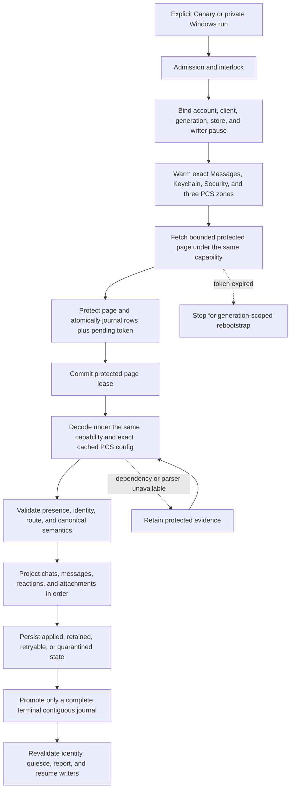
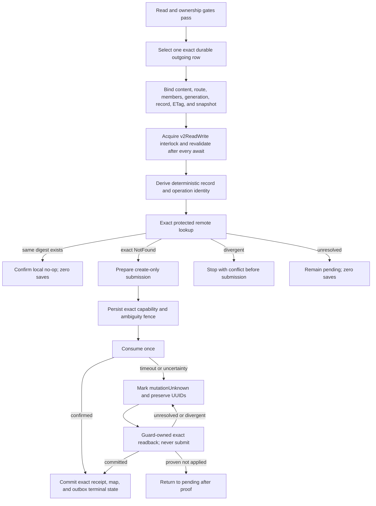

# Cloud Sync V2 current connection treemap

This document is the short operational source of truth. It contains current
architecture, safety rules, qualification state, and the next falsification
test. Dated investigations, obsolete candidates, run-by-run notes, patents,
and historical evidence remain intact in the
[investigation log](cloud_sync_v2/history/CLOUD_SYNC_V2_INVESTIGATION_LOG_FROM_2026-09-07.md).
The [bundle index](cloud_sync_v2/index.md) points to both documents and the
current evidence set.

## Decision

Treat Messages in iCloud as a durable replicated log. Remote ingestion and
local projection are separate progress clocks. A successful fetch is not a
successful sync. Undecryptable or temporarily unprojectable records remain
durable repair work and never disappear merely because a later token exists.

Every protected operation must remain bound to one exact tuple:

```text
account fingerprint
  + live CloudMessagesClient identity
  + read-authentication generation
  + protected-store identity
  + native writer-pause permit
  + container/database/zone
  + checkpoint generation
```

If any member changes, fail closed and retain the evidence. Never borrow a
different identity or container, create PCS state from the read path, fall
back to legacy sync, clear a cursor, or continue under a replacement account.

## Status legend

| Status | Meaning |
| --- | --- |
| `LIVE-PROVEN` | A content-free trace exercised the exact boundary on the named platform. Proof does not transfer between platforms. |
| `TEST-PROVEN` | Source-contract or behavioral tests cover the boundary; current-device proof remains. |
| `SOURCE-IMPLEMENTED` | The repair is in the candidate, but full exact-source qualification is incomplete. |
| `IN REPAIR` | A concrete counterexample invalidated the previous candidate. |
| `GAP` | A safe end-to-end behavior is not implemented or needs a product decision. |

## Current candidate

| Item | Current evidence |
| --- | --- |
| Latest CI-qualified APK | Exact source `78d0f8cf2e5e0d49560766c79644f4ecec869a4b`; [GCE 34983806715](https://github.com/Xare123/openbubbles-app/actions/runs/34983806715) passed the full Dart and Rust suites, automatic-writer checks, rustpush production tests, the Cloud Sync protector harness, Android JVM tests, package/native verification, GitHub-hosted signing and cleanup. Signed artifact 10404276881 downloaded as 452,938,275-byte `app-canary-debug.apk`, SHA256 `6707AE4BD99F418406DDCCCE25AD339FDF54078D64BE4FF93804D471F3C66DB4`. Independent local `apksig` verification reports v2/v3 valid, zero errors and certificate SHA256 `0ea17c1b67581ca79660d33db45af0a36b71ea36a4cbafec5293d3ae80570d79`; `aapt2` verifies package `com.bluebubbles.messaging.cloudkitcanary`, version 1.15.0 (20002227), and all four required ARM64 native libraries are present. Independent inventories show no GCE instance or matching self-hosted runner after cleanup. |
| Last observed Pixel | Signed `710003e7b` is now installed in place as Canary. Downloaded and device APK SHA256 both equal `8d87ec693bbbcbb9d31b0ab886e254cc2ef5c1a9253c3fc7acac9dc3233ad90b`; v2/v3 signature and stable certificate independently pass. All four required ARM64 libraries are present and no dotenv asset is packaged. Alpha version/install/update timestamps are unchanged. The install unintentionally overlapped a background read because the host printed but did not enforce its second busy check. The new process retained registration/chats and recovered the old five-minute coordinator lease by expiry at 20:51Z without reset or lease edits. Status is authenticated/idle/settled. The exact failed-photo retry and a new terminal read remain pending. |
| Semantic-pull regression and repair | The 10d Pixel run safely aborted before pass 1 with `cloud_sync_protocol_evidence_event_type_invalid`: production emitted valid `fetchStarted` and `inboxApplyStarted` events that the fixed evidence vocabulary omitted. Exact source `0feaa063a` repaired the vocabulary and is an ancestor of the current `78d0f8cf2` candidate. The current full qualification passed the regression coverage, but Pixel live proof remains pending. |
| Recent-first | `TEST-PROVEN` on exact source `78d0f8cf2`: a live read-only Windows wire probe proves Apple returns a bounded newest-first page for a fresh no-token stream, and the product now durably binds direction before request one. Fresh exact Chats, Messages and Attachments streams use newest-first; Chat1 and every existing cursor remain forward. Direction is carried through each continuation, restart, reset and journal CAS. GCE app-Rust 34982392496 passed 682/682 tests; full GCE 34983806715 passed every selected suite, packaging, signing and cleanup. Pixel lifecycle proof remains open. |
| Windows writes | `LIVE-PROVEN` for a fresh direct single-part chain on exact source `07e58fd0b`. Parent-35 sent with exact readback, edit-36 and unsend-37 each submitted and confirmed one CloudKit update, and a new-process unsend replay submitted zero IDS/CloudKit work. The post-run store has exactly three additional confirmed outbox operations, both new mutations are terminal, and the retained database was unchanged by the metadata-only audit. Evidence: `build-evidence/windows-chain-20260915-07e58fd0`. Pixel, groups, independent recipient UI and persistent registration health remain open. |
| Outbound lease integrity | A content-free inspector on an exact temporary copy of the retained Windows profile found 24/24 outbox rows confirmed, three still-required protected mutation leases present, all three source envelopes bound to their leases, zero missing required outbound leases, zero duplicate/unmatched mutation claims, and correct lease release after the one terminal protected send and one terminal attachment upload. Writer authority remained stable at epoch 18. The original 48,805-file profile snapshot was unchanged. This is restart-state integrity evidence, not a new Apple submission. |
| Release state | Full production is not established. Remaining gates below apply. |
| Logging repair | Logger lifetime and explicit Find My target are qualified in native 3496034e3. Awaiting `doFirstTimeInit` in the Windows hosts fixes startup ordering. Native Find My init/refresh diagnostics now show absent `locations`, not a coordinate-join failure. |
| Find My live boundary | Exact retained Windows launch `1bed3346c9374c3b81f402075da59746` used the signed `7d38f1dd8` runtime and completed fresh People and Devices service reads. People returned one uniquely selected row but no native location; the service marked that row opted out of sharing and supplied no coordinate or locate-in-progress signal. Devices returned zero rows. Items were deliberately not invoked because their initialization side effects are not yet reviewed. The UI is not discarding coordinates in this capture; the native response contains none. Commit `d13d88797` repairs test provenance and makes the offline qualifier accept only the exact verified successful launcher envelope; 54 qualifier, 11 preflight, launcher and Flutter contract tests pass. |
| Current native qualification | Windows 34779665447 passed fccca0bb5 / pilot 5fd8d03fe: 151 selected Rust tests, 658 Dart tests, 51 packaged-DLL codec cases. Parent verified 53 source inputs/12 logs/three ARM64 binaries; signed DLL `501f40e89d6268d52cd7e678a21b669d8952ca18c0421fba31ed1d0b2bb90e3f`. Local 51 codec and 24 harness tests passed; later date-shape harness has 25 passing tests. App Control remains enabled; vendor ObjectBox unchanged. |
| Next integration | The exact-source foreground pull, bounded Android background wake and controlled cold-restart incremental read are terminal with Apple cursors drained, authentication ready, outbox 1 -> 1 and remote writes disabled. Next qualify profile Regular/Turbo status, cancellation and lock/reconnect. If registration remains healthy, run one authorized ordinary-composer send, exact CloudKit readback, restart/no-duplicate replay and representative media/document checks on this same installed hash. |
| Current source changes | Installed candidate `710003e7b9feb8b74bf3cd795da22da3be0e56bb` includes reply overflow/shared progress, authenticated media-body extent and removable Canary ADB controls. Rustpush is `5522fa0ced1c1fe7ed70262ac230261889ca06c5`. GitHub bridge 35008514692 passed 685 app, 317 rustpush, 11 Anisette and 40 protector tests; 80 targeted Flutter and 16 packaging/control cases pass locally. Build 35008622263 successfully packaged/signed the independently verified Canary artifact 10413547986. This workflow did not run the full Flutter/JVM suite. Windows 35006456632 artifact 10413045788 is independently verified/imported against exact `b9c567f89`; 29 attachment tests passed from that signed native executable on the local PC. This is native cache/extent evidence, not a live Apple download. |
| Latest full Canary qualification | GCE 34983806715 completed successfully in 33m02s on exact source `78d0f8cf2`: every selected suite passed, the producer and signed APK artifacts were uploaded, Android JVM tests passed, GitHub-hosted signing passed, and cleanup deleted the ephemeral runner. Independent post-run inventories found zero GCE instances and no matching self-hosted runner registration. This establishes build/test/signing integrity, not Pixel lifecycle or end-user behavior. |
| Current artifact boundary | Installed signed `710003e7b` is retained at project-root `build-evidence/github-canary-710003e-35008622263/extracted/app-canary-debug.apk`; previous `78d0f8cf2` is retained as rollback evidence, not the current installation. Preserve app data and retained database. No clean install, data clear, checkpoint reset or Alpha change is authorized by this qualification. |
| Current qualified runtime | Source `4e7121a18e8c011ae5472831111af86a61280178`, pilot 5fd8d03fe: Windows 34782347926 passed 153 selected native / 658 Dart / 51 DLL-codec tests. Parent verified 53 inputs/12 logs/three ARM64 PEs, separately signed DLL `80f97298fad435f53b30cd4dc2b0479e3f350fb47136e644673b3a052d08b3c8`, and passed 51 local codec + 25 harness tests. GCE 34782416330 passed all 631 Rust tests and completed cleanup. No active build or new APK. |
| Fast Windows loop | Current Dart plus the verified native DLL opens the retained projection in 8.65 seconds. The stale Windows relay ticket was updated to the Pixel's working ticket after proving the same physical relay and preserving Windows installation IDs/keys. Fresh exact-source session `9fd22af4898c86559573004e9c07d21d` on September 15 ran two independent 7d38 processes to a stable terminal result: fetched/applied 0/0, retained 6,252, outbox 24 -> 24, all zones empty-terminal, zero stderr, remote writes disabled and owned-process cleanup confirmed. The initial attempt correctly rejected an older 07e native bundle as byte-incompatible before profile access. |
| Current merge repair | Real native-source/copy qualification passed the bounded production recovery and normal applier, preserving local history. Live Windows report `obcs2-semantic-1789278811033254.json` applied two pending messages; fresh-process repeat `1789278895014946` fetched/applied zero, with no conflict. Both observed empty terminal reads in all zones and kept outbox 15 -> 15 with remote writes disabled. Full native-crate qualification remains. |
| Current read result | Qualified reply replay added 34 distinct messages (32 replies), then a 5m5s drain added 250 distinct messages (246 replies) and applied 11 attachment records. Total 284 new messages, 278 replies. Outbox stayed 21; remote saves/deletes off. Drain proved remote-empty streams, but local projection remains partial with 6353 retained records. Private evidence: windows-multipart-20260913 and windows-multipart-drain-20260913 under build-evidence. New-text copies contain four replacement characters across both batches; full visual QA remains open. |
| Actual extension boundary | The 37-record inspection preserved durable state. A formerly ambiguous reply became ready with body/history intact. Five type-2 failures are 4.9-11.9 KiB raw-data live-layout archives; two type-3 records remain unsupported. Other preflight limit failures have total wire sizes about 19-200 KiB, below the 1 MiB input cap. Diagnose the exact internal bound, not an assumed oversized file. |
| Retained diagnosis | A non-projecting Windows sample inspected 37 current-generation retained saves with unchanged checkpoints, outbox and sampled rows. Seven sampled Message dependencies are unsupported extension payloads; all eight sampled Attachment dependencies lack a local parent, six otherwise materializable. This deliberate sample does not establish prevalence or parent causality. Native fixed-field diagnostics are prepared for the next Windows DLL; no parser admission was loosened. |
| Additional retained windows | Read-only probe offsets 128/256 preserve durable state and expose distinct records. Offset 256 finds extension strings 50,507-80,485 bytes against the 16,384-byte string limit, not the 1 MiB archive cap. Which field is large remains unproved. Eight sampled malformed Attachment records are native-ready but fail Dart date conversion at rust_cloud_semantic_decoder.dart:1239. Diagnose units/field semantics before changing bounds or dropping dates. Probe-only Dart changes are not part of the qualified native source. |
| Latest read/shape proof | Run-once `1789332457042301` added one row; 3m15s drain remote report `1789332557626821` plus local sweep `1789332723873549` added 13 distinct rows and one Attachment record. Retained total 6338; remote streams empty; outbox 21 -> 21. All 14 new rows have placeholder-only base text and separate extension display text/icon metadata; full rendering is not proved. Date probe shows all eight failed attachments have only createdAt populated, outside Dart range and matching the Apple-ns scale. Source write/cutoff paths establish the unit, not magnitude alone. |
| Date repair live proof / next boundary | All eight exact pre-repair record HMACs now decode with valid dates and one existing parent each. Normal 3m28s drain applied 86 Attachment records; retained total 6252, outbox 21 -> 21, remote streams empty. Copy audit proves all eight sampled sources transitioned retained -> applied with unchanged source identity/etag, bound canonical rows/parents, and successful production download-source resolution. Media bytes were not downloaded. Reports `1789335099312100` (remote) / `1789335274615314` (local sweep). Next: correlate missing Message chat references with cached protected Chat evidence; do not synthesize participants or treat missing as deleted. |
| Parent coverage result | Complete current-generation cached Chat scan: 794 physical records, 700 decoded, 81 tombstones and 13 out-of-scope. Eight sampled missing routes match neither current native identities nor legacy normalization; four applied controls correctly find proven parents. Five samples are bare UUIDs; three are explicit direct phone/email routes. No alias/index regression is established by these samples, and no remote-absence/deletion inference is made. |
| Protected Chat1 discovery proof | Separate opt-in, permit-bound Chat1 discovery is compiled and live-qualified for source c6091ddf92e13c902fc61bd911606def5ac373a7. A Windows test-host read fetched exactly one capped page: 50 distinct saves, generation 1, sequence 0 -> 50, protected token present, 0 rejected and no canonical/outbox mutation. A subsequent mutex-held cache-only inspection made no network request and found 50 pending raw rows, all with protected identity/raw references and payload digests, no duplicates, tombstones or system references. All 50 remain deliberately quarantined as `unsupportedRecordType`/`malformedRecord`; semantic admission is still forbidden. |
| Matching bindings/runtime | All seven generated bridge files are paired with the signed c6091ddf Windows DLL, SHA256 `9B0B7899BBD31D1EE6C6A15482208055C8C9FED52CF858761CDACD622A0C0C79`, signer thumbprint `8240557965890665F3B49E5FEC83D511CA4F2C9D`. Windows 34789713162 passed 666 Dart tests plus selected native/discovery contracts; full GCE Canary 34789714678 passed every actual selected suite and regenerated bindings byte-for-byte. Vendor ObjectBox SHA256 remains `9C8583C4015AB9E4CE2ED3D2D581811FA059E03BB528CB8C8387ADCDFDA8D8A5`. |
| Qualification cleanup | Both 34789713162 and 34789714678 completed successfully. GCE cleanup and independent inventory found no remaining VM or runner registration; no production credentials were used or exposed. The current test-host caller and cache inventory are local uncommitted follow-up changes, covered by 178 focused tests with one intentional live skip and a successful live cache-only execution. |
| Cached Chat1 correlation result | Exact source `97f63b5f5d8e4d89aa5b0a6deefb85060999f9e7` passed Windows 34797113685 and full GCE Canary 34797113773. The separately signed ARM64 DLL SHA256 is `5B22D174FC50A680DDCE0A64CECD3018F4E551C387B9237600426E84A94E5B12`. A mutex-held, cache-only live run verified eight distinct missing-message routes and 50 Chat1 records without network, content exposure or durable mutation. Exact record-name correlation produced zero pairs. This falsifies only the record-name-equals-route hypothesis; it does not establish that Chat1 is irrelevant or remotely absent. |
| Encrypted Chat1 routing-field result | Exact source `19022ea7bf6d4ea1fe32a60c1b5797eeccc15491` passed Windows 34801034688 and full GCE Canary 34801034710. The exact signed ARM64 DLL SHA256 is `7D768E4686E62BF21E595C8BAD796A7F3EFE49454A9F42B1F6484A2FDBE886B6`. A mutex-held live diagnostic made one PCS lookup, decoded all 50 first-page `chatEncryptedv2` records and their `cid`, `gid`, `ogid` and `guid` fields without exposing content or mutating durable state. It found zero direct or semantic route pairs for the eight targets. This is conclusive only for the first capped page. |
| Bounded paged Chat1 result | Exact source and bindings `a951e1251c658e81e9ef6533e5b3e8874b28bae7` passed Windows 34804132572 and full GCE Canary 34804133857 through pilot `629df1f5d70b2c63c51212b362b05d569df2c3d4`; signing and teardown passed. The verified copied ARM64 DLL was separately signed, SHA256 `9220F65671F4DBF385BF065C47D35139904DA9FA6BC3A748697BF7A3801832AA`. A mutex-held live walk reached terminal state after four pages / 167 changes: 165 valid `chatEncryptedv2` records, two tombstones, no other records or decode failures, and zero exact or raw semantic matches for all eight target routes. No content crossed the bridge and durable state remained unchanged. This closes the entire current Chat1-zone raw-equality hypothesis, not Chat1 relevance or remote existence. |
| Normalized comparison result | Exact source `a2f72eff9edce5cc377ca62c472e5f8bc3aa5c4d` passed full GCE 34807869942 and Windows fast loop 34807865131. Its mutex-held live retry reached the same terminal four-page / 167-change Chat1 state and found zero normalized `cid`, `gid`, `ogid` or `guid` matches for the eight routes, with no record/field decode failures, content exposure or durable mutation. This closes only those equality families for the current zone. |
| Parent-field live result / current blocker | Exact source and bindings `cb5e81410f135f969fc15cffee957ad79ab63abd` passed Windows fast loop 34843955881. Artifact SHA256 `DCEFCAE4A829914D5715C6324F21489DBE53EFE7605B3C57E1A2C2C2E7B8B88B`; the imported ARM64 runtime was signature-checked before launch. Live run `61909185c0e0f5736b8e5c44569236bf` reached terminal Chat1 state in four pages / 167 changes: 165 Chat records and two tombstones, with account binding, network read, no content exposure and unchanged durable state. All 165 records failed only two diagnostic assumptions: 18 encrypted empty `lah` values and 147 `ptcpts` lists whose outer false flag is omitted. The production preflight already accepts the omitted flag, and canonical conversion treats empty `lah` as non-authoritative. Repair those two diagnostic-only shape assumptions without loosening other route fields or admission. |
| Current compatibility candidate | `908ccc0040ed4bb60d2611db945e0b304eff639c` accepts encrypted empty `lah` as absent for that field only and mirrors the production participant-flag contract: outer rejects only explicit true, entries reject only explicit false. All type, payload, key, decrypt, cap, plist and participant validation remains. GCE app-Rust 34849044238 passed the full Rust library suite and coherent bridge generation/compilation; its only failing gate was the expected one-line generated private-helper comment drift, now imported exactly. Cleanup passed, zero GCE instances remain, and the repository self-hosted runner inventory is empty. |
| Exact Windows qualification | Windows ARM64 run 34849043947 passed in 23m57s for exact source `908ccc004` and pilot `629df1f5d70b2c63c51212b362b05d569df2c3d4`: 666 Dart tests, 51 packaged native codec tests, launcher contracts and ARM64/provenance checks. Artifact 10351037466 was hash-verified (`6647710ec763084e741541a7cfd9f6a2a272d1395bc7afcf698280a0f96498d6`), imported into the clean detached `chat1-live-a93671` runtime and locally signature-checked. The receipt binds the installed app/DLL to the same source and sidecar; pinned ObjectBox bytes remained unchanged. |
| Repaired Chat1 live result / current blocker | Live launch `dd0cf181df5b3751342e8a2f78dc07ad` reached terminal state in four pages / 167 changes: 165 decoded Chat records, two tombstones, zero record or route-field failures, no content exposure and unchanged durable state. All raw/normalized route, group and legacy equality families remained zero. The only positive relationship was sender membership in Chat1 participant lists: 76 normalized pairs, three of five sender targets, spanning 31 Chat records. This proves a useful edge but is many-to-many and cannot authorize admission. Next measure exact participant-set, route style, service and temporal/ownership corroboration, then require one uniquely proven parent or retain the message. |
| Standalone parent-correlation boundary | Windows ARM64 run 34873675005 qualified exact source `df8c75bceed50622ddbb1f7cd3f717854034c9e1`; its three-file native-test-host bundle passed provenance, ARM64, ObjectBox and 51-codec verification. GCE 34873674805 passed all 673 Rust tests and clean teardown; its overall failure was only the exact one-line generated private-helper comment drift, now imported. Two standalone live attempts advanced past protected-manifest identity validation but failed before Chat1 fetch at `chat1_standalone_read_authentication_failed`; both preserved all 212 Cloud Sync files and 155,026,542 bytes byte-for-byte. The test host had restored state but omitted production's explicit read-authentication refresh before writer pause. Candidate `fdd2beb595a4599c8783fbc8be5ed3e286415e69` adds refresh-before-pause ordering, bounded safe failure markers and a cross-platform source-order regression test. Windows 34877349884 and GCE 34877349816 must pass before another live attempt. |
| Exact relationship-probe qualification | Source `b39c785b36579586843616cbbac5bd639f4fb85f` passed GCE app-Rust 34889517605 with reproducible bindings, the full selected Rust suite and clean ephemeral-runner teardown; bindings workflow 34889470902 also passed Rust, rustpush, Anisette and protector-harness checks. Windows ARM64 run 34889520601 passed in 24m53s and produced artifact 10366986676, archive digest `805fe7e50bd858f1a56c2812f4cf4f3aa71af245bd8ae87d864dc76080563da3`. Parent independently verified its three ARM64 binaries, source/pilot provenance and pinned ObjectBox library, then signed only the executable and OpenBubbles DLL with the existing local development certificate. |
| Exact b39 live result | The standalone relationship probe authenticated, scanned 2,048 protected Message anchors, decoded 1,622, skipped 426 safely, and reached the terminal Chat1 page after four pages / 167 changes: 165 Chat records plus two tombstones. It exposed no plaintext or raw identifier and left the 212-file, 155,026,542-byte profile byte-for-byte unchanged. Five target messages had zero Chat1 candidates. Three incoming bare-route messages each retained the same two candidates (Chat1 indexes 79 and 164); sender membership, service/style and `dcId`-to-`lah` corroborated both equally, while route/group/last-seen relationships matched neither. A second no-build analysis proved Chat1 participants exclude the local `dcId`: only one remote participant was observed for either candidate, so the two-versus-three-member difference cannot safely select a parent. |
| Timestamp epoch compatibility candidate | Product source `08ee7bf8c719ee629ac0a1e3b4f963e656edc5ad` converts native CloudKit `Date.time` from Apple-reference seconds to Unix milliseconds at both native decode paths and removes the b39 diagnostic's compensating double conversion. ObjectBox property 28 is nullable: null preserves an actually absent server timestamp, an unversioned nonzero row remains a legacy Apple-epoch value, explicit format 0 preserves the real Apple epoch at zero, and format 1 preserves Unix zero and negative values. Unknown formats and overflow fail closed. The attachment cache and standalone Chat1 input manifests are versioned; Chat1 schema v2 names `server_modified_at_format: unix_epoch_milliseconds`, so a v1 Apple-epoch export cannot be silently reinterpreted. Focused local qualification passed 295 Flutter tests, 42 Rust correlation tests, Rust standalone-host compilation, focused analysis with no errors, and PowerShell parser validation. Rust 34906185049 and Windows 34906185093 passed on the product source. Build 34906185018 and Windows native-test-host 34906247493 each exposed the same test-fixture mismatch: a synthesized inbox row omitted the newly meaningful format property and therefore represented explicit Apple-epoch zero instead of an absent timestamp. Test-only source `9712487afc9c418d2fe04b5b84f3f0a28c8c7dc9` marks that fixture null without loosening production behavior. Windows 34907920177, Build 34907920178, full Canary GCE 34908830021 and read-only Windows native-test-host 34908829840 all completed successfully against 9712487af. Pixel upgrade qualification remains. |

| Retired-receipt recovery repair | Commits `306d00700` and `ea7560b83` distinguish terminal readback receipts from unfinished mutation authority. Fetch recovery may tolerate an absent retired local-send/upload receipt, but every write still performs a fresh strict recovery. Local-send retirement now recomputes the exact operation/scope/payload/generation/UUID binding. The focused 172-test suite and targeted analysis pass. |
| Latest ordinary Windows proof | The dual-provenance launcher ran current Dart `ea7560b83` against qualified native `9712487af` without rebuilding. Session `2c544457b08a06406aabcfa8fc5cb10a` completed two fresh stable read-only passes: fetched/applied 0/0, retained 94 Chats + 5,046 Messages + 1,112 Attachments, outbox 21 -> 21, all zones terminal, no content exposed and remote saves/deletes disabled. This is `LIVE-PROVEN` for Windows read recovery, not Android or write proof. |
| Exact receipt-reconstruction repair | `LIVE-PROVEN` on Windows at `bbfa149f1`. Build 34923170226, GCE 34923191959 and Windows fast loop 34923533854 all passed. The verified imported harness reconstructed exactly three committed protection receipts. Reopening the state-1 edit returned `cloud_sync_windows_mutation_send_unconfirmed_no_retry`, changed no mutation state and issued no resend. |
| Historical mutation disposition | The unfinished state-1 edit, state-3 edit and state-3 unsend were written at authority epoch 2; current stable V2 authority is epoch 18 after the fresh qualification chain. The state-3 replay stopped before network I/O at `cloud_sync_local_mutation_owner_changed`. Preserve these rows as unresolved evidence. Never rebind stale intent across epochs merely to complete a test; a future reconciler may perform readback only. |
| Fresh same-epoch chain gate | `LIVE-PROVEN` on Windows. Commit `07e58fd0b` passed 18 focused tests and Windows fast-loop run 34926960736 in 25m9s. Artifact 10380667192 was independently verified as 78 files / 335,925,603 bytes with exact source/pilot provenance, 51 native codec cases and archive SHA256 `ea87e2931a58cf6f84093478ca6a41c9bc8734170be746d8c7b81a80d8cd7a39`, then imported and locally signed through the rollback-protected importer. Parent-35, edit-36 and unsend-37 completed; edit and unsend each submitted/confirmed one update. A fresh-process unsend replay was reconciliation-only with zero submissions. Outbox moved 21 -> 24 and all 24 rows are confirmed; terminal mutations moved 6 -> 8. Final unsend projection, source binding and receipt markers pass. Independent recipient UI and Pixel lifecycle remain required. |
| Carrier backlog correction | `LIVE-PROVEN` on the isolated Windows profile for exact source `7d38f1dd8`. The first exhaustive read-only drain reclassified 573 retained Message saves from stale `malformedRecord` to typed carrier `outOfScopeService`: 531 newly recognized empty-identity SMS records plus 42 records already typed as carrier by the prior decoder but carrying an older malformed label. All 68 rows outside the exact eligible prior-category fence remained unchanged. A fresh-process repeat emitted no further transition and preserved 94 Chats, 5,046 Messages, 1,112 Attachments and outbox 24. Both runs fetched/applied 0/0 and disabled remote writes. Remaining blocking saves are 786 Messages and 1,011 Attachments. |

Prior tables and obsolete next steps were preserved verbatim in the September 12
consolidation entry of the [investigation log](cloud_sync_v2/history/CLOUD_SYNC_V2_INVESTIGATION_LOG_FROM_2026-09-07.md).
Historical tests do not establish current-device behavior.

## Scope and current evidence

| Capability | Established | Remaining |
| --- | --- | --- |
| History read | Fresh Canary visibly restores chats/messages. | Terminal ingestion, actionable retained repair or explained unavailability, repeat/incremental/restart proof. |
| Media/documents/reactions read | Earlier representative live results; current materialization/filtering implemented. | Current Pixel photos, video, transcript GIFs, documents and incremental updates. GIFs need not appear in profile media. |
| Direct writes | Fresh exact-source Windows parent send, edit, unsend and new-process no-submit replay, plus earlier reaction and image protocol results. | Ordinary Pixel composition, restart recovery, group/media cases and independent client display. |
| Groups | Restored-group binding implemented/tested. | Approved two-recipient text, attachments, reactions and supported mutations. No personal group substitution. |
| Edits/deletes | Direct single-part Windows send/edit/unsend, exact CloudKit confirmation/local reflection, terminal retraction and zero-submit restart replay. | Pixel, groups, conflicts, independent display, supported tombstones and mid-flight recovery. |
| Lifecycle | Identity/reset fences and bounded Android worker implemented/tested. | Current background/lock, reconnect, process death, token expiry and account repair. |
| Progress/speed | Card and smaller Regular workload implemented. | Integrated qualification, Pixel UX and measured performance. |
| Newest history first | Local recent-chat admission fixed. | Durable fresh-stream direction plus multi-page/restart/incremental qualification. |
| FaceTime | Lifecycle/layout candidate; offline leave analysis repaired. | Actual two-way media beyond 30 seconds, remote hangup, subsequent and incoming calls. |
| Find My | [Windows service test](FINDMY_ASTRA_20260910.md) reaches the real account and user-confirmed sole shared person. Fresh roster and selected reads return that entry without coordinates. | Native response/secure-location handling, independent UI refresh, Devices/Items inventory and supported per-device actions. No stopped-sharing inference or Items success claim. |
| SMS/MMS/RCS | Excluded by user. | Preserve and label exclusion separately from iMessage failures. |

## Safety gates

These gates are non-negotiable:

1. Bind account, live client, credential generation, protected store, zone,
   checkpoint generation, and writer-pause capability at every external wait.
2. Journal each protected page and pending token atomically before committing
   the native page lease.
3. Project in dependency order: chats, messages, reactions, attachments.
4. Promote a token only across a complete contiguous terminal journal.
5. Keep fetched, retained, and exactly projected progress separate.
6. Keep live IDS/APNs receive readiness independent from archive repair.
7. Admit a write only from an exact durable row and a fresh protected
   dependency binding.
8. Prove exact remote absence before first create. Persist the ambiguity fence
   before consuming a prepared mutation.
9. After submission uncertainty, reconcile by exact readback only. Never
   automatically replay, update-merge, quarantine away ambiguity, or delete.
10. Require an exact protected receipt before committing a record map and
    terminal outbox state together.
11. Preserve Alpha, its hardware identity, its database, and its messages.
12. Keep Windows Smart App Control enabled. Use GCE or a trusted signed
    environment when local policy blocks an executable.

## Explicitly forbidden fallbacks

- Use of a general or write-capable container when semantic read authentication
  is cold.
- Cross-account, cross-client, cross-generation, cross-zone, or cross-store
  authentication and decryption.
- `ZoneSaveOperation`, PCS creation, clique reset, or remote mutation from the
  semantic read path.
- Silent fallback to legacy CloudKit sync.
- Cursor clearing for an unknown, malformed, or inconvenient error.
- Treating `retainedUnprojected` as successful local projection.
- Advancing past an incomplete journal.
- Deleting local rows for read-path tombstones.
- Letting optional CloudKit work delay live message startup or acknowledgment.
- Using GCE as a live Apple client or exporting account, relay, PCS, or device
  identity to CI.

## Read state machine



The durable journal between fetch and projection is the critical cut. It makes
projection repair possible without refetching or losing the exact server
evidence.

## Outbound create state machine



Direct, reaction, and group operations use distinct protected binding tags.
One lane cannot be cast into another. Confirmed replay is readback-only and
must prove zero saves.

### Attachment-write integration boundary

The next vertical slice must connect the existing composer journal to this
entire chain, not merely add an upload validator:

```text
exact attachment descriptor actually sent through IDS
  -> protected descriptor + metadata + one retained record identity
  -> verified original MMCS bytes, exact pinned length
  -> existing account/container + attachment-zone PCS + boundary-key lookup
  -> byte upload, retaining its receipt or unresolved-upload state
  -> create-only CloudAttachment(cm metadata, lqa asset)
  -> exact record readback and confirmed dependency
  -> parent Message with the same attachment references
```

- The Dart store atomically admits completed Attachment-v1 uploads, and the
  runtime byte-upload coordinator and parent-message connection are implemented.
  Live byte upload has succeeded; child/parent record readback remains open.
  Native integration separates protected pre-upload preparation
  (`outboundAttachmentUpload`) from completed record-create material
  (`outboundAttachment`). Neither grants network permission or parent admission.
- Existing `Attachment.metadata["rustpush"]` stores an MMCS descriptor with
  decryption material at upload-finish, before IDS send success. It is mutable,
  not an encrypted receipt or proof of what IDS sent. Pin the actual wire
  descriptor into protected admission before send, then bind native success to
  it. The v3 receipt now carries the protected source binding, not raw keys or
  descriptors. Composer source staging/adoption is connected; whole-runtime
  attachment qualification remains separate.
- Do not put the source only inside the IDS receipt: acknowledgment deletes
  that file immediately after durable confirmation, before outbound admission.
  A protected source needs its own durable reference and recovery/GC ownership
  through parent adoption. The additive journal `protectedSourceBinding` field
  now owns that reference independently; old rows remain null and unqualified.
- Re-fetching that pinned MMCS object avoids a second permanent plaintext-byte
  journal and mutable-file reuse. It needs APS/MMCS availability, complete
  target/chunk validation, and the pinned plaintext length. A missing or expired
  object must defer, not substitute a different local file. Chunk integrity and
  length do not validate a guessed CTR key; the key must be the one actually sent.
- Reuse `CloudMessagesPreparedSaveSubmission` for record-save correlation and
  single consumption; the next native candidate supplies typed preparation
  and checked readback without enabling admission. Do not use
  legacy `save_attachments`, which enters generic update-capable saving.
- Legacy `prepare_file` calls `get_boundary_key`, which can create a keychain
  item. V2 lookup must also use keystore `get_secret`, not `ensure_secret`, when
  unwrapping existing boundary material. Keep the DSID and entry under the same
  state lock; a missing key fails without generating either local or remote keys.
- The attachment-specific local-send path extends outbox admission and parent
  encoding together. The plaintext-only path still rejects media.
- Record identity must be persisted before first upload and reused on retry.
  Legacy allocates a random attachment record ID; do not assume the proven
  Message GUID HMAC naming rule also applies to attachment records.
- `prepare_put_v2` randomizes chunk keys, FORD key and IV. Re-preparing identical
  plaintext retains neither the original encrypted descriptor nor its reference.
  Preserve the entire `PreparedPut`, including each chunk's key/signature/length,
  under platform protection before upload. Bind it to the original parent source,
  attachment metadata, full container-issued record identifier and file digest.
  A returned asset must match that exact preparation before record-create staging.
- Upload uncertainty and record-save uncertainty are distinct. Record NotFound
  cannot authorize blind byte re-upload or record-ID replacement.
- Next integration order: protected actual-IDS descriptor ownership in the
  local-send journal; durable pre-upload plan and attempt state; exact completed
  upload adoption; existing create-only record transport/readback; parent message
  dependency and encoding. Do not bypass the missing journal ownership by calling
  the legacy uploader or treating native codec tests as end-to-end qualification.
- Native send preparation is a separate boundary: `IMClient.send` calls
  `MessageInst.prepare_send`, which assigns a new send timestamp and may add
  the sender/conversation GUID. Capturing a Dart-built MessageInst and then
  allowing preparation to mutate it is not proof of the final wire. Integration
  must validate the final attachment descriptors and bind positive IDS success
  to the original source. Prefer an explicit validator for the three known
  preparation changes (timestamp, generated conversation GUID, added self
  participant), with all body/recipient/attachment fields unchanged, if that
  avoids a new two-phase send API. Freezing the prepared submission is an
  alternative, not a prerequisite. Do not ignore arbitrary changed fields.
- Local reflection is another normal transformation: `indexedPartsToAttributedBodyDyn`
  changes attachment GUIDs to `<messageGuid>_<part>` and inserts a space where
  the composer may use an object placeholder. Source identity must bind ordered
  descriptors and actual text/formatting, not these local aliases. Resolve each
  body reference to its exact attachment; do not accept count-only matching,
  unrelated rows, substituted descriptors or changed text. The native protected
  source still pins the actual sent descriptor, independently of local UI IDs.

## Fast qualification loop

Use the cheapest boundary that can falsify the current hypothesis:

```text
source contract or behavioral logic
  -> focused local test when policy allows, otherwise GCE
  -> full exact-source GCE suite and APK build

Apple protocol, PCS, save, readback, or replay behavior
  -> exact-source trusted minimal Windows harness when available
  -> otherwise signed Canary on Pixel

Android registration, ObjectBox/UI, background, lock, or lifecycle behavior
  -> signed Canary on Pixel

cross-device convergence
  -> independent Apple device confirmation
```

Do not rebuild a Canary for every code edit. Use GitHub-hosted jobs for native
compilation and focused local Flutter tests. GCE credits are exhausted and
new paid GCE work requires renewed approval. The established GCE lanes below
remain a reference, not authorization to dispatch them.
Windows ARM64 bundles are built on the isolated GitHub runner and imported
only after archive, native-codec, source/configuration and launch verification.
The retained `6abbeede2` runtime proves its bounded direct write, not newer
attachment code; `3ebcc81c9` must pass import and its own live test.
Local Cargo compilation remains blocked by App Control 4551. Keep that policy
enabled. The verified cloud bundle runs with the existing engineering signing
path when the original ObjectBox vendor DLL is preserved; re-signing that
vendor DLL caused the earlier startup block. Credentials and PCS state remain
local, never on GCE. Windows qualifies protocol boundaries, not Pixel lifecycle
or final Android release behavior.

Use five promotion lanes and do not skip upward:

1. **Focused local lane:** handwritten Dart contracts and structural guards for
   the changed boundary. It may reject a patch but cannot qualify native Rust.
2. **Fast GCE lane:** `app-rust-only` regenerates and verifies FRB bindings,
   checks the Rust bridge, and runs the app Rust library without Android SDK,
   Gradle, signing, or APK work.
3. **Full GCE lane:** only a promotion candidate runs every Dart/Rust/rustpush/
   protector test and produces the signed, ABI-verified Canary APK.
4. **Windows protocol lane:** exact-source minimal harnesses may falsify Apple
   request, PCS, save, readback, and replay behavior without an APK. They do not
   qualify Android lifecycle or UI behavior.
5. **Pixel release lane:** batch direct send, process-death recovery, group send,
   readback, restart, lifecycle, and UI evidence into as few signed-APK sessions
   as safety permits. Manual Apple-device display remains independent evidence.

The manual-writer Pixel lane now has a host-controlled three-phase gate:
[`pixel_cloudkit_write_gate.ps1`](../tooling/pixel_cloudkit_write_gate.ps1)
and [`vm_trigger_cloudkit_write.dart`](../tooling/vm_trigger_cloudkit_write.dart).
`prepare` establishes V2 ownership locally and returns only a candidate GUID
hash; `run` restarts Canary, reselects that exact hash, and invokes the existing
one-intent production path; optional `verify` restarts again and requires zero
new admissions. Every phase pins the app source and host-tool hashes, takes the
recipient only from a process environment variable bound to a separately
supplied SHA-256, emits content-free evidence, and requires the automatic
worker to be absent. The tooling is test-proven but does not replace live
CloudKit readback or independent Apple-device display.

## Recovery policy

| Failure | Safe response |
| --- | --- |
| Read credential cold or revoked | Warm the in-memory same-account credential, restore the encrypted same-account credential, or perform one bounded refresh. Then require user action. |
| Account or client changes | Stop before projection or acknowledgment and preserve journal, source, and checkpoint. |
| PCS key unavailable | Warm or look up only the exact same-scope zone. Retain the protected record if still unavailable. |
| Network or throttling | Preserve token and evidence, honor bounded retry-after, and retry later. |
| Missing parent or parser | Retain protected evidence and retry projection after the dependency or parser repair. |
| Malformed record | Store a fixed content-free reason and explicit repairability classification. Never guess identity. |
| Process death after fetch | Recover the protected lease, replay the durable journal, and keep the prior token until terminal. |
| Token expired | Stop, require the account-bound protected reset proof, release the read boundary, reacquire the destructive-reset interlock and native pause, advance the exact zone generation once, fence old evidence, reconcile authority after interruption, and replay at most once. |
| Write result unknown | Preserve request and operation UUIDs, protected receipt, and fence. Exact readback is the only next network action. |

## Source-linked boundary map

| Boundary | Primary source | Current status |
| --- | --- | --- |
| Product admission and interlock | [`cloud_sync_manual_semantic_pull_sampler.dart`](../lib/services/rustpush/cloud_sync/cloud_sync_manual_semantic_pull_sampler.dart), [`cloudkit_operation_interlock.dart`](../lib/services/rustpush/cloud_sync/cloudkit_operation_interlock.dart) | Read live-proven; full session replacement qualification remains. |
| Read authentication and exact PCS | [`cloud_sync_production_sampler_adapter.dart`](../lib/services/rustpush/cloud_sync/cloud_sync_production_sampler_adapter.dart), [`cloudkit.rs`](../rustpush/src/icloud/cloudkit.rs) | Exact `ad822f37c` live read-only pull completed; cold/account lifecycle proof remains. |
| Protected fetch, journal, and token | [`native_protected_cloud_sync_transport.dart`](../lib/services/rustpush/cloud_sync/native_protected_cloud_sync_transport.dart), [`objectbox_cloud_sync_store.dart`](../lib/services/rustpush/cloud_sync/objectbox_cloud_sync_store.dart) | Test and prior live proof. |
| Authenticated reset and restart recovery | [`cloud_sync_reset_coordinator.dart`](../lib/services/rustpush/cloud_sync/cloud_sync_reset_coordinator.dart), [`cloud_sync_manual_semantic_pull_sampler.dart`](../lib/services/rustpush/cloud_sync/cloud_sync_manual_semantic_pull_sampler.dart), [`cloudkit_writer_authority.dart`](../lib/services/rustpush/cloud_sync/cloudkit_writer_authority.dart), [`objectbox_cloud_sync_preflight.dart`](../lib/services/rustpush/cloud_sync/objectbox_cloud_sync_preflight.dart) | Exact-source qualified at `0b86a6465`; live expired-token/restart proof remains. |
| Decode and canonical conversion | [`rust_cloud_semantic_decoder.dart`](../lib/services/rustpush/cloud_sync/rust_cloud_semantic_decoder.dart), [`cloud_sync_canonical_converter.rs`](../rust/src/cloud_sync_canonical_converter.rs) | Test and representative live proof. |
| Ordered projection and retained repair | [`cloud_inbox_applier.dart`](../lib/services/rustpush/cloud_sync/cloud_inbox_applier.dart), [`objectbox_cloud_semantic_store_gateway.dart`](../lib/services/rustpush/cloud_sync/objectbox_cloud_semantic_store_gateway.dart) | Read live-proven; current backlog must be explicit. |
| Composer origin, IDS completion, and write admission | [`rustpush_service.dart`](../lib/services/rustpush/rustpush_service.dart), [`cloud_sync_local_send_journal.dart`](../lib/services/rustpush/cloud_sync/cloud_sync_local_send_journal.dart), [`cloud_sync_manual_outbound_canary.dart`](../lib/services/rustpush/cloud_sync/cloud_sync_manual_outbound_canary.dart), [`cloudkit_writer_mutation_guard.dart`](../lib/services/rustpush/cloud_sync/cloudkit_writer_mutation_guard.dart) | Atomic direct/restored-group composer admission, bounded awaited receipt replay, atomic startup claim, protected receipt recovery, and reset-required fencing are exact-source qualified through `0b86a6465`; live Pixel process-death recovery, remote readback, and duplicate suppression remain. |
| Direct and group encoders | [`cloud_sync_local_send_encoder.dart`](../lib/services/rustpush/cloud_sync/cloud_sync_local_send_encoder.dart), [`cloud_sync_outbound_group_binding.dart`](../lib/services/rustpush/cloud_sync/cloud_sync_outbound_group_binding.dart) | Direct live-proven on Windows; group source-implemented. |
| Native create/readback receipt | [`api.rs`](../rust/src/api/api.rs), [`cloud_messages.rs`](../rustpush/src/imessage/cloud_messages.rs), [`chat_create.rs`](../rustpush/src/imessage/cloud_messages/chat_create.rs) | Direct Windows proof; exact-source suite and group live proof pending. |
| Android durable read wake | [`CloudSyncV2Worker.kt`](../android/app/src/main/kotlin/com/bluebubbles/messaging/services/rustpush/CloudSyncV2Worker.kt), [`DartWorker.kt`](../android/app/src/main/kotlin/com/bluebubbles/messaging/services/backend_ui_interop/DartWorker.kt), [`cloud_sync_semantic_drain_controller.dart`](../lib/services/rustpush/cloud_sync/cloud_sync_semantic_drain_controller.dart) | Current ready/lease/budget repair has focused behavioral proof. Prior `fc132e5f8` compilation did not detect the startup deadlock; Pixel lifecycle proof remains. |

## Release gates

- [x] Prior APK source 6f778c99 passed full GCE 34741584069 and signing verification (not installed).
- [x] That run completed cleanup; later GCE inventory was empty.
- [x] Fresh Canary visibly projects readable chats/messages.
- [x] Source-specific Windows text/reaction/image checks and direct single-part send/edit/edit/unsend, exact echoed history/retraction, completed restart.
- [x] Exact source `78d0f8cf2` passed full integrated GCE qualification, package/native verification, Android JVM tests and GitHub-hosted signing (34983806715).
- [x] Install that exact signed hash on Pixel in place without touching Alpha; package, version, certificate and retained state verified.
- [ ] Complete remote history and classify/repair actionable retained saves.
- [ ] Repeat with stable cursors, no duplicates and readable media/documents.
- [ ] Pause/resume, background/lock, reconnect, cold restart and token/account recovery.
- [ ] Ordinary Pixel send through IDS acceptance, durable admission, CloudKit save/update,
  exact readback and independent client display.
- [ ] Restart reconciliation with zero duplicate IDS/CloudKit operations.
- [ ] Approved group text/attachments/reactions and supported mutations.
- [ ] Pixel/group mutation chains, mid-flight conflict/unknown-outcome recovery and deletion semantics.
- [x] Newest-history bootstrap source implementation with direction durably bound before request one, existing cursors preserved and exact app-Rust qualification (GCE 34982392496, 682/682).
- [x] Full exact-source GCE packaging/signing qualification for newest-history bootstrap (34983806715).
- [ ] Pixel multi-page, restart, cancellation and incremental-follow-up qualification for newest-history bootstrap.
- [ ] Accurate status for fetched, projected, retained, media and outgoing reconciliation.
- [ ] Measured Regular/Turbo behavior, then real FaceTime call qualification.
- [ ] Find My People location retrieval and ongoing/stale-location behavior with the user's confirmed sharing intact.
- [ ] Find My Devices/Items inventory and supported per-device actions, including correct behavior while CloudKit reads pause native writers.
- [ ] Document supported operations and limitations. No upstream draft until user confirmation.

## Current critical path

1. Keep the exact carrier correction `7d38f1dd8` unchanged. GCE and Windows
   qualification passed; live drain reclassified exactly 573 stale malformed
   carrier rows, and a fresh-process repeat proved zero further transition,
   zero fetch/apply and outbox 24 -> 24 with remote writes disabled.
2. Keep the now-live-proven Windows read path unchanged: `ea7560b83` completed
   two stable ordinary passes with all zones terminal and outbox 21 -> 21.
3. Keep the `bbfa149f1` receipt repair unchanged: full Build, GCE and Windows
   qualification passed, and live state-1 recovery proved zero resend.
4. Preserve the three epoch-2 historical mutations. They cannot safely execute
   under current epoch 18; do not weaken owner checks or relabel their outcome.
5. Keep the now-live-proven `07e58fd0b` Windows chain unchanged: parent, edit
   and unsend completed, and the new-process unsend replay submitted zero work.
6. The exact signed `78d0f8cf2` Pixel pull and cold-restart follow-up completed.
   Fix the proven media-size mismatch, then qualify ordinary composer, background/lock/reconnect,
   process death, independent client display, legible text and representative
   media/documents. Preserve Alpha and do not reset the current checkpoints.
7. Keep the implemented newest-first fresh bootstrap unchanged: direction is
   persisted before request one and bound to every continuation, restart,
   reset and journal commit; existing cursors are never reinterpreted. Complete
   Pixel lifecycle qualification, then finish approved
   group/media/mutation/conflict cases.
8. Retain the eight unresolvable missing-parent sources unless stronger unique
   evidence appears; normal stream completion must not depend on guessing them.
9. FaceTime and Find My remain separate live gates and are not evidence for
   CloudKit completion.
10. Do not count a synthetic FaceTime observer replay as product qualification.
    The September 15 sidecar prototype was rejected after parent review because
    it could not ingest the app's native trace and could falsely complete without
    the final `connected -> ended` transition. Extend the existing native trace
    path only when it can consume source-emitted evidence without inventing call
    direction, session identity, duration, or hangup semantics.

### September 15 newest-first wire proof

- The exact signed `07e58fd0b1cd-local-write` Windows harness ran the bounded
  `probe-message-feed` operation from a provenance-verified 78-file archive.
  The probe implementation is unchanged between `07e58fd0b` and candidate
  `7d38f1dd8`, and the operation pauses the native writer, adopts no token and
  returns counts and token properties only.
- With the current continuation token, ordinary and `newest_first=true` reads
  each returned one terminal change and zero target matches. This shows that
  changing direction on an established cursor does not create a recent-history
  bootstrap.
- With no continuation token and `newest_first=true`, both default self-filter
  behavior and explicit own-device inclusion returned the bounded maximum of
  200 changes, a continuation token, a nonterminal status and one exact target
  match. Apple therefore exposes the recent-first traversal needed for a fresh
  bootstrap; own-device inclusion did not change this target result.
- The probe asserted `checkpoint_unchanged=true` after rolling back every page
  lease. The older pre-write checkpoint reference returned
  `invalidCheckpoint`, so it is not evidence for replaying an expired historic
  cursor and is not used for the bootstrap conclusion.
- Standard launcher reuse now requires an exact binary-and-configuration
  receipt for this live probe and binds terminal status to the expected build
  identifier. A newer report from a different executable can no longer qualify
  a stale `-SkipBuild -MessageFeedProbe` bundle.
- Evidence is retained under
  `build-evidence/windows-feed-probe-20260915-07e58fd0/`. Exact source
  `78d0f8cf2` now persists fresh-stream direction atomically before request one
  and preserves it through continuation, restart, reset and journal commit.
  Remaining work is live Pixel qualification of multi-page catch-up,
  incremental follow-up, cancellation and crash recovery while proving existing
  cursor direction remains untouched.

### September 15 durable newest-first implementation

- `CloudSyncFetchDirection` has two closed values: `forward` and `newestFirst`.
  ObjectBox property ID `24:4160469815668187907` stores that choice on the
  checkpoint; unknown values fail closed.
- A fresh exact semantic V2 checkpoint for Chats, Messages or Attachments binds
  `newestFirst`. Any prior read evidence, including a token, pending token,
  sequence or journal row, binds an unclassified legacy checkpoint to `forward`.
  Outbound-only mutation history does not forfeit a fresh newest-first bootstrap.
  Chat1 remains forward.
- The engine supplies the persisted direction on every page and compares it
  again inside the write transaction that journals the batch. Reset preserves
  the bound direction. Native newest-first transport requires the writer pause;
  the legacy raw transport rejects it.
- Focused Dart qualification passed 274 tests, including eight direction tests,
  140 engine tests and 105 native-transport tests. GCE app-Rust run 34982392496
  regenerated and checked the bridge, then passed all 682 library tests and the
  aggregate gate on exact source `78d0f8cf2`; cleanup removed the runner. Full
  GCE run 34983806715 then passed every selected Dart/Rust/protector suite,
  automatic-upload qualification, APK/native identity checks, Android JVM
  tests, GitHub-hosted signing and cleanup on the same exact source. The signed
  APK is independently verified locally. This is source/test/build evidence,
  not a claim of completed Pixel lifecycle behavior.

### September 15 exact Pixel installation and terminal retained projection

- The signed GCE artifact for exact source `78d0f8cf2` was installed in place on
  Canary. Post-install verification matched package
  `com.bluebubbles.messaging.cloudkitcanary`, version 1.15.0 (20002227) and the
  expected signing certificate. Registration, chats and retained CloudKit state
  survived; Alpha was not touched.
- The UI-started semantic pull reached a terminal report at 09:18 local in
  `obcs2-semantic-1789489102934586.json`: two passes, remote drained, fetched
  zero, applied 203, retained 8,502, deferred/quarantined zero and outbox
  1 -> 1. Remote saves and deletes remained disabled, authentication remained
  ready and the coordinator released cleanly.
- The terminal local work applied 192 Message and 11 Attachment rows. Retained
  state is not one undifferentiated failure: the 94 Chat rows include 13 typed
  out-of-scope saves and 81 tombstones, while Messages retain 7,177 rows with
  718 blocking saves and Attachments retain 1,231 rows with 1,116 blocking
  saves. Those unresolved records remain explicit and are not silently deleted.
- The first Android background wake ended with `outcome=retry` at 09:23 after a
  transient HTTP-server/timeout boundary. WorkManager retried without changing
  registration or the outbox. Report `obcs2-semantic-1789489571217410.json`
  then finished at 09:26 with all three zones empty-terminal, fetched/applied
  zero, the same 8,502 retained rows and outbox 1 -> 1. The policy classifies
  that safe terminal read as complete. The success return currently lacks an
  explicit `Android background outcome=complete` log, which is an observability
  gap rather than evidence of another retry loop.
- Current logs show no authentication or CloudKit-fatal error. A failed
  attachment bubble separately overflowed vertically while materialization
  reported `cloud_attachment_source_invalid`; nearby attachments downloaded.
  The responsive-layout defect and the underlying source-data failure must be
  tested and repaired independently from CloudKit cursor qualification.
- Two actionable UI exceptions occurred without stopping the engine: a missing
  Message handle was force-unwrapped in `find_my.dart`, followed by an ancestor
  lookup after widget deactivation in `stateful_boilerplate.dart`. Repeated
  `ListTile background color or ink splashes may be invisible` entries are one
  styling warning emitted during rebuilds, not repeated CloudKit crashes. Keep
  these UI repairs separate from the exact-source qualification result.
- The shell-only Canary status receiver accurately exposes engine activity,
  authentication and coordinator state, but its controller-owned `pull_state`
  remains `idle` for UI and background launches. Product status qualification
  must therefore use the shared progress source or repair that observability
  seam before claiming end-user progress accuracy. The stable post-wake state
  was engine inactive, authentication ready, coordinator inactive, outbox
  settled and semantic pull available.
- A controlled force-stop and cold launch preserved setup, registration and
  authentication. The fresh process automatically scheduled one bounded read;
  report `obcs2-semantic-1789490381477658.json` completed with one pass, all
  zones empty-terminal, fetched/applied zero, retained 8,502 and outbox
  1 -> 1. This is exact-installed-hash process-restart and read-side
  no-duplicate evidence. The first pre-owner native receipt replay deferred,
  then owner preparation completed its awaited replay and logged the automatic
  writer ready before the read began; there was no second replay warning.

### September 15 exhaustive retained-projection split

- The exact Windows `drain` lane now follows the production exhaustive retained
  sweep instead of treating two empty fetch/apply passes as projection stability.
  Read-only session `ad42f0997054fef22da1547807361a93` drained every current
  zone and attempted all retained saves without changing the 24 confirmed
  outbox rows, issuing a remote write or exposing message content.
- Replaying all 13 excluded Chat saves in session
  `11bcb9af66e228e0ca630ae1696e1b90` classified three as iMessage Lite and ten
  as RCS. They do not contain the missing iMessage parents.
- Content-free native shape capture in session
  `1373eeba766d871af6f790e0401b494f` separates two projection branches:
  539 messages have every required CloudKit field present but an explicitly
  empty decrypted `chatID`; a separate 183 converted messages have nonempty
  route evidence but no uniquely proven canonical Chat.
- The exact 539-row matrix changes the diagnosis: 531 are top-level `SMS`
  records, split into 483 incoming and 48 outgoing. Their `msgProto4.groupId`
  is absent for 56 and nonempty for 475. Only eight are iMessage records, seven
  incoming and one outgoing; all eight lack group evidence. The earlier
  490-incoming/49-outgoing total was correct but hid this service split.
- Candidate `7d38f1dd8` keeps required-field presence strict and keeps iMessage
  identity strict. It classifies only `SMS`/`RCS` rows with present-but-empty
  identities as typed out-of-scope service, preserves a nested non-carrier
  mismatch as `unsupportedService`, and permits only an exact durable
  `malformedRecord` or `unsupportedService` -> `outOfScopeService` transition
  after a fresh typed decode. It advances no checkpoint and mutates no
  canonical entity. The focused Dart/ObjectBox gate passes 145 tests. Exact
  GCE app-Rust run 34957446005 passed all 682 Rust tests and reproduced the
  committed bridge bindings; its build job took 6m01s. Cleanup passed, and
  independent GCE-instance and GitHub-runner inventories found no residue.
- Windows native-test-host run 34957628962 passed in 24m35s for exact source
  `7d38f1dd8900110e298ee091fc8e715a8d988212`: 671 Dart tests, 51 packaged
  native codec cases, ARM64/provenance checks and pinned ObjectBox verification.
  The archive and provenance digests were independently verified before the
  rollback-protected import into the isolated profile.
- Live session `2b31b210b1d2d500044db1c9acd958be`, report
  `obcs2-semantic-1789469940365007.json`, performed the exhaustive local
  projection sweep with fetched/applied 0/0 and outbox 24 -> 24. It changed
  only 573 exact retained failure labels: all moved from `malformedRecord` to
  `outOfScopeService`; dependency, unsupported-service, canonical, checkpoint
  and outbox state did not move. The 573 are the 531 newly typed empty-identity
  SMS rows plus 42 of the prior 110 carrier-typed rows whose durable label was
  also malformed. The other 68 prior rows failed the exact category fence.
- Fresh-process session `911bb545a8c357f6942e57e5bfe5dc3a`, report
  `obcs2-semantic-1789470215197415.json`, emitted no additional out-of-scope
  transition. Counts stayed at 3,763 out-of-scope, 307 malformed, 474
  dependency and five unsupported Message saves; outbox stayed 24 and remote
  saves/deletes remained disabled. This is the restart/idempotence proof for
  the bounded carrier correction, not proof that the remaining retained rows
  are safe to project.
- Do not sender-route the remaining eight empty-route iMessages. They have no
  group corroboration and remain retained. They are also distinct from the
  eight sampled records inside the separate 183-row parent-unavailable branch.
- In that 183-row branch, the sampled eight have nonempty `chatID` and matching
  `msgProto4.groupId`: five are bare UUID routes and three are qualified direct
  routes. Terminal Chat1 correlation found no unique owner. Do not synthesize
  a visible Chat until deletion/tombstone semantics can prove that doing so
  will not resurrect a removed conversation; retaining an orphan is safer than
  misrouting it.

### September 15 media/UI and authenticated body size

- The real reply layout reproduces the reported 58-pixel failed-photo overflow
  (106 pixels at double text scale). Download/error prompts now grow naturally;
  downloaded reply thumbnails retain their 100-pixel limit. The five widget
  cases cover ordinary messages, replies, large text and a decoded thumbnail.
- Developer catch-up now uses `startCloudSyncV2Progress`, sharing PCS
  preparation, Regular sizing, pause ownership, read-only execution and bounded
  chat-list refresh with the Profile card. The card shows elapsed time and
  separate fetch/replay rates; an external reader disables a duplicate start
  and its completion updates the UI automatically. Background returns also
  log their actual fixed outcome on the successful path.
- Wireless Pixel native evidence narrows the failed photo to MMCS after exact
  record fetch, decryption and unique key-qualified reference validation. Four
  attempts returned `io:InvalidData`; this does not prove the asset is deleted
  or undecryptable. The local byte-limited writer uses the same error kind.
  A typed size-limit error now distinguishes that local rejection and reports
  only maximum/written/incoming byte counts. It preserves the byte limit and
  cache admission rules. Native tests and a live reproduction remain required.
- Focused Flutter qualification: 70 passing cases; after the concise card copy
  change, all eight card widget tests passed again. Analysis has zero errors,
  five existing Profile warnings and 14 pre-existing lint/deprecation infos.
  Rust formatting/parsing passed; native execution has not run for this change.
- OpenCodex 2.56.0 is live. Native Muse/Luna children each executed a read-only
  shell marker with exit 0 and PowerShell 7.5.4; actual tool outputs were
  independently reviewed and sent to the repair task. Delegation works again.
- Stable Pixel database copy `device-evidence/20260915-mmcs-size-check` proves
  the failed HEIC has one resolved source, declared/canonical size 1,048,576,
  and streaming state without completed bytes. The same-time native asset
  descriptor reports 2,302,773. Three successful nearby transfers have equal
  declared/body sizes. No pipeline 1-MiB clamp exists; cm.tb is not a reliable
  exact size for every stored media representation.
- The candidate uses a private-constructor native length proof from the exact
  selected AES-SIV-decrypted Ford entries. Lengths count repeated references,
  require matching keys and retain per-chunk and 512-MiB total limits. The
  callback admits the body extent once before any data write; no-Ford keeps
  the metadata limit. Final byte count and hash are exact. Cache v3 binds the
  body extent to the unchanged source digest; original cm.tb stays unchanged.
- Dart stores completed native bytes separately using its existing versioned
  verification-reference field. No ObjectBox schema migration is introduced.
  Restart requires consistent source and body evidence; the UI reports actual
  downloaded bytes. Local tests pass 39 state/materializer/coordinator and 41
  source/adapter/file cases; focused analysis and sensitive-log scan pass.
  Rustpush `5522fa0` and app candidate `710003e7b` now pass native qualification:
  bridge 35008514692 has 685 app/317 rustpush/11 Anisette/40 protector cases.
  Canary 35008622263 and Windows native-host 35006456632 are successful.
  Both packages were independently verified. The Canary is installed in place;
  the Windows native package is imported and separately signed, with original
  ObjectBox preserved. Local signed-host attachment tests pass 29/29. Live
  failed-photo recovery remains the next discriminating test.
- GCE free credits are exhausted: no paid GCE starts without renewed user
  approval. Before this restriction, three VM starts failed with regional
  resource exhaustion; all cleanup completed with zero instances/runners.
  Use GitHub-hosted native validation and Windows fast-loop builds. Do not
  create duplicate runs by pushing both feature and trusted-source branches.
- Last old-build report `obcs2-semantic-1789498769734234.json` reached remote
  head with fetched/applied 0/0, retained 8,502 and outbox 1 -> 1. Later old-build
  automatic upload logs show two admissions before the upgrade. A stable
  post-upgrade copy has 700 chats, 11,841 messages, 2,413 attachments, outbox 3,
  no pending checkpoint batch/token and intact failed-HEIC source metadata.
  Do not compare this outbox to the older report as an upgrade side effect.
- Host `canary_adb_control.ps1 -Action assert-idle` now throws on busy, missing
  or malformed status rather than returning a successful status-print command.
  Its 24 offline cases pass. It is a point-in-time guard, not an atomic lease;
  never continue a lifecycle command after guard failure. Do not clear a live
  or unexpired coordinator lease to expedite a test.
- Post-compaction agent reconciliation: six known native child handles return
  `not_found`; a close retry is unsupported for those handles, not shutdown
  proof. The app reports Find My child `01a0a60c-f4ac-7812-9cc1-c0a940a6f96a`
  interrupted/notLoaded. Preserve its four unique uncommitted observer files
  in `agent-worktrees/findmy-ids-shape-20260915`. The integrated MMCS worktree
  is clean and retained until package/live qualification. No session deletion
  API is available; no transcripts or worktrees were removed. C: is 35.14 GiB
  free before artifact download. No build remains active. Follow-up Muse
  Schrodinger completed isolated observer dependency/parser corrections;
  parent deferred integration pending native compilation and full observer
  review. Muse Kierkegaard traced crash recovery to five-minute lease expiry,
  confirmed by live status; no product lease-recovery change was warranted.
  Both were closed successfully and no longer resolve as active native agents.

## Current ownership and continuation rules

- `cloud_sync_extension_metadata.rs` is the pure JSON/schema boundary shared by
  the canonical DTO, archive decoder and protector harness. Keep it independent
  of rustpush/IDS/network code. New metadata fields require both app and harness
  qualification; do not stub the harness to satisfy compilation.
- New projector failure literals require the exact reviewed vocabulary and
  safe-error tests. The Windows lane now includes these downstream checks.
- Parent owns account operations and integration. Both b39 relationship audits
  and the timestamp-compatibility audit were reviewed and closed; none edited
  files or produced unique artifacts. Exact active agent/job handles belong in
  the candidate table.
- Current local live processes are closed. Cleanup for launches
  `1cec35e558d6dc76a0040286129c59eb`,
  `4842d0299701cd6b74748f714e04b894` and
  `dd0cf181df5b3751342e8a2f78dc07ad` confirmed all four owned processes from
  each launch stopped; raw stdout was removed. GCE app-Rust 34849044238,
  Windows ARM64 34849043947 and Windows writer run 34926960736 are complete.
  The four 07e live-chain processes exited, no Apple call remains active, and
  the exact profile audit changed no database bytes. C: had 12.66 GiB free at
  the latest checkpoint, so further full or repeated builds stay cloud-only.
  Preserve the exact bundle, receipt, bounded aggregates and rollback evidence.
- Preserve the qualified DLLs, source manifests and rollback evidence. Current
  generated bindings already include extensionMetadataJson; a metadata JSON
  schema change inside that string is not a new FRB ABI by itself.
- Version-2 extension context separates wire session identity from the archive
  UUID. Base/predecessor ownership, chat/provider and timestamps are validated.
  Late-content repair is atomic and paged; attachment owners are never moved.
- Do not rebuild or install an APK for Dart-only Windows qualification. An actual
  native/ABI change needs its matching cloud-built, separately verified runtime.
- Follow AGENTS.md before compaction: reconcile docs, review agents and preserve
  exact resume handles. Do not restart a job solely after a polling timeout.

## Existing-history adoption evidence gate

Automatic adoption is not safe from the offline checkout alone. For each
queued intent, a content-free live observation must first distinguish the six
`existing_history` categories and prove exactly one current direct-iMessage Chat
owner under the same account, protected store, scope, generation, writer epoch,
and native session. The proof must bind the canonical Chat lookup hash, semantic
snapshot, service-identifier alias, canonical/member record map, latest applied
non-tombstone save, ETag, protected record reference, and payload digest. A
later retained save, tombstone, competing owner, or native `overlaps` /
`incomplete` result remains a defer.

Only after that proof may the production local-send admission seam atomically
re-read the state-1 journal intent and unchanged provisional Message/Chat,
adopt the exact existing relationship, and persist its durable reconciliation
binding under the existing `v2ReadWrite` interlock and auth fence. That
transaction must create no Chat stage, outbox row, record-map mutation, remote
save, merge-update, or delete. Restart must repeat as a no-op; any mismatch must
roll back and leave the intent ready/deferred. A bare Message reparent is not a
fallback because the journal source digest binds the original Chat row and UUID.

## Edit and unsend invariants

- Message history/retractions live in the existing message's summary fields
  (`ec`, `ep`, `otr`, `rp`). Revision indexes are payload-local, not global clocks.
  Displayed body and history must remain one compatible snapshot.
- Retractions are monotonic for the exact owned message. Older history cannot
  overwrite newer text or resurrect an unsent message. Unknown parts and
  incompatible histories remain retained; never flatten unsupported bodies.
- Patch retained summary/plist/protobuf values and preserve unknown fields.
  Do not rebuild an existing record with the lossy legacy Message.toCloud path.
  Native message patching changes only the intended field spans.
- Conditional updates bind the exact predecessor record and ETag. Persist the
  mutation intent, prepared time/source, positive IDS receipt, reflection and
  request identity before submission. Unknown outcomes reconcile by readback;
  they do not authorize a retry, recreation, or overwrite.
- A completed edit can provide read-only predecessor evidence for a later mutation
  only when its exact reflected history and confirmed operation/map still match.
  The previous source remains terminal. New mutations have distinct identities.
- Current direct Windows chain/readback/restart proof is in the candidate table.
  It does not establish independent recipient rendering, group behavior, ordinary
  Pixel capture, or all interruption points.

The superseded implementation chronology, wire-experiment details and older
qualification commands are preserved verbatim in the
[historical treemap tail](cloud_sync_v2/history/TREEMAP_PRE_MULTIPART_2026-09-13.md).
