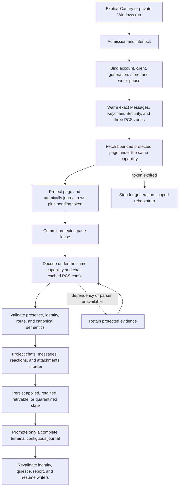
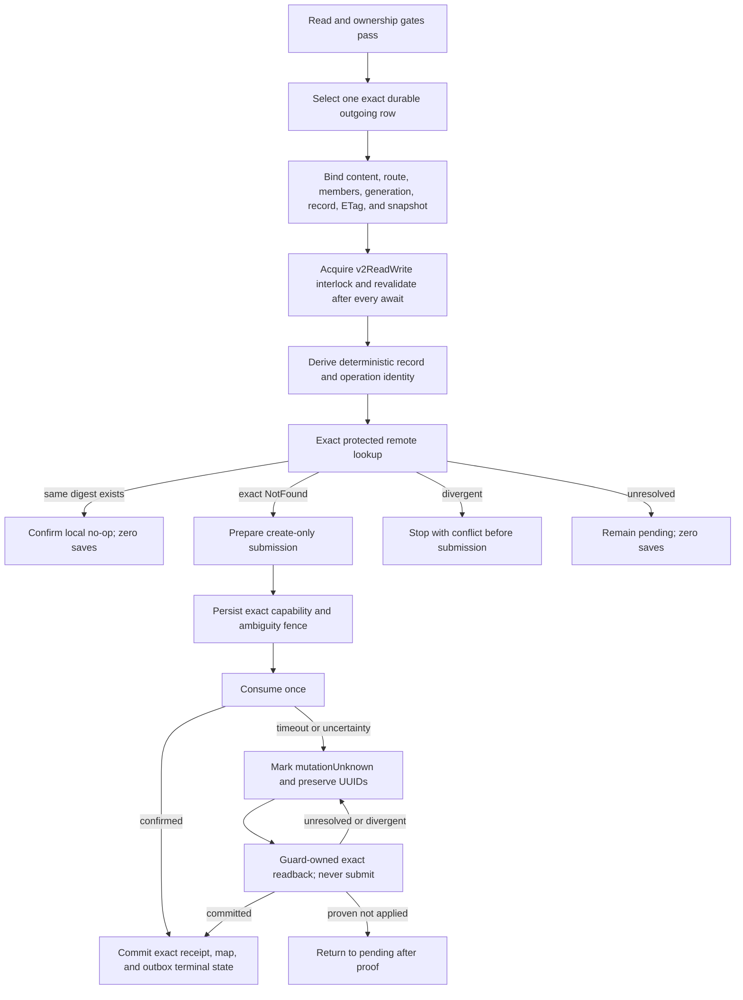

# Cloud Sync V2 current connection treemap

This document is the short operational source of truth. It contains current
architecture, safety rules, qualification state, and the next falsification
test. Dated investigations, obsolete candidates, run-by-run notes, patents,
and historical evidence remain intact in the
[investigation log](cloud_sync_v2/history/CLOUD_SYNC_V2_INVESTIGATION_LOG_THROUGH_2026-09-07.md).
The [bundle index](cloud_sync_v2/index.md) points to both documents and the
current evidence set.

## Decision

Treat Messages in iCloud as a durable replicated log. Remote ingestion and
local projection are separate progress clocks. A successful fetch is not a
successful sync. Undecryptable or temporarily unprojectable records remain
durable repair work and never disappear merely because a later token exists.

Every protected operation must remain bound to one exact tuple:

```text
account fingerprint
  + live CloudMessagesClient identity
  + read-authentication generation
  + protected-store identity
  + native writer-pause permit
  + container/database/zone
  + checkpoint generation
```

If any member changes, fail closed and retain the evidence. Never borrow a
different identity or container, create PCS state from the read path, fall
back to legacy sync, clear a cursor, or continue under a replacement account.

## Status legend

| Status | Meaning |
| --- | --- |
| `LIVE-PROVEN` | A content-free trace exercised the exact boundary on the named platform. Proof does not transfer between platforms. |
| `TEST-PROVEN` | Source-contract or behavioral tests cover the boundary; current-device proof remains. |
| `SOURCE-IMPLEMENTED` | The repair is in the candidate, but full exact-source qualification is incomplete. |
| `IN REPAIR` | A concrete counterexample invalidated the previous candidate. |
| `GAP` | A safe end-to-end behavior is not implemented or needs a product decision. |

## Current candidate

| Item | Current state |
| --- | --- |
| App branch | `agent/cloudkit-v2-sms-chat-contract` |
| Candidate | Exact-source app-code candidate `0b86a6465cdb6ff574b0e6a94b86a8c6c78f3c52`. Prior live Android read proof remains `ad822f37cbf468a6bc74d602965e78ae02a852d1`. |
| Main change | Direct and restored-group plaintext admission, IDS receipt recovery, protected reset proof, crash-safe generation rebootstrap, bounded replay, and manual read/write gates are wired with automatic uploads off. Reset-fenced old-generation outbox rows remain durable audit evidence but cannot block the new generation when an exact newer checkpoint proves them terminal. |
| Dependency | rustpush `866560d38fcc544851c0b3d55414d25a29bba192`. |
| Full qualification | GCE run `34414062044` qualified exact app code `0b86a6465`: 2,522 Dart tests, 359 app Rust tests, 226 rustpush tests, 34 protector tests, and the 14-case semantic outbox contract passed; bindings reproduced; the ARM64 Canary contained every required native library and was signed on the trusted GitHub-hosted path. Automatic uploads were off. Independent inventories found zero remaining runners and zero GCE instances. |
| Android release proof | The signed `ad822f37c` APK was installed in place with Canary data preserved and Alpha untouched. Its live read-only pull drained the remote head in one pass and finished without an unsafe failure. The final local sweep completed Chats with the exact 476-row durable backlog, kept remote save/delete disabled, and kept outbox `0 -> 0`. Messages and Attachments remain honestly degraded with 1,893 and 1,693 blocking saves respectively. |
| Production claim | Not yet allowed. |

### What the candidate includes

- Native and Dart compute the same deterministic group-routing digest from the
  canonical group, current raw group ID, service/style, group version, and
  normalized participants.
- Both sides use UTF-8 byte ordering. Exact `urn:biz:<UUID>` participants are
  retained; arbitrary schemes remain rejected.
- Older applied groups can receive a missing digest only through protected
  null-to-non-null projection repair with an otherwise exact snapshot match.
- Restored, nonprovisional group plaintext uses opaque dependency binding tag
  3. It binds generation, owner, aliases, server record, ETag/raw reference,
  latest applied save, and routing digest.
- Direct tag-1 and reaction tag-2 encoders and bindings remain unchanged.
- Provisional group creation, group reactions, group-state mutations, remote
  deletion, and update merge remain closed.
- Exact out-of-scope chat satellites and retained tombstones no longer make a
  valid physical-retention result fail the whole Chats zone.
- Retained message and attachment blockers are counted separately from the
  larger physical backlog. The current live blocker is therefore 3,586 saves,
  not all 10,108 retained rows.
- Content-free Windows inspection proved all 189 native `msgProto` field-2
  wire mismatches are classes 4-7, whose Apple schemas use int64 rather than
  the ordinary message string. The same inspection found five class-3 system
  events. The decoder base `12035ec0c` validates all five variant schemas and retains
  them as `UnsupportedMessageType`; it does not invent projection semantics.
- Existing-history write deferrals report fixed counts for local-chat, snapshot,
  alias, prior-origin, record-map, and tombstone conflicts. The classifier is
  observational only and does not authorize adoption or alter failure precedence.
- Canary ADB control is package-scoped, challenge-confirmed, and read-only by
  default. Host parsing accounts for Android SharedPreferences key prefixes and
  harmless Windows PowerShell native-stderr promotion.
- Receipt discovery keeps only a bounded candidate window in memory and reads at
  most 64 receipts per replay page. Its cursor advances past invalid receipts,
  while leaving later valid receipts discoverable on subsequent pages.
- Startup receipt replay completes before stale-send normalization. The
  ObjectBox startup claim then retains native-confirmation work and clears only
  sends that are proven untracked in the same transaction.

## Scope and current evidence

| Capability | Status | Remaining proof or work |
| --- | --- | --- |
| Chat and message history | `LIVE-PROVEN` for restored readable history | Qualify sustained incremental sync, restart, and account lifecycle on the release candidate. |
| Reactions on read | `LIVE-PROVEN` for representative records | Continue retaining unavailable parents; qualify current candidate on Pixel. |
| Photos and videos on read | `SOURCE-IMPLEMENTED` after prior live proof | Current source resolves generic and UTI-only image/video records consistently across profile and message surfaces. Pixel must prove HEIC, video, and tap-to-open behavior; GIF data remains preserved but profile animation is not a release requirement. |
| Documents and plugin payloads | `TEST-PROVEN` | Supported documents remain visible, unknown opaque files remain available, and only the exact `.pluginPayloadAttachment` suffix is hidden from profile media/documents without deleting its row. Pixel UI proof remains. |
| Direct plaintext create | `LIVE-PROVEN` in the Windows development loop | Confirm exact remote readback, restart no-save replay, independent Apple-device visibility, and ordinary Pixel composer convergence. |
| Restored-group plaintext create | `SOURCE-IMPLEMENTED` and exact-source qualified | Perform one authorized live group test with pinned route/binding plus exact readback/restart proof. Provisional group creation remains closed. |
| Direct reactions | `TEST-PROVEN` | Live Apple save/readback and independent-reader display remain. |
| Edits and unsends | `GAP` | Require distinct causal mutation and anti-resurrection contracts. |
| Attachment writes | `GAP` | Require protected asset staging, record binding, save/readback, and recovery. |
| Tombstones and deletion | Closed | Define exact ownership and recoverable semantics before enabling any local or remote delete. |
| Token expiry | `TEST-PROVEN` | Live expired-token/restart proof remains. The exact-source path requires an authenticated protected reset proof, releases the semantic read boundary, reacquires the destructive-reset interlock and native pause, advances once, reconciles authority after process death, and replays once. |
| SMS, MMS, and RCS | Out of scope | Do not add them to this CloudKit V2 release path. |

## Safety gates

These gates are non-negotiable:

1. Bind account, live client, credential generation, protected store, zone,
   checkpoint generation, and writer-pause capability at every external wait.
2. Journal each protected page and pending token atomically before committing
   the native page lease.
3. Project in dependency order: chats, messages, reactions, attachments.
4. Promote a token only across a complete contiguous terminal journal.
5. Keep fetched, retained, and exactly projected progress separate.
6. Keep live IDS/APNs receive readiness independent from archive repair.
7. Admit a write only from an exact durable row and a fresh protected
   dependency binding.
8. Prove exact remote absence before first create. Persist the ambiguity fence
   before consuming a prepared mutation.
9. After submission uncertainty, reconcile by exact readback only. Never
   automatically replay, update-merge, quarantine away ambiguity, or delete.
10. Require an exact protected receipt before committing a record map and
    terminal outbox state together.
11. Preserve Alpha, its hardware identity, its database, and its messages.
12. Keep Windows Smart App Control enabled. Use GCE or a trusted signed
    environment when local policy blocks an executable.

## Explicitly forbidden fallbacks

- Use of a general or write-capable container when semantic read authentication
  is cold.
- Cross-account, cross-client, cross-generation, cross-zone, or cross-store
  authentication and decryption.
- `ZoneSaveOperation`, PCS creation, clique reset, or remote mutation from the
  semantic read path.
- Silent fallback to legacy CloudKit sync.
- Cursor clearing for an unknown, malformed, or inconvenient error.
- Treating `retainedUnprojected` as successful local projection.
- Advancing past an incomplete journal.
- Deleting local rows for read-path tombstones.
- Letting optional CloudKit work delay live message startup or acknowledgment.
- Using GCE as a live Apple client or exporting account, relay, PCS, or device
  identity to CI.

## Read state machine



The durable journal between fetch and projection is the critical cut. It makes
projection repair possible without refetching or losing the exact server
evidence.

## Outbound create state machine



Direct, reaction, and group operations use distinct protected binding tags.
One lane cannot be cast into another. Confirmed replay is readback-only and
must prove zero saves.

## Fast qualification loop

Use the cheapest boundary that can falsify the current hypothesis:

```text
source contract or behavioral logic
  -> focused local test when policy allows, otherwise GCE
  -> full exact-source GCE suite and APK build

Apple protocol, PCS, save, readback, or replay behavior
  -> exact-source trusted minimal Windows harness when available
  -> otherwise signed Canary on Pixel

Android registration, ObjectBox/UI, background, lock, or lifecycle behavior
  -> signed Canary on Pixel

cross-device convergence
  -> independent Apple device confirmation
```

Do not rebuild a Canary for every code edit. GCE handles exact-source Dart,
Rust, bridge-generation, identity, projection, and reconciliation tests. The
existing Windows ARM harness is stale relative to the current branch head;
both app and rustpush revisions moved, so its reports cannot qualify the
candidate.
Smart App Control blocks the locally self-signed DLL and Cargo build-script
executables with error 4551 before CloudKit starts. Keep that policy enabled.
Restore Windows hot reload only after a trusted-provider-signed exact-source
minimal harness exists. Credentials and PCS state remain on a private local
profile, never on GCE. Pixel remains the live protocol and final release proof.

Use five promotion lanes and do not skip upward:

1. **Focused local lane:** handwritten Dart contracts and structural guards for
   the changed boundary. It may reject a patch but cannot qualify native Rust.
2. **Fast GCE lane:** `app-rust-only` regenerates and verifies FRB bindings,
   checks the Rust bridge, and runs the app Rust library without Android SDK,
   Gradle, signing, or APK work.
3. **Full GCE lane:** only a promotion candidate runs every Dart/Rust/rustpush/
   protector test and produces the signed, ABI-verified Canary APK.
4. **Windows protocol lane:** exact-source minimal harnesses may falsify Apple
   request, PCS, save, readback, and replay behavior without an APK. They do not
   qualify Android lifecycle or UI behavior.
5. **Pixel release lane:** batch direct send, process-death recovery, group send,
   readback, restart, lifecycle, and UI evidence into as few signed-APK sessions
   as safety permits. Manual Apple-device display remains independent evidence.

The manual-writer Pixel lane now has a host-controlled three-phase gate:
[`pixel_cloudkit_write_gate.ps1`](../tooling/pixel_cloudkit_write_gate.ps1)
and [`vm_trigger_cloudkit_write.dart`](../tooling/vm_trigger_cloudkit_write.dart).
`prepare` establishes V2 ownership locally and returns only a candidate GUID
hash; `run` restarts Canary, reselects that exact hash, and invokes the existing
one-intent production path; optional `verify` restarts again and requires zero
new admissions. Every phase pins the app source and host-tool hashes, takes the
recipient only from a process environment variable bound to a separately
supplied SHA-256, emits content-free evidence, and requires the automatic
worker to be absent. The tooling is test-proven but does not replace live
CloudKit readback or independent Apple-device display.

## Recovery policy

| Failure | Safe response |
| --- | --- |
| Read credential cold or revoked | Warm the in-memory same-account credential, restore the encrypted same-account credential, or perform one bounded refresh. Then require user action. |
| Account or client changes | Stop before projection or acknowledgment and preserve journal, source, and checkpoint. |
| PCS key unavailable | Warm or look up only the exact same-scope zone. Retain the protected record if still unavailable. |
| Network or throttling | Preserve token and evidence, honor bounded retry-after, and retry later. |
| Missing parent or parser | Retain protected evidence and retry projection after the dependency or parser repair. |
| Malformed record | Store a fixed content-free reason and explicit repairability classification. Never guess identity. |
| Process death after fetch | Recover the protected lease, replay the durable journal, and keep the prior token until terminal. |
| Token expired | Stop, require the account-bound protected reset proof, release the read boundary, reacquire the destructive-reset interlock and native pause, advance the exact zone generation once, fence old evidence, reconcile authority after interruption, and replay at most once. |
| Write result unknown | Preserve request and operation UUIDs, protected receipt, and fence. Exact readback is the only next network action. |

## Source-linked boundary map

| Boundary | Primary source | Current status |
| --- | --- | --- |
| Product admission and interlock | [`cloud_sync_manual_semantic_pull_sampler.dart`](../lib/services/rustpush/cloud_sync/cloud_sync_manual_semantic_pull_sampler.dart), [`cloudkit_operation_interlock.dart`](../lib/services/rustpush/cloud_sync/cloudkit_operation_interlock.dart) | Read live-proven; full session replacement qualification remains. |
| Read authentication and exact PCS | [`cloud_sync_production_sampler_adapter.dart`](../lib/services/rustpush/cloud_sync/cloud_sync_production_sampler_adapter.dart), [`cloudkit.rs`](../rustpush/src/icloud/cloudkit.rs) | Exact `ad822f37c` live read-only pull completed; cold/account lifecycle proof remains. |
| Protected fetch, journal, and token | [`native_protected_cloud_sync_transport.dart`](../lib/services/rustpush/cloud_sync/native_protected_cloud_sync_transport.dart), [`objectbox_cloud_sync_store.dart`](../lib/services/rustpush/cloud_sync/objectbox_cloud_sync_store.dart) | Test and prior live proof. |
| Authenticated reset and restart recovery | [`cloud_sync_reset_coordinator.dart`](../lib/services/rustpush/cloud_sync/cloud_sync_reset_coordinator.dart), [`cloud_sync_manual_semantic_pull_sampler.dart`](../lib/services/rustpush/cloud_sync/cloud_sync_manual_semantic_pull_sampler.dart), [`cloudkit_writer_authority.dart`](../lib/services/rustpush/cloud_sync/cloudkit_writer_authority.dart), [`objectbox_cloud_sync_preflight.dart`](../lib/services/rustpush/cloud_sync/objectbox_cloud_sync_preflight.dart) | Exact-source qualified at `0b86a6465`; live expired-token/restart proof remains. |
| Decode and canonical conversion | [`rust_cloud_semantic_decoder.dart`](../lib/services/rustpush/cloud_sync/rust_cloud_semantic_decoder.dart), [`cloud_sync_canonical_converter.rs`](../rust/src/cloud_sync_canonical_converter.rs) | Test and representative live proof. |
| Ordered projection and retained repair | [`cloud_inbox_applier.dart`](../lib/services/rustpush/cloud_sync/cloud_inbox_applier.dart), [`objectbox_cloud_semantic_store_gateway.dart`](../lib/services/rustpush/cloud_sync/objectbox_cloud_semantic_store_gateway.dart) | Read live-proven; current backlog must be explicit. |
| Composer origin, IDS completion, and write admission | [`rustpush_service.dart`](../lib/services/rustpush/rustpush_service.dart), [`cloud_sync_local_send_journal.dart`](../lib/services/rustpush/cloud_sync/cloud_sync_local_send_journal.dart), [`cloud_sync_manual_outbound_canary.dart`](../lib/services/rustpush/cloud_sync/cloud_sync_manual_outbound_canary.dart), [`cloudkit_writer_mutation_guard.dart`](../lib/services/rustpush/cloud_sync/cloudkit_writer_mutation_guard.dart) | Atomic direct/restored-group composer admission, bounded awaited receipt replay, atomic startup claim, protected receipt recovery, and reset-required fencing are exact-source qualified through `0b86a6465`; live Pixel process-death recovery, remote readback, and duplicate suppression remain. |
| Direct and group encoders | [`cloud_sync_local_send_encoder.dart`](../lib/services/rustpush/cloud_sync/cloud_sync_local_send_encoder.dart), [`cloud_sync_outbound_group_binding.dart`](../lib/services/rustpush/cloud_sync/cloud_sync_outbound_group_binding.dart) | Direct live-proven on Windows; group source-implemented. |
| Native create/readback receipt | [`api.rs`](../rust/src/api/api.rs), [`cloud_messages.rs`](../rustpush/src/imessage/cloud_messages.rs), [`chat_create.rs`](../rustpush/src/imessage/cloud_messages/chat_create.rs) | Direct Windows proof; exact-source suite and group live proof pending. |

## Release gates

### Candidate qualification

- [x] Reset-proof base `7df608af7` passed the full exact-source suite and
  signed-APK path in GCE run `34407071539`, with automatic uploads off.
- [x] Current app code `0b86a6465` reproduced bindings and passed 2,522 Dart,
  359 app Rust, 226 rustpush, 34 protector, and 14 semantic-outbox contract
  tests in run `34414062044`.
- [x] The `0b86a6465` Canary contains every required ARM64 native library and
  is signed on the existing trusted GitHub-hosted signing path.
- [x] Run `34414062044` deleted its VM and deregistered its runner; independent
  inventories confirmed zero remaining runners and zero GCE instances.

### Read qualification

- [x] Representative chats and readable messages project on Canary.
- [x] Representative reactions and media metadata project without deleting
  unavailable evidence.
- [ ] A cold-start candidate executes authentication, pause, three-zone warm,
  fetch, decode, journal, projection, and token promotion in one process.
- [ ] A second pull is idempotent and reports fetched, retained, and projected
  counts separately.
- [ ] Restart, background/lock, account replacement, and expired-token paths
  preserve evidence and fail closed.

### Write qualification

- [x] Direct plaintext create has bounded Windows save/readback/restart proof.
- [x] Host-controlled Pixel prepare/run/verify tooling exercises the existing
  exact-intent production path across fresh Canary processes, rejects candidate
  drift, redacts arbitrary failures, and requires automatic uploads off. Live
  execution against Apple remains below.
- [ ] Confirmed direct replay proves zero saves and independent Apple-device
  display for the release candidate.
- [ ] Restored-group plaintext passes exact-source tests, one authorized live
  group create, exact readback, restart, and independent display.
- [ ] Direct reactions pass live save/readback/restart and independent display.
- [ ] Ordinary composer queue admission atomically commits the first durable
  outgoing Message and state-0 local-send intent. Native IDS success is durably
  recorded before `SendConfirm`; restart recovery promotes it to state 3 and
  acknowledges that receipt only after the ObjectBox commit. Protected staging
  then atomically adopts the intent into the outbox and converges automatically.
- [ ] Attachment write, edits, unsends, and tombstones each receive their own
  causal and recovery contract before release or remain explicitly disabled.

### Production qualification

- [ ] One signed Canary survives foreground/background, lock, reconnect,
  process restart, and account repair without duplicate sends or lost tokens.
- [ ] Current retained backlog is zero or every retained category has an
  explicit non-destructive repair or honest unavailable state.
- [ ] User-visible status distinguishes remote ingestion, projection, media
  materialization, live delivery, and write reconciliation.
- [ ] Scope documentation names supported operations precisely. Initial text
  creation must not be advertised as complete Messages parity.

## Current critical path

1. On exact-source Canary `0b86a6465`, prove composer admission and the native IDS receipt across an
   intentional process death, then verify state-3 recovery, one protected
   outbox adoption, exact CloudKit readback, and zero duplicate local/remote
   records. Do not touch Alpha.
2. Use the authorized test recipients only. First repeat direct no-duplicate
   readback proof, then create one controlled restored-group plaintext message.
3. Verify the group record by exact CloudKit readback, restart/no-save replay,
   and independent Apple-device display.
4. Qualify lifecycle P0 before automatic sync: expired-token reset must advance
   exactly once and replay once; a second reset signal must stop. Process death
   must recover prepared or unknown authority without losing old evidence.
   Same-generation authentication may refresh once; account replacement must
   preserve evidence and fail closed.
5. Add the durable Android background entrypoint and then enable incremental
   automatic triggers behind a rollback gate.
6. Run lifecycle soak and produce one release-candidate report that proves
   identity stability, token continuity, zero duplicate writes, and honest
   retained counts. Direct reactions may follow text-sync MVP. Keep edits,
   unsends, attachment writes, group-state changes, and deletion explicitly
   disabled until their separate contracts pass.

## Next falsification test

Use the signed exact-source `0b86a6465` Canary from successful GCE run
`34414062044` for one batched Pixel session: cold read, idempotent
second read, expired-token/restart recovery, and the authorized direct
process-death write test. The write must recover state 3, adopt exactly one
protected outbox operation, obtain exact CloudKit readback and independent
Apple-device display, and create zero duplicate local or remote records.
Automatic uploads remain disabled during this proof.
Existing-history adoption remains a separate write gate; diagnostic counts
cannot authorize or perform adoption.

## Existing-history adoption evidence gate

Automatic adoption is not safe from the offline checkout alone. For each
queued intent, a content-free live observation must first distinguish the six
`existing_history` categories and prove exactly one current direct-iMessage Chat
owner under the same account, protected store, scope, generation, writer epoch,
and native session. The proof must bind the canonical Chat lookup hash, semantic
snapshot, service-identifier alias, canonical/member record map, latest applied
non-tombstone save, ETag, protected record reference, and payload digest. A
later retained save, tombstone, competing owner, or native `overlaps` /
`incomplete` result remains a defer.

Only after that proof may the production local-send admission seam atomically
re-read the state-1 journal intent and unchanged provisional Message/Chat,
adopt the exact existing relationship, and persist its durable reconciliation
binding under the existing `v2ReadWrite` interlock and auth fence. That
transaction must create no Chat stage, outbox row, record-map mutation, remote
save, merge-update, or delete. Restart must repeat as a no-op; any mismatch must
roll back and leave the intent ready/deferred. A bare Message reparent is not a
fallback because the journal source digest binds the original Chat row and UUID.

## Edit and unsend evidence gate

Apple carries edit history and retracted parts inside the existing message's
`msgProto.messageSummaryInfo` blob (`ec`, `ep`, `otr`, and `rp`). The read path
already validates part-key consistency, monotonic edit revisions, and the rule
that present-but-empty collections are absent rather than an explicit clear.
The underlying CloudKit client exposes update save semantics and stale-record
conflicts, but V2 transport deliberately remains initial-create-only.

Do not enable update transport from structural inference alone. First capture
one genuine Apple edit and one unsend read-only, proving the same record name,
the before/after protected system fields and change tag, the complete rewritten
or merged field set, and the resulting `messageSummaryInfo` bytes. Then require
stale-tag refetch and reapply, exact retry identity, and anti-resurrection proof.
Explicit `NOT_FOUND` is not permission to recreate a previously known message.

A reviewed three-file first-edit identity scaffold remains deliberately outside
this candidate. It has no production call site, Apple record or native wire
fixture, journal/admission integration, or content-derived proof that its
caller-supplied pre/post digests match the actual message text. Its operation
identity also cannot establish the required predecessor change tag or monotonic
CloudKit mutation revision. Retain it only as design evidence; do not integrate
it until the live capture above determines the real zone, record, and compare-
and-swap contract.
